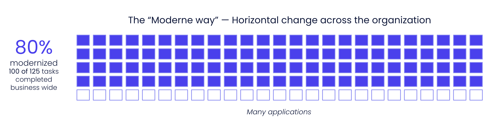
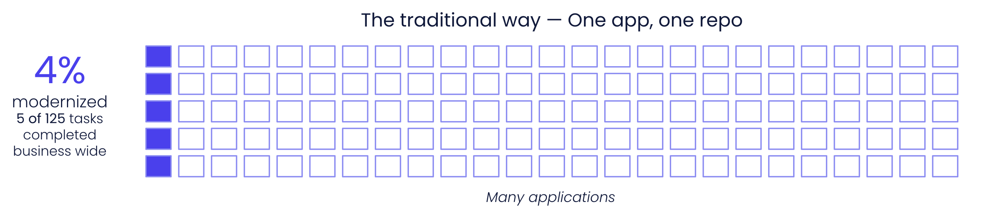

import Tabs from '@theme/Tabs';
import TabItem from '@theme/TabItem';

# Proof of value (POV) process for C#

:::info
Before starting the PoV process, make sure your team has completed the [prerequisites checklist](./proof-of-value-prerequisites.md).
:::

Moderne automates code maintenance tasks like framework migrations, security vulnerability fixes, and code quality improvements. Work that traditionally takes months can be completed in minutes, freeing developers to focus on delivering business value.

This guide walks through a typical proof of value (POV) process to help you evaluate Moderne's capabilities against your .NET codebase. To demonstrate Moderne's value, we start with lower-complexity tasks like code quality improvements and then explore what happens with more complex migrations. It's important to note that we won't try to complete an entire migration during the proof of value phase. The goal is to demonstrate to you and your leadership that your developers, armed with the Moderne toolset (the CLI and Platform), _can_ get you all the way over the line. This applies not just to a specific migration, but to all future security and modernization efforts.

Moderne's value lies in working horizontally across all of your repositories simultaneously. Consider a modernization task that needs to happen across 125 repositories:

<figure>
  
  <figcaption>**The Moderne approach**: Even if you only complete 80% of the work on each repository, that's 80% progress business-wide (100 of 125 tasks done).</figcaption>
</figure>

<figure>
  
  <figcaption>**The traditional approach**: If you fully complete one repository before moving to the next, you achieve 100% on that single repo, but that's only 4% progress across the organization (5 of 125 tasks).</figcaption>
</figure>

This is why we focus on Moderne's multi-repo capabilities during the proof of value process. Rather than trying to get any single repository perfectly over the line, we demonstrate the power of applying changes across your entire codebase at once.

During the proof of value process, we will teach you how to use building block recipes as well as how to develop your own custom recipes that will start to bridge the remaining 20% gap. After the proof of value process, we will continue to work with you to get that last 20% over the line.

## Proof of value steps

<Tabs>
<TabItem value="platform" label="Moderne Platform">

1. **Platform provisioning** - Moderne provisions an isolated platform in your chosen cloud provider and region (takes ~1 hour).

2. **Mass Ingest** - Your team [sets up an ingestion pipeline](../../../administrator-documentation/moderne-platform/how-to-guides/mass-ingest.md) to build and publish LST artifacts for your .NET repositories. You should start with 100 or more diverse repositories for best results. This step does not require you to make any changes to the repositories themselves.

3. **Connector setup** - Your team sets up the Moderne Connector following our [Connector configuration doc](../../../administrator-documentation/moderne-platform/how-to-guides/connector-configuration/connector-config.md). The Connector runs as a Docker image or JAR and connects to your source code manager (SCM) and artifact repository using read-only service accounts (takes less than 1 hour with accounts ready).

4. **Run recipes** - With everything set up, you can now run recipes against your code. We strongly recommend starting with simple code quality improvement recipes before progressing to complex migrations. You can find our recommended recipes to run and examples of what they do in the next section of this doc.

5. **Study results** - After you've run a recipe, you should generate [data tables](./data-tables.md) and [visualizations](./visualizations.md) to learn more about what happened.

:::note
The recipes below progress from simple to complex. Links go to the [public Moderne Platform](https://app.moderne.io) where you can test on open-source repositories. You can also run these recipes using the CLI commands provided in each section.
:::

</TabItem>
<TabItem value="cli" label="Moderne CLI">

1. **Install the Moderne CLI** – Follow the [installation steps in the getting started guide](../../moderne-cli/getting-started/cli-intro.md#installation-and-configuration) to install the CLI for your platform.
    * **Note:** You may experience a few speed bumps related to your internal nexus/scanners that block recipes JARs. Ideally this is not an issue, but if it is, please let us know, and we'll work together with you to address it.

2. **Install the .NET SDK** – The CLI uses `dotnet` to restore and parse C# projects. Install a recent .NET SDK (.NET 8 or later) and verify it with `dotnet --version`. The CLI selects the SDK automatically from `$PATH`, or you can configure it explicitly with `mod config dotnet installation edit`.

3. **Clone repos to your local machine** – In order for the CLI to run recipes against your code, you will need to provide it with [a repos.csv file](../../moderne-cli/references/repos-csv.md).
    * Once you've created the `repos.csv` file, create a directory somewhere on your machine and run the following command:

        ```bash
        mod git sync csv . repos.csv --with-sources
        ```

4. **Build LSTs for the repos you cloned** – With all of the repositories cloned to your machine, you'll need to build the LSTs for them by running the following command:

    ```bash
    mod build .
    ```

    * **Note**: All of your LSTs may not build successfully. This is a normal experience during initial ingestion as there are always unique configurations and environmental factors that need to be accounted for. We can work with you to investigate these issues on a call.
      * The CLI stack trace will give some hints as to the issue. There is also a `build.log` file produced to every repo that will contain more context. You can also run the following command to aggregate the build logs:

        ```bash
        mod log builds add . logs.zip --last-build
        ```

      * **Common reasons C# LSTs may fail to build:**
        * Solutions that pin an SDK version in `global.json` that is not installed locally
        * Projects targeting preview or unreleased .NET SDKs
        * Solutions whose `dotnet restore` requires private NuGet feeds that are not configured on the build machine
        * Solutions that contain multiple top-level project files at the root (the build invokes `dotnet restore <solution>` and cannot disambiguate `*.sln` vs. `*.slnx`)

5. **Add your CLI key** – By now, you should have received a CLI key for the purposes of this PoC. Run the following command to add the key, which will allow you to download and run recipes:

    ```bash
    mod config license edit <insert provided key here>
    ```

6. **Install the recipes** – Copy and run the [Moderne CLI command under CLI installation](../../recipes/lists/latest-versions-of-every-openrewrite-module.md#cli-installation).

7. **Try your first recipe** – Try a simple recipe to test that you can execute successfully against the LSTs you built in step 4. We recommend the C# code quality recipe, which will apply a curated set of code quality improvements across your repos. To run this recipe, run the following command:

    ```bash
    mod run . --recipe OpenRewrite.Recipes.CSharp.CodeQuality.CodeQuality
    ```

</TabItem>
</Tabs>

## Code quality recipes

### [C# code quality](https://app.moderne.io/recipes/OpenRewrite.Recipes.CSharp.CodeQuality.CodeQuality)

> Applies a curated set of C# code quality improvements covering formatting, naming, simplification, performance, and style. This is the recommended starting point for a C# PoV.

#### CLI commands

```bash
mod run . --recipe OpenRewrite.Recipes.CSharp.CodeQuality.CodeQuality
mod study . --last-recipe-run --data-table SourcesFileResults
```

## Code search and impact analysis

Many developers use Moderne every day for code search. Need to plan a refactor? Want to understand how an API is used? Trying to assess security concerns? All of these questions can be answered by running search recipes across your repositories.

This is possible because Moderne treats your code like a data warehouse. Our search capabilities go far beyond simple text searches. They understand your code's structure, inheritance hierarchies, and semantic relationships. It's effectively like running a database query across your entire codebase.

One of the most powerful applications of search is **impact analysis** – understanding what will be affected before you make changes. The search recipes below help you assess the scope and impact of potential transformations, giving you confidence before running large-scale refactors or migrations.

### [Find call graph](https://app.moderne.io/recipes/org.openrewrite.FindCallGraph)

> Produces a data table where each row represents a method call. Works across languages, including C#.

#### CLI commands

```bash
mod run . --recipe org.openrewrite.FindCallGraph
mod study . --last-recipe-run --data-table CallGraph
```

### [Find blocking calls in async methods](https://app.moderne.io/recipes/OpenRewrite.Recipes.CSharp.CodeQuality.Performance.FindBlockingCallsInAsync)

> Locates synchronous blocking calls (`.Result`, `.Wait()`, `Task.Run` over sync work) inside `async` methods. Useful for triaging async hygiene issues at scale before a performance or stability push.

#### CLI commands

```bash
mod run . --recipe OpenRewrite.Recipes.CSharp.CodeQuality.Performance.FindBlockingCallsInAsync
mod study . --last-recipe-run --data-table RecipeRunStats
```

### [Find methods that could be static](https://app.moderne.io/recipes/OpenRewrite.Recipes.CSharp.CodeQuality.Performance.FindMakeMethodStatic)

> Identifies instance methods that don't reference `this` and could be declared `static`. A lightweight search recipe to demonstrate type-aware impact analysis on C# code.

#### CLI commands

```bash
mod run . --recipe OpenRewrite.Recipes.CSharp.CodeQuality.Performance.FindMakeMethodStatic
mod study . --last-recipe-run --data-table RecipeRunStats
```

### [Find TODO/HACK/FIXME comments](https://app.moderne.io/recipes/OpenRewrite.Recipes.CSharp.CodeQuality.Naming.FindFixTodoComment)

> Surfaces every TODO, HACK, and FIXME comment across your C# codebase. Useful for sizing technical debt before planning a remediation effort.

#### CLI commands

```bash
mod run . --recipe OpenRewrite.Recipes.CSharp.CodeQuality.Naming.FindFixTodoComment
mod study . --last-recipe-run --data-table RecipeRunStats
```

## Dependency management

### [Dependency insight for C#](https://app.moderne.io/recipes/org.openrewrite.csharp.dependencies.DependencyInsight)

> Finds NuGet dependencies (including transitive) across your .NET projects. Useful for identifying version inconsistencies that can cause runtime issues.

#### CLI commands

```bash
# Example: find every Newtonsoft.* dependency in use
mod run . --recipe org.openrewrite.csharp.dependencies.DependencyInsight \
  -P "packagePattern=Newtonsoft*"

mod study . --last-recipe-run --data-table DependenciesInUse
```

### [Upgrade NuGet package version](https://app.moderne.io/recipes/OpenRewrite.CSharp.Recipes.UpgradeNuGetPackageVersion)

> Upgrades a NuGet package to a specific version or to the latest available version.

#### CLI commands

```bash
mod run . --recipe OpenRewrite.CSharp.Recipes.UpgradeNuGetPackageVersion \
  -P "PackageName=Newtonsoft.Json" \
  -P "NewVersion=latest"

mod study . --last-recipe-run --data-table SourcesFileResults
```

## Security

### [Find and fix vulnerable NuGet dependencies](https://app.moderne.io/recipes/org.openrewrite.csharp.dependencies.DependencyVulnerabilityCheck)

> Software composition analysis (SCA) tool that detects and upgrades NuGet dependencies with known CVEs. Uses the GitHub Security Advisory Database, which aggregates multiple vulnerability databases including the National Vulnerability Database.

#### CLI commands

```bash
mod run . --recipe org.openrewrite.csharp.dependencies.DependencyVulnerabilityCheck

mod study . --last-recipe-run --data-table SourcesFileResults
```

## Major migrations

Major migrations are complex transformations that typically automate 80-90% of the work, with the remainder requiring manual developer intervention. They are typically composed of multiple, complex recipes.

### [Migrate to .NET 10](https://app.moderne.io/recipes/OpenRewrite.Recipes.CSharp.Migration.Dotnet.Net10.UpgradeToDotNet10)

> Comprehensive migration to .NET 10. Updates target frameworks, replaces deprecated APIs, adopts new language features, and upgrades NuGet packages to .NET 10 compatible versions. Earlier migrations (`UpgradeToDotNet8`, `UpgradeToDotNet9`, etc.) are also available if you need a smaller jump.

#### CLI commands

```bash
mod run . --recipe OpenRewrite.Recipes.CSharp.Migration.Dotnet.Net10.UpgradeToDotNet10
mod study . --last-recipe-run --data-table SourcesFileResults
```

## AI agent context

AI coding agents like Claude Code, Cursor, and GitHub Copilot work better when they have structured knowledge about your codebase rather than inferring architecture from raw code. Prethink recipes generate this context automatically, mapping service endpoints, dependencies, test coverage, and architecture so agents reason over facts instead of guessing. To learn more, please [check out our Prethink documentation](../../agent-tools/prethink.md).

### [Update Prethink context (no AI)](https://app.moderne.io/recipes/io.moderne.prethink.UpdatePrethinkContextNoAiStarter)

> Generates Prethink context files with architectural discovery, dependency inventory, and architecture diagrams without requiring an LLM provider. Works for C# projects.

#### CLI commands

```bash
mod run . --recipe io.moderne.prethink.UpdatePrethinkContextNoAiStarter

mod git apply . --last-recipe-run
```
