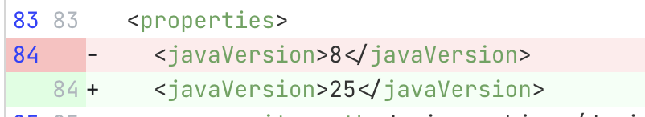

import ReactPlayer from 'react-player';
import Tabs from '@theme/Tabs';
import TabItem from '@theme/TabItem';

# Proof of value (POV) process

Moderne automates code maintenance tasks like framework migrations, security vulnerability fixes, and code quality improvements. Work that traditionally takes months can be completed in minutes, freeing developers to focus on delivering business value.

This guide walks through a typical proof of value (POV) process to help you evaluate Moderne's capabilities. We recommend starting with lower-risk tasks like code quality improvements before moving to more complex migrations.

<figure>
  
  <figcaption>Progression from simple to complex automation tasks</figcaption>
</figure>

## Proof of value steps

<Tabs>
<TabItem value="platform" label="Moderne Platform">

1. **Platform provisioning** - Moderne provisions an isolated platform in your chosen cloud provider and region (takes ~1 hour).

2. **Mass Ingest** - Your team [sets up an ingestion pipeline](../../../administrator-documentation/moderne-platform/how-to-guides/mass-ingest.md) to build and publish LST artifacts for your repositories. You should start with 100 or more diverse repositories for best results. This step does not require you to make any changes to the repositories themselves (such as installing build plugins).

3. **Agent setup** - Your team sets up the Moderne agent following our [on-premise agent configuration doc](../../../administrator-documentation/moderne-platform/how-to-guides/agent-configuration/agent-config.md). The agent runs as a Docker image or JAR and connects to your source code manager (SCM) and artifact repository using read-only service accounts (takes less than 1 hour with accounts ready).

4. **Run recipes** - With everything set up, you can now run recipes against your code. We strongly recommend starting with simple code quality improvement recipes before progressing to complex migrations. You can find our recommended recipes to run and examples of what they do in the next section of this doc.

5. **Study results** - After you've run a recipe, you should generate [data tables](./data-tables.md) and [visualizations](./visualizations.md) to learn more about what happened.

:::note
The recipes below progress from simple to complex. Links go to the [public Moderne Platform](https://app.moderne.io) where you can test on open-source repositories. You can also run these recipes using the CLI commands provided in each section.
:::

</TabItem>
<TabItem value="cli" label="Moderne CLI">

1. **Download the Moderne CLI** – Download the [latest JAR from Maven Central](https://central.sonatype.com/artifact/io.moderne/moderne-cli/versions).
    * While not required, you are strongly encouraged to [set up an alias for running the JAR](../../moderne-cli/getting-started/cli-internal-tools.md#step-2-optional---but-recommended-create-an-alias-for-the-moderne-cli-jar).
    * **Note:** You may experience a few speed bumps related to your internal nexus/scanners that block recipes JARs. For example, the Spring migrations recipes have migrations going back a few major versions. Those versions call out now vulnerable dependencies – but those calls may get blocked by your firewall as it doesn't recognize what the purpose of the recipe is. Ideally this is not an issue, but if it is, please let us know, and we'll work together with you to address it.

2. **Clone repos to your local machine** – In order for the CLI to run recipes against your code, you will need to provide it with [a repos.csv file](../../moderne-cli/references/repos-csv.md).
    * Once you've created the `repos.csv` file, create a directory somewhere on your machine and run the following command:
        ```bash
        mod git sync csv . repos.csv
        ```

3. **Build LSTs for the repos you cloned** – With all of the repositories cloned to your machine, you'll need to build the LSTs for them by running the following command:
        ```bash
        mod build .
        ```
    
    * **Note**: All of your LSTs may not build successfully. This is a normal experience during initial ingestion as there are always unique configurations and environmental factors that need to be accounted for. We can work with you to investigate these issues on a call.
      * The CLI stack trace will give some hints as to the issue. There is also a `build.log` file produced to every repo that will contain more context. You can also run the following command to aggregate the build logs:

      ```bash
      mod log builds add . logs.zip --last-build
      ```
      
      * **Common reasons LSTs may fail to build:**
        * Using Java versions older than Java 8
        * Partially checked-in or outdated wrapper files that are not used in CI
        * Builds that depend on system properties or environment variables that are set locally or in CI but not documented
        * Using Gradle versions older than 4.10
        * Non-standard locations for Maven's `settings.xml` or local repository
        * Unusual Maven profile activation conditions

4. **Add your CLI key** – By now, you should have received a CLI key for the purposes of this PoC. Run the following command to add the key, which will allow you to download and run recipes:

    ```bash
    mod config license edit <insert provided key here>
    ```

5. **Install the recipes** – Copy and run the [Moderne CLI command under CLI installation](https://docs.openrewrite.org/reference/latest-versions-of-every-openrewrite-module#cli-installation).

6. **Try your first recipe** – Try a simple recipe to test that you can execute successfully against the LSTs you built in step 3. We recommend the "Find empty classes" recipe, which will search through your repos to find empty classes that do not implement an interface or extend a class. To run this recipe, run the following command:

      ```bash
      mod run . --recipe org.openrewrite.java.search.FindEmptyClasses
      ```

</TabItem>
</Tabs>

## Code quality recipes

### [Common static analysis issues](https://app.moderne.io/recipes/org.openrewrite.staticanalysis.CommonStaticAnalysis)

> Resolves common static analysis issues (SAST issues) to improve code quality, fix mistakes, eliminate legacy patterns, and resolve performance issues.

#### CLI commands

```bash
mod run . --recipe org.openrewrite.staticanalysis.CommonStaticAnalysis
mod study . --last-recipe-run --data-table SourcesFileResults
```

#### Recipe results

<figure style={{maxWidth: '700px', margin: '0 auto'}}>
  
  <figcaption>_Static analysis fixes_</figcaption>
</figure>

## Code search and impact analysis

Many developers use Moderne every day for code search. Need to plan a refactor? Want to understand how an API is used? Trying to assess security concerns? All of these questions can be answered by running search recipes across your repositories.

This is possible because Moderne treats your code like a data warehouse. Our type-aware search capabilities go far beyond simple text searches. They understand your code's structure, inheritance hierarchies, and semantic relationships. It's effectively like running a database query across your entire codebase.

One of the most powerful applications of search is **impact analysis** – understanding what will be affected before you make changes. The search recipes below help you assess the scope and impact of potential transformations, giving you confidence before running large-scale refactors or migrations.

To see learn more about impact analysis and how to automate it, check out this video:

<ReactPlayer className="reactPlayer" url='https://youtu.be/jMxSWB5jJ5M?t=306' controls="true" />

### [Find types](https://app.moderne.io/recipes/org.openrewrite.java.search.FindTypes#defaults=W3sibmFtZSI6ImZ1bGx5UXVhbGlmaWVkVHlwZU5hbWUiLCJ2YWx1ZSI6Im9yZy5hcGFjaGUuY29tbW9ucy5sYW5nMy5TdHJpbmdVdGlscyJ9LHsibmFtZSI6ImNoZWNrQXNzaWduYWJpbGl0eSIsInZhbHVlIjp0cnVlfV0=)

> Identifies classes, interfaces, or enums matching a type pattern. Crucial for understanding class usage and inheritance hierarchies before performing refactoring or migrations.

:::tip
If you don't remember the exact type, try replacing parts of the expression with `*` as a wildcard and go from there.
:::

#### CLI commands

```bash
# Example: Find all uses of Apache Commons StringUtils across your codebase
mod run . --recipe org.openrewrite.java.search.FindTypes \
    -P "fullyQualifiedTypeName=org.apache.commons.lang3.StringUtils" \
    -P "checkAssignability=true"

mod study . --last-recipe-run --data-table SourcesFileResults
```

#### Recipe results

<figure style={{maxWidth: '700px', margin: '0 auto'}}>
  
  <figcaption>_Discovering type usage patterns across repositories_</figcaption>
</figure>

### [Find methods](https://app.moderne.io/recipes/org.openrewrite.java.search.FindMethods#defaults=W3sibmFtZSI6Im1ldGhvZFBhdHRlcm4iLCJ2YWx1ZSI6Im9yZy5hcGFjaGUuY29tbW9ucy4uKiMqKC4uKSJ9LHsibmFtZSI6Im1hdGNoT3ZlcnJpZGVzIiwidmFsdWUiOnRydWV9XQ==)

> Locates method invocations matching a method pattern, even when methods are imported in different ways or invoked on subclasses. Essential for understanding API usage before refactoring.

:::tip
Unsure how to accurately identify methods? Check out our [documentation on method patterns](https://docs.openrewrite.org/reference/method-patterns#anatomy-of-a-method-pattern).
:::

#### CLI commands

```bash
# Example: Find all uses of methods in org.apache.commons
mod run . --recipe org.openrewrite.java.search.FindMethods \
    -P "methodPattern=org.apache.commons..*#*(..)" \
    -P "matchOverrides=true"

mod study . --last-recipe-run --data-table SourcesFileResults
```

#### Recipe results

<figure style={{maxWidth: '700px', margin: '0 auto'}}>
  
  <figcaption>_Finding method usage across repositories_</figcaption>
</figure>

### [Find sensitive API endpoints](https://app.moderne.io/recipes/org.openrewrite.java.security.search.FindSensitiveApiEndpoints#defaults=W3sibmFtZSI6ImZpZWxkTmFtZXMiLCJ2YWx1ZSI6WyJmaXJzdE5hbWUiLCJsYXN0TmFtZSIsImVtYWlsIiwiZW1haWxBZGRyZXNzIl19LHsibmFtZSI6InRyYW5zaXRpdmUiLCJ2YWx1ZSI6dHJ1ZX1d)

> Discovers REST API endpoints that handle sensitive data. Essential for security audits, understanding data exposure, and planning privacy improvements.

#### CLI commands

```bash
# Find endpoints handling personal data fields like names and emails
mod run . --recipe org.openrewrite.java.security.search.FindSensitiveApiEndpoints \
    -P "fieldNames=firstName,lastName,email,emailAddress" \
    -P "transitive=true"

mod study . --last-recipe-run --data-table SourcesFileResults
```

#### Recipe results

<figure style={{maxWidth: '700px', margin: '0 auto'}}>
  
  <figcaption>_Identifying sensitive API endpoints for security review_</figcaption>
</figure>

<figure style={{maxWidth: '700px', margin: '0 auto'}}>
  
  <figcaption>_Sensitive values can be found on super classes of types used in API endpoints_</figcaption>
</figure>

### [Find SQL statements](https://app.moderne.io/recipes/org.openrewrite.sql.FindSql)

> Identifies SQL statements in your codebase, including those constructed through string concatenation. Useful for understanding database dependencies, finding potential SQL injection vulnerabilities, and planning schema changes.

#### CLI commands

```bash
# Find all SQL statements, particularly useful for identifying dynamic SQL construction
mod run . --recipe org.openrewrite.sql.FindSql

mod study . --last-recipe-run --data-table DatabaseColumnsUsed
```

#### Recipe results

<figure style={{maxWidth: '700px', margin: '0 auto'}}>
  
  <figcaption>_Discovering SQL statements across the codebase_</figcaption>
</figure>

### [Find call graph](https://app.moderne.io/recipes/org.openrewrite.FindCallGraph)

> Produces a data table where each row represents a method call.

#### CLI commands

```bash
# Generates a data table where each row represents a method call.
mod run . --recipe org.openrewrite.FindCallGraph

mod study . --last-recipe-run --data-table CallGraph
```

#### Recipe results

<figure style={{maxWidth: '700px', margin: '0 auto'}}>
  
  <figcaption>_Example call graph._</figcaption>
</figure>

### [Find Spring API endpoints](https://app.moderne.io/recipes/org.openrewrite.java.spring.search.FindApiEndpoints)

> Find all HTTP API endpoints exposed by Spring applications. More specifically, this marks method declarations annotated with `@RequestMapping`, `@GetMapping`, `@PostMapping`, `@PutMapping`, `@DeleteMapping`, and `@PatchMapping` as search results.

#### CLI commands

```bash
# Finds all HTTP API endpoints exposed by Spring applications.
mod run . --recipe org.openrewrite.java.spring.search.FindApiEndpoints

mod study . --last-recipe-run --data-table DatabaseColumnsUsed
```

#### Recipe results

<figure style={{maxWidth: '700px', margin: '0 auto'}}>
  
  <figcaption>_Finding Spring API endpoints._</figcaption>
</figure>

### [Software bill of materials](https://app.moderne.io/recipes/org.openrewrite.java.dependencies.SoftwareBillOfMaterials)

> Produces a software bill of materials (SBOM) for a project. An SBOM is a complete list of all dependencies used in a project, including transitive dependencies. The produced SBOM is in the CycloneDX XML format. Supports Gradle and Maven. Places a file named `sbom.xml` adjacent to the Gradle or Maven build file.

#### CLI commands

```bash
# Produces a SBOM for the project
mod run . --recipe org.openrewrite.java.dependencies.SoftwareBillOfMaterials

mod study . --last-recipe-run --data-table SourcesFileResults
```

#### Recipe results

<figure style={{maxWidth: '700px', margin: '0 auto'}}>
  
  <figcaption>_Example of a SBOM file created from the recipe._</figcaption>
</figure>

### [Post quantum cryptography](https://app.moderne.io/recipes/io.moderne.cryptography.PostQuantumCryptography)

> This recipe searches for instances in code that may be impacted by post quantum cryptography. Applications may need to support larger key sizes, different algorithms, or use crypto agility to handle the migration. The recipe includes detection of hardcoded values that affect behavior in a post-quantum world, programmatic configuration that may prevent algorithm changes, and general cryptographic usage patterns that should be reviewed.

#### CLI commands

```bash
# Searches for code that may be impacted by post quantum cryptography.
mod run . --recipe io.moderne.cryptography.PostQuantumCryptography

mod study . --last-recipe-run --data-table SecurityIssues
mod study . --last-recipe-run --data-table TaintFlowTable
```

#### Recipe results

<figure style={{maxWidth: '700px', margin: '0 auto'}}>
  
  <figcaption>_Identifying code that will be affected by post quantum crypytography._</figcaption>
</figure>

### [Dependency insight for Gradle and Maven](https://app.moderne.io/recipes/org.openrewrite.java.dependencies.DependencyInsight)

> Finds all dependencies (including transitive) across Gradle and Maven projects. Useful for identifying version inconsistencies that can cause runtime issues.

#### CLI commands

```bash
# Example: Find all Jackson library versions
mod run . --recipe org.openrewrite.java.dependencies.DependencyInsight \
  -P "groupIdPattern=com.fasterxml.jackson.*" \
  -P "artifactIdPattern=*" \
  -P "scope=runtime"

mod study . --last-recipe-run --data-table DependenciesInUse
```

#### Recipe results

<figure>
  
  <figcaption>_A data table that includes information about what repositories use the dependency we specified above._</figcaption>
</figure>

<figure style={{maxWidth: '400px', margin: '0 auto'}}>
  
  <figcaption>_A visualization generated from the recipe results that shows the different versions of the specified dependencies across the selected repositories._</figcaption>
</figure>

## Logging improvements

### [Parameterize SLF4J logging statements](https://app.moderne.io/recipes/org.openrewrite.java.logging.slf4j.ParameterizedLogging)

> Converts string concatenation in log statements to parameterized logging for significant performance boosts, especially when log levels are disabled.

#### CLI commands

```bash
mod run . --recipe org.openrewrite.java.logging.slf4j.ParameterizedLogging
mod study . --last-recipe-run --data-table SourcesFileResults
```

#### Recipe results

<figure style={{maxWidth: '500px', margin: '0 auto'}}>
  
  <figcaption>_Logging improvements_</figcaption>
</figure>

### [Complete exception logging](https://app.moderne.io/recipes/org.openrewrite.java.logging.slf4j.CompleteExceptionLogging)

> Ensures exceptions are logged with full stack traces rather than just messages. Many exception types lack useful messages, and stack traces are critical for debugging.

#### CLI commands

```bash
mod run . --recipe org.openrewrite.java.logging.slf4j.CompleteExceptionLogging
mod study . --last-recipe-run --data-table SourcesFileResults
```

#### Recipe results

<figure style={{maxWidth: '500px', margin: '0 auto'}}>
  
  <figcaption>_Adding useful exceptions to logs_</figcaption>
</figure>

## Dependency management

### [Update Gradle wrapper](https://app.moderne.io/recipes/org.openrewrite.gradle.UpdateGradleWrapper)

> Updates Gradle wrapper to the latest version, querying `services.gradle.org` for available releases while respecting your artifact repository configuration.

#### CLI commands

```bash
mod run . --recipe org.openrewrite.gradle.UpdateGradleWrapper
mod study . --last-recipe-run --data-table SourcesFileResults
```

#### Recipe results

<figure style={{maxWidth: '500px', margin: '0 auto'}}>
  
  <figcaption>_Updating the Gradle wrapper_</figcaption>
</figure>

### [Update Gradle plugins](https://app.moderne.io/recipes/org.openrewrite.gradle.plugins.UpgradePluginVersion)

> Updates Gradle plugins by ID to newer versions.

#### CLI commands

```bash
# Update specific plugin - adjust parameters for your plugins
mod run . --recipe org.openrewrite.gradle.plugins.UpgradePluginVersion \
  --recipe-option "pluginIdPattern=org.springframework.boot" \
  --recipe-option "newVersion=3.4.x"

mod study . --last-recipe-run --data-table SourcesFileResults
```

#### Recipe results

<figure>
  
  <figcaption>_An example `build.gradle` change._</figcaption>
</figure>

### [Update Maven wrapper](https://app.moderne.io/recipes/org.openrewrite.maven.UpdateMavenWrapper)

> Update the version of Maven used in an existing Maven wrapper.

#### CLI commands

```bash
mod run . --recipe org.openrewrite.maven.UpdateMavenWrapper
mod study . --last-recipe-run --data-table SourcesFileResults
```

#### Recipe results

<figure style={{maxWidth: '500px', margin: '0 auto'}}>
  
  <figcaption>_Updating the Maven wrapper_</figcaption>
</figure>

### [Update Maven plugins](https://app.moderne.io/recipes/org.openrewrite.maven.UpgradePluginVersion)

> Upgrade the version of a plugin using Node Semver advanced range selectors, allowing more precise control over version updates to patch or minor releases.

#### CLI commands

```bash
# Update specific plugin - adjust parameters for your plugins
mod run . --recipe org.openrewrite.maven.UpgradePluginVersion \
  --recipe-option "groupId=org.openrewrite.maven" \
  --recipe-option "artifactId=rewrite-maven-plugin" \
  --recipe-option "newVersion=29.X"

mod study . --last-recipe-run --data-table SourcesFileResults
```

## Security

### [Find secrets](https://app.moderne.io/recipes/org.openrewrite.java.security.secrets.FindSecrets)

> Locates secrets like passwords, API keys, and tokens stored in plain text.

#### CLI commands

```bash
mod run . --recipe org.openrewrite.java.security.secrets.FindSecrets
mod study . --last-recipe-run --data-table SourcesFileResults
```

#### Recipe results

<figure>
  
  <figcaption>_Example of a secret being found in the code._</figcaption>
</figure>

### [Use secure random](https://app.moderne.io/recipes/org.openrewrite.java.security.SecureRandom)

> Replaces `java.util.Random` with cryptographically secure `java.security.SecureRandom`.

#### CLI commands

```bash
mod run . --recipe org.openrewrite.java.security.SecureRandom
mod study . --last-recipe-run --data-table SourcesFileResults
```

#### Recipe results

<figure style={{maxWidth: '500px', margin: '0 auto'}}>
  
  <figcaption>_Example demonstrating `Random` being replaced with `SecureRandom`._</figcaption>
</figure>

### [Java security best practices](https://app.moderne.io/recipes/org.openrewrite.java.security.JavaSecurityBestPractices)

> Applies multiple security improvements including XML parser XXE vulnerability fixes, secure temporary file creation, Zip slip vulnerability remediation, file descriptor leak prevention, and loop condition safety checks.

#### CLI commands

```bash
mod run . --recipe org.openrewrite.java.security.JavaSecurityBestPractices
mod study . --last-recipe-run --data-table SourcesFileResults
```

#### Recipe results

<figure>
  
  <figcaption>_Example demonstrating how this recipe handles security issues such as the Zip slip vulnerability._</figcaption>
</figure>

### [OWASP Top Ten](https://app.moderne.io/recipes/org.openrewrite.java.security.OwaspTopTen)

> Identifies and remediates vulnerabilities from the OWASP Top Ten including broken access control, cryptographic failures, injection, security misconfiguration, vulnerable components, and data integrity failures.

#### CLI commands

```bash
mod run . --recipe org.openrewrite.java.security.OwaspTopTen
mod study . --last-recipe-run --data-table SourcesFileResults
```

#### Recipe results

<div style={{display: 'flex'}}>
  <figure style={{maxWidth: '400px'}}>
    
    <figcaption>_Example demonstrating how this recipe fixes security issues such as CSRF attacks._</figcaption>
  </figure>

  <figure style={{maxWidth: '400px'}}>
    
    <figcaption>_A vulnerability report that includes detailed information about the affected artifact and the corresponding CVEs._</figcaption>
  </figure>
</div>

<figure style={{maxWidth: '400px', margin: '0 auto'}}>
  
  <figcaption>_The vulnerablity report also shows the severity of the CVE and the depth (transitivity) of the dependency. ~80% of vulnerable dependencies are transitive._</figcaption>
</figure>

### [Find and fix vulnerable dependencies](https://app.moderne.io/recipes/org.openrewrite.java.dependencies.DependencyVulnerabilityCheck)

> Software composition analysis (SCA) tool that detects and upgrades dependencies with known CVEs. Uses GitHub Security Advisory Database which aggregates multiple vulnerability databases including the National Vulnerability Database.

#### CLI commands

```bash
mod run . --recipe org.openrewrite.java.dependencies.DependencyVulnerabilityCheck \
  -P "scope=runtime" \
  -P "overrideTransitive=True" \
  -P "maximumUpgradeDelta=patch"

mod study . --last-recipe-run --data-table VulnerabilityReport
```

#### Recipe results

<div style={{display: 'flex'}}>
  <figure style={{maxWidth: '400px'}}>
    
    <figcaption>_Example demonstrating how this recipe updates minor versions to get critical security fixes._</figcaption>
  </figure>

  <figure style={{maxWidth: '400px'}}>
    
    <figcaption>_A vulnerability report that includes detailed information about the affected artifact and the corresponding CVEs._</figcaption>
  </figure>
</div>

<figure style={{maxWidth: '400px', margin: '0 auto'}}>
  
  <figcaption>_The vulnerablity report also shows the severity of the CVE and the depth (transitivity) of the dependency. ~80% of vulnerable dependencies are transitive._</figcaption>
</figure>

## Test modernization

### [JUnit Jupiter best practices](https://app.moderne.io/recipes/org.openrewrite.java.testing.junit5.JUnit5BestPractices)

> Migrates to JUnit 5 and applies best practices to tests. This recipe will: migrate from JUnit 4.x to JUnit Jupiter, statically import JUnit Jupiter assertions, remove the test prefix and public visibility from JUnit 5 tests, add `@ParameterizedTest` annotations, and improve lifecycle methods – among other things.

#### CLI commands

```bash
mod run . --recipe org.openrewrite.java.testing.junit5.JUnit5BestPractices
mod study . --last-recipe-run --data-table SourcesFileResults
```

#### Recipe results

<figure style={{maxWidth: '600px', margin: '0 auto'}}>
  
  <figcaption>_Applying best practices to JUnit tests._</figcaption>
</figure>

### [AssertJ best practices](https://app.moderne.io/recipes/org.openrewrite.java.testing.assertj.Assertj)

> Migrates assertions to AssertJ for better readability. Migrates from JUnit, Hamcrest, Fest, and TestNG assertions, statically imports `assertThat`, simplifies chained assertions, and adopts type-specific assertions.

#### CLI commands

```bash
mod run . --recipe org.openrewrite.java.testing.assertj.Assertj
mod study . --last-recipe-run --data-table SourcesFileResults
```

#### Recipe results

<figure style={{maxWidth: '600px', margin: '0 auto'}}>
  
  <figcaption>_Applying AssertJ best practices to a test class._</figcaption>
</figure>

## Major migrations

Major migrations are complex transformations that typically automate 80-90% of the work, with the remainder requiring manual developer intervention. They are typically composed of multiple, complex recipes.

### [Migrate to Java 25](https://app.moderne.io/recipes/org.openrewrite.java.migrate.UpgradeToJava25)

> Comprehensive migration from Java 8/11 to Java 25. Updates build files for Java 25 target/source, replaces deprecated APIs, adopts new language features, upgrades plugins to Java 25 compatible versions, and updates GitHub Actions configurations.

#### CLI commands

```bash
mod run . --recipe org.openrewrite.java.migrate.UpgradeToJava25
mod study . --last-recipe-run --data-table SourcesFileResults
```

#### Recipe results

<div style={{display: 'flex'}}>
  <figure style={{maxWidth: '400px'}}>
    
    <figcaption>_Updating the Java version_</figcaption>
  </figure>

  <figure style={{maxWidth: '400px'}}>
    
    <figcaption>_Fixing deprecated methods_</figcaption>
  </figure>
</div>

### [Spring Boot 3.5 best practices](https://app.moderne.io/recipes/io.moderne.java.spring.boot3.SpringBoot3BestPractices)

> Migrates to Spring Boot 3.5 and applies best practices. Includes upgrades from prior Spring Boot versions with configuration updates and dependency alignment.

#### CLI commands

```bash
mod run . --recipe io.moderne.java.spring.boot3.SpringBoot3BestPractices
mod study . --last-recipe-run --data-table SourcesFileResults
```

#### Recipe results

<figure style={{maxWidth: '600px', margin: '0 auto'}}>
  
  <figcaption>_Applying Spring Boot best practices to a Java class._</figcaption>
</figure>
