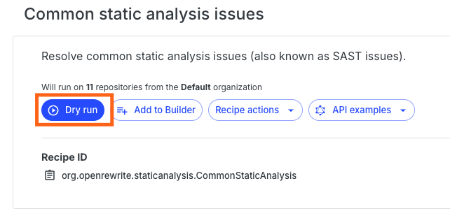
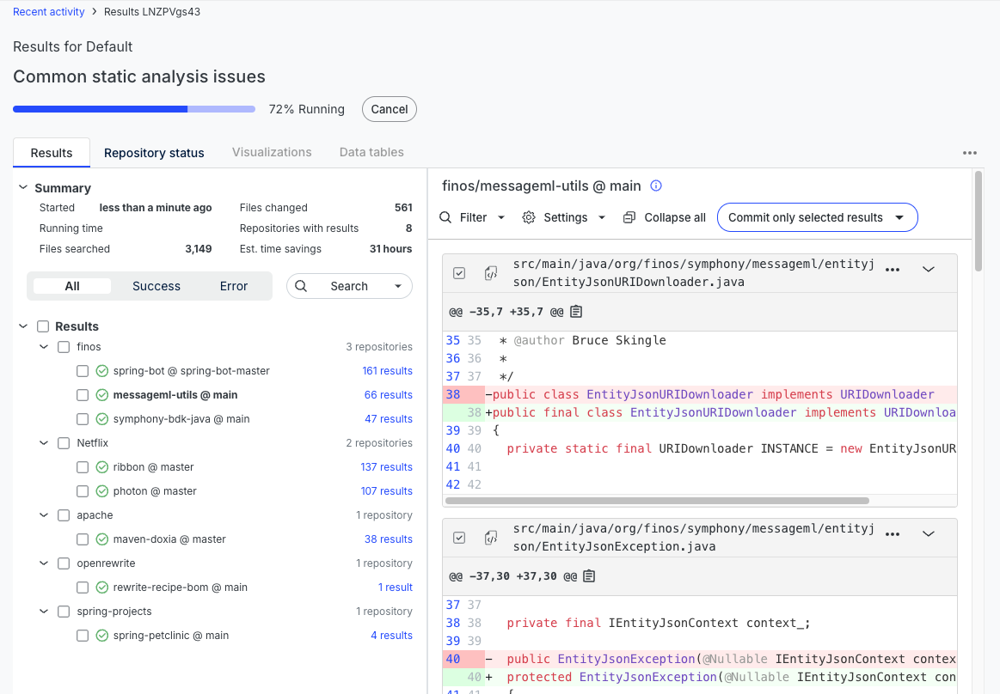
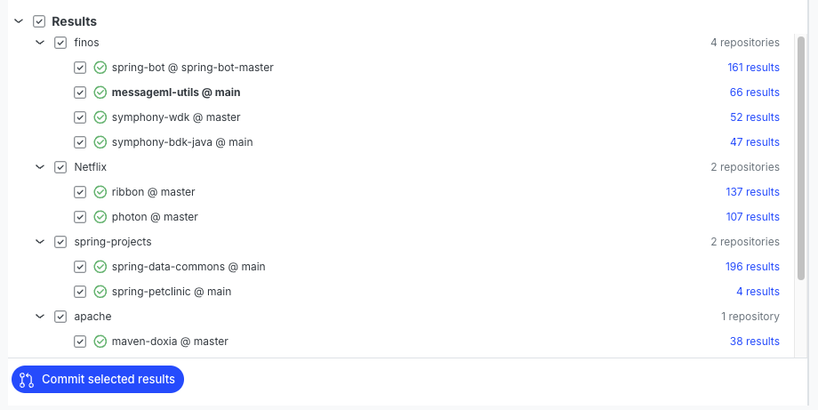

import ReactPlayer from 'react-player';

# Quickstart: Using the Moderne Platform

To help you understand the power of Moderne, let's walk through applying one of our core recipes ([common static analysis](https://docs.openrewrite.org/recipes/staticanalysis/commonstaticanalysis)) to some open-source projects that we have imported into Moderne. This recipe will fix a significant amount of static analysis issues while also ensuring that your code continues to function as expected. 

By the end of this quickstart guide, you'll understand how to run recipes against any repository in Moderne.

<ReactPlayer className="reactPlayer" url='https://vimeo.com/1120235061' controls={true} />

## Step 1: Sign in to the Moderne Platform

Go to [https://app.moderne.io](https://app.moderne.io) and sign in. We recommend signing in with GitHub as most of the open-source repositories in the Moderne Platform are in GitHub.

<figure style={{maxWidth: '600px', margin: '0 auto'}}>
  
  <figcaption>_The Moderne login screen_</figcaption>
</figure>

## Step 2: Configure your source code manager permissions

The first time you sign in to Moderne, you will be presented with an authorization prompt for a few permissions to help enhance your experience. This authorization screen will depend on which source code manager you signed in with.

:::info
For a better understanding of the permissions requested, please see [GitHub Permissions](../../../administrator-documentation/moderne-platform/references/github-permissions.md#oauth-permission).
:::

<figure style={{maxWidth: '300px', margin: '0 auto'}}>
  
  <figcaption>_An example of what the GitHub permission request might look like._</figcaption>
</figure>

## Step 3: (Optional) Select what repositories to run the recipe against

By default, recipes will run against the `Default` organization in Moderne. This organization is composed of a diverse set of open-source repositories that can help demonstrate the power of many recipes.

If you'd prefer to run against a different group of repositories, you can do so by clicking on the `Organization` button and then selecting the organization you'd like:

  <figure style={{maxWidth: '400px'}}>
    
    <figcaption>_Organization button_</figcaption>
  </figure>

  <figure style={{maxWidth: '600px'}}>
    
    <figcaption>_List of organizations_</figcaption>
  </figure>

:::tip
It's also possible to [create your own organization](../how-to-guides/managing-user-configured-organizations.md) that contains just the repositories you care about.
:::

## Step 4: Select the recipe to run

There are over 4700 recipes available in the Moderne Platform. While you are welcome to try out any of them, let's start by running the common static analysis recipe. To do so, click on the search bar and type `common static`. Then click on the first recipe that appears:

<figure style={{maxWidth: '600px', margin: '0 auto'}}>
  
  <figcaption>_Finding the common static analysis recipe._</figcaption>
</figure>

:::tip
If you want to get more information about the recipe before running it, click on the `See details` link. That will take you to a page that lists out all of the recipes that will be run as part of the common static analysis recipe.
:::

## Step 5: Run the recipe

Once you've found the recipe, click _Dry run_ to begin running the recipe. You might be asked for additional GitHub permissions after you click this button.

:::note
Running a recipe _does not_ automatically update the code in the selected repositories. You will be able to view the results and decide what you want to commit and how you want to commit it (e.g., via a PR, in a branch, etc.). We'll walk through these options later on in this guide.
:::

<figure style={{maxWidth: '500px', margin: '0 auto'}}>
  
  <figcaption>_Click on the dry run button to run the recipe._</figcaption>
</figure>

## Step 6: View the results

After pressing _Dry run_, you will be taken to a page that shows a summary of the recipe status, a list of all of the repositories where results were found, and a code block section that shows some of the changes that were made by the recipe:

<figure style={{maxWidth: '600px', margin: '0 auto'}}>
  
  <figcaption>_Example results_</figcaption>
</figure>

If you want to learn more about why a change was made, you can click on the three dots (`...`) at the top-right of any file and select `Why did this change?`. For instance, in the below example, we can see that the `final` keyword was added to the class because it only has private constructors:

<figure style={{maxWidth: '600px', margin: '0 auto'}}>
  
  <figcaption>_Understanding why the code was changed_</figcaption>
</figure>

## Step 7: Commit your changes

Once you've confirmed you want to make the changes, the next course of action is to commit everything.

:::warning
Depending on what organization you ran the recipe against, you may not have access to commit code or create a PR. Please don't try and open PRs against random projects that aren't your own.
:::

In the results view, select the repositories you want to commit, and then click on the _Commit selected results_ button:

<figure style={{maxWidth: '700px', margin: '0 auto'}}>
  
  <figcaption>_Selecting what repositories we want to commit the changes to._</figcaption>
</figure>

This will open a modal that allows you to select different actions such as committing directly, opening a pull request, etc:

<figure style={{maxWidth: '700px', margin: '0 auto'}}>
  
  <figcaption>_Selecting what repositories we want to commit the changes to._</figcaption>
</figure>

From this modal, you can customize either the _Branch Name_ or the _Commit Message_ to match the contributing guidelines of a particular repository.

:::info
You will need to have [specific permissions](../../../administrator-documentation/moderne-platform/references/github-permissions.md) depending on the commit strategy you decide to go with.
:::

## Next steps

You now know how to run recipes and commit results 🎉.

* Check out our [proof of value doc](./proof-of-value.md) for a list of popular recipes to run.
* Work through our [Moderne CLI workshop](../../moderne-cli/getting-started/moderne-cli-workshop.md) to get a better understanding of how you can use the power of Moderne and OpenRewrite locally on your computer.
* If you want to learn how to create your own recipes, read through our [fundamentals of recipe development workshop](../../../hands-on-learning/fundamentals/workshop-overview.md).