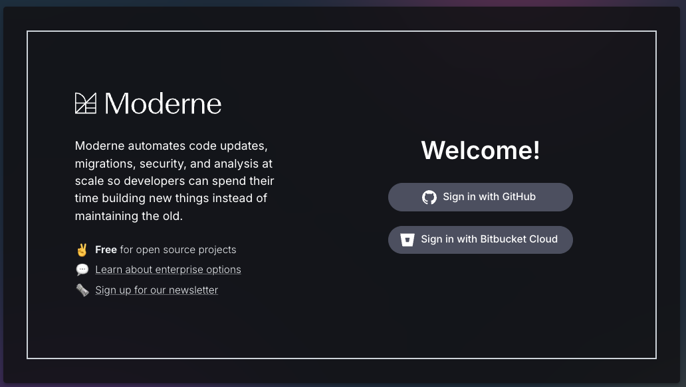
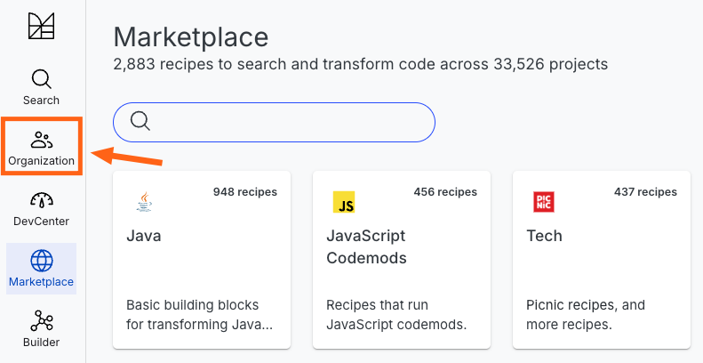
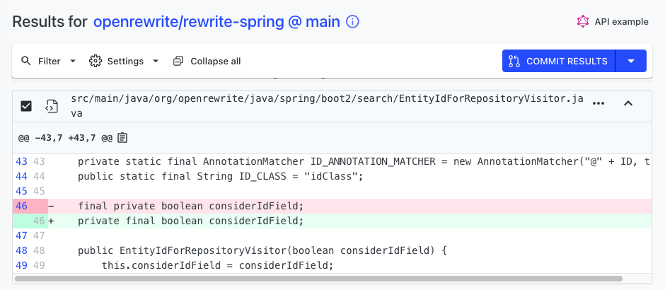
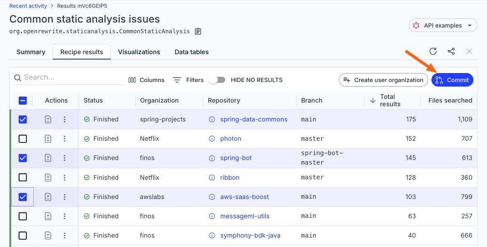

import ReactPlayer from 'react-player';

# Quickstart: Running your first recipe

To help orient you to Moderne, let's walk through how to run a [recipe](https://docs.openrewrite.org/concepts-and-explanations/recipes) on some open-source projects that we have imported into Moderne.

In this guide, we will:

* [**Sign in to Moderne**](#step-1-sign-in)
* [**Select an organization**](#step-3-optionally-select-an-organization)
* [**Find a recipe to run**](#step-5-select-a-recipe)
* [**Run a recipe**](#step-6-run-the-recipe)
* [**Examine the results**](#step-7-view-the-results)
* [**Commit the changes**](#step-8-commit-your-changes)

<ReactPlayer className="reactPlayer" url='https://www.youtube.com/watch?v=cHRi6jRPMUI' controls="true" />

## Step 1: Sign in

If you're an enterprise user, you'll need to navigate to and sign in with the link your company has provided you. Please do that and skip to [step 3](#step-3-optionally-select-an-organization).

If you're not an enterprise user, go to [https://app.moderne.io](https://app.moderne.io) and sign in:

<figure>
  
  <figcaption></figcaption>
</figure>

## Step 2: Configure GitHub permissions

The first time you sign in to Moderne through GitHub, you will be presented with an authorization prompt for a few permissions to help enhance your experience.

:::info
For a better understanding of the permissions requested, please see [GitHub Permissions](../../../administrator-documentation/moderne-platform/references/github-permissions.md#oauth-permission).
:::

<figure>
  
  <figcaption>_GitHub permission request_</figcaption>
</figure>

## Step 3: (Optionally) select an organization

After you've logged in and granted the appropriate permissions, you'll arrive at the [Moderne home page](https://app.moderne.io/).

If you went to run a recipe right now, you would find that some repositories are already selected to run against. In public Moderne, the `Default` organization is selected (a diverse selection of open-source repositories). In an enterprise instance of Moderne, the `All` organization is selected if you haven't set up an organizations service (meaning all recipes will run against every repository in the tenant). If the organizations service has been set up, it will be whatever that service returns for your user.

If you'd prefer to run against a different group of repositories so that you can get relevant results more quickly, you can: select the organization that matches your needs, set up the [Organization service](../../../administrator-documentation/moderne-platform/how-to-guides/organizations-service.md) (for enterprise users), or follow our [instructions for defining user configured organizations](../how-to-guides/managing-user-configured-organizations.md#how-to-create-a-user-configured-organization).

<figure>
  
  <figcaption>_Selecting an organization_</figcaption>
</figure>

## Step 4: Navigate to the recipe marketplace

Once you've decided what repositories you want to run recipes against, click on `Marketplace` on the left side of the screen (If you aren't already there):

<figure>
  
  <figcaption>_Moderne home page_</figcaption>
</figure>

This will take you to a page that lists all of the recipe categories. This is the default page you see when you log in.

## Step 5: Select a recipe

Let's find a good recipe to start from to help illustrate how to search across multiple repositories.

1. From the [Marketplace](https://app.moderne.io/marketplace), click on [Static analysis and remediation](https://app.moderne.io/marketplace/org.openrewrite.staticanalysis) and then [Core](https://app.moderne.io/marketplace/org.openrewrite.staticanalysis.core).
2. Click on the `Common static analysis issues` recipe.

## Step 6: Run the recipe

Click _Dry Run_ to start the recipe. You might be asked for additional GitHub permissions after you click this button.

<figure>
  
  <figcaption>Dry run selection</figcaption>
</figure>

On the results page, you will see a summary of your recipe criteria and an indication of progress.

<figure>
  
  <figcaption>Example results</figcaption>
</figure>

Each result shows the number of files searched and how many changes were detected.

import diff from './assets/diff-button.png';

To see the proposed changes, click on either the  button under `Actions` or the name of the repository (e.g. _openrewrite/rewrite_).

## Step 7: View the results

The resulting diff allows you to preview the changes from the recipe before you decide what you want to do.

<figure>
  
  <figcaption>Recipe diff</figcaption>
</figure>

If you're unsure why something changed, you can click on the three dots (`...`) at the top right of any file and select `Why did this change?`

For instance, in the above example, the identifiers were reordered due to the [modifier order rule](https://app.moderne.io/recipes/org.openrewrite.staticanalysis.ModifierOrder).

## Step 8: Commit your changes

Once you've confirmed you want to make the changes, the next course of action is to commit everything.

In the results view, select the repositories you want to commit and then click _Commit Selected_.

<figure>
  
  <figcaption>Repositories selected to commit changes on</figcaption>
</figure>

This will open a prompt that allows you to select different actions such as committing directly, opening a pull request, etc.

<figure>
  
  <figcaption>Commit change dialogue box</figcaption>
</figure>

From this prompt, you can customize either the _Branch Name_ or the _Commit Message_ to match the contributing guidelines of a particular repository.

:::info
You will need to have [specific permissions](https://docs.moderne.io/references/github-permissions) depending on the commit strategy you decide to go with.
:::

## Step 9: 🎉 Profit

You've now run and committed your first recipe. Way to go!!
