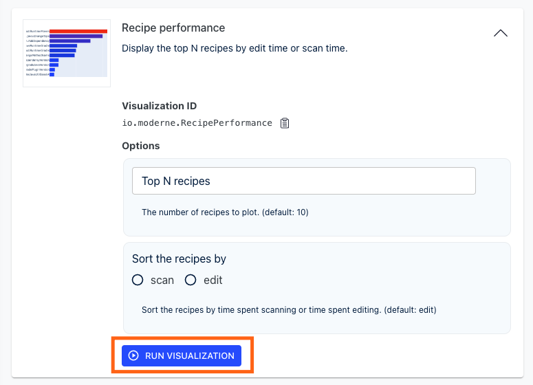
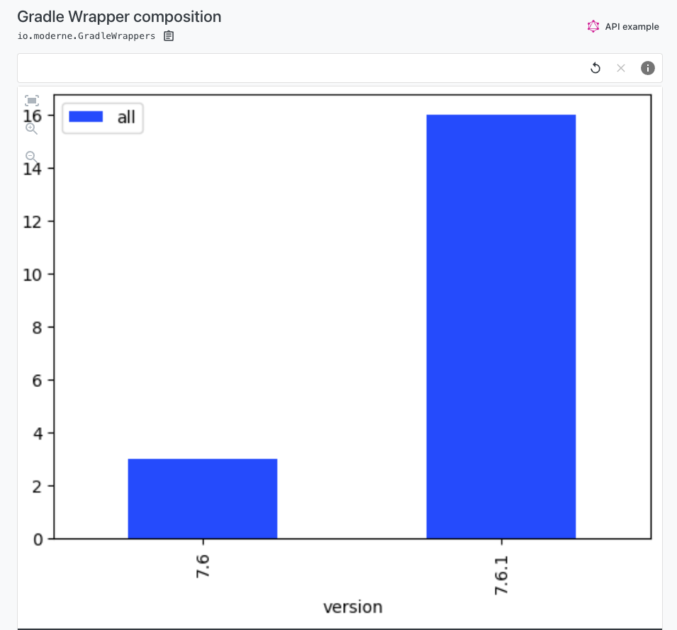
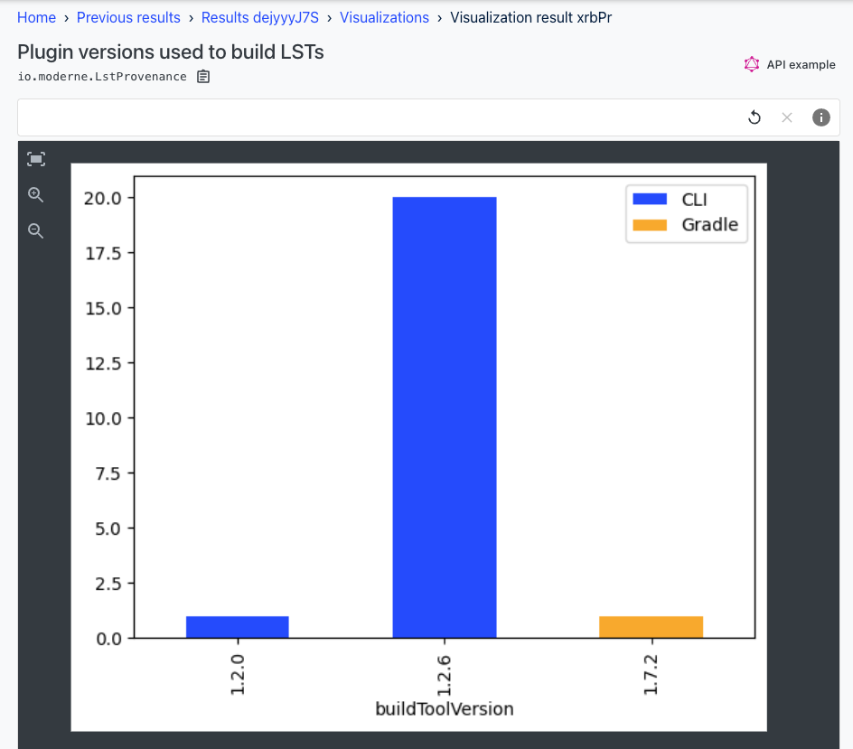

import ReactPlayer from 'react-player';

# Getting started with visualizations

Visualizations provide a unique way of looking at the data generated by specific recipes. A visualization could be a complex image that you can zoom in and out of to examine connections between nodes or it could be as simple as a text-based table that you can filter or search (see the [examples section](#visualization-examples) to see what these look like).

In this guide, we will explain everything you need to know to find, use, and create visualizations in the Moderne Platform.

<ReactPlayer className="reactPlayer" url='https://www.youtube.com/watch?v=ez1i1g7z6MM' controls="true" />

## Where visualizations exist

While you will see a visualization button on every recipe run, it will be disabled for most recipes.

This is because only a handful of recipes currently offer visualizations. You can see the list of visualizations in the [moderne-visualizations-misc repository](https://github.com/moderneinc/moderne-visualizations-misc/tree/main/moderne_visualizations_misc/specs) or you can use the following GraphQL query to find all visualizations:

```graphql
query {
  visualizationCategories {
    visualizations {
      id
      name
      description
      recipe {
        id
      }
    }
  }
}
```

Below you can find some of the most popular recipes that currently produce visualizations:

```
org.openrewrite.sql.FindSql
org.openrewrite.java.dependencies.DependencyVulnerabilityCheck
org.openrewrite.cobol.search.FindRelationships
org.openrewrite.gradle.search.FindGradleWrapper
org.openrewrite.cobol.search.FindCopybook
org.openrewrite.cobol.search.FindRelationships
org.openrewrite.FindSourceFiles
org.openrewrite.LanguageComposition
org.openrewrite.FindLstProvenance
org.openrewrite.LanguageComposition
org.openrewrite.java.search.FindMethods
```

## How to view visualizations

If a recipe produces a visualization, you can find them in the `Visualizations` tab:


When you click on it, you'll be taken to a page that contains all of the visualizations available for that recipe. Some recipes may only have one visualization whereas others might have many:


Click on the one you want to execute. After you do, the visualization box will expand. Some visualizations will offer you options to choose from to tune the visualization to your needs:


Visualization options serve two main purposes: they can change the rendering of the visualization (such as turning a node from a square to a circle) or they can subset the data (e.g., taking 1000 nodes and filtering them down to 100 that match your specific needs).

Once you've selected the options you want, click the `Run Visualization` button at the bottom:



This will trigger the process for building the visualization. Once it's done building, you should see a visualization appear:


## How to create visualizations

Please see our [how to create visualizations guide](../../../administrator-documentation/moderne-platform/how-to-guides/create-visualization.md).

## Visualization examples

### Language composition report

This reports the usage of different programming languages and data file formats. Can be configured to count lines of text or number of files.


### SQL operation usage in code

Reports SQL operation usage. A good way to understand the SQL usage patterns and identify programs which interact with a database.


### Dependency vulnerability profile

Reports the known vulnerabilities and the related dependencies, broken down by the severity of the vulnerability. Notes whether a major, minor, or patch version increase would be sufficient to move the affected dependency to a version known to have a fix for the vulnerability.


### Gradle wrapper composition

Reports the distribution of Gradle wrapper versions in use. Useful when planning migrations and upgrades.



### Plugin versions used to build LSTs

Reports the tool which produced the LST and the version of that tool. Useful for evaluating whether or not you can expect to see the latest features and bug fixes in action.



### Find uses of method in code

Reports method invocations. Useful for finding example usage or conducting impact analysis for proposed changes.


### COBOL relationship diagram

Reports the relationships between different COBOL resources. Includes COBOL sources, Copybooks, Link-edit cards, DB2 access, and others.


### COBOL relationship data grid

Reports the relationships between different COBOL resources. Includes COBOL sources, Copybooks, Link-edit cards, DB2 access, and others.


