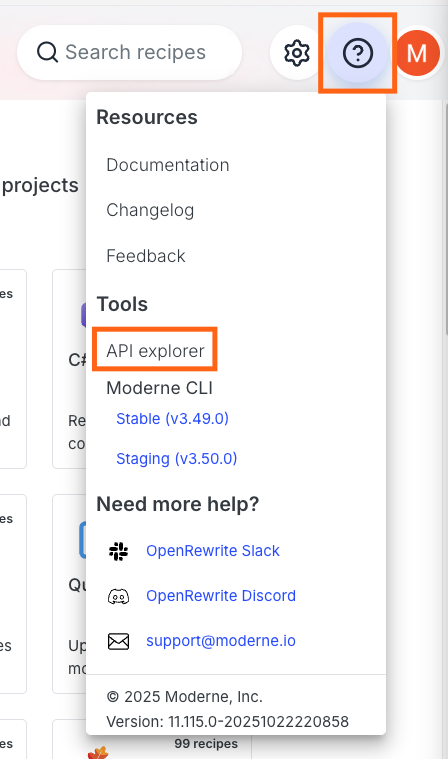
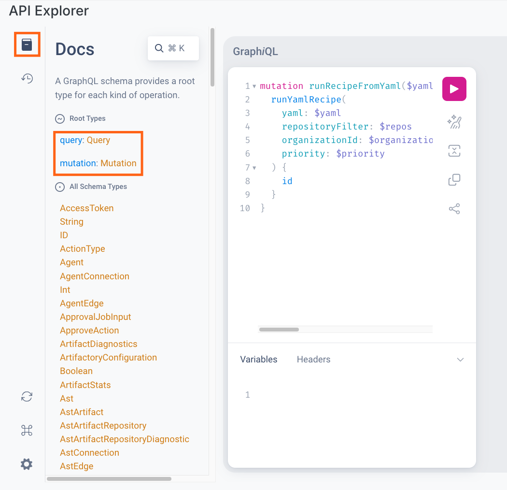

# Accessing the Moderne API

Moderne offers a GraphQL API for customers to interact with through the usage of a personal access token. In this doc, we'll walk through everything you need to know to access and use this API.

## Prerequisites

In order to access the GraphQL API, you will need to [create a Moderne personal access token](create-api-access-tokens.md).

:::warning
Personal access tokens **do not** have the same permissions as your user account. Actions that require roles (such as deploying recipes or uploading LSTs) will fail as forbidden if attempted with an access token.
:::

## GraphQL API Explorer

To assist with the development of tools that access the Moderne APIs, Moderne offers an API explorer where you can manually create and run queries.

To access this explorer, either click on the API Explorer link GraphQL link in the top bottom left corner of the UI or go directly to [https://app.moderne.io/graphql](https://app.moderne.io/graphql).

:::warning
Please note that when you make actual API requests, you'll want to make them against `https://api.app.moderne.io/` instead of `https://app.moderne.io/graphql`.
:::

<figure>
  
</figure>

:::info
A temporary access token is created when you log in to the platform. This lasts for 1 hour and is autopopulated into the `Authorization` header (located in the `Request Headers` tab in the bottom left) when you navigate to the GraphQL explorer.
:::

## View the documentation

After you've navigated to the API explorer, you should see a `Documentation Explorer` on the right side of the page. You can click on `Query` or `Mutation` to navigate through their respective docs.

