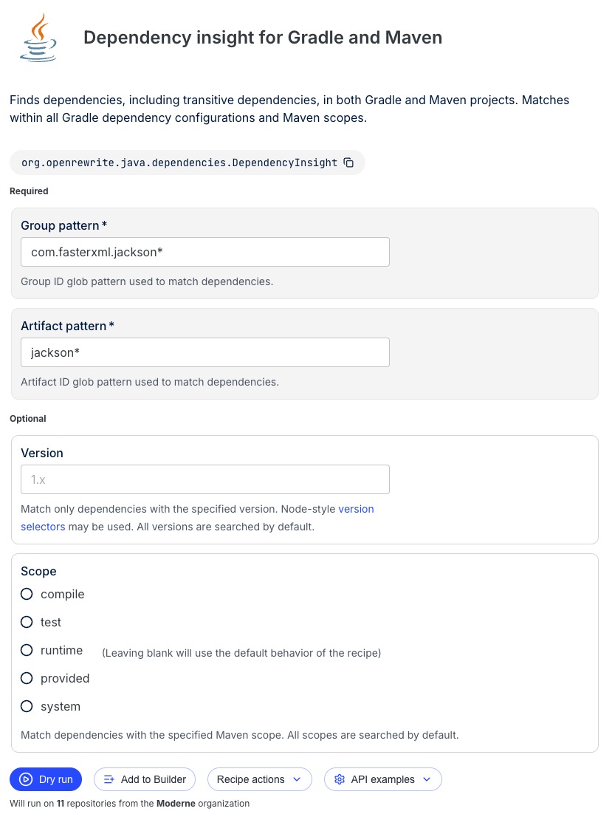
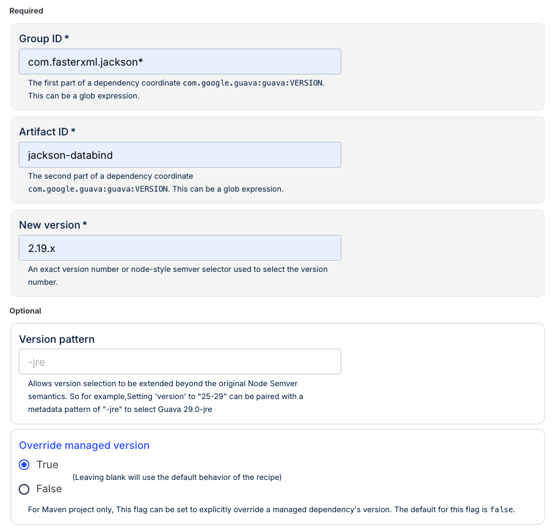

# How to address CVEs with Moderne

Let's assume a new Jackson CVE has just been disclosed. Your security team has reached out to you and told you that this is a critical issue. You have to quickly determine if your company is affected and, if so, what needs to be fixed. This is a common scenario that plays out whenever a new vulnerability is discovered in a popular library.

Fortunately, Moderne can help make your life much easier in this situation.

In this guide, we'll walk you through how to respond to this situation using Moderne. We'll cover everything from assessing the situation to remediating it.

## Prerequisites

This guide assumes that you are already familiar with running recipes on specific repositories in the Moderne Platform. If you aren't, please check out our [getting started guide](../getting-started/running-your-first-recipe.md) before working through this guide.

In this guide, we will use the `Default` organization in the Moderne Platform. That being said, as code is constantly changing, your results may differ from the ones you see here.

## The hypothetical CVE

Before we dive into using Moderne, let's establish what we know about this hypothetical CVE.

Let's say that the CVE affects Jackson versions prior to `2.19`. The security team recommends upgrading to at least version `2.19.x`. That being said, for maximum protection, we should consider upgrading to Jackson `3.x`, since version `2.x` will soon be unsupported.

Based on that information, we need to:

1. **Assess our exposure**: Which repositories use Jackson, and what versions are they on?
2. **Determine the fix**: Can we simply bump the version, or do we need a more comprehensive migration?
3. **Apply the fix**: Make the necessary changes across all affected repositories.

Now that we have an idea of what we need to do, let's get started!

## Step 1: Assess our exposure

Before we can fix anything, we need to understand the scope of the problem. How many of our repositories use Jackson? What versions do they use? Are we already using safe versions?

Normally you'd want to spend some time looking for what recipes exist - perhaps by asking [Moddy](../../moddy/moddy-platform.md) or via the [Moderne Platform search](./moderne-platform-search.md).

For the purposes of this guide, however, let's use the [Dependency insight for Gradle and Maven recipe](https://app.moderne.io/recipes/org.openrewrite.java.dependencies.DependencyInsight) as it answers all of the above questions.

### Run the dependency insight recipe

Navigate to the [Dependency insight for Gradle and Maven recipe](https://app.moderne.io/recipes/org.openrewrite.java.dependencies.DependencyInsight?defaults=W3sibmFtZSI6Imdyb3VwSWRQYXR0ZXJuIiwidmFsdWUiOiJjb20uZmFzdGVyeG1sLmphY2tzb24qIn0seyJuYW1lIjoiYXJ0aWZhY3RJZFBhdHRlcm4iLCJ2YWx1ZSI6ImphY2tzb24qIn0seyJuYW1lIjoidmVyc2lvbiIsInZhbHVlIjoiIn1d) and configure it to find all Jackson dependencies:

* **Group pattern**: `com.fasterxml.jackson*`
* **Artifact pattern**: `jackson*`

<figure style={{maxWidth: '600px', margin: '0 auto'}}>
  
  <figcaption>_Searching for all Jackson dependencies across our organization_</figcaption>
</figure>

Once you've filled out the fields, press **Dry Run** to run the recipe.

### Visually see what work needs to be done

After the recipe completes, navigate to the **Visualizations** tab and run the **Dependency usage violin** visualization. This gives us an immediate picture of our exposure:

<figure style={{maxWidth: '600px', margin: '0 auto'}}>
  
  <figcaption>_Violin chart showing Jackson versions in use - we can immediately see which versions need attention._</figcaption>
</figure>

Looking at this visualization, we can quickly assess our situation:

* The **X-axis** shows the Jackson artifacts in use throughout our projects (`jackson-annotations`, `jackson-core`, `jackson-databind`, etc.).
* The **Y-axis** shows the specific versions that are in use by the projects.
* Each **dot** signifies that there are one or more repositories using that version. You can hover over each dot to see how many repositories use the specified version.

From the above example, we can see that we have a significant number of repositories that are using Jackson versions prior to `2.19` - so we have our work cut out for us.

### Get a detailed breakdown

If the problem is widespread or you want to create a more dedicated plan, it can be helpful to download a data table that contains specifics about every repository that is affected.

To access this data table, go to the **Data tables** tab and download the **Dependencies in use** data table. This CSV will provide information on things like:

* What Jackson artifact and version is used in each repository
* The dependency scope (compile dependencies are higher priority than test dependencies)

## Step 2: Apply a simple version bump

Now that we know our exposure, let's start fixing what we can. For repositories that just need a minor version bump (no breaking changes), we can use the [Upgrade Gradle or Maven dependency versions](https://app.moderne.io/recipes/org.openrewrite.java.dependencies.UpgradeDependencyVersion) recipe.

### Configure the upgrade recipe

Navigate to the [Upgrade dependency version recipe](https://app.moderne.io/recipes/org.openrewrite.java.dependencies.UpgradeDependencyVersion) and enter the following details:

* **Group ID**: `com.fasterxml.jackson*` - The glob pattern ensures we catch all Jackson modules.
* **Artifact ID**: `jackson-databind` - Targeting the specific artifact mentioned in the CVE.
* **New version**: `2.19.x` - The minimum safe version.
* **Override managed version**: `True` - This is especially important! This ensures BOM-managed versions are also updated.

<figure style={{maxWidth: '600px', margin: '0 auto'}}>
  
  <figcaption>_Options you should run this recipe with._</figcaption>
</figure>

Press **Dry Run** to preview the changes.

### Review the results

The results show us exactly which build files would be modified:

<figure>
  
  <figcaption>_An example of what the recipe may change._</figcaption>
</figure>

For each affected repository, we can see the changes to the `pom.xml` or `build.gradle` files. Fortunately, this is a straightforward fix that doesn't require any code changes.

If everything looks good, commit the changes. If you are routinely running the `Dependency insight for Gradle and Maven` recipe we mentioned above to track the CVE, the repos you modified will no longer show they have issues for this CVE.

### Is a simple version bump enough?

For many CVEs, upgrading to a patched version within the same major release is sufficient. Unfortunately for us, the advisory did mention that Jackson `2.x` is approaching its end-of-life. To set us up for success in the future, we should upgrade to Jackson `3.x`.

This is where things get a bit more interesting.

## Step 3: Run a comprehensive migration

Upgrading from Jackson `2.x` to `3.x` isn't just a version bump - it's a major version migration with breaking changes:

* Package names change from `com.fasterxml.jackson` to `tools.jackson`
* Several methods have been renamed
* Some features that required explicit configuration in `2.x` are now defaults in `3.x`
* Certain modules that were separate are now built into core

Doing this manually across dozens of repositories would take weeks. Fortunately, Moderne has a recipe that can drastically cut this time down.

### Run the Jackson migration recipe

Navigate to the [Upgrade Jackson 2.x to 3.x recipe](https://app.moderne.io/recipes/org.openrewrite.java.jackson.UpgradeJackson_2_3):

<figure>
  
  <figcaption>_The Jackson migration recipe handles all the breaking changes automatically._</figcaption>
</figure>

This comprehensive recipe handles a substantial amount of the changes needed for the migration:

* **Package changes**: Updates all imports from `com.fasterxml.jackson` to `tools.jackson`
* **Dependency updates**: Upgrades all Jackson `2.x` dependencies to their `3.x` equivalents
* **Method renames**: `JsonGenerator.writeObject()` → `writePOJO()`, `JsonParser.getCurrentValue()` → `currentValue()`, and many others
* **Feature flag cleanup**: Removes configuration for features that are now on by default in Jackson 3
* **Module consolidation**: Removes explicit registrations for modules now built into Jackson 3
* **Serialization updates**: Updates `ObjectMapper` configuration for Jackson 3 compatibility

To see what this recipe does on our repositories, click the **Dry Run** button.

### Review the comprehensive changes

Unlike the simple version bump we did earlier, this recipe modifies actual source code. You'll see changes to:

* **Build files**: Dependency coordinates updated to Jackson `3.x`
* **Java source files**: Import statements, method calls, and configuration updated

Review these changes carefully. While the recipe handles the mechanical transformation correctly, you'll want to ensure your tests pass after the migration. Major version upgrades can have subtle behavioral changes that automated tools can't detect.

## Verifying the fix

After applying your fixes (whether simple upgrades or full migrations), it's important to verify that the CVE is actually resolved.

Run the `Dependency insight` recipe again with the same parameters. The visualization should now show all repositories on safe versions. If any repositories still show vulnerable versions, investigate why - they may have dependency conflicts or other issues preventing the upgrade.

## Summary

When a new CVE is disclosed, Moderne enables you to respond quickly and systematically:

1. **Assess exposure** - identify exactly which repositories are affected and what versions they use
2. **Apply simple fixes** - for patch and minor version bumps where no code changes are needed
3. **Apply comprehensive migrations** - for major version upgrades with breaking changes
4. **Verify the fix** - validate that affected repositories have been remediated

What would traditionally take days or weeks of manual investigation and code changes can be accomplished in hours.
