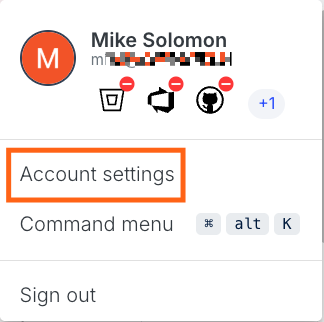
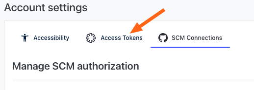
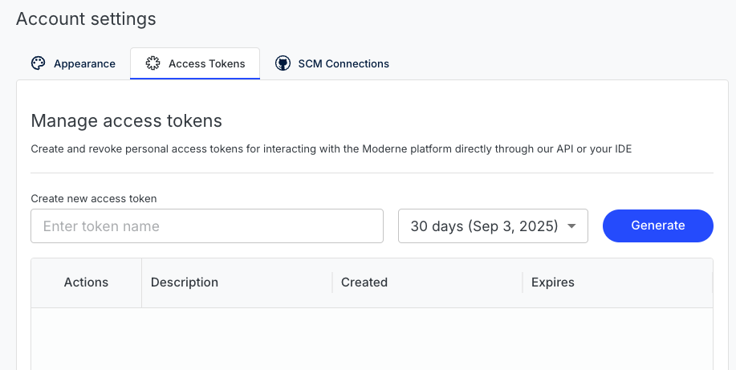
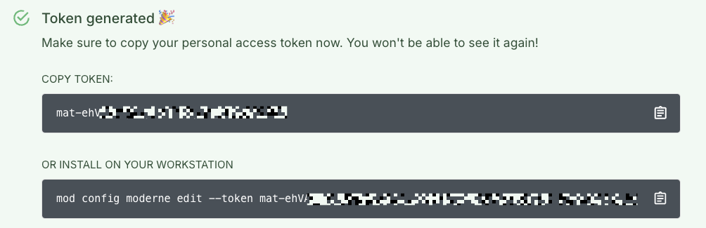
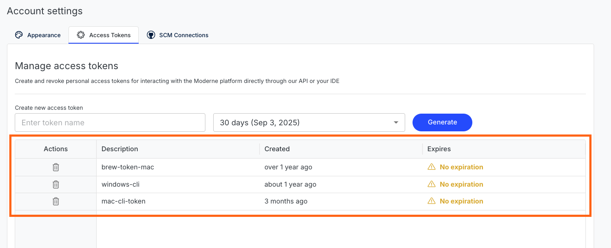
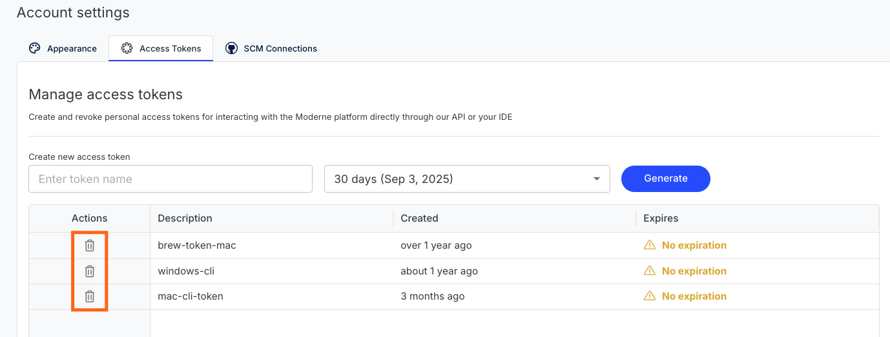

# Creating a personal access token

In order to use the [Moderne GraphQL API](https://api.app.moderne.io/), you will need to create a Personal Access Token.

:::info
If you want to learn how to use an access token, please go to the [Accessing the Moderne API doc](accessing-the-moderne-api.md).
:::

In this doc, you can find out:

* [How to make a new access token](#how-to-make-an-access-token)
* [How to view what access tokens already exist](#how-to-view-your-access-tokens)
* [How to revoke access tokens you no longer want](#how-to-revoke-an-access-token)
* [Some limitations around these access tokens](#limitations)

## How to make an access token

1. In the bottom left-hand corner of the app, click on your profile avatar and select _Account settings:_

<figure>
  
  <figcaption></figcaption>
</figure>

2. Click on _Access Tokens_ in the middle of the page:

<figure>
  
  <figcaption></figcaption>
</figure>

3. You should now see a page that looks like:

<figure>
  
  <figcaption></figcaption>
</figure>

4. In the text box that says `Enter token name`, enter a descriptive name for your token so that it can easily be distinguished from other tokens.
5.  Press the `generate` button. You should see something that looks like:

<figure>
  
  <figcaption>_Hint: Click the clipboard icon to copy your access token_</figcaption>
</figure>

6. Copy your token to a safe place such as a password manager. You won't be able to see the token again if you close the window.

## How to view your access tokens

From the [access token](https://app.moderne.io/settings/access-token) page (where you previously created the token), you can see a list of all the tokens:

<figure>
  
  <figcaption></figcaption>
</figure>

## How to revoke an access token

From the [access token](https://app.moderne.io/settings/access-token) page, click _Delete_ icon next to the token you wish to revoke:

<figure>
  
  <figcaption></figcaption>
</figure>

## Limitations

* Personal access tokens have the lowest level of permissions possible. They do not have the same permissions as your user account. For instance, actions that require a specific role (such as deploying a recipe or uploading an AST) will fail as forbidden if attempted with an access token.
