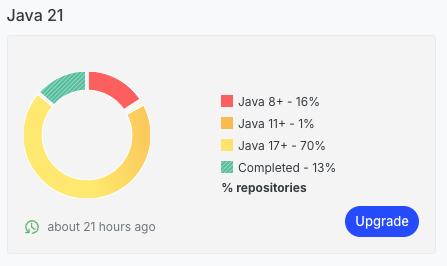
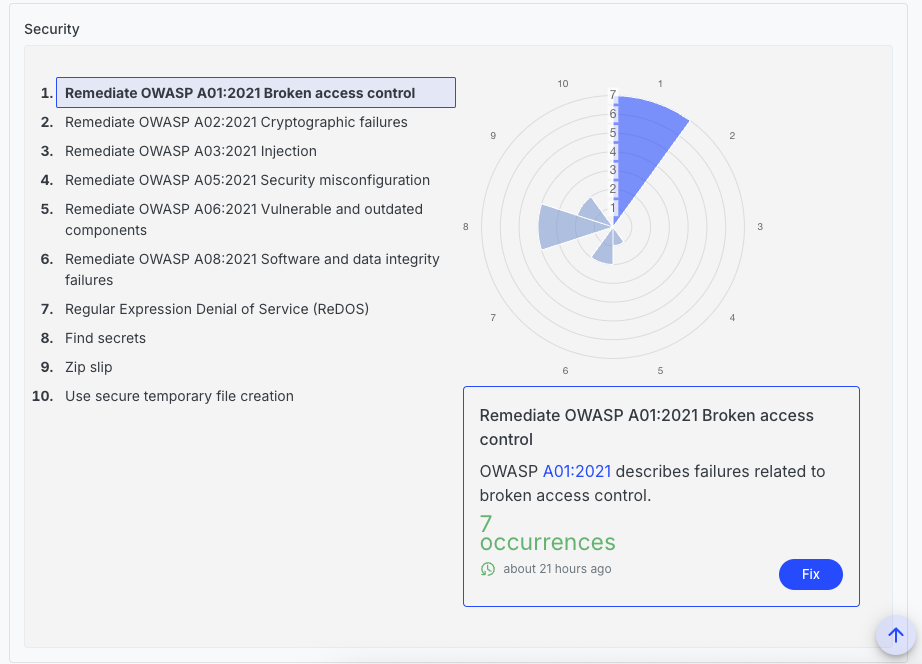

# How to create a custom DevCenter recipe

The Moderne DevCenter is the mission-control dashboard of the Moderne Platform. It provides you with high-level details about the state of all of your repositories. Using it, you can track the progress of upgrades, migrations, and security vulnerabilities.

In order to create a DevCenter, you will need to create a recipe module, have it depend on our [DevCenter starter module](https://github.com/moderneinc/rewrite-devcenter), and then create a declarative YAML recipe that defines your DevCenter.

This guide will walk you through how to do all of those steps so that you can come out of it with a fully working DevCenter.

## Prerequisites

This guide assumes that:

* You have a basic understanding of what [declarative YAML recipes](https://docs.openrewrite.org/reference/yaml-format-reference) look like.

## Understanding how a DevCenter recipe works

To understand how a DevCenter recipe works, let's first look at the [DevCenter starter](https://github.com/moderneinc/rewrite-devcenter/blob/main/src/main/resources/META-INF/rewrite/devcenter-starter.yml) we've created to help you get started.

### Metadata

The top of this recipe begins with standard metadata (e.g., `name` and `description`) that you would find in any declarative YAML recipe:

```yaml
type: specs.openrewrite.org/v1beta/recipe
name: io.moderne.devcenter.DevCenterStarter
displayName: DevCenter
description: >-
  This is a default DevCenter configuration that can be used as a starting point for your own DevCenter configuration.
  It includes a combination of upgrades, migrations, and security fixes.
  You can customize this configuration to suit your needs.
  
  For more information on how to customize your DevCenter configuration, see the [DevCenter documentation](https://docs.moderne.io/user-documentation/moderne-platform/getting-started/dev-center/).
```

### Recipe list

After that, it lists out the recipes that will be run to build the DevCenter dashboard. Each of these recipes will turn into a card in your DevCenter:

```yaml
recipeList:
  - io.moderne.devcenter.LibraryUpgrade:
      cardName: Move to Spring Boot 3.5.0
      groupIdPattern: org.springframework.boot
      artifactIdPattern: '*'
      version: 3.5.0
      upgradeRecipe: io.moderne.java.spring.boot3.UpgradeSpringBoot_3_5
  - io.moderne.devcenter.JavaVersionUpgrade:
      majorVersion: 21
      upgradeRecipe: org.openrewrite.java.migrate.UpgradeToJava21
  - io.moderne.devcenter.JUnitJupiterUpgrade:
      upgradeRecipe: org.openrewrite.java.testing.junit5.JUnit4to5Migration
  - io.moderne.devcenter.SecurityStarter
```

These recipes have some properties you probably haven't seen before. Specifically:

* `cardName` is a property that allows you to customize what the name of the card should be. By default, TODO.
* `upgradeRecipe` is a property that defines the recipe that should be run to upgrade your repositories. It is the recipe that will get executed when you press the `Upgrade` button on a card.

<figure>
  
  <figcaption>_An example of a DevCenter card._</figcaption>
</figure>

### Security card

It's also possible to create recipes in your `devcenter.yml` file. For instance, at the bottom of our example, you will find a recipe that is used to create a security card in the DevCenter:

```yaml
---
type: specs.openrewrite.org/v1beta/recipe
name: io.moderne.devcenter.SecurityStarter
displayName: OWASP top ten
description: >-
  This recipe is a starter card to reveal common OWASP Top 10 issues in your source code.
  You can customize this configuration to suit your needs.
  
  For more information on how to customize your DevCenter configuration, see the [DevCenter documentation](https://docs.moderne.io/user-documentation/moderne-platform/getting-started/dev-center/).
recipeList:
  - org.openrewrite.java.security.OwaspA01
  - org.openrewrite.java.security.OwaspA02
  - org.openrewrite.java.security.OwaspA03
  - org.openrewrite.java.security.OwaspA08
  - org.openrewrite.java.security.RegularExpressionDenialOfService
  - org.openrewrite.java.security.ZipSlip
  - org.openrewrite.java.security.SecureTempFileCreation
  # Changes made by recipes above this one in the recipe list are reported as occurrences
  # in the Security DevCenter card.
  - io.moderne.devcenter.ReportAsSecurityIssues:
      fixRecipe: org.openrewrite.java.security.OwaspTopTen
```

This security recipe differs slightly from a traditional YAML recipe. In the recipe list, there is a specical recipe called `io.moderne.devcenter.ReportAsSecurityIssues`. By adding that recipe to the list, it will detect the number of issues found in the above recipes and generate a card that display them all.

This recipe takes in a `fixRecipe` property that defines the recipe that can be run to fix the issues reported by the above security recipes.

<figure>
  
  <figcaption>_An example of a security section in a DevCenter._</figcaption>
</figure>

## Examples of customizations

Taking the DevCenter starter as a starting point, you can customize it to suit your needs. Here are a few examples of how you can do that:

### Quarkus example

```yaml
# An example DevCenter configuration for a Quarkus application, with a named custom upgrade recipe for Quarkus
type: specs.openrewrite.org/v1beta/recipe
name: io.moderne.devcenter.DevCenterQuarkus
displayName: DevCenter
description: >-
  DevCenter for organizations that use Quarkus.
  Also includes Java and JUnit upgrades and security findings.
recipeList:
  - io.moderne.devcenter.LibraryUpgrade:
      cardName: Move to Quarkus 3.23.0
      groupIdPattern: io.quarkus
      artifactIdPattern: '*'
      version: 3.23.0
      upgradeRecipe: io.moderne.devcenter.UpgradeQuarkus
  - io.moderne.devcenter.JavaVersionUpgrade:
      majorVersion: 21
      upgradeRecipe: org.openrewrite.java.migrate.UpgradeToJava21
  - io.moderne.devcenter.JUnitJupiterUpgrade:
      upgradeRecipe: org.openrewrite.java.testing.junit5.JUnit4to5Migration
  - io.moderne.devcenter.SecurityStarter
---
type: specs.openrewrite.org/v1beta/recipe
name: io.moderne.devcenter.UpgradeQuarkus
displayName: DevCenter
description: >-
  This recipe upgrades all Quarkus dependencies to the latest 3.23 version.
recipeList:
  - org.openrewrite.java.dependencies.UpgradeDependencyVersion:
      groupId: io.quarkus
      artifactId: '*'
      newVersion: 3.23.x
```
* The `LibraryUpgrade` recipe was adjusted to target `io.quarkus` dependencies instead of `org.springframework.boot`.
* As a generic `UpgradeQuarkus` recipe doesn't exist yet, a new `UpgradeQuarkus` recipe was created to upgrade all Quarkus dependencies to the latest version.
  * Note that this recipe does not have to be in the same file or even module.

### Custom parent example

```yaml
# An example DevCenter tracking Parent POM versions, illustrated by using the Apache Maven parent POM
type: specs.openrewrite.org/v1beta/recipe
name: io.moderne.devcenter.DevCenterApacheParent
displayName: DevCenter
description: >-
  DevCenter for organizations that use the apache maven parent.
  Also includes Java and JUnit upgrades and security findings.
recipeList:
  - io.moderne.devcenter.ParentPomUpgrade:
      cardName: Move to the latest Apache Maven parent POM
      groupIdPattern: org.apache.maven
      artifactIdPattern: maven-parent
      version: x
      upgradeRecipe: io.moderne.devcenter.UpgradeApacheMavenParent
  - io.moderne.devcenter.JavaVersionUpgrade:
      majorVersion: 21
      upgradeRecipe: org.openrewrite.java.migrate.UpgradeToJava21
  - io.moderne.devcenter.JUnitJupiterUpgrade:
      upgradeRecipe: org.openrewrite.java.testing.junit5.JUnit4to5Migration
  - io.moderne.devcenter.SecurityStarter
---
type: specs.openrewrite.org/v1beta/recipe
name: io.moderne.devcenter.UpgradeApacheMavenParent
displayName: Upgrade Apache Maven Parent
description: >-
  Upgrades the Apache Maven parent POM to the latest version.
recipeList:
  - org.openrewrite.maven.UpgradeParentVersion:
      groupId: org.apache.maven
      artifactId: maven-parent
      newVersion: x
```
* Instead of the `LibraryUpgrade` recipe seen previously, this example uses a `ParentPomUpgrade` recipe to target the Apache Maven parent POM.
* A generic recipe to upgrade parent versions does exist, but to fill its parameters in a DevCenter recipe, you need to create a custom recipe that specifies the groupId and artifactId of the parent POM you want to upgrade.

## TODO - explain deploying 

To be able to use the recipe in the CLI or in your tenant, you'll have to make it part of a recipe module.
  * If you haven't set this up yet, please refer to the [Recipe authoring workshop](https://docs.moderne.io/user-documentation/workshops/recipe-authoring/#exercise-2-create-and-test-your-own-recipe-module).
  * Make sure your recipe module depends on `rewrite-devcenter`