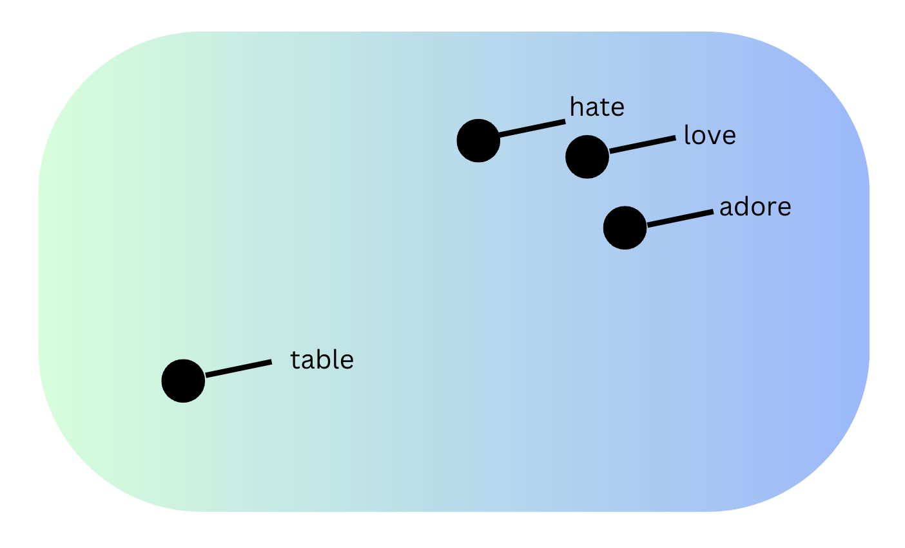
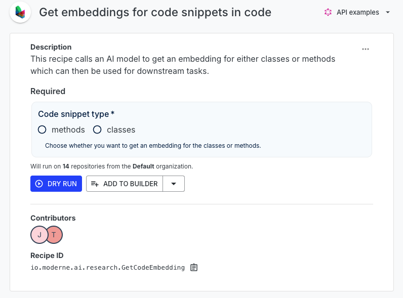
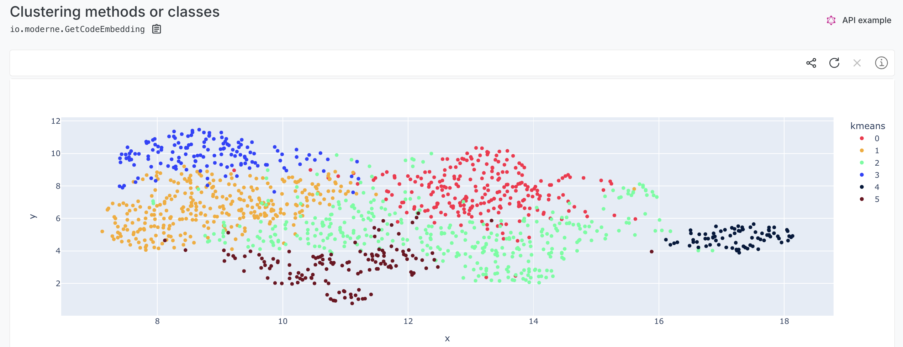

# How to gain a high-level overview of your codebase using AI clustering

<figure>
  
  <figcaption></figcaption>
</figure>

## Why is this useful?

A visualization that clusters all the method declarations in a codebase is particularly useful for understanding the overall structure and organization of the code. By grouping related methods or classes together, it allows developers to quickly grasp how different parts of the codebase are connected. This, in turn, makes it easier to navigate and comprehend, especially in large projects.

Furthermore, this type of visualization can reveal patterns that indicate potential “code smells” or areas where refactoring might be needed. For example, by highlighting clusters of methods that naturally belong together but are dispersed across different classes, the visualization can help identify opportunities for refactoring to enhance code cohesion and modularity.

It also allows developers to quickly spot method names that don’t follow established naming conventions, such as discovering a method named `fetchData` in a cluster where the convention is to use `retrieveData`.

## Concepts and terminology

### Embeddings

Embeddings are numerical representations of data concepts that AI models can operate on. A data concept can be an image, a word, a document, chunks of a document, or even a method declaration. Since embeddings are vectors of floats, they can be used to do arithmetics. With the basis that embeddings represent entities, if two entities’ embeddings are close to each other numerically, the two entities will be similar. For example, you might think that “love” and “hate” would be far from each other, but they tend to have similar embeddings. They both are emotions that people use to define a relationship in regard to something or someone else.

<figure>
    
    <figcaption></figcaption>
</figure>

### Clustering

Clustering is the process of grouping similar objects together based on their features. It involves dividing a dataset into clusters, where objects within the same cluster are more similar to each other than to those in other clusters. Using the example above, we could see two clusters: one containing “hate”, “love” and “adore”, and another containing “table”.

## How to produce the visualization

Before starting the visualization, you must first [run a recipe which collects the embeddings for each method or class](https://app.moderne.io/recipes/io.moderne.ai.research.GetCodeEmbedding) (depending on your preference). Select `methods` or `classes` depending on which one you want to analyze.

<figure>
  
  <figcaption></figcaption>
</figure>

Once the recipe has finished running, click on the visualization tab and run the "clustering code snippets" visualization.

<figure>
  
  <figcaption></figcaption>
</figure>

As a result you will get a 2D scatter plot, where each dot represents either a method or a class depending on what you selected. You can hover over any dot to reveal the name of the method or class. The closer two dots are, the more likely their contents are similar. For instance, you can expect to find methods that read, write, or delete files near each other.

<figure>
  
  <figcaption></figcaption>
</figure>

## What information can you extract from this?

* You could find methods that do similar things but have different names, which could be refactored into a more cohesive design, such as creating a class that extends another to group similar functionality.
* You can identify inconsistencies in naming conventions across the codebase, such as methods that perform similar actions but are named differently, which could be standardized for clarity.
* It allows you to see which methods (or classes) are most closely related, potentially revealing opportunities for optimizing the codebase by improving modularity or reducing dependencies.

## Gotchas & tips and tricks

* Note that the methods are deduplicated, so only one dot represents a method even if it appears multiple times in the codebase. The deduplication is based on the full method declaration, not just the name or signature.
* Running the visualization on too many repositories with too many methods or classes can make the information overwhelming and difficult to digest, so it’s best to narrow the scope when possible.
* The embeddings used for clustering are based on the content of the method (or class) as well, not just the method (or class) names, which helps in grouping methods (or class) that perform similar tasks even if they have different names.
* While clusters can provide useful information about related methods, the relative positions of the clusters within the visualization also hold significant insights. One dot may be perfectly in between two clusters, so its position conveys more information than the cluster it was assigned to.
