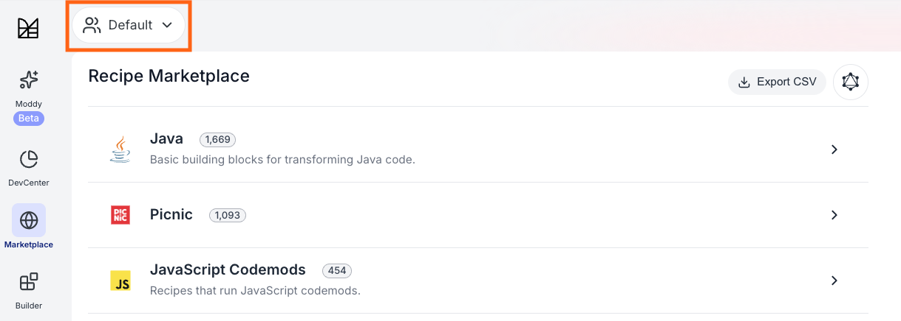
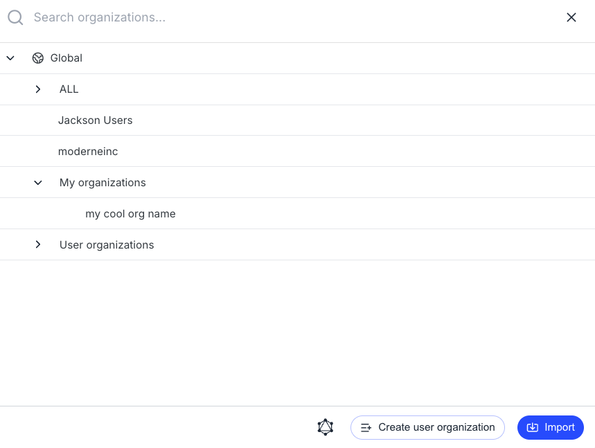
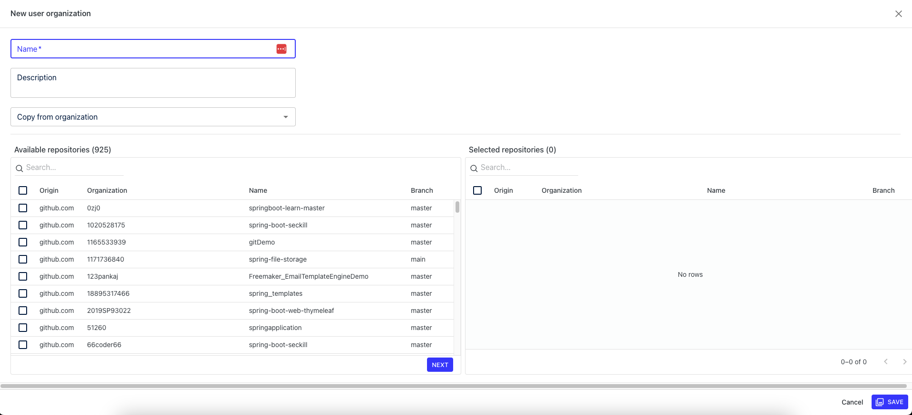
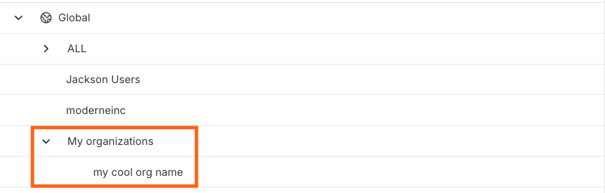
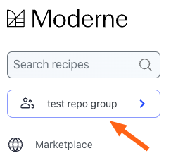
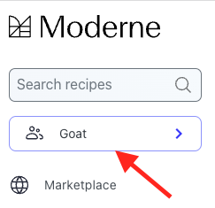
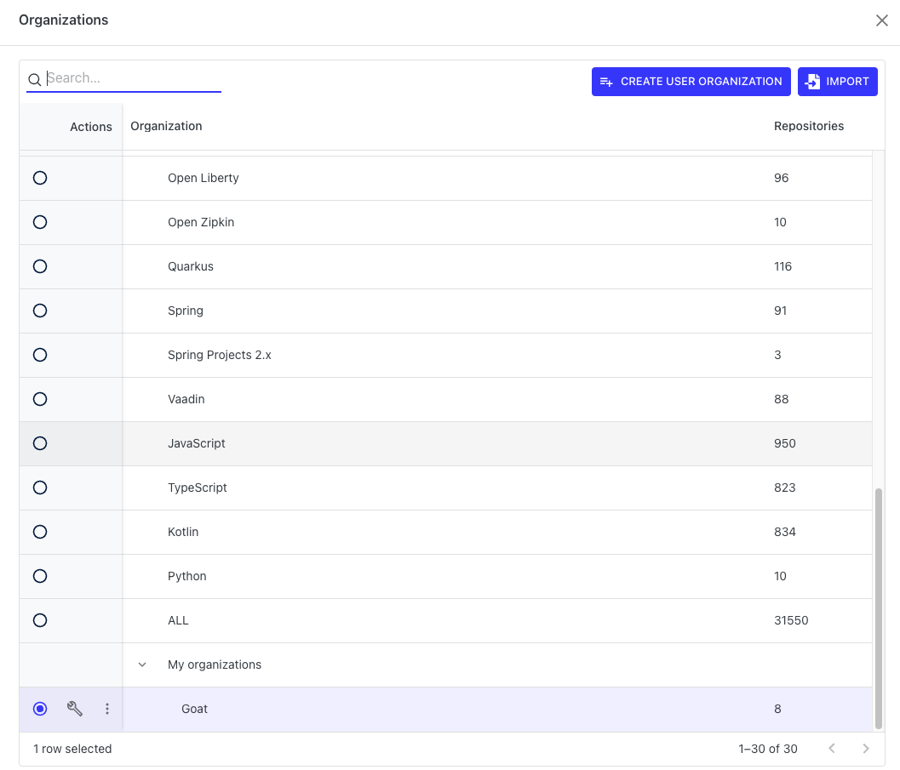
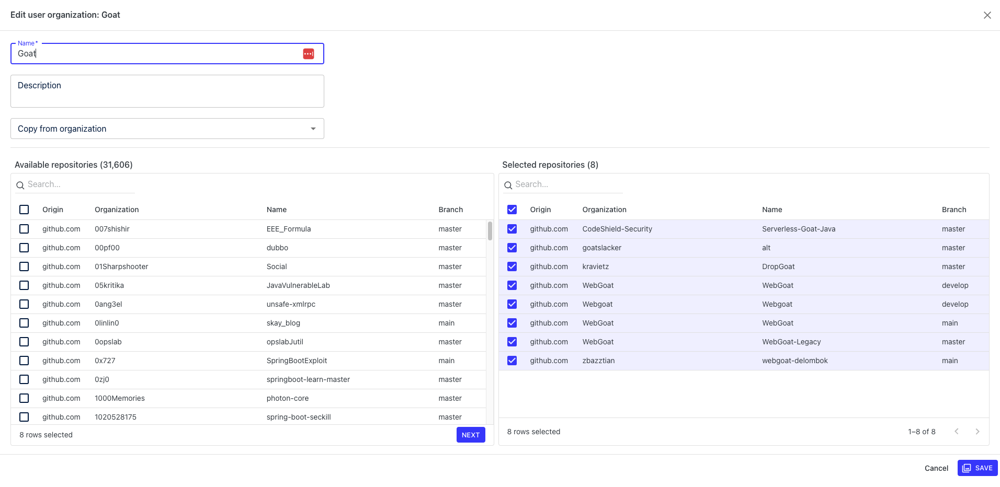

# Managing user-configured organizations

When running recipes in Moderne, it's a good idea to filter them to run on a selection of repositories you care about so that you get relevant results more quickly. In filtering these recipes, many people have found that they wanted to create multiple user-configured organizations of repositories that they can easily switch between. Both of these issues can be solved by using user-configured organizations.

To help you get started with user-configured organizations, in this guide you will learn:

* [How to create a user-configured organization](#how-to-create-a-user-configured-organization)
* [How to modify or delete an existing user-configured organization](#how-to-modify-or-delete-existing-user-configured-organizations)
* [How to export user-configured organization JSON](#how-to-modify-or-delete-existing-user-configured-organizations)

## How to create a user-configured organization

1. In the top left corner of the Moderne home page, you will see a box under the search box that says `Default`:

<figure>
  
  <figcaption></figcaption>
</figure>

2. If you click on that, the organizations menu will appear:

<figure>
  
  <figcaption></figcaption>
</figure>

3. Press the `Create User Organization` button in the top right corner. You will be taken to the user-configured organization creation page:

<figure>
  
  <figcaption></figcaption>
</figure>

4. At the top, you should enter a descriptive name for the user organization. This will be the identifier you'll see when you go to select which organization you want to run a recipe on.
5. Once you've entered a name for your organization, it's time to select the repositories you want to be included in this organization. You can use the search box to look for repositories that contain your search term anywhere in their origin, organization, name, or branch.
6. When you've finished searching for the repositories you want in the organization, you can select all of the repositories to add by clicking on the checkbox at the top or you can select individual repositories by clicking on the checkbox next to each repository.
7. Once you've selected all the repositories you want to be in the organization, click on the `Save` button in the bottom right to create the user-configured organization. You will be redirected back to the Organizations page. At the bottom of that page, you will find your organizations under the `My Organizations` heading.

<figure>
  
  <figcaption></figcaption>
</figure>

8. Now, when you go to run any recipe, you can navigate to the Organizations page and click on the organization name to select which organization you want to run the recipe on. Once selected, you should see the name of the organization appear in the box back on the home page:

<figure>
  
  <figcaption></figcaption>
</figure>

## How to modify or delete existing user-configured organizations

1. From any page, click on the organization box under the search box:

<figure>
  
  <figcaption></figcaption>
</figure>

2. This will take you to the list of organizations or user-configured organizations to select:

<figure>
  
  <figcaption></figcaption>
</figure>

3. To modify a user-configured organization, scroll to the bottom of that page and click on the wrench icon next to the organization you want to modify. You will be redirected to a page that allows you to select repositories:

<figure>
  
  <figcaption></figcaption>
</figure>

4. To remove a user-configured organization, scroll to the bottom of the page and click on the `...` icon. Then select `Delete user organization` and it will be removed.

## How to export user-configured organization JSON

Follow the same instructions as above, but instead of selecting "delete", select "export".

## Additional information

User-configured organizations are saved in the database and are available between browsers. User-configured organizations are only available to the user that created them. This means that no one else in your organization or team will be able to see the user-configured organizations you've created.
