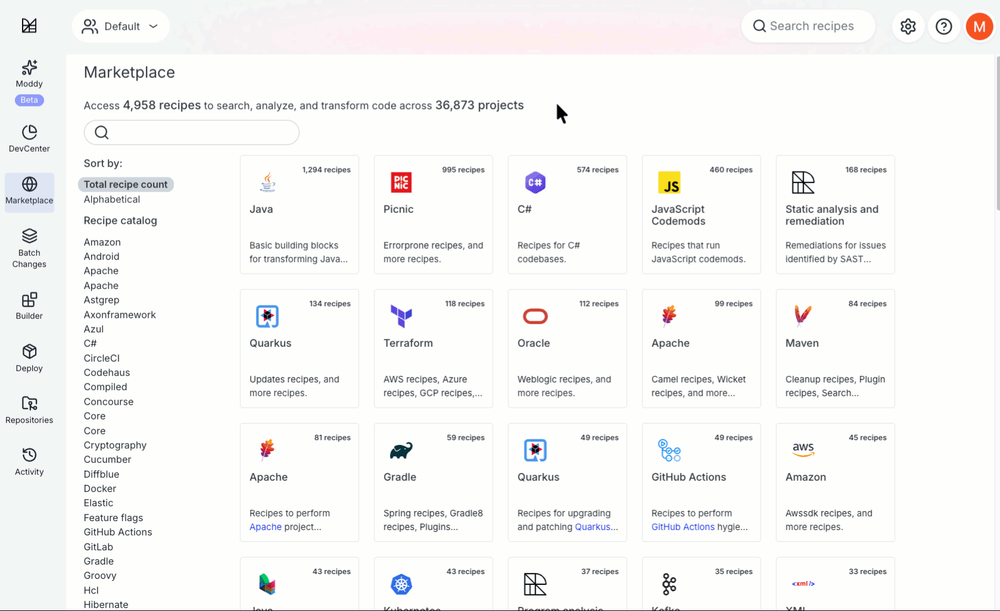
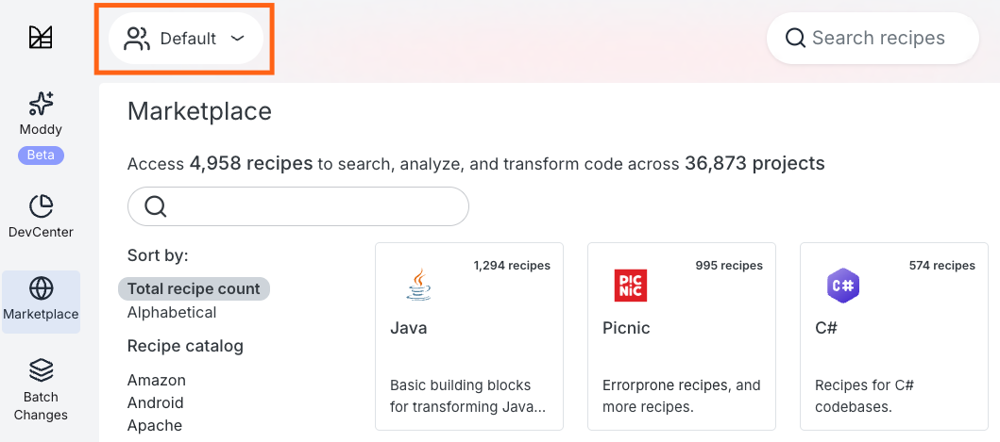
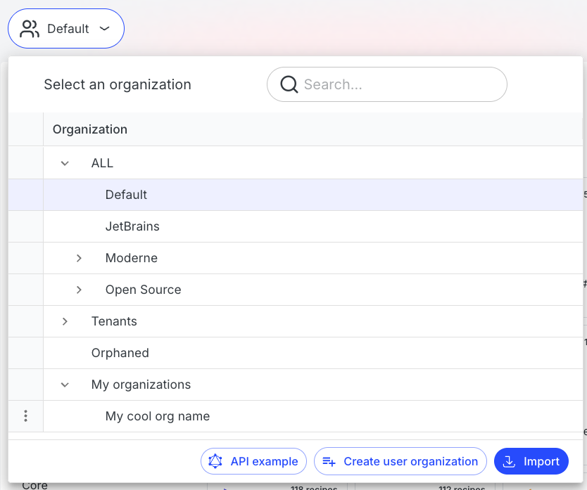
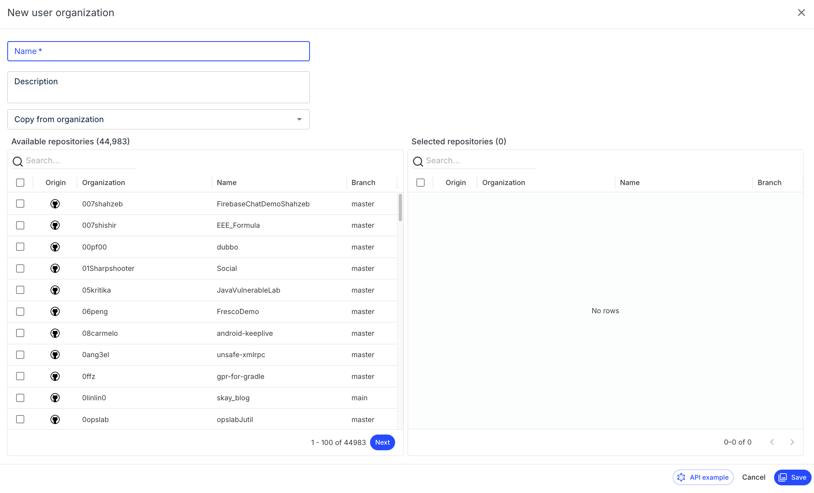
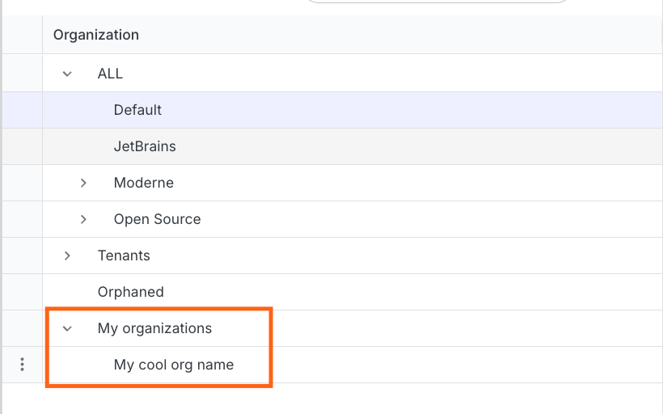
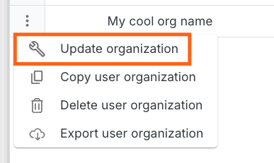

# Managing user-configured organizations

When running recipes in Moderne, it's a good idea to filter them to run on a selection of repositories you care about so that you get relevant results more quickly. In filtering these recipes, many people have found that they wanted to create multiple user-configured organizations of repositories that they can easily switch between. Both of these issues can be solved by using user-configured organizations.

To help you get started with user-configured organizations, in this guide you will learn:

* [How to create a user-configured organization](#how-to-create-a-user-configured-organization)
* [How to modify or delete an existing user-configured organization](#how-to-modify-or-delete-existing-user-configured-organizations)
* [How to export user-configured organization JSON](#how-to-modify-or-delete-existing-user-configured-organizations)

## How to create a user-configured organization

<figure>
  
  <figcaption>_A gif showing the whole process described below._</figcaption>
</figure>

1. In the top left corner of the Moderne home page, you will see an `Organization` icon:

<figure>
  
  <figcaption></figcaption>
</figure>

2. If you click on that, the Organizations modal will appear. Press the `Create User Organization` button in the top-right corner.

<figure>
  
  <figcaption></figcaption>
</figure>

3. You will be taken to the user-configured organization creation page:

<figure>
  
  <figcaption></figcaption>
</figure>

4. At the top, you should enter a descriptive name for the user organization. This will be the identifier you'll see when you go to select which organization you want to run a recipe on.
5. Once you've entered a name for your organization, it's time to select the repositories you want to be included in this organization. You can use the search box to look for repositories that contain your search term anywhere in their origin, organization, name, or branch –– you'd then click the checkbox next to all the ones you want to use in your org. You can also choose to copy all the repos from a specific organization if you have one you want to start from.
6. Once you've selected all the repositories you want to be in the organization, click on the `Save` button in the bottom right to create the user-configured organization. You will be redirected back to the Organizations page. At the bottom of that page, you will find your organizations under the `My organizations` heading.

<figure>
  
  <figcaption></figcaption>
</figure>

8. Now, when you go to run any recipe, you can click on the `Organizations` icon and select the organization you want to run the recipe on.

## How to modify or delete existing user-configured organizations

1. From any page, click on the organization box under the search box:

<figure>
  
  <figcaption></figcaption>
</figure>

2. This will take you to the list of organizations or user-configured organizations to select:

<figure>
  
  <figcaption></figcaption>
</figure>

3. To modify a user-configured organization, click on the triple dots next to the organization you want to modify and then select `Update organization`:

<figure>
  
  <figcaption></figcaption>
</figure>

4. You will be redirected to a page that allows you to select repositories:

<figure>
  
  <figcaption></figcaption>
</figure>

5. To remove a user-configured organization, select `Delete user organization` instead of `Update organization`.

## How to export user-configured organization JSON

Follow the same instructions as above, but instead of selecting "delete", select "export".

## Additional information

User-configured organizations are saved in the database and are available between browsers. User-configured organizations are only available to the user that created them. This means that no one else in your organization or team will be able to see the user-configured organizations you've created.
