import VersionBanner from '@site/src/components/VersionBanner';

<VersionBanner version="v2" linkPath="/user-documentation/moderne-platform-v1/how-to-guides/new-recipe-builder" />

# Create custom recipes with the recipe builder

Have you found a recipe in Moderne where you only want to run certain parts of it? Or have you found a few recipes that you want to combine into one larger recipe? Or maybe you want to run a bunch of recipes in a specific order?

All of these problems can be solved by utilizing the new Recipe Builder, which provides a way for you to create custom recipes from our existing recipe catalog.

## How to create a custom recipe in the builder

To create a custom recipe you will need to:

1. Click on the `Builder` link to be taken to the recipe builder.

<figure>
  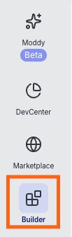
  <figcaption>_Builder link_</figcaption>
</figure>

2. Create a recipe by either clicking on the `New recipe...` link in the welcome modal or by clicking on the recipe name in the top-left corner of the builder and then pressing `New`:

<figure>
  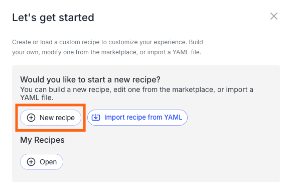
  <figcaption>_Welcome modal_</figcaption>
</figure>

<figure>
  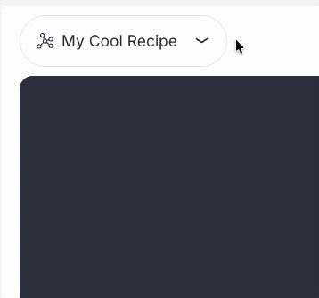
  <figcaption>_New recipe menu_</figcaption>
</figure>

3. Regardless of which path you picked, you'll be met with a new modal for defining some basic details of your recipe:

<figure style={{maxWidth: '500px', margin: '0 auto'}}>
  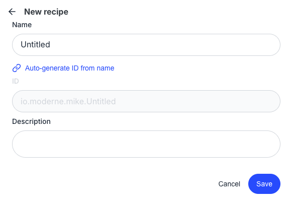
  <figcaption>_New recipe modal_</figcaption>
</figure>

4. Enter a name, ID, and description for the recipe and then press `Save`. It's important to give the recipe an appropriate name and description if you ever intend to share it with others.

5. In the center of your window, you'll find the 3D recipe viewer. In it, there is a highlighted sphere with the name of your recipe. You can think of this as the root node of your recipe. From there, you can attach other recipes or preconditions to it. To do this, either click on the three horizontal lines next to the recipe title and then click `Add recipe to this recipe node` –– or mouse over the name of your recipe in the recipe list on the right side of the screen and click the triple vertical docs and select `Add recipe to node`:

<figure>
  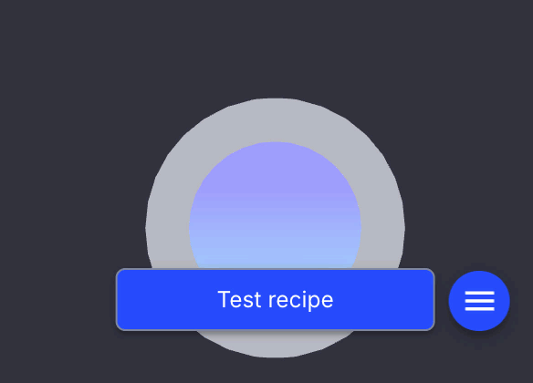
  <figcaption>_Add recipes/preconditions from the 3D viewer_</figcaption>
</figure>

<figure>
  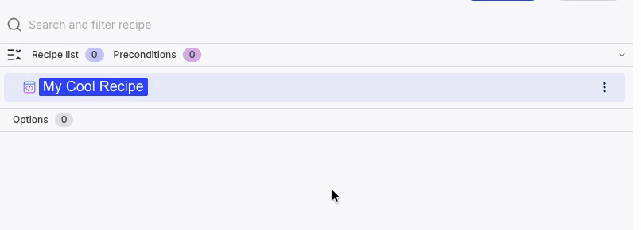
  <figcaption>_Add recipes/preconditions from the recipe list_</figcaption>
</figure>

6. In the modal that popped up, you can search for recipes to add. If the "Add as a precondition" box is checked, that recipe will be added as a [precondition](./preconditions.md). Otherwise, the recipe will be added to the list of recipes to run.

<figure style={{maxWidth: '700px', margin: '0 auto'}}>
  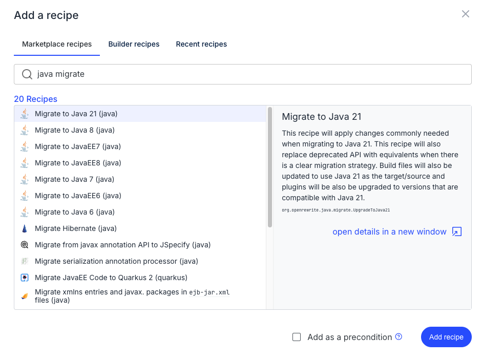
  <figcaption>_Add recipe modal_</figcaption>
</figure>

7. After you select a recipe, the 3D recipe viewer and recipe list side panel will be updated to include that recipe and all of its sub-recipes. Feel free to add more recipes or edit the ones you've included. For more detailed instructions in how to use the 3D recipe viewer or the recipe list panel, [jump down in this doc](#how-to-use-the-3d-viewer). 

8. Once you've got your recipe into the place you want it, you can run it by pressing the `Dry Run` button at the top of your screen:

<figure>
  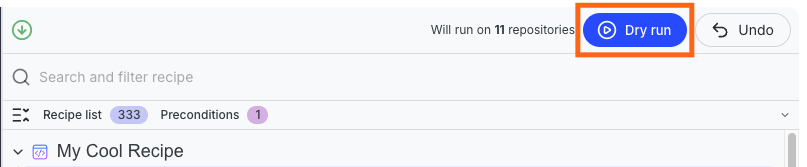
  <figcaption>_Dry run button_</figcaption>
</figure>

9. Victory!

## How to create or add recipes from the marketplace

From any recipe in the marketplace, you can click on the `Add to builder` button:

<figure>
  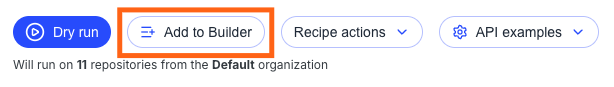
  <figcaption>_Add to builder button_</figcaption>
</figure>

A modal will then pop up that either allows you to create a new recipe or add this recipe to one you've already created.

<figure>
  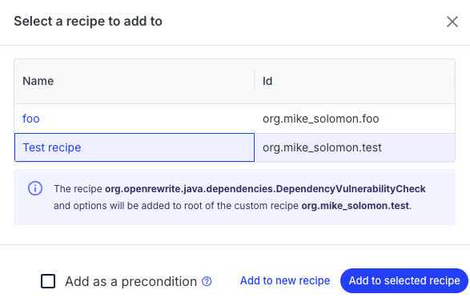
  <figcaption>_Add to builder modal_</figcaption>
</figure>

Click on the `Add to new recipe` or `Add to selected recipe` button to continue. 

## How to save and share custom recipes

When you're ready to save or share your custom recipe with others, you can do so by clicking on the `Recipe` button in the top-left corner and selecting either `Download YAML` or `Copy as YAML to clipboard`:

<figure>
  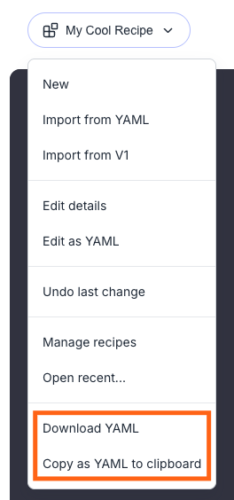
  <figcaption>_Saving or sharing a recipe_</figcaption>
</figure>

Clicking on either of these will convert the recipe into a YAML file that you can then share with others.

## How to import custom recipes

If you want to import a recipe from a YAML file you can do so by clicking on the `Recipe` button in the top-left corner and clicking on `Import from YAML` in the drop-down:

<figure>
  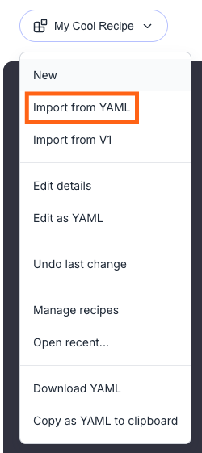
  <figcaption>_Import a recipe_</figcaption>
</figure>

This will open a YAML editor that you can then paste a recipe into. Once you've confirmed it's the recipe you want, press the `Import` button in the bottom-right corner to import it.

## How to use the 3D viewer

### How to add/edit/remove recipes or preconditions

Select the node you are interested in adding to/editing/deleting. Click on the three horizontal bars that appear next to the node. Select what you would like to do from that menu that appears.

<figure>
  
  <figcaption>_Add/edit/delete recipes or preconditions_</figcaption>
</figure>

### How to rotate a recipe

Hold down the **left** mouse button and drag it in the direction you want to rotate the recipe nodes:

<figure>
  
  <figcaption>_Recipe rotate_</figcaption>
</figure>

### How to move around in the 3D space

Hold down the **right** mouse button and drag it to move around in the 3D space:

<figure>
  
  <figcaption>_Recipe movement_</figcaption>
</figure>

### How to zoom in and out

Scroll the mouse wheel up and down to zoom in and out. The viewer will zoom towards and away from where your mouse is currently hovering.

<figure>
  
  <figcaption>_Recipe zoom_</figcaption>
</figure>

### How to reset your 3D viewer

If you've zoomed too far out or moved the recipe too far away, and you want to reset to a stable view, either click the "move to fit" or "move to selected node" button in the bottom-left corner of the 3D viewer. Moving to fit will attempt to make it so all of the recipes nodes fit in the viewer at once. Moving to selected will zoom in to the node you currently have selected.

<figure>
  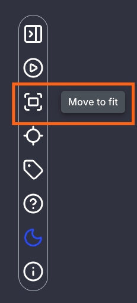
  <figcaption>_Move to fit_</figcaption>
</figure>

<figure>
  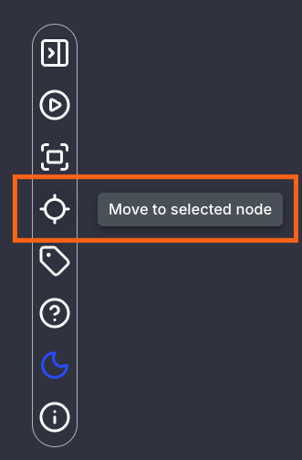
  <figcaption>_Move to selected_</figcaption>
</figure>

### How to turn on/off node highlighting

In some situations, you may want to view the 3D recipe without having the current node highlighted. To turn on/off node highlighting, click on the hide/show node highlighting button:

<figure>
  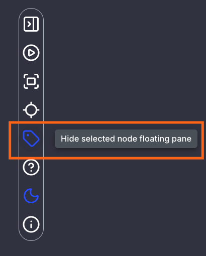
  <figcaption>_Node highlighting button_</figcaption>
</figure>

### How to swap the 3D recipe viewer and the recipe list side panel

When creating or editing recipes, you may find that the 3D recipe viewer is not as important as the recipe list tree view. In that case, you can swap the position of the two by clicking on the move to sidebar button:

<figure>
  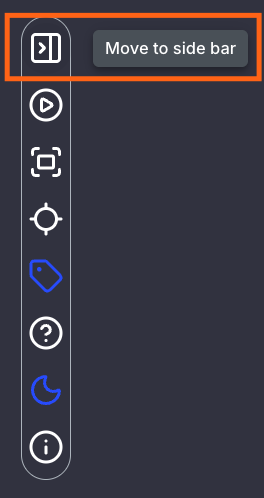
  <figcaption>_Move to sidebar button_</figcaption>
</figure>
