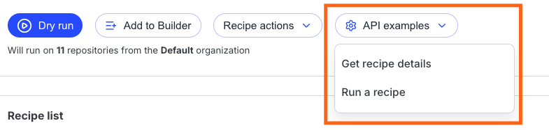

import Tabs from '@theme/Tabs';
import TabItem from '@theme/TabItem';

# Recipe execution and commits with the Moderne API

Imagine you found a recipe you would like to run as part of your organization's automation process (such as updating the Gradle plugin version when a new release is published). Rather than manually running this recipe each time, you can use Moderne's GraphQL API to speed this process up with automation.

To help you understand how to automate recipe execution and commits, we'll walk through all the steps necessary to use Moderne's GraphQL API. By the end, you should know how to:

* [Execute recipes](#recipe-execution)
* [Verify that recipes have been completed](#verify-recipe-completion)
* [Retrieve repository results](#retrieve-repositories-with-results)
* [Commit changes](#creating-a-pull-request)
* [Ensure that committed changes are correct](#verify-commit-job)

### Prerequisites:

This guide assumes that you:

1. Know how to use and interact with GraphQL APIs.
2. [Have created a Moderne personal access token](create-api-access-tokens.md).
3. [Have created an SCM access token.](../references/create-scm-access-tokens.md)

### Recipe execution

1. To begin, you'll want to decide what repositories you want your recipe to run on. You have three options for selecting repositories: choosing an existing organization, creating a new user-defined organization, or selecting an existing user-defined organization. Once you've selected or created one, you can proceed to step 2.

2. Navigate to the recipe you wish to run and fill out the recipe options.

3. In the top right corner of the page, click on `API examples` and select `Run a recipe`. This will provide you with the query that will be run when executing a recipe run. Additionally, the appropriate variables will be added to this query based on your organization selection from step 1.

<figure>
  
  <figcaption></figcaption>
</figure>

4. You can then execute a recipe with the following mutation:

<Tabs>
<TabItem value="run-recipe-mutation" label="Run Recipe Mutation">

```graphql
mutation runRecipe($input: RecipeRunInput!) {
  runRecipe(run: $input) {
    id
    __typename
  }
}
```

**Mutation Variables**:

```json
{
  "input": {
     "recipe": {
      "id": "org.openrewrite.gradle.plugins.UpgradePluginVersion",
      "options": [
        { "name": "pluginIdPattern", "value": "com.gradle.plugin-publish" },
        { "name": "newVersion", "value": "1.1.0" }
      ]
    },
    "organizationId": "Gradle"
  }
}
```
</TabItem>
<TabItem value="curl" label="cURL">


```bash
curl --request POST \
--url https://api.app.moderne.io/graphql \
--header 'Authorization: Bearer <YOUR MODERNE TOKEN HERE>' \
--header 'Content-Type: application/json' \
--data '{"query":"# Moderne API: https://api.app.moderne.io/graphql\nmutation executeRecipe($input: RecipeRunInput!) {\nrunRecipe(run: $input) {\n id\n}\n}","variables":{"input":{"recipe":{"id":"org.openrewrite.gradle.plugins.UpgradePluginVersion","options":[{"name":"pluginIdPattern","value":"com.gradle.plugin-publish"},{"name":"newVersion","value":"1.1.0"}]},"organizationId": "Gradle"}},"operationName":"executeRecipe"}'

```

</TabItem>
</Tabs>

5. The mutation will return a response that contains the `id` of the recipe run which will be used in the next step to poll for the completion of the recipe. Example response:

```graphql
{
  "data": {
    "runRecipe": {
      "id": "5LPSt"
    }
  }
}
```

### Verify recipe completion

1. You will now need to poll (Moderne's web interface uses a 3-second interval) with the query shown below using the `id` from the [recipe execution mutation](recipe-execution-and-commits-with-graphql.md#recipe-execution).

<Tabs>
<TabItem value="query-recipe-run" label="Query Recipe Run">

```graphql
query runRecipeName($id: ID!) {
  recipeRun(id: $id) {
    recipe {
      id
      name
    }
    state
  }
}
```
</TabItem>

<TabItem value="query-variables" label="Query Variables">

```json
{ "id": "h7a0mwyqg" }
```
</TabItem>

<TabItem value="curl" label="cURL">


```bash
curl --request POST \
--url https://api.app.moderne.io/graphql \
--header 'Authorization: Bearer <YOUR MODERNE TOKEN HERE>' \
--header 'Content-Type: application/json' \
--data '{"query":"# Moderne API: https://api.app.moderne.io/graphql\nquery runRecipeName($id: ID!) {\n recipeRun(id: $id) {\n recipe {\n id\n name\n }\n state\n }\n}","variables":{"id":"h7a0mwyqg"},"operationName":"runRecipeName"}'
```

</TabItem>
</Tabs>

2\. Once you receive a response with an `FINISHED` or `ERROR` state, you can then retrieve the repositories where changes were made. Example response:

```json
{
  "data": {
    "recipeRun": {
      "recipe": {
        "id": "org.openrewrite.gradle.plugins.UpgradePluginVersion",
        "name": "Update a Gradle plugin by id"
      },
      "state": "FINISHED"
    }
  }
}
```

### Retrieve repositories with results

1. Using the `id` from the [recipe execution](#recipe-execution) response, you can now retrieve the repositories where changes were made using the query below.

<Tabs>
<TabItem value="retrieve-repositories-query" label="Retrieve Repositories Query">

```graphql
query selectAllRepositoriesWithResults($id: ID!, $first: Int, $after: String) {
  recipeRun(id: $id) {
    summaryResultsPages(
      first: $first
      after: $after
      filterBy: { onlyWithResults: true } 
    ) {
      count
      pageInfo {
        hasNextPage
        endCursor
      }
      edges {
        node {
          repository {
            __typename
            origin
            path
            branch
          }
          state
        }
      }
    }
  }
}
```
</TabItem>

<TabItem value="query-variables" label="Query Variables">

```json
{
  "id": "h7a0mwyqg",
  "first": 100
}
```
</TabItem>

<TabItem value="curl" label="cURL">


```bash
curl --request POST \
--url https://api.app.moderne.io/graphql \
--header 'Authorization: Bearer <YOUR MODERNE TOKEN HERE>' \
--header 'Content-Type: application/json' \
--data '{"query":"query selectAllRepositoriesWithResults($id: ID!, $first: Int, $after: String) {\n recipeRun(id: $id) {\n summaryResultsPages(\n first: $first\n after: $after\n filterBy: { onlyWithResults: true }\n ) {\n count\n pageInfo {\n hasNextPage\n endCursor\n }\n edges {\n node {\n repository {\n __typename\n origin\n path\n branch\n }\n state\n }\n }\n }\n\t}\n}","variables":{"id":"XHxCx"},"operationName":"selectAllRepositoriesWithResults"}'
```

</TabItem>
</Tabs>

2. You can then use the `edges` array in the response, to build up the repository list used in the next step of creating a pull request. Example response:

```json
{
  "data": {
    "recipeRun": {
      "summaryResultsPages": {
        "count": 1,
        "pageInfo": {
          "hasNextPage": false,
          "endCursor": "0"
        },
        "edges": [
          {
            "node": {
              "repository": {
                "__typename": "GitHubRepository",
                "origin": "github.com",
                "path": "gradle/gradle-checksum",
                "branch": "master"
              },
              "state": "FINISHED"
            }
          }
        ]
      }
    }
  }
}
```

### Creating a pull request

1. Next, we will perform the `pullRequest` mutation to create a pull request with our changes. We will be using the`id` from [recipe execution ](#recipe-execution)and the response from the previous step to construct the mutation variables for committing a pull request. See the mutation variables tab below.

<Tabs>
<TabItem value="pull-request-mutation" label="Pull Request Mutation">

```graphql
mutation pullRequest($commitInput: CommitInput!, $orgId: ID, $isDraft: Boolean, $pullRequestTitle: String, $pullRequestBody: Base64) {
  pullRequest(
    orgId: $orgId
    draft: $isDraft
    commit: $commitInput
    pullRequestTitle: $pullRequestTitle
    pullRequestBody: $pullRequestBody
  ) {
    id
    started
    email
    completed
    summaryResults {
      count
      successfulCount
      failedCount
      noChangeCount
    }
  }
}
```
</TabItem>

<TabItem value="mutation-variables" label="Mutation Variables">


```graphql
{
  "isDraft": false,
  "orgId": "Gradle",
  "commitInput": {
    "recipeRunId": "h7a0mwyqg",
    "branchName": "refactor/update-a-gradle-plugin-by-id",
    "message": "refactor: Update a Gradle plugin by id",
    "repositories": [
      {
        "branch": "master",
        "origin": "github.com",
        "path": "gradle/gradle-checksum"
      },
      {
        "branch": "master",
        "origin": "github.com",
        "path": "gradle-nexus/publish-plugin"
      }
    ],
    "scmAccessTokens": [{"origin": "github.com", "value": "MY_SCM_PERSONAL_ACCESS_TOKEN"}]
  },
  "pullRequestTitle": "refactor: Update a Gradle plugin by id",
  "pullRequestBody": "cmVmYWN0b3I6IFVwZGF0ZSBhIEdyYWRsZSBwbHVnaW4gYnkgaWQ"
}
```
</TabItem>

<TabItem value="curl" label="cURL">


```bash
curl --request POST
    --url https://api.app.moderne.io/graphql \
    --header 'Authorization: Bearer <session token or Moderne PAT here>' \
    --header 'Content-Type: application/json' \
    --data '{ "query": "mutation pullRequest($commitInput: CommitInput!, $orgId: ID, $isDraft: Boolean, $pullRequestTitle: String, $pullRequestBody: Base64) {\n  pullRequest(\n    orgId: $orgId\n    draft: $isDraft\n    commit: $commitInput\n    pullRequestTitle: $pullRequestTitle\n    pullRequestBody: $pullRequestBody\n  ) {\n    id\n    started\n    email\n    completed\n    summaryResults {\n      count\n      successfulCount\n      failedCount\n      noChangeCount\n    }\n  }\n}", "variables": "{\n  \"isDraft\": false,\n  \"orgId\": \"Gradle\",\n  \"commitInput\": {\n    \"recipeRunId\": \"MEY8ulZNB\",\n    \"branchName\": \"refactor/update-a-gradle-plugin-by-id\",\n    \"message\": \"refactor: Update a Gradle plugin by id\",\n    \"repositories\": [\n      {\n        \"branch\": \"master\",\n        \"origin\": \"github.com\",\n        \"path\": \"gradle/gradle-checksum\"\n      },\n      {\n        \"branch\": \"master\",\n        \"origin\": \"github.com\",\n        \"path\": \"gradle-nexus/publish-plugin\"\n      }\n    ],\n    \"scmAccessTokens\": [{\"origin\": \"github.com\", \"value\": \"MY_SCM_PERSONAL_ACCESS_TOKEN\"}]\n  },\n  \"pullRequestTitle\": \"refactor: Update a Gradle plugin by id\",\n  \"pullRequestBody\": \"cmVmYWN0b3I6IFVwZGF0ZSBhIEdyYWRsZSBwbHVnaW4gYnkgaWQ=\"\n}" }'
```

</TabItem>
</Tabs>

2. Once the mutation is executed we will receive a response with the commit `id` that we can then poll for the completion of the commit. Example response:

```json
{
  "data": {
    "pullRequest": {
      "id": "c83315a1-397f-44cb-9ef2-9a2ca195dda6",
      "started": "2022-12-01T22:46:01.818313Z",
      "email": "dev@null",
      "completed": 0,
      "summaryResults": {
        "count": 1,
        "successfulCount": 0,
        "failedCount": 0,
        "noChangeCount": 0
      }
    }
  }
}
```

### Verify commit job

1. Using the `id` returned from the [pull request mutation](#creating-a-pull-request) we can then poll for the completion of the commit job. When the response is returned with the `completed` property equal to the `commits.count` property the job has been completed. The `summaryResults` property will contain the count of success, failure, and no changes commit jobs. Detailed statuses are found on the `commits` property. This is a paginated query so you may need to loop through multiple pages if you wish to see detailed results for each commit.

<Tabs>
<TabItem value="commit-job-query" label="Commit Job Query">

```graphql
query commitJob(
  $id: ID!
  $first: Int = 50
  $after: String
  $filterBy: CommitJobFilterInput
  $orderBy: CommitJobOrderInput
) {
  commitJob(id: $id) {
    id
    started
    email
    completed
    summaryResults {
      count
      successfulCount
      failedCount
      noChangeCount
    }
    recipeRunId
    message
    extendedMessage
    options {
      ... on PullRequestOptions {
        branchName
        draft
        pullRequestBody
        pullRequestTitle
      }
    }
    started
    commits(
      first: $first
      after: $after
      filterBy: $filterBy
      orderBy: $orderBy
    ) {
      pageInfo {
        hasNextPage
        endCursor
      }
      count
      edges {
        node {
          state
          stateMessage
          repository {
            origin
            path
            branch
            ... on GitHubRepository {
              organization
              name
              ingested
            }
          }
          resultLink
        }
      }
    }
  }
}
```
</TabItem>

<TabItem value="query-variables" label="Query Variables">

```json
{
  "first": 50,
  "id": "c83315a1-397f-44cb-9ef2-9a2ca195dda6"
}
```
</TabItem>

<TabItem value="curl" label="cURL">


```bash
curl --request POST \
  --url https://api.app.moderne.io/graphql \
  --header 'Authorization: Bearer <YOUR MODERNE TOKEN HERE>' \
  --header 'Content-Type: application/json' \
  --data '{"query":"query commitJob($id: ID!, $first: Int = 50, $after: String, $filterBy: CommitJobFilterInput, $orderBy: CommitJobOrderInput) { commitJob(id: $id) { id started email completed summaryResults { count successfulCount failedCount noChangeCount __typename } __typename recipeRunId message extendedMessage options { ... on PullRequestOptions { branchName draft pullRequestBody pullRequestTitle __typename } __typename } started commits(first: $first after: $after filterBy: $filterBy orderBy: $orderBy) { pageInfo { hasNextPage endCursor __typename } count edges { node { state stateMessage repository { origin path branch ... on GitHubRepository { organization name ingested __typename } __typename } resultLink __typename } __typename } __typename } __typename } }","variables":{"first":50,"id":"c83315a1-397f-44cb-9ef2-9a2ca195dda6"},"operationName":"commitJob"}'

```

</TabItem>
</Tabs>

2. Example response:

```json
{
  "data": {
    "commitJob": {
      "id": "c83315a1-397f-44cb-9ef2-9a2ca195dda6",
      "started": "2022-12-01T22:46:01.818313Z",
      "email": "dev@null.com",
      "completed": 1,
      "summaryResults": {
        "count": 1,
        "successfulCount": 1,
        "failedCount": 0,
        "noChangeCount": 0
      },
      "recipeRunId": "NazKj",
      "message": "refactor: Update a Gradle plugin by id",
      "extendedMessage": null,
      "options": {
        "branchName": "refactor/update-a-gradle-plugin-by-id",
        "draft": false,
        "pullRequestBody": null,
        "pullRequestTitle": null
      },
      "commits": {
        "pageInfo": {
          "hasNextPage": false,
          "endCursor": "c2ltcGxlLWN1cnNvcjA="
        },
        "count": 1,
        "edges": [
          {
            "node": {
              "state": "COMPLETED",
              "stateMessage": null,
              "repository": {
                "branch": "master",
                "origin": "github.com",
                "path": "gradle/gradle-checksum"
              },
              "resultLink": "https://github.com/gradle/gradle-checksum/pull/14"
            }
          }
        ]
      }
    }
  }
}
```
