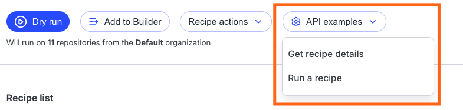

import Tabs from '@theme/Tabs';
import TabItem from '@theme/TabItem';
import VersionBanner from '@site/src/components/VersionBanner';

<VersionBanner version="v2" linkPath="/user-documentation/moderne-platform-v1/how-to-guides/recipe-execution-and-commits-with-graphql" />

# Recipe execution and commits with the Moderne API

Imagine you found a recipe you would like to run as part of your organization's automation process (such as updating the Gradle plugin version when a new release is published). Rather than manually running this recipe each time, you can use Moderne's GraphQL API to speed this process up with automation.

To help you understand how to automate recipe execution and commits, we'll walk through all the steps necessary to use Moderne's GraphQL API. By the end, you should know how to:

* [Execute recipes](#recipe-execution)
* [Verify that recipes have been completed](#verify-recipe-completion)
* [Retrieve repository results](#retrieve-repositories-with-results)
* [Download data tables](#downloading-data-tables)
* [Commit changes](#creating-a-pull-request)
* [Ensure that committed changes are correct](#verify-commit-job)

### Prerequisites

This guide assumes that you:

1. Know how to use and interact with GraphQL APIs.
2. [Have created a Moderne personal access token](./create-api-access-tokens.md).
3. [Have created an SCM access token](../references/create-scm-access-tokens.md).

### Recipe execution

1. To begin, you'll want to decide what repositories you want your recipe to run on. You have three options for selecting repositories: choosing an existing organization, creating a new user-defined organization, or selecting an existing user-defined organization. Once you've selected or created one, you can proceed to step 2.

2. Navigate to the recipe you wish to run and fill out the recipe options.

3. At the bottom of the recipe, you will find an **API examples** button. Click on it and then select **Run a recipe**. This will provide you with the query that will be run when executing a recipe run. Additionally, the appropriate variables will be added to this query based on your organization selection from step 1.

<figure>
  
  <figcaption></figcaption>
</figure>

4. You can then execute a recipe with the following mutation:

<Tabs>
<TabItem value="run-recipe-mutation" label="Run Recipe Mutation">

```graphql
mutation runRecipe($input: RunRecipeInput!) {
  runRecipe(input: $input) {
    id
  }
}
```

</TabItem>
<TabItem value="mutation-variables" label="Mutation Variables">

```json
{
  "input": {
    "recipe": {
      "id": "org.openrewrite.gradle.plugins.UpgradePluginVersion",
      "options": [
        { "name": "pluginIdPattern", "value": "com.gradle.plugin-publish" },
        { "name": "newVersion", "value": "1.1.0" }
      ]
    },
    "organizationId": "Gradle"
  }
}
```

</TabItem>
<TabItem value="curl" label="cURL">

```bash
curl --request POST \
  --url https://api.app.moderne.io/graphql \
  --header 'Authorization: Bearer <YOUR MODERNE TOKEN HERE>' \
  --header 'Content-Type: application/json' \
  --data '{"query":"mutation runRecipe($input: RunRecipeInput!) {\n  runRecipe(input: $input) {\n    id\n  }\n}","variables":{"input":{"recipe":{"id":"org.openrewrite.gradle.plugins.UpgradePluginVersion","options":[{"name":"pluginIdPattern","value":"com.gradle.plugin-publish"},{"name":"newVersion","value":"1.1.0"}]},"organizationId":"Gradle"},"operationName":"runRecipe"}'
```

</TabItem>
</Tabs>

Each recipe option is provided as a `name` and `value` pair. The `value` accepts whatever type the option expects, such as a string, a boolean, a number, or a list.

5. The mutation returns the `id` of the recipe run. This `id` identifies the run (a changeset in the Moderne API) and is used in every subsequent step, including polling, data table downloads, and commits. Example response:

```json
{
  "data": {
    "runRecipe": {
      "id": "20260723153349-gueAs"
    }
  }
}
```

### Verify recipe completion

In the Moderne API, a recipe run is a changeset that belongs to the organization it ran against. Rather than a separate `state` field, the run's current state is encoded in its `__typename` (for example, `OrganizationRecipeRunRunning` or `OrganizationRecipeRunFinished`). To poll a run, you will need both the `organizationId` you ran against and the run `id` from the previous step.

1. Poll (Moderne's web interface uses a 3-second interval) with the query below. Every state writer advances the `lastUpdatedAt` high-water mark, so you can poll `__typename` and `lastUpdatedAt` cheaply and only fetch the heavier results once the run reaches a terminal state.

<Tabs>
<TabItem value="recipe-run-state-query" label="Recipe Run State Query">

```graphql
query recipeRunState($orgId: ID!, $runId: ID!) {
  organization(id: $orgId) {
    changesets(where: { id: { _eq: $runId } }) {
      edges {
        node {
          __typename
          id
          ... on OrganizationRecipeRun {
            lastUpdatedAt
            recipe {
              id
              displayName
            }
          }
        }
      }
    }
  }
}
```

</TabItem>
<TabItem value="query-variables" label="Query Variables">

```json
{
  "orgId": "Gradle",
  "runId": "20260723153349-gueAs"
}
```

</TabItem>
</Tabs>

2. Keep polling until the run's `__typename` reaches a terminal state: `OrganizationRecipeRunFinished`, `OrganizationRecipeRunError`, or `OrganizationRecipeRunCanceled`. A run that is still in progress reports `OrganizationRecipeRunQueued` or `OrganizationRecipeRunRunning`. Example response:

```json
{
  "data": {
    "organization": {
      "changesets": {
        "edges": [
          {
            "node": {
              "__typename": "OrganizationRecipeRunFinished",
              "id": "20260723153349-gueAs",
              "lastUpdatedAt": "2026-07-23T15:34:40.812Z",
              "recipe": {
                "id": "org.openrewrite.gradle.plugins.UpgradePluginVersion",
                "displayName": "Update a Gradle plugin by id"
              }
            }
          }
        ]
      }
    }
  }
}
```

### Retrieve repositories with results

Once the run has finished, you can retrieve the repositories where changes were made from the same changeset. On a finished run, the `repositories` connection accepts a `where` filter, and passing `onlyWithResults: true` limits the results to repositories that actually changed. Each repository also carries its own `__typename` reflecting its per-repository outcome (for example, `RepositoryRecipeRunFinished`, `RepositoryRecipeRunError`, or `RepositoryRecipeRunNoLst`).

1. Using the `organizationId` and the run `id`, retrieve the changed repositories with the query below.

<Tabs>
<TabItem value="recipe-run-results-query" label="Recipe Run Results Query">

```graphql
query recipeRunResults($orgId: ID!, $runId: ID!, $first: Int, $after: String) {
  organization(id: $orgId) {
    changesets(where: { id: { _eq: $runId } }) {
      edges {
        node {
          __typename
          ... on OrganizationRecipeRunFinished {
            totals {
              filesChanged
              repositoriesWithResults
              repositoriesSuccessful
              repositoriesWithErrors
            }
            repositories(
              first: $first
              after: $after
              where: { onlyWithResults: true }
            ) {
              count
              pageInfo {
                hasNextPage
                endCursor
              }
              edges {
                node {
                  __typename
                  repository {
                    origin
                    path
                    branch
                  }
                }
              }
            }
          }
        }
      }
    }
  }
}
```

</TabItem>
<TabItem value="query-variables" label="Query Variables">

```json
{
  "orgId": "Gradle",
  "runId": "20260723153349-gueAs",
  "first": 100
}
```

</TabItem>
</Tabs>

2. The `repositories` connection is paginated. When `pageInfo.hasNextPage` is `true`, pass `pageInfo.endCursor` back as the `after` variable to fetch the next page. Use each repository's `origin`, `path`, and `branch` to build the repository list for the commit step. Example response:

```json
{
  "data": {
    "organization": {
      "changesets": {
        "edges": [
          {
            "node": {
              "__typename": "OrganizationRecipeRunFinished",
              "totals": {
                "filesChanged": 3,
                "repositoriesWithResults": 2,
                "repositoriesSuccessful": 2,
                "repositoriesWithErrors": 0
              },
              "repositories": {
                "count": 2,
                "pageInfo": {
                  "hasNextPage": false,
                  "endCursor": "MQ=="
                },
                "edges": [
                  {
                    "node": {
                      "__typename": "RepositoryRecipeRunFinished",
                      "repository": {
                        "origin": "github.com",
                        "path": "gradle/gradle-checksum",
                        "branch": "master"
                      }
                    }
                  },
                  {
                    "node": {
                      "__typename": "RepositoryRecipeRunFinished",
                      "repository": {
                        "origin": "github.com",
                        "path": "gradle-nexus/publish-plugin",
                        "branch": "master"
                      }
                    }
                  }
                ]
              }
            }
          }
        ]
      }
    }
  }
}
```

### Downloading data tables

Data tables are exported asynchronously. You start a download with the `downloadDataTable` mutation and then poll the run's `dataTables` connection until the download is ready. Like recipe runs, a data table's state is encoded in its `__typename`.

1. Start the download by specifying the changeset (your recipe run `id`), the data table to export, and the format (`CSV` or `XLSX`). The following mutation requests the `org.openrewrite.table.SourcesFileResults` data table:

<Tabs>
<TabItem value="data-table-mutation" label="Start Data Table Download Mutation">

```graphql
mutation startDataTableDownload($changesetId: ID!, $dataTable: String!, $format: DataTableFormat!) {
  downloadDataTable(
    changesetId: $changesetId
    dataTable: $dataTable
    format: $format
  ) {
    __typename
    id
    dataTable {
      name
      displayName
    }
  }
}
```

</TabItem>
<TabItem value="mutation-variables" label="Mutation Variables">

```json
{
  "changesetId": "20260723153349-gueAs",
  "dataTable": "org.openrewrite.table.SourcesFileResults",
  "format": "CSV"
}
```

</TabItem>
</Tabs>

The mutation returns the download task in its `DataTableProcessing` state, along with the task `id` you will poll:

```json
{
  "data": {
    "downloadDataTable": {
      "__typename": "DataTableProcessing",
      "id": "20260723155616-Om91d",
      "dataTable": {
        "name": "org.openrewrite.table.SourcesFileResults",
        "displayName": "Source files that had results"
      }
    }
  }
}
```

:::info
For community data tables that belong to a group, pass the optional `group` argument to select the correct bucket.
:::

2. Because the export takes time, poll the run's `dataTables` connection with the task `id` until the download finishes:

<Tabs>
<TabItem value="data-table-download-query" label="Data Table Download Query">

```graphql
query dataTableDownloadState($orgId: ID!, $runId: ID!, $dataTableId: ID!) {
  organization(id: $orgId) {
    changesets(where: { id: { _eq: $runId } }) {
      edges {
        node {
          dataTables(where: { id: { _eq: $dataTableId } }) {
            edges {
              node {
                __typename
                id
                ... on DataTableFinished {
                  format
                  downloadUrl
                }
                ... on DataTableError {
                  message
                }
              }
            }
          }
        }
      }
    }
  }
}
```

</TabItem>
<TabItem value="query-variables" label="Query Variables">

```json
{
  "orgId": "Gradle",
  "runId": "20260723153349-gueAs",
  "dataTableId": "20260723155616-Om91d"
}
```

</TabItem>
</Tabs>

The data table moves through states you can read from its `__typename`: `DataTableAvailable`, `DataTableProcessing`, `DataTableFinished`, and `DataTableError`. Keep polling until the node reports `DataTableFinished`, which exposes the `downloadUrl`:

```json
{
  "data": {
    "organization": {
      "changesets": {
        "edges": [
          {
            "node": {
              "dataTables": {
                "edges": [
                  {
                    "node": {
                      "__typename": "DataTableFinished",
                      "id": "20260723155616-Om91d",
                      "format": "CSV",
                      "downloadUrl": "/api/recipe-runs/20260723153349-gueAs/20260723153353-ftHOe/datatable/org.openrewrite.table.SourcesFileResults.csv.gz"
                    }
                  }
                ]
              }
            }
          }
        ]
      }
    }
  }
}
```

3. The `downloadUrl` is a path relative to the API base URL, so the full download location is `https://api.app.moderne.io` followed by the `downloadUrl` value. Use the returned value as-is rather than building it by hand, since it embeds internal identifiers. Note that the exported file is gzipped (for example, a `CSV` export is served as `.csv.gz`).

### Creating a pull request

The Moderne API exposes a single `commit` mutation for delivering a changeset's results back to your repositories. You choose how the changes are delivered through the `strategy` field, which accepts exactly one of `direct` (push to the origin remote), `fork`, `pullRequest`, or `forkAndPullRequest`. To open pull requests, use the `pullRequest` strategy.

:::info
The `scmAccessTokens` field inside `input` is required for programmatic pull request creation. If you don't provide this token, the API will initiate an OAuth browser flow, which is not suitable for automation or scripting. Make sure you've [created an SCM access token](../references/create-scm-access-tokens.md) and include it in your request as shown in the mutation variables example.
:::

1. Perform the `commit` mutation using the run `id` as the `changesetId` and the repositories from the previous step. The `repositories` field is a list of filters: each entry matches repositories in the changeset (for example, by `path`). Omit `repositories` entirely to commit to every repository with results in the run.

<Tabs>
<TabItem value="commit-mutation" label="Commit Mutation">

```graphql
mutation commit($input: CommitInput!) {
  commit(input: $input) {
    id
  }
}
```

</TabItem>
<TabItem value="mutation-variables" label="Mutation Variables">

```json
{
  "input": {
    "organizationId": "Gradle",
    "changesetId": "20260723153349-gueAs",
    "message": "refactor: Update a Gradle plugin by id",
    "repositories": [
      { "path": { "_eq": "gradle/gradle-checksum" } },
      { "path": { "_eq": "gradle-nexus/publish-plugin" } }
    ],
    "strategy": {
      "pullRequest": {
        "title": "refactor: Update a Gradle plugin by id",
        "body": "cmVmYWN0b3I6IFVwZGF0ZSBhIEdyYWRsZSBwbHVnaW4gYnkgaWQ=",
        "draft": false
      }
    },
    "scmAccessTokens": [
      { "origin": "github.com", "value": "MY_SCM_PERSONAL_ACCESS_TOKEN" }
    ]
  }
}
```

</TabItem>
<TabItem value="curl" label="cURL">

```bash
curl --request POST \
  --url https://api.app.moderne.io/graphql \
  --header 'Authorization: Bearer <YOUR MODERNE TOKEN HERE>' \
  --header 'Content-Type: application/json' \
  --data '{"query":"mutation commit($input: CommitInput!) {\n  commit(input: $input) {\n    id\n  }\n}","variables":{"input":{"organizationId":"Gradle","changesetId":"20260723153349-gueAs","message":"refactor: Update a Gradle plugin by id","repositories":[{"path":{"_eq":"gradle/gradle-checksum"}},{"path":{"_eq":"gradle-nexus/publish-plugin"}}],"strategy":{"pullRequest":{"title":"refactor: Update a Gradle plugin by id","body":"cmVmYWN0b3I6IFVwZGF0ZSBhIEdyYWRsZSBwbHVnaW4gYnkgaWQ=","draft":false}},"scmAccessTokens":[{"origin":"github.com","value":"MY_SCM_PERSONAL_ACCESS_TOKEN"}]},"operationName":"commit"}'
```

</TabItem>
</Tabs>

The `body` is Base64-encoded. If you omit `title`, the commit `message` is used as the pull request title.

2. The mutation returns the commit `id`, which you use to poll the commit's progress. Example response:

```json
{
  "data": {
    "commit": {
      "id": "c83315a1-397f-44cb-9ef2-9a2ca195dda6"
    }
  }
}
```

### Verify commit job

A commit runs asynchronously across the repositories you targeted. A commit belongs to the changeset it was created from, so you poll it through the run's `commits` connection, filtered by the commit `id`, and read its `__typename` for the overall state. The `repositories` connection reports per-repository progress: compare `completedCount` to `count` to track how many repositories have reached a terminal state.

1. Poll for the commit's completion with the query below. Each repository's `__typename` reflects its individual outcome, such as `PullRequestCommitSucceeded` (which exposes a `resultLink` to the pull request and its `pullRequestStatus`), `RepositoryCommitFailed`, or `RepositoryCommitNoChanges`.

<Tabs>
<TabItem value="commit-state-query" label="Commit State Query">

```graphql
query commitState($orgId: ID!, $runId: ID!, $commitId: ID!, $first: Int, $after: String) {
  organization(id: $orgId) {
    changesets(where: { id: { _eq: $runId } }) {
      edges {
        node {
          commits(where: { id: { _eq: $commitId } }) {
            edges {
              node {
                __typename
                id
                message
                repositories(first: $first, after: $after) {
                  count
                  completedCount
                  pageInfo {
                    hasNextPage
                    endCursor
                  }
                  edges {
                    node {
                      __typename
                      repository {
                        origin
                        path
                        branch
                      }
                      ... on PullRequestCommitSucceeded {
                        resultLink
                        pullRequestStatus {
                          state
                        }
                      }
                      ... on RepositoryCommitFailed {
                        errorMessage
                      }
                    }
                  }
                }
              }
            }
          }
        }
      }
    }
  }
}
```

</TabItem>
<TabItem value="query-variables" label="Query Variables">

```json
{
  "orgId": "Gradle",
  "runId": "20260723153349-gueAs",
  "commitId": "c83315a1-397f-44cb-9ef2-9a2ca195dda6",
  "first": 50
}
```

</TabItem>
</Tabs>

2. Keep polling until the commit's `__typename` reaches a terminal state: `OrganizationCommitFinished`, `OrganizationCommitCanceled`, or `OrganizationCommitError`. A commit still in progress reports `OrganizationCommitQueued` or `OrganizationCommitRunning`. Example response:

```json
{
  "data": {
    "organization": {
      "changesets": {
        "edges": [
          {
            "node": {
              "commits": {
                "edges": [
                  {
                    "node": {
                      "__typename": "OrganizationCommitFinished",
                      "id": "c83315a1-397f-44cb-9ef2-9a2ca195dda6",
                      "message": "refactor: Update a Gradle plugin by id",
                      "repositories": {
                        "count": 2,
                        "completedCount": 2,
                        "pageInfo": {
                          "hasNextPage": false,
                          "endCursor": "MQ=="
                        },
                        "edges": [
                          {
                            "node": {
                              "__typename": "PullRequestCommitSucceeded",
                              "repository": {
                                "origin": "github.com",
                                "path": "gradle/gradle-checksum",
                                "branch": "master"
                              },
                              "resultLink": "https://github.com/gradle/gradle-checksum/pull/14",
                              "pullRequestStatus": {
                                "state": "OPEN"
                              }
                            }
                          },
                          {
                            "node": {
                              "__typename": "PullRequestCommitSucceeded",
                              "repository": {
                                "origin": "github.com",
                                "path": "gradle-nexus/publish-plugin",
                                "branch": "master"
                              },
                              "resultLink": "https://github.com/gradle-nexus/publish-plugin/pull/8",
                              "pullRequestStatus": {
                                "state": "OPEN"
                              }
                            }
                          }
                        ]
                      }
                    }
                  }
                ]
              }
            }
          }
        ]
      }
    }
  }
}
```
