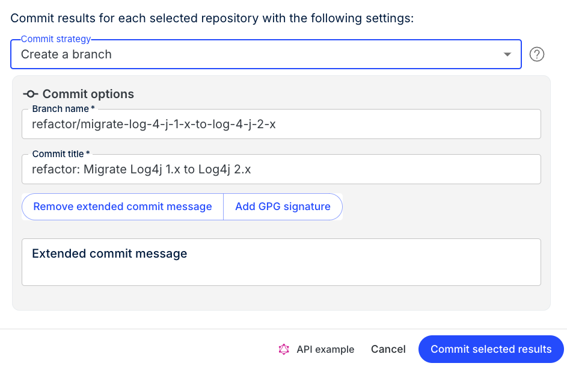

import Tabs from '@theme/Tabs';
import TabItem from '@theme/TabItem';

# Working with commits and PRs in Moderne

When implementing code changes across repositories, effective commit and PR management is crucial for maintaining visibility and control over your codebase. Fortunately, Moderne provides powerful tools to help you create, track, and manage commits and PRs at scale.

In this guide, we'll walk you through the fundamentals of working with commits and PRs in Moderne. You'll learn about the extensive commit options we offer, how you can track the status of your changes, and some important caveats to consider when creating commits/PR. 

## Committing

After you've run a recipe and reviewed its results, the next step is to either commit it or create a pull request. 

Moderne supports five different commit strategies:

1. Committing directly
2. Creating a branch
3. Creating a fork
4. Creating a pull request
5. Creating a pull request from a fork

For each of those, there are a wide variety of options that you can configure to meet your needs:

<Tabs groupId="commit-type">
<TabItem value="direct-commit" label="Committing directly">

<figure>
  
  <figcaption>_Options when committing directly_</figcaption>
</figure>

</TabItem>

<TabItem value="branch" label="Creating a branch">

<figure>
  
  <figcaption>_Options when creating a branch_</figcaption>
</figure>

</TabItem>

<TabItem value="fork" label="Creating a fork">

<figure>
  
  <figcaption>_Options when creating a fork_</figcaption>
</figure>

</TabItem>

<TabItem value="pull-request" label="Creating a PR">

<figure>
  
  <figcaption>_Options when creating a pull request_</figcaption>
</figure>

</TabItem>

<TabItem value="pull-request-fork" label="Creating a PR from a fork">

<figure>
  
  <figcaption>_Options when creating a pull request from a fork_</figcaption>
</figure>

</TabItem>
</Tabs>

### Rate-limiting and retry logic

When creating commits and PRs at scale, it's not as simple as just making an API call and hoping for the best. You need to consider things like rate-limits and when you should retry a request vs. drop it.

Fortunately, Moderne takes care of all of this for you so you don't need to worry about it.

Moderne will create a commit job for each commit. This job will attempt to create a commit in the appropriate SCM. If it runs into a rate limit error, it will exponentially back off and retry again up to three times (at 2 minutes, 4 minutes, and 8 minutes). If it fails, it will provide you with context into why the job failed, so you can figure out what you need to fix.

## Tracking commits

Without proper tracking of mass-created PRs and commits, it's easy to lose sight of pending changes. Fortunately, Moderne offers a commit view to help you track all commits/PRs in one place.

### How to get to the commit view

There are two ways to get to the page that tracks the status of commits or PRs:

1. **Automatically**: You will be taken there whenever you commit results or open PRs from a recipe run.

2. **Manually**: If you didn't run a recipe – or you ran one and wanted to get back to the commit view page, you can navigate there from the [activity view](../getting-started/activity-view.md).

<figure>
  
  <figcaption>_A link to the commit view in the activity view._</figcaption>
</figure>

### How to use the commit view

From the commit view, you can take various actions depending on whether or not you committed the results directly or opened a PR.

#### If you opened PRs

<figure>
  
  <figcaption>_What the commit view looks like if you've opened PRs._</figcaption>
</figure>

From this view, you can approve, merge, or close PRs. You can perform these actions by clicking on the triple vertical dots and selecting approve/merge/close. Or, if you want to take action on multiple repositories at once, you can click the checkboxes next to the repositories you want and then press the buttons at the top.

To navigate to the open PRs themselves, you can either click on the repository name or you can click on the arrow under `Actions`.

If opening a PR failed for some reason, you can see the details of why on this screen. You can also press the `Re-run failed` button to try and open them again.

Lastly, you can download all of this information as a data table by clicking on the `Export` button – which can be useful if you want to pipe the data into another system.

#### If you committed directly

<figure>
  
  <figcaption>_What the commit view looks like if you've committed directly._</figcaption>
</figure>

From this view, you can see all of the commits that were created. You can navigate to the commit by either clicking on the repository or by clicking on the arrow button under the `Actions` column.

If a commit failed, you can see details of why it failed on this screen. Likewise, you can attempt to re-run the failed commits by clicking on the `Re-run failed` button.

Lastly, you can download all of this information as a data table by clicking on the `Export` button – which can be useful if you want to pipe the data into another system.

## Important considerations

**Take care when running recipes against existing PRs**. Once you open a PR, you can continue pushing changes to that PR as long as they don't conflict with the current state of the branch. If you change a recipe and push again to the branch, or if you push changes manually to the branch, it is unlikely that Moderne will be able to push any further changes to that branch.

On a related note, it's important to realize that merging in a PR generated from a recipe **is not good enough to say that an issue has been resolved**. As Moderne does not know what happens on a PR after it's been opened, it's quite possible for a developer to come and change something and partially undo a fix. 

To confirm that an issue has been resolved or that a vulnerability is actually gone, you will need to re-run the recipe again on the merged in code. If no results appear, then you can be confident the issue has been fixed.