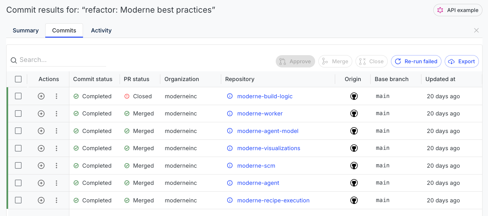

# How to track/merge/approve commits and PRs created with Moderne

After you run a recipe, you will often want to open PRs or commit the results. Manually following up on hundreds or thousands of PRs would be extremely tedious. Fortunately, Moderne offers some functionality to help with this.

In this doc, we'll take a look at how you can track commits and PRs and then take action on them – whether that's approving, merging, or closing.

## How to get to the commit view

There are two ways to get to the page that tracks the status of commits or PRs:

1. **Automatically**: You will be taken there whenever you commit results or open PRs from a recipe run.

2. **Manually**: If you didn't run a recipe – or you ran one and wanted to get back to the commit view page, you can navigate there from the [activity view](../getting-started/activity-view.md).

<figure>
  
  <figcaption>_A link to the commit view in the activity view._</figcaption>
</figure>

## How to use the commit view

From the commit view, you can take various actions depending on whether or not you committed the results directly or opened a PR.

### If you opened PRs

<figure>
  
  <figcaption>_What the commit view looks like if you've opened PRs._</figcaption>
</figure>

From this view, you can approve, merge, or close PRs. You can perform these actions by clicking on the triple vertical dots and selecting approve/merge/close. Or, if you want to take action on multiple repositories at once, you can click the checkboxes next to the repositories you want and then press the buttons at the top.

To navigate to the open PRs themselves, you can either click on the repository name or you can click on the arrow under `Actions`.

If opening a PR failed for some reason, you can see the details of why on this screen. You can also press the `Re-run failed` button to try and open them again.

Lastly, you can download all of this information as a data table by clicking on the `Export` button – which can be useful if you want to pipe the data into another system.

### If you committed directly

<figure>
  
  <figcaption>_What the commit view looks like if you've committed directly._</figcaption>
</figure>

From this view, you can see all of the commits that were created. You can navigate to the commit by either clicking on the repository or by clicking on the arrow button under the `Actions` column.

If a commit failed, you can see details of why it failed on this screen. Likewise, you can attempt to re-run the failed commits by clicking on the `Re-run failed` button.

Lastly, you can download all of this information as a data table by clicking on the `Export` button – which can be useful if you want to pipe the data into another system.