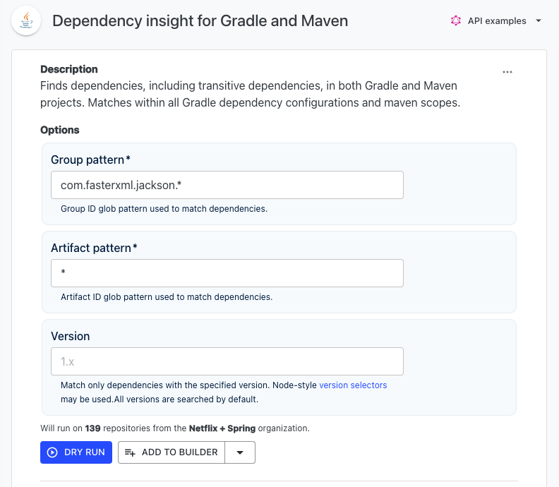
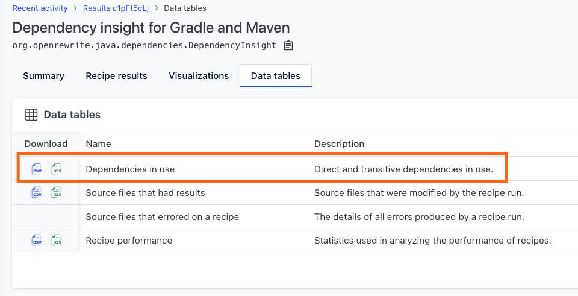

# How to track migration status with Moderne

Dependencies are constantly getting updated with new versions. It can be difficult to ensure one repository is up-to-date – let alone hundreds or thousands of them. While some recipes can help with migrations, it's unrealistic to expect that all repositories will be updated at the same time. In those instances, it's nice to track which versions each repository is using and how they differ from one another.

This is where a recipe like [Dependency insight for Gradle and Maven](https://app.moderne.io/recipes/org.openrewrite.java.dependencies.DependencyInsight) can help. Using this recipe, you can not only generate a visualization that shows which versions are in use and how much they differ between repositories, but you can also generate a detailed data table so that you can perform your own analysis on the results.

In this guide, we'll walk through how to use this recipe to figure out how a migration is going and see which dependencies are lagging behind others across numerous repositories.

## Running the recipe

Navigate to the [Dependency insight for Gradle and Maven recipe](https://app.moderne.io/recipes/org.openrewrite.java.dependencies.DependencyInsight).

:::info
All dependencies can be defined with a combination of their group ID, artifact ID, and a version (GAV).
:::

For the group pattern and artifact pattern, you can use the regex `*` to match anything. For instance, if you wanted to search for all `com.fasterxml.jackson` modules (e.g., `com.fasterxml.jackson.dataformat`), you could enter `com.fasterxml.jackson.*` into the group pattern. If you wanted to search for all artifacts in said group, you could enter `*` as the artifact pattern. Here's what this looks like:

<figure>
  
</figure>

When you're done selecting the dependencies you want to look for, press the `Dry Run` button. You will be redirected to a recipe results page:

<figure>
  
</figure>

## Understanding recipe results

If you click on any of the repositories on the recipe results page, you will be redirected to a diff view. Unlike other recipes that actively change code, this recipe will highlight dependencies that depend on one of the dependencies you specified above. 

For instance, in the following examples, we can see that `org.springframework.cloud` was highlighted by the recipe. If you mouse over the code or the magnifying glass, you can see that it was highlighted because that depends on `com.fasterxml.jackson.core`:

<figure>
  
</figure>

## Viewing the visualization

While looking at individual dependencies and their transitive dependencies is interesting, it's much more useful to get a glimpse of what versions are being used across all of your repositories. To get this view, start from the recipe results page and click on `Visualizations` at the top of the page:

<figure>
  
</figure>

Next, run the `Dependency usage` visualization:

<figure>
  
</figure>

You'll be redirected to a violin chart that shows all of the artifacts and their corresponding versions across your repositories:

<figure>
  
</figure>

In the above example, you can see that `jackson-annotations` is all over the place across our repositories – ranging from `2.4.0` to `2.16.1` for a total of 27 different versions! Comparatively, `jackson-datatype-hibernate` only has 1 version across all of our repositories.

## Downloading the data table

If we want to dig deeper into which repositories are using which dependencies and perhaps make our own graphs or add it to a different system, we can download the data table that contains all of the information about the dependencies across all of the repositories.

To do so, click on `Data tables` at the top of the recipe page as you did earlier. Then download the `direct and transitive dependencies in use` data table by clicking on the `csv` or `xls` download button:

<figure>
  
</figure>

The data table contains the following columns:

* repositoryOrigin
* repositoryPath
* repositoryBranch
* scmType
* repositoryLink
* projectName
* sourceSet
* groupId
* artifactId
* version
* datedSnapshotVersion
* scope
* depth