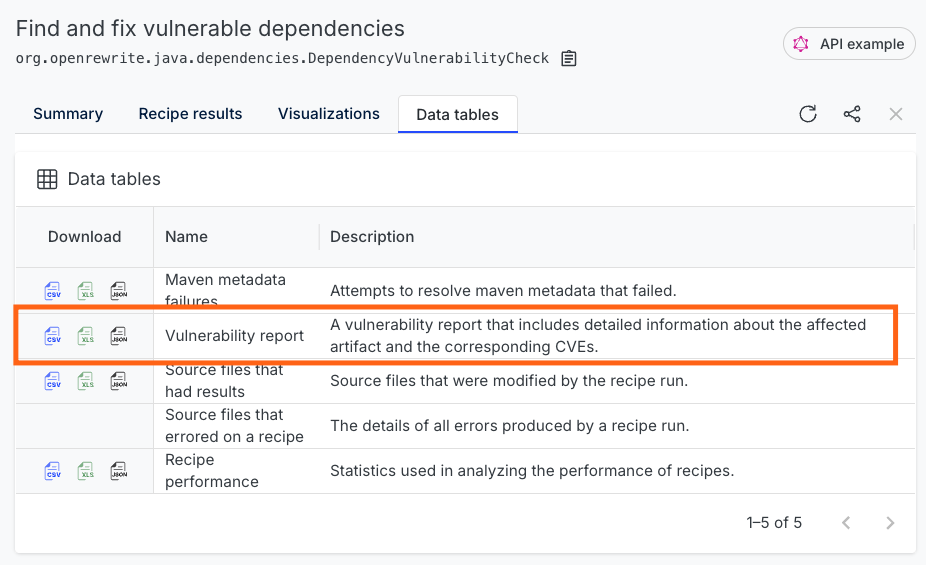
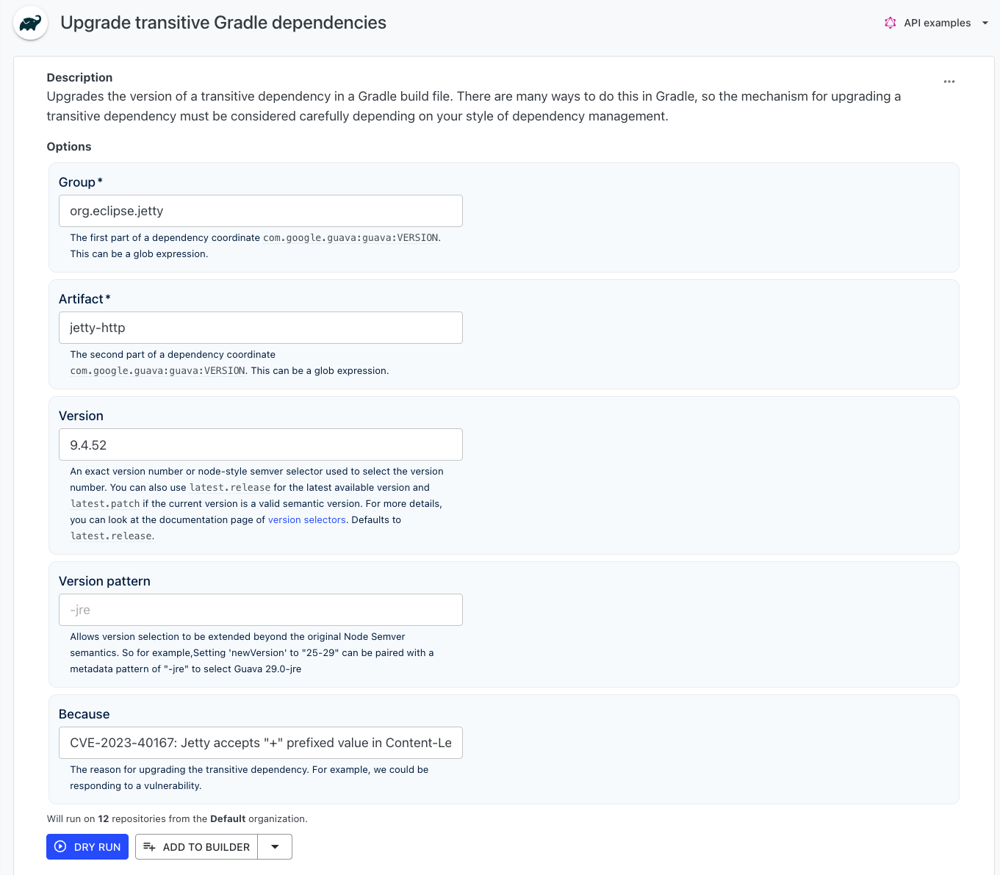

import ReactPlayer from 'react-player';

# How to upgrade transitive dependencies

It's a good practice for developers to routinely check if there are any security vulnerabilities in their repositories and ensure that their dependencies are up-to-date. Unfortunately, many tools cannot see dependencies that are more than one level deep. If you have a dependency that has a dependency that has a dependency that is insecure, most tools will not warn you about it – let alone let you update it.

Fortunately, Moderne offers the ability to find and fix dependencies that are many levels deep. Let's walk through how you might discover these problems and then how you could go about fixing them.

<ReactPlayer className="reactPlayer" url='https://www.youtube.com/watch?v=xicPgKzgz-M' controls="true" />

## Finding vulnerable dependencies

Moderne offers a [find and fix vulnerable dependencies recipe](https://app.moderne.io/recipes/org.openrewrite.java.dependencies.DependencyVulnerabilityCheck) that will recursively search through all dependencies on all repositories in your organization for ones that have security issues. Feel free to run that recipe on the `Default` organization to see what shows up. For more information on how to use that, check out our [fixing vulnerable dependencies guide](./vulnerable-dependencies.md).

After the recipe runs, you can download a CSV file that contains all of the security issues by going to the `Data tables` tab and pressing the download button for the type of file you wish to download:

In there, you can find key information such as what CVE a particular repository is affected by, what the current version is, what version is the minimum one needed to fix it, a clear summary of what is wrong, and how many levels deep the dependency is. In the below example, you can see that this recipe found a security issue in a dependency 8 levels deep!

## Fixing the security issues by upgrading the transitive dependencies

You can use the [upgrade transitive Gradle dependencies recipe](https://app.moderne.io/recipes/org.openrewrite.gradle.UpgradeTransitiveDependencyVersion) to update the dependencies that have security issues that we found above. Let's specify the group, artifact, and fixed version found in the CSV file from above (`org.eclipse.jetty`, `jetty-http`, and `9.4.52`). Let's also specify a reason for this change by combining the CVE with a summary (`CVE-2023-40167: Jetty accepts "+" prefixed value in Content-Length`):

Press `Dry Run` to begin the recipe run. After this runs, if we take a look at the code changes, you can see that a `constraints` section was added that ensures the transitive dependency is secure. You can also see that there is a clear explanation in the code for why this happened:

## Next steps

Congratulations on successfully updating transitive dependencies in your project! If you're looking for other security issues to solve, consider checking out [how to use Moderne to find personally identifiable information and secrets exposed by your APIs](find-pii.md).