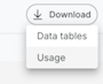

import Tabs from '@theme/Tabs';
import TabItem from '@theme/TabItem';

# How to run user reports

Moderne offers the following reports:

* **Usage by organization** - This includes every recipe run and associated commit by every user for a specific organization. 

## Usage by organization

The generated report includes every recipe run and associated commit for a given organization. This report includes the recipe name, time saved, user that ran it, recipe, and various statistics of the recipe run. 

If any commit was created in association with the recipe run, details of the commit are included (e.g., the type of commit or the status of the commit job).

The usage report is accessible from `https://<TENANT>.moderne.io/devcenter/{organization}`.

These reports can be downloaded using the download button: 

<figure>
  
  <figcaption>_Usage report download button_</figcaption>
</figure>

## Accessing via the API

All of these reports can be accessed via the API, as well. Below is an example of how to prepare and download the usage report:

<Tabs>
<TabItem value="mutation-download-report" label="Mutation download report">

```graphql
mutation firstDownloadUsageReport($until: DateTime!, $since:DateTime!, $organizationId: String) {
    downloadUsageReport(until: $until, since: $since , organizationId:$organizationId) {
        id
    }
}
```

</TabItem>

<TabItem value="query-variables" label="Query Variables">

```json
{
  "since": "2024-10-29T10:15:30Z",
  "until":"2024-12-30T10:15:30Z",
  "organizationId":"my_organization_Id"
}
```

</TabItem>
</Tabs>

```graphql
query secondDownloadUsageReport($id: ID!) {
    usageReportDownload(id: $id) {
        id
        state
        stateMessage
        url
        fileSize
    }
}
```

The output of `secondDownloadUsageReport` will include a URL which you can then use to download the report.
