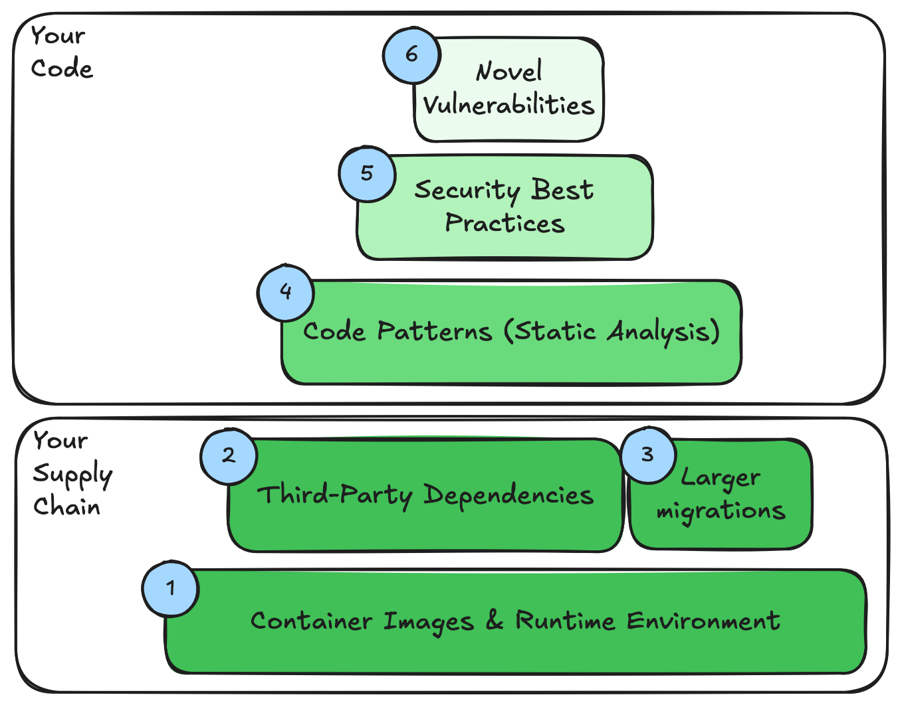
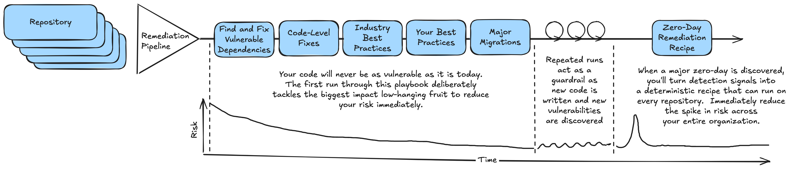
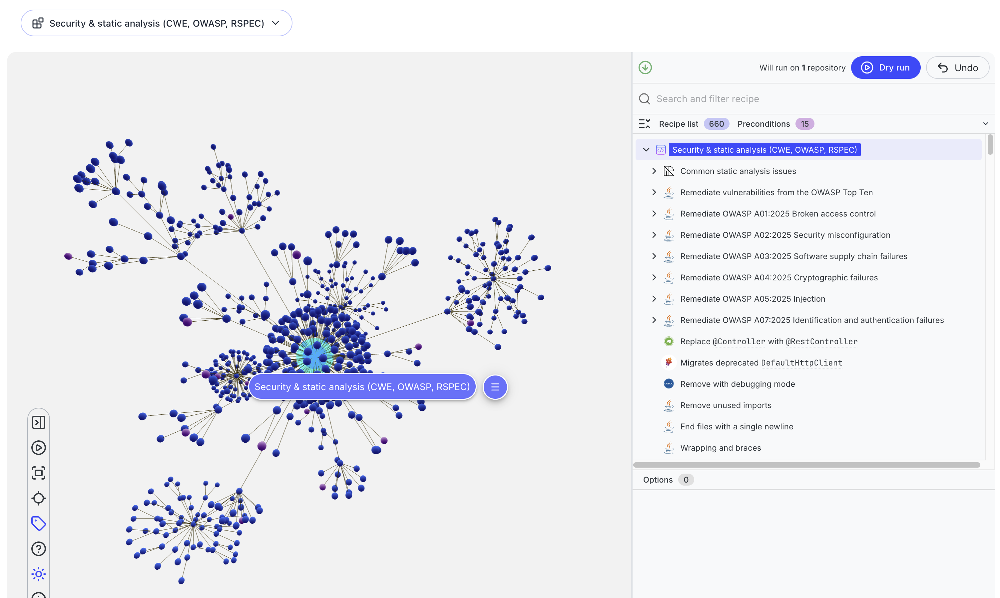
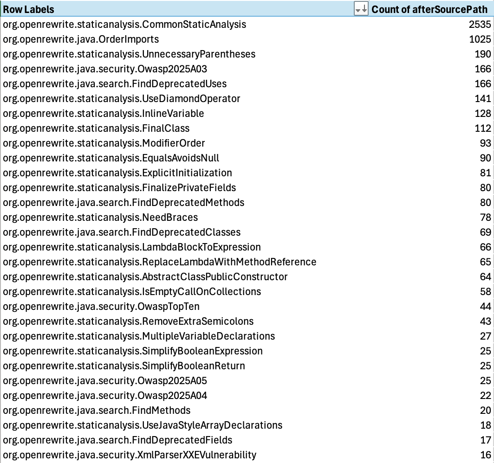
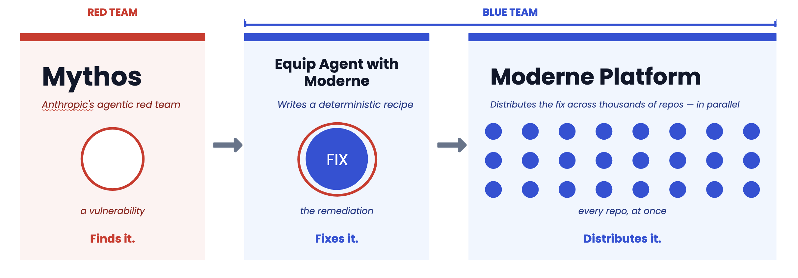

import Tabs from '@theme/Tabs';
import TabItem from '@theme/TabItem';

# Vulnerability remediation playbook

:::tip
This page is meant to be forked!  While this playbook walks you through the process on our public Moderne SaaS tenant, it's also a great starting point for your own internal documentation to guide users toward the right internal recipes to get this job done.  Grab the markdown for this page and edit it to point to your own internal setup guides, recipe catalog, and tools.
:::

Security findings rarely arrive one at a time. A runtime scanner flags hundreds of vulnerabilities across dozens of applications, a new Common Vulnerabilities and Exposures (CVE) record lands on a Friday afternoon, and your teams are left asking the same question over and over: _what do I actually do to make these go away?_ Answering that question one finding at a time, one repository at a time, does not scale.

This playbook gives you a single, opinionated path through that problem. Rather than treating every finding as a unique investigation, it sorts your vulnerabilities into layers and gives each layer a process for running recipes across your entire estate at once. If you need to improve your security posture but aren't sure where to start, this playbook is for you - work down the list, and erase whole categories of findings from your scanner reports.

In this guide, we will walk you through how to assess your current exposure, then work layer by layer — from base images and dependencies up through code-level fixes, custom guardrails, and novel findings — to build a durable, automated vulnerability remediation practice.

:::info
This is a strategy guide that ties together several more detailed how-to guides and recipes. Each layer links out to step-by-step instructions, so treat this page as the map and the linked guides as the turn-by-turn directions.
:::

## Prerequisites

This guide assumes that you are already familiar with selecting an organization and running recipes in the Moderne Platform. If you aren't, please work through our [getting started guide](../getting-started/running-your-first-recipe.md) first.

It also assumes your repositories have been ingested so that Moderne has Lossless Semantic Trees (LSTs) to run recipes against. If you are running Moderne on-premises, the [mass ingest](#vulnerability-remediation-at-scale) process is what builds and stores those LSTs.  You can also [build LSTs for your own repositories](../../moderne-cli/getting-started/cli-intro.md#building-lsts) if you do not have prebuilt LSTs available.

You'll use a number of different recipes over the course of this playbook.  If you're using the Moderne CLI locally, you'll need to install these first:

```bash
mod config recipes jar install org.openrewrite:rewrite-docker:RELEASE
mod config recipes jar install org.openrewrite:rewrite-maven:RELEASE
mod config recipes jar install org.openrewrite.recipe:rewrite-java-dependencies:RELEASE
mod config recipes jar install org.openrewrite.recipe:rewrite-migrate-java:RELEASE
mod config recipes jar install org.openrewrite.recipe:rewrite-static-analysis:RELEASE
mod config recipes jar install org.openrewrite.recipe:rewrite-java-security:RELEASE
mod config recipes jar install org.openrewrite.recipe:rewrite-spring:RELEASE
mod config recipes jar install io.moderne.recipe:rewrite-spring:RELEASE
mod config recipes jar install io.moderne.recipe:rewrite-program-analysis:RELEASE
```

## Choosing your interface

You can run every recipe in this playbook from either the Moderne Platform or the Moderne CLI. Each step below includes both. Pick the interface that fits your workflow — the tabs throughout this guide remember your choice — and follow the same run-and-apply pattern shown here for every step.

<Tabs groupId="interface">
<TabItem value="platform" label="Moderne Platform">

For each step:

1. Select the organization you want to remediate.
2. Open the recipe linked in the step and set any recommended options.
3. Click **Dry Run** to preview the changes across every repository in the organization.
4. Review the diffs, then click **Commit** to push the changes back to your source control manager. See the [committing results guide](./track-commits.md) for the available commit strategies, such as opening pull requests.

</TabItem>
<TabItem value="cli" label="Moderne CLI">

First, clone the repositories you want to work with and build their LSTs:

```shell
mod git sync moderne . --organization <your-org>
mod build .
```

Then, for each step, run the recipe and apply its changes to your working copy:

```shell
mod run . --recipe <recipe-id>
mod git apply . --last-recipe-run
```

`mod run` computes the changes but does not modify your files — `mod git apply` applies the patches proposed by the recipe to your files on disk so you can review, build, and test them locally. To stage the changes on a dedicated branch ready for a pull request instead, swap `mod git apply` for the branch-and-commit flow:

```shell
mod git checkout . -b refactor/<branch-name> --last-recipe-run
mod git commit . -m "<commit message>" --last-recipe-run
mod git push . --last-recipe-run -u
```

You can inspect a recipe's data tables with `mod study . --last-recipe-run --data-table <data-table-name>`, which can be helpful to review the impact of the recipe before applying patches to your source files beforehand or to collect additional data after applying.

</TabItem>
<TabItem value="dx" label="Moderne DX">

First, clone your repositories from a [repos.csv](https://docs.moderne.io/user-documentation/moderne-cli/references/repos-csv/) or the `repos-lock.csv` that was provided to you:

```shell
mod git sync csv . repos.csv
mod build .
```

Then, for each step, run the recipe and apply its changes to your working copy:

```shell
mod run . --recipe <recipe-id>
mod git apply . --last-recipe-run
```

`mod run` computes the changes but does not modify your files — `mod git apply` applies the patches proposed by the recipe to your files on disk so you can review, build, and test them locally. To stage the changes on a dedicated branch ready for a pull request instead, swap `mod git apply` for the branch-and-commit flow:

```shell
mod git checkout . -b refactor/<branch-name> --last-recipe-run
mod git commit . -m "<commit message>" --last-recipe-run
mod git push . --last-recipe-run -u
```

You can inspect a recipe's data tables with `mod study . --last-recipe-run --data-table <data-table-name>`, which can be helpful to review the impact of the recipe before applying patches to your source files beforehand or to collect additional data after applying.

</TabItem>
</Tabs>

## The remediation model

Vulnerabilities show up at different layers of your software, and each layer calls for a different kind of fix. Trying to solve all of them with a single tool — or worse, by hand — is what makes remediation feel endless.

<figure>
  
  <figcaption>_Layers of vulnerability in your application_</figcaption>
</figure>

This playbook organizes the work into layers and gives each one a dedicated play.

Working from the bottom of the stack upward:

| Layer | What it covers | The play |
| --- | --- | --- |
| **1. Infrastructure & base images** | Vulnerable OS and runtime layers in your infrastructure and containers | Update your terraform manifests, kubernetes resources, or base images in your `Dockerfile` files |
| **2. Third-party dependencies** | Vulnerable libraries you depend on | Find and fix vulnerable dependencies with patch or minor version bumps |
| **3. Larger migrations** | Vulnerabilities that only a major upgrade clears | Framework and language migration recipes |
| **4. Code patterns** | Insecure patterns in your own source code | Static analysis and security recipes |
| **5. Security best practices** | Your organization's own security standards | Custom best-practices recipes |
| **6. Novel findings** | New or org-specific vulnerability classes | AI-assisted purpose-built recipes from any detector |

The lower layers are the most automated and lowest risk, and they tend to clear the largest share of findings. As you move up the stack, the work shifts from running out-of-the-box recipes toward writing recipes tailored to your organization.

Like vulnerability remediation in general, this playbook isn't a one-shot end-to-end process that you'll run once and call it a day.  Instead, this steps here are intended to be run continuously - the first steps aim to reduce your risk as quickly as possible, later steps keep that risk down and deal with new threats, and every iteration of playbook's loop acts as a guardrail that reduces your risk across your entire organization and keeps it there.

<figure>
  
  <figcaption>_The playbook's steps applied continuously to keep your risk under control._</figcaption>
</figure>

## Step 0: Assess your exposure

Before fixing anything, you need an accurate picture of where you stand. Most organizations already run scanners — a runtime or container scanner that reactively flags vulnerabilities in deployed applications, and a Continuous Integration / Continuous Delivery (CI/CD) gate that preventively blocks vulnerable builds from shipping. These tools tell you _what_ is wrong.

Moderne complements them by telling you _how widespread_ a problem is across your code and allows you to remediate it at scale. Where a scanner reports findings application by application, Moderne can answer estate-wide questions in a single run down to the impacted lines exposing those vulnerabilities:

* Which repositories use a given library, and what versions are they on? Run the [Dependency insight for Gradle and Maven recipe](https://app.moderne.io/recipes/org.openrewrite.java.dependencies.DependencyInsight) and review the **Dependencies in use** data for an immediate picture of your version spread.
* Which repositories are affected by known-vulnerable dependencies, and how deep are they? The [find and fix vulnerable dependencies recipe](https://app.moderne.io/recipes/org.openrewrite.java.dependencies.DependencyVulnerabilityCheck) can be used to patch vulnerabilities (see step 1) but it also produces a **Vulnerability report** data table with the CVE, current version, fixed version, severity, and dependency depth for every affected repository.  Running all of the recipes in this playbook without applying the proposed changes gives you situational awareness on the total threat surface area.

Download these data tables to build your remediation plan. For a deeper walkthrough of assessing exposure to a specific CVE, see [how to address CVEs with Moderne](./addressing-cves.md).

<Tabs groupId="interface">
<TabItem value="platform" label="Moderne Platform">

1. Open the [find and fix vulnerable dependencies recipe](https://app.moderne.io/recipes/org.openrewrite.java.dependencies.DependencyVulnerabilityCheck) and select the organization you want to assess.
2. Click **Dry Run** to generate the report without changing any code.
3. Open the **Data Tables** tab and download the **Vulnerability report** to see every affected repository, CVE, and fixed version.

</TabItem>
<TabItem value="cli" label="Moderne CLI">

Run the recipe to generate the report, then export the data table to inspect it:

```shell
mod run . --recipe org.openrewrite.java.dependencies.DependencyVulnerabilityCheck
mod study . --last-recipe-run --data-table VulnerabilityReport
```

Skip the `mod git checkout`/`commit` steps here — at this stage you only want the report, not the changes.

</TabItem>
</Tabs>

:::tip
Capture a scanner snapshot _before_ you start remediating. Re-scanning after each layer (covered in [Measuring effectiveness](#measuring-effectiveness)) is the most credible way to prove what the recipes fixed and to surface gaps worth closing next.
:::

## Step 1: Upgrade & harden infrastructure & container images

Your applications run in some kind of runtime environment - a VM, a container, a cloud platform-as-a-service.  This layer of runtime artifact can be a vector for a number of supply chain and other environmental vulnerabilities that sit outside of your application but have just as much impact on your overall security posture.

If you're using Terraform to build your infrastructure, you can take advantage of existing recipes to keep this infrastructure up to date and apply best practices:

- Find all of your [Terraform resource providers](../../recipes/recipe-catalog/terraform/search/findrequiredprovider) and then upgrade outdated configuration with the [Change resource attribute recipe](../../recipes/recipe-catalog/terraform/changeresourcenestedblockattribute).
- Apply the best security best practices provided by your cloud providers whether you're running in [AWS](../../recipes/recipe-catalog/terraform/aws/awsbestpractices), [Azure](../../recipes/recipe-catalog/terraform/azure/azurebestpractices), or [GCP](../../recipes/recipe-catalog/terraform/gcp/gcpbestpractices).

For containerized applications, a large share of findings come from the base image — the operating system and runtime layers underneath your code. Many organizations already automate this layer by periodically rebuilding and republishing approved base images, with application teams subscribing to those updates.

Moderne acts on what lives in your repositories, so it cannot patch a running container's filesystem directly — but your `Dockerfile` is source code, and that is exactly where a recipe can help. Use Moderne to:

* Find outdated or unsupported base images across your estate with the [Find end-of-life Docker base images recipe](../../recipes/recipe-catalog/docker/search/findendoflifeimages.md).
* Update base image references with the [Change Docker FROM recipe](../../recipes/recipe-catalog/docker/changefrom.md).
* Apply broader container hardening with the [Apply Docker security best practices recipe](../../recipes/recipe-catalog/docker/dockersecuritybestpractices.md).

If you have an internal system that publishes SBOMs for your own base images and clearly documents the upgrade path for internal images, you can write a custom recipe that bakes in this data set (or reaches out to pull from your system of record) to identify Dockerfiles with out-of-date images and automatically upgrade using the Change Docker FROM recipe above.  This creates a turn-key "Find & Fix Vulnerable Docker Base Images" recipe from this data set.

<Tabs groupId="interface">
<TabItem value="platform" label="Moderne Platform">

Open and run any of these recipes against your organization:

* [Find end-of-life Docker base images](https://app.moderne.io/recipes/org.openrewrite.docker.search.FindEndOfLifeImages)
* [Change Docker FROM](https://app.moderne.io/recipes/org.openrewrite.docker.ChangeFrom)
* [Apply Docker security best practices](https://app.moderne.io/recipes/org.openrewrite.docker.DockerSecurityBestPractices)

</TabItem>
<TabItem value="cli" label="Moderne CLI">

```shell
mod run . --recipe org.openrewrite.docker.search.FindEndOfLifeImages
mod study . --last-recipe-run --data-table org.openrewrite.docker.table.EolDockerImages
```

The **Docker Security Best Practices** recipe provides changes that cut across a number of common Docker patterns:

```shell
mod run . --recipe org.openrewrite.docker.DockerSecurityBestPractices
mod git apply . --last-recipe-run
```

The **Change Docker FROM** recipe takes the old and new image as options, for example:

```shell
mod run . --recipe org.openrewrite.docker.ChangeFrom -PoldImageName=eclipse-temurin -PoldTag=17 -PnewTag=21
mod git apply . --last-recipe-run
```

</TabItem>
</Tabs>

:::info
If you already have an automated base image update process, this layer may largely be handled for you. Moderne is most useful here for finding repositories that have fallen behind and for codifying base image standards as recipes.  If you'd like to run a recipe to gather up a list of all base images used across your repos as a starting point, take a look at the [Find Base Images](https://docs.moderne.io/user-documentation/recipes/recipe-catalog/docker/search/findbaseimages) recipe.
:::

## Step 2: Address third-party dependency vulnerabilities with patch and minor version bumps

The next step is to address the libraries your application pulls in but does not own — including the transitive dependencies buried deep in your dependency graph where the majority of vulnerabilities actually live. This is the highest-value, lowest-risk play in the whole playbook, and for many teams it should be the _first_ recipe they run.

Use the [find and fix vulnerable dependencies recipe](./vulnerable-dependencies.md). It recursively searches every dependency in every repository, knows which versions are vulnerable and which updates fix those vulnerabilities, and applies the upgrade. Equivalent recipes exist for [NPM](../../recipes/recipe-catalog/nodejs/security/dependencyvulnerabilitycheck.md), [.NET](../../recipes/recipe-catalog/csharp/dependencies/dependencyvulnerabilitycheck.md), and [Python](../../recipes/recipe-catalog/python/dependencies/dependencyvulnerabilitycheck.md).

For the safest possible play, configure the recipe to:

* Set `maximum upgrade delta` to `patch` — patch releases rarely carry breaking changes, so these fixes are safe to apply broadly and commit with confidence.
* Set `Override transitives` to `True` so the recipe also pins vulnerable transitive dependencies, not just your direct ones.

This combination lets you erase a large block of findings with effectively zero risk. The recipe still reports the vulnerabilities it _can't_ resolve with a patch in its data table — those become the input to the next layer.

<Tabs groupId="interface">
<TabItem value="platform" label="Moderne Platform">

1. Open the [find and fix vulnerable dependencies recipe](https://app.moderne.io/recipes/org.openrewrite.java.dependencies.DependencyVulnerabilityCheck?organizationId=QUxML09wZW4gU291cmNlL05ldGZsaXggKyBTcHJpbmcgKyBBcGFjaGUvTmV0ZmxpeCArIFNwcmluZw%3D%3D#defaults=W3sibmFtZSI6InNjb3BlIiwidmFsdWUiOiJydW50aW1lIn0seyJuYW1lIjoib3ZlcnJpZGVUcmFuc2l0aXZlIiwidmFsdWUiOnRydWV9LHsibmFtZSI6Im1heGltdW1VcGdyYWRlRGVsdGEiLCJ2YWx1ZSI6Im1pbm9yIn1d) and select your organization.
2. Set **Maximum upgrade delta** to `patch` and **Override transitives** to `true`.
3. Click **Dry Run**, review the diffs, then **Commit** the changes.

</TabItem>
<TabItem value="cli" label="Moderne CLI">

```shell
mod run . --recipe org.openrewrite.java.dependencies.DependencyVulnerabilityCheck -PmaximumUpgradeDelta=patch -PoverrideTransitive=true
mod study . --last-recipe-run --data-table VulnerabilityReport
mod git apply . --last-recipe-run
```

The `mod study` command produces a report of the vulnerabilities found, including the CVE, current version, fixed version, severity, and dependency depth for each affected repository.

Then commit them to a branch using the flow from [Choosing your interface](#choosing-your-interface).

</TabItem>
</Tabs>

:::warning
The find and fix recipe uses the GitHub Security Advisory database by default. If your scanner uses a different vulnerability database, the two may not agree finding-for-finding. The recipe will still fix everything it knows about, so most findings should clear — but use a before-and-after scan to identify any residual gaps. See [Measuring effectiveness](#measuring-effectiveness).
:::

While the next layer feels like it should be to tackle your larger migrations, these can often be complicated and there's lower-hanging fruit in other code-level recipes.  You should tackle those first to reduce your risk surface area as much as possible, and we'll circle back to these larger upgrades once you've secured as much as you can with other recipes first.

## Step 3: Remove code-level security vulnerabilities

Dependencies are only one side of application security. The other side is insecure patterns in your own source code — the things a Static Application Security Testing (SAST) tool flags, such as cross-site scripting, SQL injection, weak cryptography, or path traversal. These need a code change, not a version bump.

Moderne has a deep catalog of recipes that detect and fix these patterns automatically:

* [Common static analysis issues](../../recipes/recipe-catalog/staticanalysis/commonstaticanalysis.md) — a broad sweep of code quality and safety fixes.
* [Remediate vulnerabilities from the OWASP Top Ten](../../recipes/recipe-catalog/java/security/owasptopten.md) — targeted fixes for the most impactful common vulnerabilities.

To find whether a recipe exists for a specific scanner rule, browse the [security-tagged recipes](../../recipes/lists/recipes-by-tag.md#security).  Recipes are also tagged with specific CWE and RSPEC values to help trace coverage for your specific findings.

Asking teams to map individual findings to individual recipes does not scale. A composite recipe — one recipe that runs all the static analysis and security fixes you care about — gives developers one button to press to sweep their code for a whole class of issues at once.

<figure>
  
  <figcaption>_Moderne recipe builder containing all vulnerability remediation recipes_</figcaption>
</figure>

To assemble one, list the recipes you want to include and reference them under `recipeList` in a declarative YAML recipe. Here's a composite combining the recipes listed above:

```yaml
type: specs.openrewrite.org/v1beta/recipe
name: com.yourorg.VulnerabilityRemediationPlaybook
displayName: Security & static analysis (CWE, OWASP, RSPEC)
description: "Runs CommonStaticAnalysis, OWASP, targeted CWE, and static analysis
  recipes addressing specific RSPEC rules."
recipeList:
  - org.openrewrite.staticanalysis.CommonStaticAnalysis
  - org.openrewrite.java.security.OwaspTopTen
  - org.openrewrite.java.security.Owasp2025A01
  - org.openrewrite.java.security.Owasp2025A02
  - org.openrewrite.java.security.Owasp2025A03
  - org.openrewrite.java.security.Owasp2025A04
  - org.openrewrite.java.security.Owasp2025A05
  - org.openrewrite.java.security.Owasp2025A07
  - org.openrewrite.java.security.JavaSecurityBestPractices
  - org.openrewrite.analysis.java.security.FindInsecureCryptoComparison
  - org.openrewrite.java.security.ImproperPrivilegeManagement
  - org.openrewrite.java.security.SecureRandomPrefersDefaultSeed
  - org.openrewrite.java.security.UpgradeInadequateKeySize
  - org.openrewrite.java.security.search.FindBeanPropertyAssignment
  - org.openrewrite.java.security.search.FindInstanceMethodStaticFieldWrite
  - org.openrewrite.java.security.spring.PreventClickjacking
  - org.openrewrite.maven.security.UseHttpsForRepositories
```

For step-by-step instructions, see [writing and installing recipes](./writing-and-installing-recipes.md). This umbrella recipe becomes a stable target you can grow over time as you map more of your scanner's rules to Moderne recipes.

<Tabs groupId="interface">
<TabItem value="platform" label="Moderne Platform">

You can run an out-of-the-box recipe directly, such as [Common static analysis issues](https://app.moderne.io/recipes/org.openrewrite.staticanalysis.CommonStaticAnalysis) or [Remediate vulnerabilities from the OWASP Top Ten](https://app.moderne.io/recipes/org.openrewrite.java.security.OwaspTopTen).

In the Moderne SaaS, you can use the [Builder](https://app.moderne.io/builder) to create a new custom recipe using the above YAML.  Use the "Import from YAML" option to create a new recipe with this YAML content, then click the Dry Run button to run the combined recipe on your organization.

This command will generate a CSV and/or Excel spreadsheet that you can use to look at which individual recipes within the overall composite produced changes.  A pivot table on this information can help you identify if there are noisy sub-recipes that are going to make it harder for your teams to accept and merge these results, or if there are specific sub-recipes you should break off and run independently to focus on their specific changes.

Once you've run this recipe, you'll have proposed changes from a number of different recipes that potentially impact your source code.  Take this opportunity to analyze the proposed changes before applying them using the provided composite recipe visualization in the Moderne SaaS:

<figure>
  
  <figcaption>_The composite recipe visualization helps understand the most impactful recipes._</figcaption>
</figure>

When you're happy with the results, commit them to your repository to allow your existing pipelines to kick off with these vulnerabilities addressed.

</TabItem>
<TabItem value="cli" label="Moderne CLI">

Create a new YAML file on your system with the contexts of the composite recipe above.  We'll refer to this as `VulnerabilityRemediationPlaybook.yaml`.  Install this recipe into your Moderne CLI recipe marketplace:

```shell
mod config recipes yaml install VulnerabilityRemediationPlaybook.yaml
```

Next up, run it by its name:

```shell
mod run . --recipe com.yourorg.VulnerabilityRemediationPlaybook
```

Once you've run this recipe, you'll have proposed changes from a number of different recipes that potentially impact your source code.  Take this opportunity to analyze the proposed changes before applying them using the sources that had results datatable:

```shell
mod study . --last-recipe-run --data-table org.openrewrite.table.SourcesFileResults
```

This command will generate a CSV and/or Excel spreadsheet that you can use to look at which individual recipes within the overall composite produced changes.  A pivot table on this information can help you identify if there are noisy sub-recipes that are going to make it harder for your teams to accept and merge these results, or if there are specific sub-recipes you should break off and run independently to focus on their specific changes.

<figure>
  
  <figcaption>_A pivot table of recipe results can help understand the most impactful recipes._</figcaption>
</figure>

When you're happy with the results, apply them to your repository:

```shell
mod git apply . --last-recipe-run
```

Then commit them to a branch using the flow from [Choosing your interface](#choosing-your-interface).

</TabItem>
</Tabs>

Once you've crafted a composite recipe that provides a batteries-included vulnerability remediation process for code-level vulnerabilities, this is a great opportunity to put that YAML recipe manifest into a versions recipe artifact and make it available to your organization.  You can do this through by publishing the recipe artifact to your internal artifact registry and exposing it to your users through the Moderne recipe marketplace.

## Step 4: Layer on your organization's best practices as guardrails

Above the out-of-the-box recipes sit the security standards that are specific to _your_ organization — the conventions living on a Confluence page or in a code review checklist that no off-the-shelf recipe knows about. Examples might be requiring a specific approved logging or crypto library, enforcing a particular authentication pattern, or banning an internal API that has been deprecated for security reasons.

The play here is to turn each of those written standards into an executable recipe. Once a best practice is a recipe, it stops being a guideline that developers may or may not remember and becomes an actionable guardrail you can apply across every existing repository and enforce on every future one.

Moderne provides some common best practices recipes including the [Java security best practices](../../recipes/recipe-catalog/java/security/javasecuritybestpractices.md) and framework-specific recipes such as [Spring security best practices](../../recipes/recipe-catalog/java/spring/security/springsecuritybestpractices.md). Building your own recipes to capture your own specific experience allows you to build on top of what Moderne already provides to make your best practices runnable programs that automatically catch and update code. See [writing and installing recipes](./writing-and-installing-recipes.md) to get started, and consider bundling your organization's standards into a single "best practices" composite recipe, just as you did for static analysis.

<Tabs groupId="interface">
<TabItem value="platform" label="Moderne Platform">

Run Moderne's built-in best-practices recipes against your organization, then add your own:

* [Java security best practices](https://app.moderne.io/recipes/org.openrewrite.java.security.JavaSecurityBestPractices)
* [Spring security best practices](https://app.moderne.io/recipes/org.openrewrite.java.spring.security.SpringSecurityBestPractices)

</TabItem>
<TabItem value="cli" label="Moderne CLI">

```shell
mod run . --recipe org.openrewrite.java.security.JavaSecurityBestPractices
mod git apply . --last-recipe-run
```

```shell
mod run . --recipe org.openrewrite.java.spring.security.SpringSecurityBestPractices
mod git apply . --last-recipe-run
```

Then commit them to a branch using the flow from [Choosing your interface](#choosing-your-interface).

</TabItem>
</Tabs>

## Step 5: Tackle larger migrations

Some vulnerabilities cannot be cleared with a safe patch bump in your build tool — the fix only exists in a newer major version of a framework or language, and adopting it means breaking changes. You should not try to pin your way out of these. Where Find & Fix Vulnerable Dependencies recipes help map your supply chain risk and address the low-hanging fruit and code-level recipes like OWASP Top Ten and best practices recipes help you make things safer overall, this step calls for more complex recipes that migrate your dependencies _and_ your codebase.

This is where Moderne's larger migration recipes do the heavy lifting, handling package renames, removed APIs, and configuration changes that would otherwise take weeks by hand:

* Upgrade your language runtime to get the latest bug fixes and security patches using recipes like [Migrate to Java 25](../../recipes/recipe-catalog/java/migrate/upgradetojava25.md)
* Bring your applications up to date to the latest version of the major frameworks you're using with recipes like [Migrate to Spring Boot 4.1](../../recipes/recipe-catalog/java/spring/boot4/upgradespringboot_4_1.md).

If you've pinned some dependencies in Step 2 in the past and are now upgrading your larger frameworks as part of this step, take this chance to clean up those pinned transitive dependencies that your application doesn't need to manage any longer. You can run the [Remove redundant dependencies](../../recipes/recipe-catalog/java/dependencies/removeredundantdependencies.md) recipe to find and remove these unecessary pins and go back to a clean managed state (newly secured by your recent migration).

<Tabs groupId="interface">
<TabItem value="platform" label="Moderne Platform">

Open and run the migration recipe that matches your target, for example:

* [Migrate to Java 25](https://app.moderne.io/recipes/org.openrewrite.java.migrate.UpgradeToJava25)
* [Migrate to Spring Boot 4.1](https://app.moderne.io/recipes/io.moderne.java.spring.boot4.UpgradeSpringBoot_4_1)

Because these recipes change source code, commit them to a branch and open pull requests so teams can review and run their test suites.

</TabItem>
<TabItem value="cli" label="Moderne CLI">

```shell
mod run . --recipe org.openrewrite.java.migrate.UpgradeToJava25
mod git apply . --last-recipe-run
```

```shell
mod run . --recipe io.moderne.java.spring.boot4.UpgradeSpringBoot_4_1
mod git apply . --last-recipe-run
```

Commit each migration to its own branch using the flow from [Choosing your interface](#choosing-your-interface).

</TabItem>
</Tabs>

Because major upgrades can introduce subtle behavioral changes, always run your test suite after applying a migration recipe. To find every repository that still needs a given migration — and to track progress as teams adopt it — use the [track migrations guide](./track-migrations.md).

## Step 6: Remediate novel vulnerability findings

At the top of the stack are the findings that no existing recipe covers — a new vulnerability class surfaced by a detector like Mythos, a one-off pattern your security team identifies, or a surprise zero-day happening in one of your critical libraries. The instinct is to hand these back to individual teams to fix manually, which means the same problem gets solved many different ways with inconsistent results.  This also means you're paying for the solution (or the tokens each team's AI agent uses) over and over again.

Instead, turn the novel vulnerability finding into a recipe _once_ and then scale it consistently across your entire organization.

<figure>
  
  <figcaption>_Mythos finds.  Moderne fixes at scale._</figcaption>
</figure>

Whether it's coming from a shiny new AI model or a battle-hardened vulnerability scanner: write a recipe that both detects and fixes the pattern, then run it across the whole estate. You can author these recipes yourself, with help from AI tooling, or with the Moderne team.  Our agent tools can help you turn a novel vulnerability report into a recipe that can surgically find and fix that particular code path because agents are _really good_ at writing new OpenRewrite recipes. Building these remediation recipes lets you turn complex findings into a fix that works across your organization, without spending tokens to fix each repository individually. This compounds over time: every novel finding you convert into a recipe permanently raises your security waterline and adds to the composite recipes in the lower security layers.

## Measuring effectiveness

Running recipes is only half the story — you need to prove they worked and find what they missed. The most credible way to do this is a before-and-after scan:

1. Capture a baseline scan (runtime, container, or SAST) before remediating.
2. Run the recipes for the relevant layers and commit the results.
3. Re-scan the same repositories and compare.

The drop in findings is your evidence of impact. Just as importantly, the findings that _remain_ tell you exactly where to invest next — which scanner rules still need recipe coverage. Feed those gaps back into Steps 4 through 6.

## Vulnerability remediation at scale

The process in this guide describes _what_ to run. It's important to remember that you can run these recipes on one repository or one hundred thousand repositories.  Security vulnerability remediation must be continuous rather than a one-time push, so you need the machinery to run these recipes across hundreds or thousands of repositories on a schedule.  Moderne helps you do this with the following machinery:

* **Mass ingest** builds and stores the LSTs for every repository, producing the organizational structure you target recipes against. This is the prerequisite that makes recipes fast to run, because the trees are pre-built and ready.
* **Mass run** is the complementary step that pulls those pre-built LSTs, runs a recipe across them, and pushes the results back as pull requests for review.

On the Moderne SaaS Platform, this is built in — you select an organization, run a recipe across every repository, and commit the results as pull requests. Running recipes across your organization in one pass turns this playbook from a reactive, team-by-team chore into a push-based practice:

1. Understand the vulnerabilities across your entire estate
2. Routinely run and remove supply-chain vulnerabilities that don't require source code changes
3. Guide teams to the recipes that will help them through more complex upgrades
4. Turn your security best practices into diffs on real code instead of static wiki pages

All of these can be run on a schedule across your organization so that teams pull down fixed code with their next `git pull` or wake up to focused pull requests to help them stay secure.

The steps that grow your internal library of security-focused recipes, including best practices and remediating entirely-new threats, becomes an activity triggered by external factors - your team establishes a new pattern or Mythos tells you something new - but turns into changes that roll right back into the regularly-scheduled security recipes.
