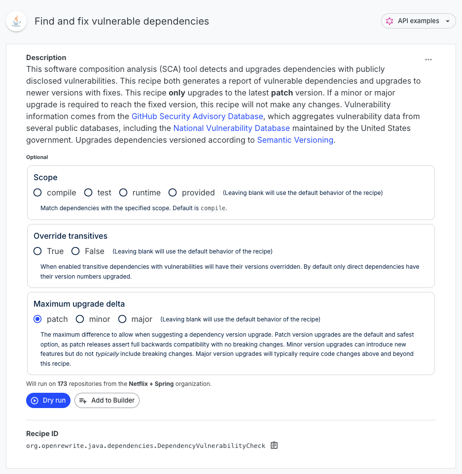
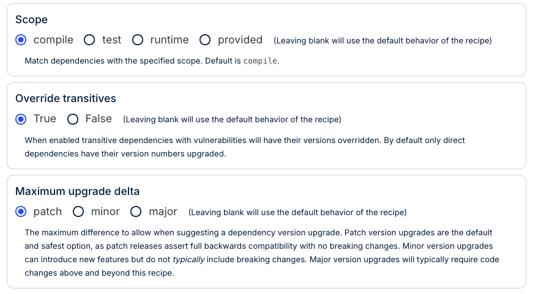
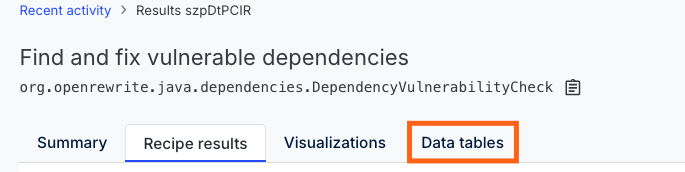
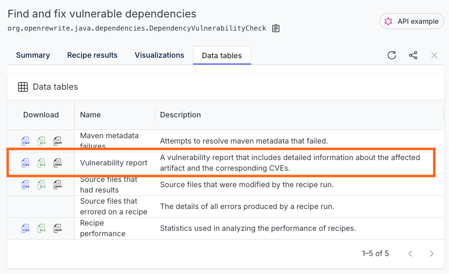

# How to find and fix vulnerable dependencies

Vulnerable dependencies can be a ticking time bomb for software projects. A single outdated or compromised library can expose your entire company to security risks, data breaches, and reputational damage. Finding and fixing these vulnerabilities is crucial, but it's often easier said than done - especially when dealing with transitive dependencies buried deep within your project's dependency graph.

That's where Moderne comes in. Unlike other solutions that only identify vulnerabilities in _direct_ dependencies, Moderne takes it a step further by not only detecting vulnerabilities in _transitive_ dependencies – but also providing options for **fixing** them.

In this guide, we'll walk you through how to use Moderne to find and fix vulnerable dependencies in your project.

## Prerequisites

This guide assumes that you are already familiar with Moderne and that you're able to select an organization and find/run recipes. If you need help with that, consider checking out our [getting started guide](../getting-started/running-your-first-recipe.md).

## Step 1: Select an organization

The first thing you need to do is select an organization that contains repositories that you want to find/fix vulnerabilities in.

If you are using the public Moderne Platform, we'd encourage you to select the `Netflix + Spring` organization, as it includes a variety of repositories that have interesting results.

If you are a Moderne customer with private organizations, please select any organization that is relevant to your needs.

## Step 2: Navigate to the recipe

From the Moderne Platform, open the [find and fix vulnerable dependencies recipe](https://app.moderne.io/recipes/org.openrewrite.java.dependencies.DependencyVulnerabilityCheck) (Note: We also have similar find/fix dependency recipes for [NPM](https://app.moderne.io/recipes/org.openrewrite.nodejs.DependencyVulnerabilityCheck) and [.NET](https://app.moderne.io/recipes/org.openrewrite.csharp.dependencies.DependencyVulnerabilityCheck)). You will see a page that looks like this:

<figure>
  
  <figcaption>_Find and fix vulnerable dependencies recipe_</figcaption>
</figure>

## Step 3: Select recipe options

When running this recipe, we'd recommend these options:

<figure>
  
  <figcaption>_Recommended recipe options_</figcaption>
</figure>

By default, this recipe will only upgrade dependencies that your project **directly** depends on. However, most vulnerabilities will come from **transitive dependencies** (~80% of vulnerabilities are in transitive dependencies). To get the most out of this recipe, we'd strongly recommend selecting `True` for `Override transitives`.

Similarly, we'd also strongly recommend leaving `maximum upgrade delta` as `patch` (at least at first). With that selected, the recipe will upgrade any of your dependencies that can have their security issues resolved with a _patch_ version. It will still provide information in a data table for the other vulnerabilities, but it won't change your code to resolve those.

Patch updates typically have no breaking changes, so this should ensure the recipe doesn't cause any harm. Doing _minor_ or _major_ version bumps could cause many things to break, so please only select those if you're comfortable with that.

## Step 4: Run the recipe

Press `Dry Run` at the bottom of the page and wait for the recipe to run. Once the recipe finishes running, you will see a page that looks like this:

<figure>
  
  <figcaption>_Find and fix vulnerable dependencies recipe results_</figcaption>
</figure>

## Step 5: Examine the changes

The right side of the screen shows the changes made for each repository. You can click on any repository to see the changes made. Keep in mind, though, that these changes will be minimal in nature if you selected `patch` for the `maximum upgrade delta`.

<figure>
  
  <figcaption>_Example dependency change to fix a security issue_</figcaption>
</figure>

You also may find it useful to check out a visualization that shows the type of version changes needed to fix vulnerabilities in your repositories. To see that, click on the `Visualizations` tab and run the `Dependency vulnerability profile` visualization:

<figure>
  
  <figcaption>_Dependency vulnerability profile visualization_</figcaption>
</figure>

That being said, the substantial benefit of this recipe comes from the data table that is produced.

## Step 6: Download and review the data table

Click on the `Data tables` tab at the top of the recipe results page and then download the `Vulnerability report` data table:

<figure>
  
  <figcaption>_Data tables tab_</figcaption>
</figure>

<figure>
  
  <figcaption>_Vulnerability report download_</figcaption>
</figure>

The downloaded data table provides the following columns:

* `repositoryOrigin`
* `repoistoryPath`
* `repositoryBranch`
* `scmType`
* `repositoryLink`
* `projectName`
* `cve`
* `groupId`
* `artifactId`
* `version`
* `fixedVersion`
* `fixWithVersionUpdateOnly`
* `summary`
* `severity`
* `depth`
* `CWEs`

With this information, you can easily extract critical data about your services to create an action plan for how you'll fix these issues.

## Step 7: Fix the issues

For issues that can be resolved with minor version bumps, run this recipe with a `maximum upgrade delta` of `minor`, and then test that those repositories still function as expected.

For other issues, though, you'll need to consider larger and more complex recipes. Fortunately, Moderne offers substantial migration recipes that perform major version bumps alongside extensive code refactoring. 

Some notable migration/refactoring recipes include:

* [Migrating to Spring Boot 3.4](https://docs.openrewrite.org/recipes/recipe/spring/boot3/upgradespringboot_3_4)
* [Migrating from Micronaut 3.x to 4.x](https://docs.openrewrite.org/recipes/java/micronaut/micronaut3to4migration)
* [Migrating from Quarkus 1 to 2](https://docs.openrewrite.org/recipes/quarkus/quarkus2/quarkus1to2migration)

If we don't offer a recipe that can fix your issue, you should consider [writing your own](./writing-and-installing-recipes.md) so that you can automate fixes across many repositories and potentially share the solution with others.