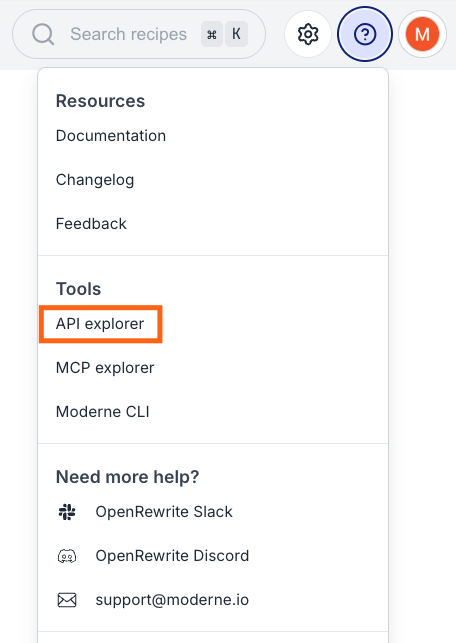
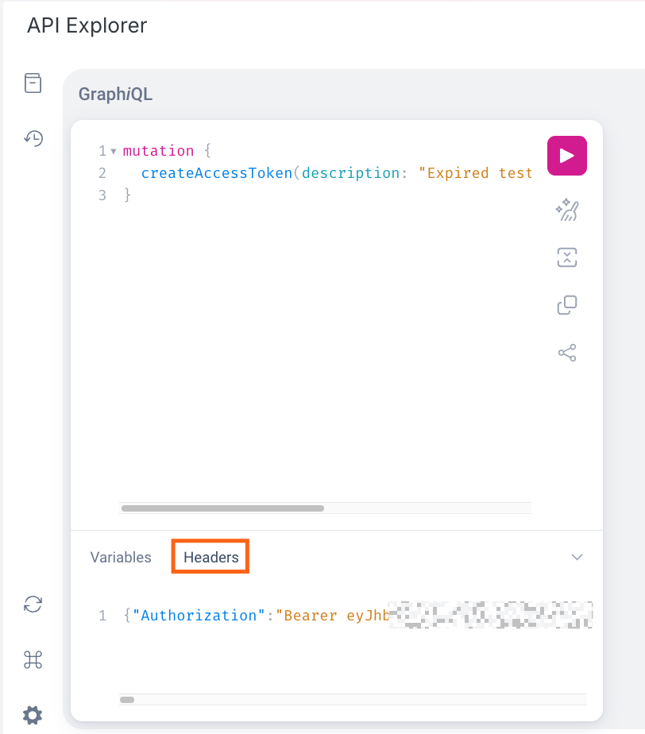
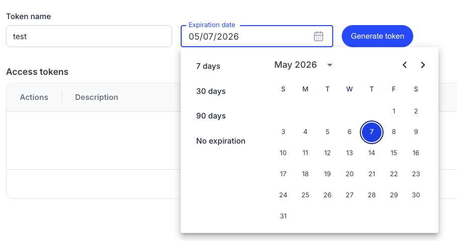

# Moderne tokens

Moderne issues two kinds of tokens for authenticating to the Platform and its APIs:

1. [A JSON Web Token (JWT) that is created when you log in to Moderne](#login-token)
2. [A personal access token used for programmatically accessing the Moderne GraphQL API](#personal-access-tokens)

In this doc, you can find detailed information about each of these.

:::info
Neither of these tokens gives Moderne access to your source code. Moderne reaches your repositories with a separate credential from your source code management (SCM) provider. To learn how that works, please read the [SCM access tokens reference](./create-scm-access-tokens.md).
:::

## Login token

When you log in to the Moderne Platform, a JWT is created for you by Keycloak. The UI then uses this token to authenticate against various Moderne APIs for things like displaying recipe categories.

You can find this token by clicking on the GraphQL icon in the top middle of the Moderne Platform once you are logged in:

<figure>
  
</figure>

From there, at the bottom of the GraphQL Explorer, there is a `request headers` tab that includes this token:

<figure>
  
</figure>

You can use this token to make general GraphQL API calls. For anything beyond quick experimentation, though, you should create a [personal access token](#personal-access-tokens) instead, as login tokens are short-lived.

### Permissions

A login token carries the same permissions as the user it was issued to. If you are an administrator, your login token has administrator permissions. For a breakdown of what each kind of user can do, please read the [user roles reference](../../../administrator-documentation/moderne-platform/references/user-roles.md).

Because roles are embedded in the token when it is issued, a login token keeps the permissions it was created with until it expires, even if your roles change in the meantime.

### Expiration

Login tokens expire after one hour.

## Personal access tokens

Personal access tokens are used to make queries against the [Moderne GraphQL API](https://api.app.moderne.io/).

### Permissions

A personal access token carries the same permissions as the user who created it. If you are an administrator, any personal access token you create has administrator permissions and can be used for administrative operations such as viewing audit logs or revoking other users' tokens.

Unlike login tokens, a personal access token has its permissions resolved on every request rather than baked in at creation. If your roles change, the change takes effect on your existing tokens immediately, without you having to create new ones.

### Expiration

You choose how long a personal access token should last when you create it. If you don't set an expiration date, the token never expires.

Your organization's administrator may configure a maximum token lifetime through the connector's `moderne.authorization.accessTokens.maxExpiryDays` setting. When that limit is in place, you must set an expiration date that falls within it. Tokens without an expiration date, and tokens that would outlive the limit, are rejected.

<figure>
  
</figure>

The Moderne CLI creates tokens on your behalf when you run `mod config moderne login`, and those tokens default to 365 days. Pass `--expiration` with an ISO-8601 duration to choose a different lifetime, such as `--expiration P90D` for 90 days.

### Further reading

For instructions on how to create, view, or revoke personal access tokens, please read the [managing personal access tokens doc](../how-to-guides/create-api-access-tokens.md).
