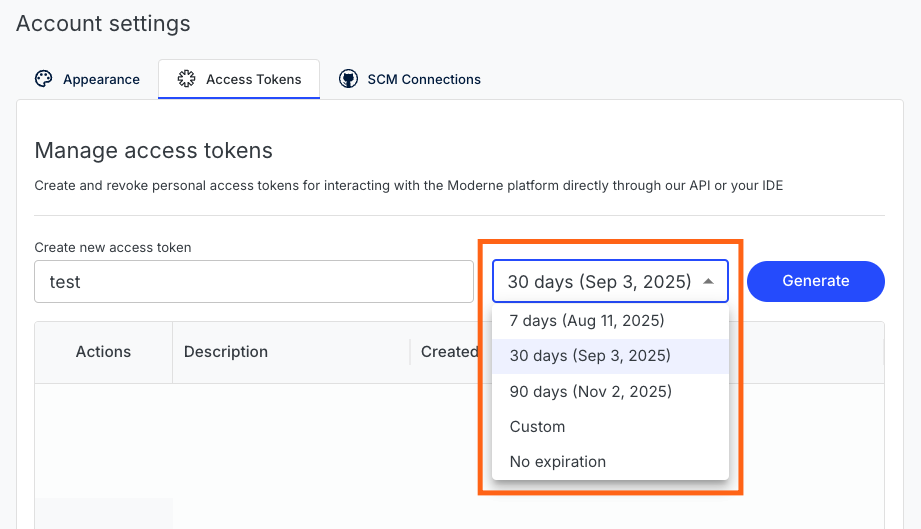

# Moderne tokens

There are three types of tokens used throughout the Moderne Platform:

1. [A JSON Web Token (JWT) that is created when a user logs in to Moderne](#login-token)
2. [A personal access token used for programmatically accessing the Moderne GraphQL API](#personal-access-tokens)
3. [An OAuth token used for interacting with Source Code Management systems (SCMs)](#source-code-management-scm-oauth-token)

In this doc, you can find detailed information about each of these.

:::info
The tokens described in this doc have the same permissions as `everyone` in the [user roles doc](../../../administrator-documentation/moderne-platform/references/user-roles.md). They _do not_ have `administrator` permissions.
:::

## Login token

When a user logs in to the Moderne Platform, a JWT is created for them by Keycloak. This token is then used by the UI to authenticate against various Moderne APIs for things like displaying recipe categories.

:::warning
This token _is not_ used for accessing or viewing source code. That is done via the [SCM Token](#source-code-management-scm-oauth-token)
:::

Users can find this token by clicking on the GraphQL icon in the top middle of the Moderne Platform once they are logged in:

<figure>
  
</figure>

From there, at the bottom of the GraphQL Explorer, there is a `request headers` tag that includes this token:

<figure>
  
</figure>

This token can be used to make general GraphQL API calls. Please note, though, that it is preferable to create a [Personal Access Token](#personal-access-tokens) for interacting with the APIs as Personal Access Tokens do not expire.

### Permissions

A user's token shares the same permissions they have. For example, if a user is an admin, when they create a token, that token will have admin permissions, too.

If you are an admin, tokens you create can only be used if you've logged into the platform in the last **14 days**.

### Expiration

Login tokens expire after one hour.

## Personal Access Tokens

Personal access tokens are used to make queries against the [Moderne GraphQL API](https://api.app.moderne.io/).

### Permissions

Personal access tokens share the same permissions as your user. What this means is that, if you are an admin, any personal access token you create will have admin permissions.

### Expiration

You can choose how long a personal access token should last when you create it. By default, the token will last for 30 days.

<figure>
  
</figure>

For instructions on how to revoke personal access tokens, please see our [managing personal access tokens doc](../how-to-guides/create-api-access-tokens.md#how-to-revoke-an-access-token)

### Further reading

For instructions on how to create, view, or revoke personal access tokens, please read the [managing personal access tokens doc](../how-to-guides/create-api-access-tokens.md).

## Source Code Management (SCM) OAuth token

In order for users to see or interact with source code, an SCM token needs to be created. These tokens are created when a user clicks on one of the SCM logos in the top right corner of the screen OR when an action is performed that requires this token such as viewing a diff or committing code.

These SCM OAuth tokens are stored in association with a user, so if a user logs out and logs back in, that token remains until it expires.

If an SCM token is currently valid, a user can use their [Personal Access Token](#personal-access-tokens) or [JWT](#login-token) to interact with the SCM.

### Permissions

SCM tokens will have different permissions depending on the source code manager used and what the user has allowed or not.

### Expiration

SCM tokens expire after 8 hours.
