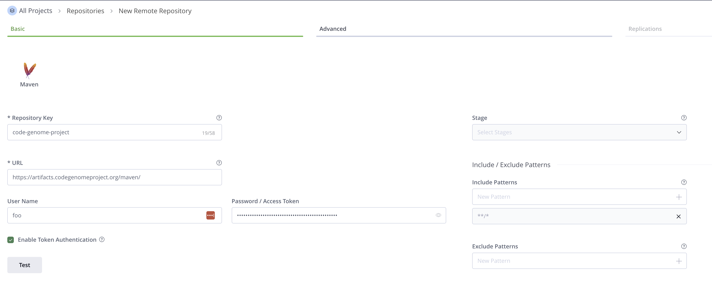
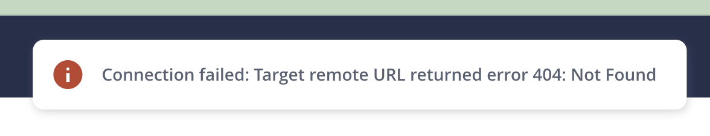

{/*
Interim page: this pulls the admin-facing essentials for enabling Code Genome Project access so
customer admins are unblocked now. Move or supersede it once the canonical Code Genome Project
documentation is published.
*/}

# Accessing the Code Genome Project

The Moderne CLI and recipe artifacts are hosted in the Code Genome Project Maven repository at `https://artifacts.codegenomeproject.org/maven`. The recommended setup is to mirror it in your own artifact repository, so the CLI and recipes resolve through your internal repository exactly as before. If you don't run an internal mirror, you can also point the CLI or a build directly at it with your credentials.

This guide covers what the repository hosts, how you get credentials, and how to onboard it as a remote repository.

## Why now

The Code Genome Project is launching now because the way OpenRewrite's recipes have been distributed is changing. Those recipes have historically been published to the Central Repository (Maven Central), operated by Sonatype. Sonatype is introducing limits on public publishing, including a cap on the number of releases per month and a size cap per release.

Those limits do not fit how OpenRewrite is built and shipped:

* A single release of OpenRewrite's primary repository exceeds both the release-count and size limits on its own.
* OpenRewrite releases frequently, often several times per week.

Aside from publishing limits, there are also rate limits that have negatively impacted us. When trying to build and release OpenRewrite, we often will see [HTTP 429 responses](https://central.sonatype.org/faq/429-error/) as we attempt to resolve artifacts across numerous repository. This holds up our release train and makes it take longer to get updates out.

Rather than let another party's constraints dictate how these tools reach you, Moderne now hosts OpenRewrite's recipes and the Moderne CLI in the Code Genome Project.

## What the repository hosts

Access to each kind of content depends on your entitlement:

* **OpenRewrite open-source recipes** (Apache 2.0), the **Moderne CLI**, and the **Moderne Connector**: available to any authenticated user.
* **Moderne Source Available License (MSAL) recipes**: available to customers only.
* **Moderne proprietary recipes**: available to customers only.

Your entitlement is checked on every request, so access that Moderne grants or revokes takes effect on your next download without needing a new credential.

## Getting credentials

If you're a Moderne customer, you'll receive the following directly from Moderne:

* A **username**.
* A **password**.
* A **download token** to get started immediately.

These credentials carry your customer entitlement, so they can pull MSAL and proprietary recipes in addition to the open-source recipes and the CLI. Use the credentials Moderne provides rather than creating your own account, because the entitlement is attached to the Moderne-provided identity.

## Onboarding the repository in Artifactory or Nexus

Add `https://artifacts.codegenomeproject.org/maven` as a new remote (proxy) repository in your Artifactory or Nexus, using your Code Genome Project credentials. Authenticate with HTTP Basic auth, using the token as the password. The username is not validated for token credentials, so any value works, though your Moderne-provided username keeps things clear.

When ordering your virtual repositories, it's important that you put the Code Genome Project **below your internal repositories and above Maven Central**. If you put CGP _above_ your internal repositories, you will end up with getting a 404 from CGP and added latency in resolving those artifacts. If you put CGP _below_ Maven Central, you'll end up only seeing stale releases rather than the latest one in CGP.

:::info
Use the repository URL exactly as shown. Do not append a storage prefix such as `/oss`. The gateway adds the correct prefix for you, and an extra one causes the request to be rejected.
:::



Once the remote repository is in place, your developers install and run the CLI and recipes through your internal repository exactly as before, with no per-developer changes. See [Deploying the CLI from an internal artifact repository](../moderne-cli/getting-started/cli-internal-mirror.md) for the CLI-side setup.

### The connection test returns a 404

Artifactory's **Test** button, and the equivalent check in Nexus, requests the repository root at `https://artifacts.codegenomeproject.org/maven/`. The Code Genome Project answers a directory request from a build tool with a `404 Not Found`, because directory listings are not part of the Maven wire protocol. A browser asks for HTML at that same URL and gets a browsable index, but a repository manager does not, so it reports `Connection failed: Target remote URL returned error 404: Not Found`.



:::info
This 404 is expected, and it does not mean the remote repository is misconfigured. Save the repository and verify it by requesting a real artifact through it.
:::

### Verifying the remote repository

Request an artifact that the Code Genome Project hosts, through your own repository manager:

```
https://YOUR_ARTIFACTORY_HOST/artifactory/YOUR_REPOSITORY_KEY/org/openrewrite/rewrite-core/maven-metadata.xml
```

Replace `YOUR_ARTIFACTORY_HOST` with your host and `YOUR_REPOSITORY_KEY` with the repository key you chose. A `200` response whose body is `<metadata>` XML means the proxy and the credentials are both working.

If that request fails, check the Code Genome Project directly to find out which side is at fault:

```bash
curl -u USERNAME:TOKEN https://artifacts.codegenomeproject.org/maven/org/openrewrite/rewrite-core/maven-metadata.xml
```

A `302` redirect to a signed CloudFront URL is success, since artifact bytes are served from the CDN rather than the gateway. Add `-L` to follow the redirect and see the metadata itself. If this request succeeds but the one through your repository manager fails, the credentials stored on the remote repository are the problem.

## Point the CLI or a build directly at the repository

If you don't run an internal mirror, point the Moderne CLI or your build directly at the repository, authenticating with your token.

For the **Moderne CLI**, add it as a recipe artifact repository. See [pointing the CLI at the Code Genome Project for recipes](../moderne-cli/getting-started/cli-internal-tools.md#pointing-the-cli-at-the-code-genome-project-for-recipes).

For a **Maven build**, put your credentials (the token is the password) in `settings.xml`:

```xml
<settings>
  <servers>
    <server>
      <id>codegenome</id>
      <username>USERNAME</username>
      <password>TOKEN</password>
    </server>
  </servers>
</settings>
```

and declare the repository in `pom.xml`:

```xml
<repositories>
  <repository>
    <id>codegenome</id>
    <url>https://artifacts.codegenomeproject.org/maven</url>
  </repository>
</repositories>
```

For a **Gradle build**, add the repository to your `build.gradle.kts`:

```kotlin
repositories {
    maven {
        url = uri("https://artifacts.codegenomeproject.org/maven")
        credentials {
            username = "USERNAME"
            password = "TOKEN"
        }
    }
}
```

## Troubleshooting

* **`404 Not Found` from a connection test**: expected. See [The connection test returns a 404](#the-connection-test-returns-a-404).
* **`401 Unauthorized`**: your request had no credentials, or the token is invalid or revoked. Confirm your mirror is sending the token, and generate a new one if needed.
* **`403 Forbidden`**: your request is authenticated, but your identity is not entitled to that artifact. Open-source recipes and the CLI are available to any authenticated user. MSAL and proprietary recipes require a customer entitlement. Confirm your mirror is configured with your Moderne-provided credentials rather than a personal account.
