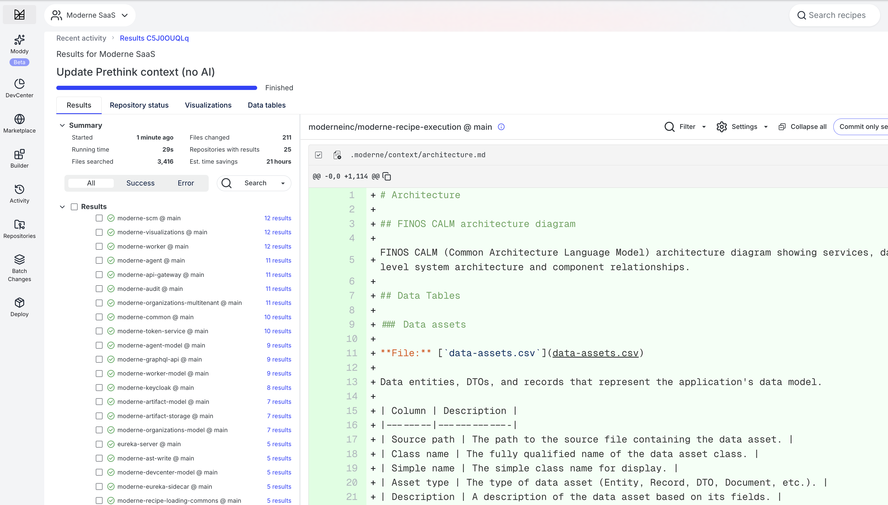
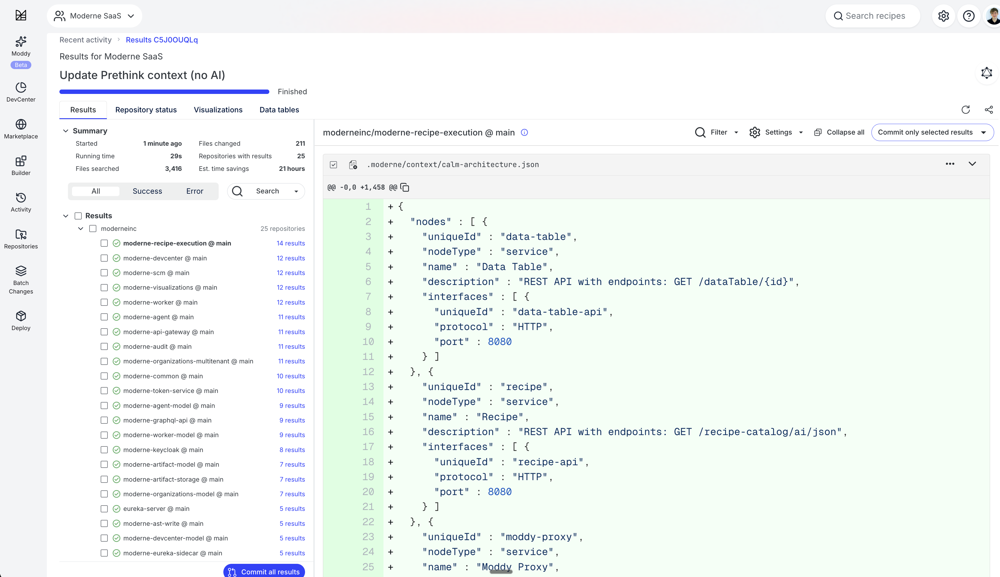

# Prethink recipes

Prethink recipes generate structured context that gives AI coding agents a clear, accurate understanding of your entire codebase. Instead of forcing AI agents to infer your architecture from raw code, Prethink provides pre-resolved knowledge about service endpoints, dependencies, test coverage, and more.

## Why use Prethink

AI coding agents like Claude Code, Cursor, and GitHub Copilot struggle with enterprise codebases due to:

* **Token limits** that prevent them from fitting your entire codebase into context
* **Shallow code understanding** that forces them to infer types, dependencies, and cross-repository relationships from raw text (often resulting in hallucinations)
* **Repetitive context building** that wastes tokens re-describing code structure on every interaction

These aren't faults of the models themselves - they're data problems. When working with vast enterprise codebases, AI models don't have the semantic context needed to be comprehensive, accurate, and efficient.

Prethink solves these problems by generating verified, structured context that AI agents can reason over directly. This means faster responses, lower costs, and more accurate results.

## What Prethink provides

Moderne Prethink delivers pre-resolved, verified knowledge that AI agents can reason over directly:

* **Architectural patterns**: Service endpoints, database connections, external service calls, and messaging patterns
* **Resolved dependency graphs**: Complete dependency trees, including transitive dependencies
* **Known vulnerabilities**: Security issues identified across your repositories
* **Declared migration targets**: Your organization's upgrade and modernization goals
* **Deterministic recipes**: Structured transformations that can be applied reliably

With Prethink:

* Code structure is documented, not guessed
* Relationships between services are already mapped
* Your goals and constraints are part of the context
* AI reasons over facts instead of reconstructing them

## How Prethink works

Prethink is delivered as a set of OpenRewrite recipes that generate multi-repo, trusted context for AI agents. When you run Prethink recipes against your codebase, they produce structured outputs that capture context, including:

* **Code data tables**: Deep insights only discoverable using Moderne's Lossless Semantic Tree (LST) code model
* **Dependency inventory**: Complete picture of libraries including transitive dependencies
* **Knowledge graph** (optional): System-level map of how components, dependencies, and behaviors connect
* **CALM-formatted artifacts**: Architecture diagrams with nodes and relationships that can be visualized with [CALM](https://calm.finos.org/)-compatible tools

These outputs can be continuously updated as your codebase evolves by re-running Prethink recipes. This ensures your AI agents always have current, accurate context.

## Recipe modules

Prethink is distributed as two complementary modules:

| Module                                    | Description                                                                                                                                           |
|-------------------------------------------|-------------------------------------------------------------------------------------------------------------------------------------------------------|
| `io.moderne.recipe:rewrite-prethink`      | A pre-configured module with out-of-the-box discovery for Spring MVC, JAX-RS, JPA, Kafka, and more. Includes LLM integrations for code comprehension. |
| `org.openrewrite.recipe:rewrite-prethink` | Open-source building blocks for custom Prethink recipes. Use this when you have custom frameworks or want full control over context generation.       |

### What the Moderne module discovers

The `io.moderne.recipe:rewrite-prethink` module provides out-of-the-box discovery for common frameworks:

* **Service endpoint discovery**: Spring MVC, JAX-RS, Micronaut, Quarkus
* **Database connection discovery**: JPA, Spring Data, JDBC
* **External service call discovery**: RestTemplate, WebClient, Feign, Apache HttpClient
* **Messaging pattern discovery**: Kafka, RabbitMQ, JMS, Spring Cloud Stream
* **Security configuration discovery**: Spring Security, CORS, OAuth2
* **LLM integrations**: Code comprehension at the method and class level, test summary generation

### What the OpenRewrite module provides

The `org.openrewrite.recipe:rewrite-prethink` module provides the building blocks for generating Prethink context:

* **ExportContext**: Exports data tables as CSV files to your repository
* **UpdateAgentConfig**: Updates AI agent configuration files with context references
* **UpdatePrethinkContext**: Orchestrates context generation from pre-populated data tables
* **CALM architecture generation**: Produces CALM-formatted architecture diagrams

This module provides the infrastructure but expects you to supply your own recipes for discovering CALM entities and producing the context you want to save.

## Available recipes

### Update Prethink context (with AI)

Generates Moderne Prethink context files with AI-generated code comprehension, test coverage mapping, dependency inventory, and FINOS CALM architecture diagrams. Maps tests to implementation methods and optionally generates AI summaries of what each test verifies when an LLM provider is configured.

* **Recipe:** [`io.moderne.prethink.UpdatePrethinkContextStarter`](https://app.moderne.io/recipes/io.moderne.prethink.UpdatePrethinkContextStarter)
* **Module:** `io.moderne.recipe:rewrite-prethink`

#### Options

| Option              | Description                           | Example                               |
|---------------------|---------------------------------------|---------------------------------------|
| `provider`          | LLM provider for generating summaries | `openai`, `gemini`, `poolside`        |
| `apiKey`            | API key for the LLM provider          | `ps-...`                              |
| `model`             | Model name to use                     | `Malibu-v2.20251021`                  |
| `baseUrl`           | Custom base URL for the provider      | `https://divers.poolsi.de/openai/v1/` |
| `requestsPerMinute` | Rate limit for LLM requests           | `60`                                  |

### Update Prethink context (no AI)

Generates Moderne Prethink context files with architectural discovery, test coverage mapping, dependency inventory, and FINOS CALM architecture diagrams. This recipe does not require an LLM provider - use the [Update Prethink context (with AI) recipe](#update-prethink-context-with-ai) if you want AI-generated code comprehension and test summaries.

* **Recipe:** [`io.moderne.prethink.UpdatePrethinkContextNoAiStarter`](https://app.moderne.io/recipes/io.moderne.prethink.UpdatePrethinkContextNoAiStarter)
* **Module:** `io.moderne.recipe:rewrite-prethink`

This recipe includes the same architectural discovery, test coverage mapping, dependency inventory, and CALM architecture generation as the AI version, but skips AI-generated code comprehension. Instead, it estimates token usage for methods so you can evaluate AI costs before enabling comprehension.

This recipe has no configurable options.

### Update Prethink context (base recipe)

Generates a FINOS CALM architecture diagram and updates agent configuration files. This recipe expects CALM-related data tables (ServiceEndpoints, DatabaseConnections, ExternalServiceCalls, MessagingConnections, etc.) to be populated by other recipes in a composite.

* **Recipe:** [`org.openrewrite.prethink.UpdatePrethinkContext`](https://app.moderne.io/recipes/org.openrewrite.prethink.UpdatePrethinkContext)
* **Module:** `org.openrewrite.recipe:rewrite-prethink`

Use this recipe when building custom Prethink configurations with your own discovery recipes. This recipe has no configurable options.

### Supporting recipes

The OpenRewrite module also provides these building blocks:

| Recipe                                       | Description                                                                                                                        |
|----------------------------------------------|------------------------------------------------------------------------------------------------------------------------------------|
| `org.openrewrite.prethink.ExportContext`     | Exports data tables to CSV files in `.moderne/context/` with markdown documentation describing the schema.                         |
| `org.openrewrite.prethink.UpdateAgentConfig` | Updates agent configuration files (`CLAUDE.md`, `.cursorrules`, `.github/copilot-instructions.md`) to reference generated context. |

## Creating custom Prethink recipes

If the built-in recipes don't meet your needs, you can create custom Prethink recipes. This is useful when you have custom frameworks, proprietary patterns, or want full control over what context is generated.

### Setting up a recipe repository

1. Create a new recipe repository using either the [rewrite-recipe-starter](https://github.com/moderneinc/rewrite-recipe-starter) or your own internal recipe starter template.

2. Add a dependency on the Prethink modules in your `build.gradle`:

```groovy
dependencies {
    // For pre-configured discovery (recommended)
    implementation("io.moderne.recipe:rewrite-prethink:latest.release")

    // Or for building blocks only
    implementation("org.openrewrite.recipe:rewrite-prethink:latest.release")
}
```

The Moderne module includes all recipes from the OpenRewrite module plus framework-specific discovery and LLM integrations.

### Recipe examples

#### Complete Prethink configuration

This example runs all discovery phases and generates comprehensive context:

```yaml
type: specs.openrewrite.org/v1beta/recipe
name: com.example.prethink.UpdatePrethinkContext
displayName: Update Prethink context
description: >-
  Generates comprehensive Prethink context for AI agents including
  service endpoints, dependencies, test coverage, and architecture.
recipeList:
  # Phase 1: Architectural Discovery
  - io.moderne.prethink.calm.FindProjectMetadata
  - io.moderne.prethink.calm.FindServiceEndpoints
  - io.moderne.prethink.calm.FindDatabaseConnections
  - io.moderne.prethink.calm.FindExternalServiceCalls
  - io.moderne.prethink.calm.FindMessagingConnections
  - io.moderne.prethink.calm.FindServerConfiguration
  - io.moderne.prethink.calm.FindSecurityConfiguration
  - io.moderne.prethink.calm.FindDeploymentArtifacts
  - io.moderne.prethink.calm.FindDataAssets

  # Phase 2: Test Coverage
  - io.moderne.prethink.FindTestCoverage

  # Phase 3: Context Generation
  - io.moderne.prethink.calm.GenerateCalmArchitecture
  - org.openrewrite.prethink.UpdateAgentConfig
```

#### Minimal Prethink configuration

If you only need basic service endpoint discovery:

```yaml
type: specs.openrewrite.org/v1beta/recipe
name: com.example.prethink.MinimalPrethink
displayName: Minimal Prethink context
description: >-
  Generates basic Prethink context with service endpoints only.
recipeList:
  - io.moderne.prethink.calm.FindProjectMetadata
  - io.moderne.prethink.calm.FindServiceEndpoints
  - org.openrewrite.prethink.ExportContext:
      displayName: Service Endpoints
      shortDescription: REST and HTTP endpoints
      dataTables:
        - io.moderne.prethink.table.ServiceEndpoints
  - org.openrewrite.prethink.UpdateAgentConfig
```

#### Prethink with AI summaries

To enable AI-generated summaries, configure the LLM provider:

```yaml
type: specs.openrewrite.org/v1beta/recipe
name: com.example.prethink.PrethinkWithAI
displayName: Prethink context with AI summaries
description: >-
  Generates Prethink context with AI-enhanced test summaries.
recipeList:
  - io.moderne.prethink.calm.FindProjectMetadata
  - io.moderne.prethink.calm.FindServiceEndpoints
  - io.moderne.prethink.FindTestCoverage:
      provider: poolside
  - io.moderne.prethink.calm.GenerateCalmArchitecture
  - org.openrewrite.prethink.UpdateAgentConfig
```

#### Custom discovery with OpenRewrite module

When using the OpenRewrite module, you provide your own discovery recipes:

```yaml
type: specs.openrewrite.org/v1beta/recipe
name: com.example.prethink.CustomPrethink
displayName: Custom Prethink context
description: >-
  Generates Prethink context using custom discovery recipes.
recipeList:
  # Your custom discovery recipe that populates a data table
  - com.example.discovery.FindCustomEndpoints

  # Export the custom data table to CSV
  - org.openrewrite.prethink.ExportContext:
      displayName: Custom Endpoints
      shortDescription: Custom framework endpoints
      longDescription: >-
        Endpoints discovered from our internal framework.
      dataTables:
        - com.example.table.CustomEndpoints

  # Update agent configuration files
  - org.openrewrite.prethink.UpdateAgentConfig
```

Your custom discovery recipe would implement the logic to find architectural elements specific to your frameworks and populate a data table. See the [OpenRewrite recipe development documentation](https://docs.openrewrite.org/authoring-recipes) for guidance on creating custom recipes.

:::tip
Recipes do not have to be in the same file or even the same module. You can compose Prethink recipes by referencing recipes from other modules.
:::

### Data tables

Prethink recipes populate several data tables that capture different aspects of your codebase:

| Data table              | Description                                                      |
|-------------------------|------------------------------------------------------------------|
| `ServiceEndpoints`      | REST/HTTP endpoints with HTTP methods, paths, and framework info |
| `DatabaseConnections`   | JPA entities, repositories, and JDBC connections                 |
| `ExternalServiceCalls`  | Outbound HTTP calls to external services                         |
| `MessagingConnections`  | Kafka, RabbitMQ, JMS, and other messaging patterns               |
| `TestMapping`           | Mapping of test methods to implementation methods                |
| `SecurityConfiguration` | Spring Security, CORS, and OAuth2 configurations                 |
| `ServerConfiguration`   | Port, SSL, and context path settings                             |
| `DeploymentArtifacts`   | Dockerfile, Kubernetes, and docker-compose files                 |
| `DataAssets`            | Entities, records, and DTOs                                      |
| `ProjectMetadata`       | Artifact ID, group ID, and project name                          |
| `ClassDescriptions`     | AI-generated class descriptions (with AI recipe)                 |
| `MethodDescriptions`    | AI-generated method descriptions (with AI recipe)                |

For the full schema definitions, see the [data table source code](https://github.com/openrewrite/rewrite-prethink/tree/main/src/main/java/org/openrewrite/prethink/table).

## What Prethink generates

After running a Prethink recipe, you'll find generated files in the `.moderne/context/` directory (there will be a `.moderne` directory created inside of each repository):

```
.moderne/context/
├── service-endpoints.csv
├── service-endpoints.md
├── database-connections.csv
├── database-connections.md
├── test-mapping.csv
├── test-mapping.md
├── dependencies.csv
├── dependencies.md
└── calm-architecture.json
```

* **CSV files** contain structured data that AI agents can parse directly
* **Markdown files** describe the context and schema for human and agent readability
* **CALM architecture JSON** can be visualized with [CALM](https://calm.finos.org/)-compatible tools

### Context export

The context export component saves structured data tables as files in your repository. This allows any AI agent to access resolved knowledge about your codebase without needing to parse and understand the code itself.

Each exported context file is accompanied by a markdown file that describes what the data contains and how to interpret it. This helps AI agents understand the schema and meaning of the data without additional prompting.

<figure>
  
  <figcaption>_A markdown file describing the CALM architecture context_</figcaption>
</figure>

### Code comprehension

The optional code comprehension component uses Moderne's LST analysis combined with your bring-your-own LLM to build a knowledge graph. This graph captures how software components, dependencies, and behaviors relate at a system level.

### Architecture visualization

Prethink can export architecture information in CALM format, providing nodes and relationships that describe your system's structure. These can be visualized with CALM-compatible tools or consumed directly by AI agents for architectural reasoning.

<figure>
  
  <figcaption>_A generated CALM architecture diagram showing services and their relationships_</figcaption>
</figure>

## How agents discover Prethink context

When Prethink runs, it updates the agent configuration files in your repository (such as `CLAUDE.md`, `.cursorrules`, or `.github/copilot-instructions.md`) to point AI agents to the generated context. This enables progressive discovery where agents first learn about the available context and then read the relevant files as needed.

<figure>
  
  <figcaption>_An updated CLAUDE.md file pointing agents to Prethink context_</figcaption>
</figure>

The agent configuration includes a table of available context types with descriptions and file paths, along with instructions on how to use the context effectively. This means agents can immediately start reasoning over pre-resolved facts about your codebase.

## Next steps

* [Run Prethink recipes on the Moderne Platform](../moderne-platform/getting-started/prethink.md)
* [Generate Prethink context with the CLI](../moderne-cli/how-to-guides/cli-prethink.md)