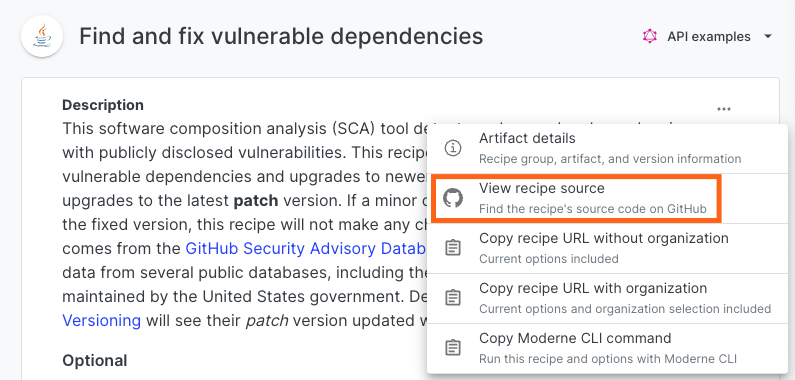

# Recipe authoring workshop

[OpenRewrite](https://docs.openrewrite.org/) is a framework for writing and running code transformations. [Recipes](https://docs.openrewrite.org/concepts-and-explanations/recipes) are the unit of work in OpenRewrite, and can be written in [YAML](https://docs.openrewrite.org/concepts-and-explanations/recipes#declarative-recipes), [Refaster](https://docs.openrewrite.org/authoring-recipes/refaster-recipes), or [imperative Java](https://docs.openrewrite.org/concepts-and-explanations/recipes#imperative-recipes).

In this workshop, we'll walk through everything you need to know to get started with recipe development – from writing simple YAML recipes, to creating complex imperative recipes, along with all of the steps in between such as testing or debugging recipes.

This workshop is designed to be hands-on, so you can follow along with the examples in your own environment. The workshop consists of the materials you see here, and a set of exercises to help you practice what you've learned.

Be sure to also follow links to the [OpenRewrite documentation](https://docs.openrewrite.org/) for more in-depth information. Feel free to skip around to the sections that interest you most, based on your needs and experience level.

If you get stuck, or have questions, feel free to ask in the [OpenRewrite Slack](https://join.slack.com/t/rewriteoss/shared_invite/zt-nj42n3ea-b\~62rIHzb3Vo0E1APKCXEA) or [Discord](https://discord.gg/xk3ZKrhWAb).

## Running existing recipes

Before you begin writing your own recipes, you should make sure you are aware of what recipes already exist and how to run them. This is beneficial for two reasons: you won't spend time creating a recipe that someone else has already made, and you will gain a better understanding of how people will actually use any recipe you write.

There are two main locations for discovering recipes: the [OpenRewrite recipe catalog](https://docs.openrewrite.org/recipes) and [the Moderne Platform](https://app.moderne.io/marketplace). The former contains all the information you'll need to run the recipe – whereas the latter has a richer search and view, that allows you to directly run recipes.

:::warning
We recommend using Moderne multi-repository tools for authoring and testing recipes at scale. This accelerates the feedback loop on recipe quality, and allows you to validate recipes on real-life scenarios encountered in real codebases.

If you are an OSS contributor writing OSS recipes for your projects, you can use Moderne tools for free. Specifically, both the Moderne CLI and the Moderne IntelliJ plugin are free to test on OSS repositories that you control. If you don't see your project in the Moderne Platform, [please reach out to us](mailto:support@moderne.io), and we'll get it added.
:::

There are three main ways to run recipes for Moderne customers:

1. The [Moderne CLI](../moderne-cli/getting-started/cli-intro.md) allows you to run recipes against **multiple projects locally**, and to debug recipes at scale.
   * Free to use on open-source projects, but [requires a Moderne CLI license](../moderne-cli/getting-started/moderne-cli-license.md) for private projects.
   * **Serializes the LST of your project to disk**, and runs recipes against that serialized LST. Larger projects that won't work well with OpenRewrite can use the CLI instead.
2. The [Moderne Platform](https://app.moderne.io/marketplace) offers a UI that allows you to run recipes at scale, create data visualizations, and track progress over time.
   * Supports over 37,000 open-source projects and organizations for free.
   * Requires a company subscription for private projects.
   * Similar to the CLI, it can handle projects of any size.
3. The [Moderne IntelliJ IDEA plugin](../moderne-ide-integration/how-to-guides/moderne-plugin-install.md) allows you to run recipes that you're developing or have checked out locally from inside of IntelliJ.
   * Free to use on open-source projects, but [requires a Moderne CLI license](../moderne-cli/getting-started/moderne-cli-license.md) for private projects.
   * Currently limited to only [imperative and refaster template recipes](https://docs.openrewrite.org/authoring-recipes/types-of-recipes).

:::info
Learn more about [the differences between OpenRewrite and Moderne](https://docs.openrewrite.org/#refactoring-at-scale-with-moderne).
:::

### Exercise 1: Run a recipe against a group of repositories.

To get comfortable running recipes, let's walk through using the [Moderne Platform](https://app.moderne.io/marketplace) and/or the [Moderne CLI](../moderne-cli/getting-started/cli-intro.md) to run recipes against a group of repositories.

#### Goals for this exercise

* See what recipes are already available.
* See the types of changes that can be made to your code.
* Run a recipe against a group of repositories.

#### Steps

1. If you have access to the [Moderne Platform](https://app.moderne.io/marketplace), navigate to it and [follow along with our quickstart guide for running recipes](../moderne-platform/getting-started/running-your-first-recipe.md). If you don't have access, skip to step 2.
   * Note that, by default, you will be running recipes against a hand-picked group of open-source repositories.
   * Feel free to explore other recipes that match your interests such as [migrating to Java 21](https://app.moderne.io/recipes/org.openrewrite.java.migrate.UpgradeToJava21) or [finding and fixing vulnerable dependencies](https://app.moderne.io/recipes/org.openrewrite.java.dependencies.DependencyVulnerabilityCheck).
   *   Consider checking out the source code for the recipes by clicking on the triple dots in the top-right hand corner of any recipe and then selecting `View recipe source`:

<figure>
  
  <figcaption></figcaption>
</figure>

2. If you don't have the CLI installed, please follow along with [our instructions for installing and configuring the Moderne CLI](../moderne-cli/getting-started/cli-intro.md#installation-and-configuration).
3. Once the CLI is installed, please work through [our examples of using the CLI to run recipes](../moderne-cli/getting-started/cli-intro.md#using-the-cli). Please refrain from applying any recipe changes, though - as this may cause issues in future steps.
   * This will have you run a recipe against a tailored group of open-source repositories and then have you study the results and data tables produced by the recipes. You will use this group of repositories again in future steps as we write and test recipes.
   * Feel free to explore the [OpenRewrite recipe catalog](https://docs.openrewrite.org/recipes) and run other recipes by following the `Moderne CLI` instructions on each recipe page.
   * Similarly, we'd recommend checking out the source code for the recipes by clicking on the `GitHub` link at the top of each recipe page.

#### Takeaways

* There are over 2600 recipes already available to run that cover a wide range of use cases.
* Recipes can make changes to Java source files, properties files, XML files, build files and more.
* It's not necessary to change your build to run recipes.
* Any recipe page in the docs links to the source code of the recipe on GitHub, so you can see how it's implemented.
* The tests for the recipe are also available, so you can see how the recipe behaves in various scenarios.
* The Moderne CLI and Platform allow you to run recipes at scale, to see how recipes behave in practice.

If you're specifically interested in migrating Spring Boot applications, check out our [blogpost on migrating to Spring Boot 3.x](https://www.moderne.io/blog/speed-your-spring-boot-3-0-migration). You may also be interested in looking at the [migrate to Spring Boot 3.x recipe](https://docs.openrewrite.org/recipes/java/spring/boot3/springboot3bestpractices).

## Recipe development environment

Now that you've seen how to run recipes, let's look at how to write your own recipes.

You'll want to have the following installed:

* Java 17 or higher, as our [RewriteTests](https://docs.openrewrite.org/authoring-recipes/recipe-testing#rewritetest-interface) use text blocks.
  * Recipes use Java 8 source level, so they can run on Java 8 and higher.
* IntelliJ IDEA Ultimate 2024.1+ (required by the OpenRewrite plugin).
* The [OpenRewrite plugin](https://plugins.jetbrains.com/plugin/23814-openrewrite), to run and write YAML recipes (This comes pre-installed with IntelliJ versions 2024.1 or later).
* [The Moderne plugin](../moderne-ide-integration/how-to-guides/moderne-plugin-install.md), for faster recipe development and to help debug recipes.
* [The Moderne CLI](../moderne-cli/getting-started/cli-intro.md), to run recipes at scale locally, and debug against serialized LSTs.

### Exercise 2: Create and test your own recipe module

#### Goals for this exercise:

* Set up a new recipe module in your IDE, based on the [rewrite-recipe-starter](https://github.com/moderneinc/rewrite-recipe-starter) project.
* Run the unit tests for the recipe module, to ensure everything is set up correctly.
* Install your recipe module to your local Maven repository for debugging later.
* Use the CLI to run different types of recipes against the `Default` group of repositories [you set up earlier](../moderne-cli/getting-started/cli-intro.md#using-the-cli).

#### Steps

1. Git clone the [rewrite-recipe-starter](https://github.com/moderneinc/rewrite-recipe-starter).
   * You can either clone the project at is, or use it as a template to create a new GitHub repository.
2. Open the project in IntelliJ IDEA.
   * You have the option to import the project as a Maven project, or as a Gradle project. Pick the one you're most comfortable with.
3. (Optional) Consider [updating the way you run tests in IntelliJ](https://docs.openrewrite.org/reference/building-openrewrite-from-source#developing-tips) to speed up test responsiveness.
4. Run the unit tests in the project, to ensure everything is set up correctly.
   * All tests should pass, and you should see a message that the project was successfully built.
5. (Optional) Customize the project's group ID and artifact ID in the `pom.xml` file, or `build.gradle` and `settings.gradle` file. Also consider updating the Java package names to reflect these changes as well.
   * This helps make the project your own, and allows you to version and share your recipes without conflicts.
   * For the purposes of this workshop, this isn't required, though. Feel free to continue using `com.yourorg` throughout.
6. Install the project to your local Maven repository & CLI. This is useful for debugging declarative recipes or for Moderne DX users.
   * Run `mvn install` from the root of the project, or `./gradlew publishToMavenLocal` if you're using Gradle.
   * You should see a message that the project was successfully installed to your local Maven repository.
   * From there make the recipe available to the CLI through `mod config recipes jar install com.yourorg:rewrite-recipe-starter:0.1.0-SNAPSHOT`
   * **Note**: You can also test recipes directly from IntelliJ using the Moderne plugin as described in [exercise 9](#exercise-9-using-the-moderne-plugin).
7. Confirm that everything is set up correctly for testing imperative recipes (we'll explain the types of recipes in the next section) by opening up the `AssertEqualsToAssertThat` class, right-clicking on the class name, and clicking on the `Set Active Recipe` option. Then, open your terminal and navigate to the `workshop` directory (that you set up in the CLI tutorial earlier) and run: `mod run . --active-recipe`.
   * You should see: `Running recipe com.yourorg.AssertEqualsToAssertThat` in the output.
8. Confirm everything is set up for testing declarative recipes by opening your terminal and navigating to the `/src/main/resources/META-INF/rewrite` directory in the `rewrite-recipe-starter` repo. Then run the command: `mod config recipes yaml install stringutils.yml`. Afterwards, navigate to your `workshop` directory and run: `mod run . --recipe=com.yourorg.UseApacheStringUtils`.
   * If everything worked correctly, you should see that the recipe was installed from the YAML file and then was recognized by the `mod run` command.
9. Briefly look over the various recipes and tests in the starter project. We will visit these in more details in upcoming exercises.

#### Takeaways

* The `rewrite-recipe-starter` project is a good starting point for your own recipe module.
* There are various types of recipes included in the starter project, to give you a feel for how they're implemented.
* The unit tests in the starter project take in text blocks that assert the state before and after running a recipe.
* You can quickly test recipes against actual repositories with the CLI.

## Fundamental concepts

Before we dive into writing recipes, let's take a look at some fundamental concepts that underpin OpenRewrite.

Read up on the following concepts in the [OpenRewrite documentation](https://docs.openrewrite.org/), to get a better understanding of how OpenRewrite works:

1. [Lossless Semantic Trees](https://docs.openrewrite.org/concepts-and-explanations/lossless-semantic-trees)
   * [Java LST examples](https://docs.openrewrite.org/concepts-and-explanations/lst-examples)
   * [YAML LST examples](https://docs.openrewrite.org/concepts-and-explanations/yaml-lst-examples)
   * [TreeVisitingPrinter](https://docs.openrewrite.org/concepts-and-explanations/tree-visiting-printer)
2. [Visitors](https://docs.openrewrite.org/concepts-and-explanations/visitors)
   * [Cursoring](https://docs.openrewrite.org/concepts-and-explanations/visitors#cursoring)
   * [Isomorphic vs. non-isomorphic](https://docs.openrewrite.org/concepts-and-explanations/visitors#isomorphic-vs.-non-isomorphic-visitors)
3. [Recipes](https://docs.openrewrite.org/concepts-and-explanations/recipes)

These concepts should give you some sense as to the importance of exact type attribution, and how visitors are used to traverse and modify the LST. Without these, it would be next to impossible to write recipes that make changes to your code reliably.

### Three types of recipes

It's important to note there are different types of recipes, each with their own trade-offs.

1. [Declarative recipes](https://docs.openrewrite.org/authoring-recipes/types-of-recipes#declarative-recipes) are the simplest to write, and are the most common type of recipe. They are written in YAML, and often tie together existing recipe building blocks with some light configuration.
2. [Refaster rules](https://docs.openrewrite.org/authoring-recipes/types-of-recipes#refaster-template-recipes) bring you the benefit of compiler support, and work best for straightforward replacements. They generate recipes that can also be used as a starting point for more complex recipe implementations.
3. [Imperative recipes](https://docs.openrewrite.org/authoring-recipes/types-of-recipes#imperative-recipes) are the most powerful, and allow you to write Java code to implement your recipe. By [using the `JavaTemplate` builder](https://docs.openrewrite.org/authoring-recipes/modifying-methods-with-javatemplate), you can keep complexity down, as you define arbitrary code changes.

No matter which method of recipe development you choose, you can always [write unit tests for your recipe](https://docs.openrewrite.org/authoring-recipes/recipe-testing). Beyond that, there are [best practices for writing recipes](https://docs.openrewrite.org/authoring-recipes/recipe-conventions-and-best-practices), such as ensuring idempotence, and avoiding harmful changes.

## Declarative YAML recipes

As a best practice, if your recipe can be declarative (meaning it can be built out of other recipes), then you should make it declarative. You can make some truly powerful migration recipes by combining many tiny recipes together (which have been vetted to handle specific tasks correctly, such as only adding dependencies as needed).

### Exercise 3: Write a declarative YAML recipe

Let's have a look at a simple declarative YAML recipe, and expand that to cover an additional use case.

#### Goals for this exercise

* Write a declarative YAML recipe that ties together existing recipes.
* Learn how to configure a recipe with options.
* Gain an understanding of the order that recipes are executed and what that means for your recipe options.

#### Steps

:::warning
If you don't have IntelliJ IDEA 2024.1 Ultimate, you'll lack bundled editor support for writing and running recipes. Some of the below steps will not work for you without this.
:::

1. Open the [rewrite-recipe-starter](https://github.com/moderneinc/rewrite-recipe-starter) project in IntelliJ IDEA.
   * You can also compose recipes in [the Moderne Platform recipe builder](https://app.moderne.io/recipes/builder), and run them against open-source projects.
2. Open the `UseApacheStringUtils` recipe which is defined in a YAML file: [src/main/resources/META-INF/rewrite/stringutils.yml](https://github.com/moderneinc/rewrite-recipe-starter/blob/main/src/main/resources/META-INF/rewrite/stringutils.yml).
   * Notice how the file is structured, with a `type`, `name`, `displayName`, `description`, and `recipeList` fields.
   * Comment out the `type:` and see how that disables the OpenRewrite support.
3. Note how the `recipeList` field is a list of fully qualified class names of recipes along with their options (if any exist).
   * Click through on the `AddDependency` and `ChangeType` recipes to open their definition.
   * Have your IDE suggest options to existing recipes by triggering auto-completion (ctrl + space by default). You should see that the recipe doesn't have every option by default (e.g., it's missing `estimatedEffortPerOccurrence`).
4. The migration recipe is a great start, but far from complete. Let's add a recipe to change from [Spring's `trimWhitepace(String)`](https://docs.spring.io/spring-framework/docs/current/javadoc-api/org/springframework/util/StringUtils.html#trimWhitespace\(java.lang.String\)) to [Apache Common's `StringUtils.strip(String)`](https://commons.apache.org/proper/commons-lang/apidocs/org/apache/commons/lang3/StringUtils.html#strip-java.lang.String-).
   * Begin by adding the [org.openrewrite.java.ChangeMethodName](https://docs.openrewrite.org/recipes/java/changemethodname) recipe to the end of the `recipeList` field.
   * Make sure to pass in `methodPattern: org.apache.commons.lang3.StringUtils trimWhitespace(java.lang.String)` and `newMethodName: strip` such as in [this example gist](https://gist.github.com/mike-solomon/4e1271c92c07665725d77beedd3ae1f9).
   * Please note that [the method pattern](https://docs.openrewrite.org/reference/method-patterns) refers to a method that does not exist. Apache Commons does not have a `trimWhitespace` method, but Spring _does_. That's because recipes in the `recipeList` are executed in order. The [ChangeType recipe](https://github.com/moderneinc/rewrite-recipe-starter/blob/main/src/main/resources/META-INF/rewrite/stringutils.yml#L29-L31) comes before our new `ChangeMethodName` recipe. That means that when our `ChangeMethodName` recipe is run, there will no longer be a Spring `trimWhitespace` method. This is important to keep in mind when chaining recipes together.
5. Open the unit test [src/test/java/com/yourorg/UseApacheStringUtilsTest.java](https://github.com/moderneinc/rewrite-recipe-starter/blob/main/src/test/java/com/yourorg/UseApacheStringUtilsTest.java).
   * Notice how we implement `RewriteTest`, override `defaults(RecipeSpec)` to run our recipe, and configure a classpath for the tests that has both `commons-lang3` and `spring-core` on it.
   * Run the first test. Note that we invoke `rewriteRun(SourceSpecs...)` and pass in a single `java(String, String)` source specification, that takes in a before and after text block.
   * The `//language=java` [language injection](https://www.jetbrains.com/help/idea/using-language-injections.html) enables syntax highlighting and code completion in the text block.
   * All together, this asserts that when we run the recipe, code that matches the `before` block will be converted to code that matches the `after` block.
6. Add a unit test for the `ChangeMethodName` recipe we added that converts `trimWhitespace` to `strip`.
   * [Here is an example of what this trimWhitespace() test might look like](https://gist.github.com/mike-solomon/b56bcc2d07cb7ada646b0a60dad119e1)
   * Run the new unit test, and verify that the correct changes are indeed made.
7. Feel free to test the recipe against the `Default` repositories. Just remember you'll need to let the CLI know the recipe has been updated by running `mod config recipes yaml install stringutils.yml` again (from the `/rewrite-recipe-starter/src/main/resources/META-INF/rewrite` directory).

#### Takeaways

* Declarative recipes are the simplest to write, and are the most common type of recipe.
* Common building blocks can be configured and combined to compose more complex migrations.
* Recipes can be chained together, to make multiple changes to your code in a single run.
* When changing types, keep in mind the order of recipes as subsequent recipes in the `recipeList` will need to use the new type.
* Unit tests are a great way to ensure your recipe behaves as expected.

### Preconditions

[Preconditions](https://docs.openrewrite.org/reference/yaml-format-reference#preconditions) are recipes that run before other recipes to limit which source files the recipe will run on. Preconditions are often used to ensure a recipe only runs against certain files or directories – but any recipe which is not a `ScanningRecipe` can technically be used as a precondition.

When a recipe is used as a precondition, any file it would make a change to is considered to meet the precondition. When more than one recipe is used, all of them must make a change to the file for it to be considered to "meet the precondition".

One substantial benefit of preconditions is that other recipes don't need to individually support options to limit themselves to a particular path.

### Exercise 4: Adding preconditions to a recipe

Let's update the `stringutils.yml` recipe to only run on sources that are likely tests, by adding a precondition that uses [the `org.openrewrite.java.search.IsLikelyTest` recipe](https://docs.openrewrite.org/recipes/java/search/islikelytest).

#### Goals for this exercise

* Discover common preconditions, and learn how to combine those with recipes.

#### Steps

1. Open the `UseApacheStringUtils` YAML file (`src/main/resources/META-INF/rewrite/stringutils.yml`) once again.
2. Add a `preconditions` field to the recipe, in between the `description` and `recipeList` fields. **Note**: IntelliJ may warn you that this property isn't allowed, but that's [an IntelliJ bug that will hopefully be fixed soon](https://youtrack.jetbrains.com/issue/IDEA-352288/OpenRewrite-file-editor-should-not-give-a-warning-when-using-preconditions).
   * Add a single `org.openrewrite.java.search.IsLikelyTest` recipe to the list of preconditions, with no options.
   * [Here's an example of what this recipe looks like with the precondition added](https://gist.github.com/mike-solomon/04287b874e335a5e1b40c529d6f3eab9).
3. Open the unit test `src/test/java/com/yourorg/UseApacheStringUtilsTest.java`.
   * Run the tests – they should fail and not make any changes.
   * Add a static import on `org.openrewrite.java.Assertions.srcTestJava`.
   * Wrap the `java(String, String)` methods with `srcTestJava()` to indicate that the sources are tests.
   * [Here's an example of what this should look like](https://gist.github.com/mike-solomon/84b85e62825e671ff27a5de96c520218).
   * Run the tests again, and verify that they now pass.
4. You may be interested in exploring other `Find` recipes in the OpenRewrite recipe catalog. These are often used as preconditions for recipes:
   * [org.openrewrite.FindSourceFiles](https://docs.openrewrite.org/recipes/core/findsourcefiles), to match specific files or directories.
   * [org.openrewrite.java.migrate.search.FindJavaVersion](https://docs.openrewrite.org/recipes/java/migrate/search/findjavaversion), to match specific Java versions.
   * [org.openrewrite.java.search.FindTypes](https://docs.openrewrite.org/recipes/java/search/findtypes), to find type references by name.

#### Takeaways

* Preconditions are used to limit which source files a recipe is run on.
* Common preconditions can be used to target specific files or directories.
* When a recipe is used as a precondition, any file it would make a change to is considered to "meet the precondition" – which means the main recipe will run against it.
* Preconditions themselves do not make changes to the source code, but are used to limit which files a recipe is run on.

## Testing recipes

When developing recipes, it's very important to test them to ensure that they not only make the expected changes but that they also don't make unnecessary changes.

OpenRewrite has extensive support for [testing recipes through the `RewriteTest` interface](https://docs.openrewrite.org/authoring-recipes/recipe-testing), which allows you to write tests that assert the state of the LST before and after running a recipe.

In addition to verifying the textual output, the unit testing framework also makes assertions on the underlying types and structure of the LST, as that might otherwise negatively affect recipe composition. The testing framework will tell you when there are issues with the type information, and help you to correct them.

There are various ways to provide a [recipe specification](https://docs.openrewrite.org/authoring-recipes/recipe-testing#recipespec) – from reading a recipe from any YAML resource through `recipeFromResources`, to reading a recipe from a specific resource, to constructing a Java recipe directly and passing that in.

Similarly, there are various ways to pass in [source specifications](https://docs.openrewrite.org/authoring-recipes/recipe-testing#sourcespec). Each parser has an `Assertions` class to provide test source files of a specific type. Source specifications can take in a single text block to assert no changes are made to a file, or a pair of text blocks to assert that a file is changed from one state to another. An optional final argument can consume a [`SourceSpec`](https://github.com/openrewrite/rewrite/blob/main/rewrite-test/src/main/java/org/openrewrite/test/SourceSpec.java) to provide additional configuration, or make assertions before or after the recipe is run.

### Exercise 5: Explore the various unit tests in the starter project

Let's explore the unit tests in the starter project, to see what elements you can take from each for your own tests.

#### Goals for this exercise

* Understand how to write unit tests for your recipes.
* Learn how to assert the state of the LST before and after running a recipe.
* Explore the various ways to provide recipe and source specifications.

#### Steps

1. Open [src/test/java/com/yourorg/AppendToReleaseNotesTest.java](https://github.com/moderneinc/rewrite-recipe-starter/blob/main/src/test/java/com/yourorg/AppendToReleaseNotesTest.java).
   * Notice how the recipe specification directly constructs a `JavaRecipe` and passes that in. This is most convenient when testing imperative recipes.
   * Notice how `@Test void createNewReleaseNotes() { ... }` uses `org.openrewrite.test.SourceSpecs.text(java.lang.String, java.lang.String)` to provide a before and after text block.
   * The before text block is `null` to indicate that the file does not exist initially. Conversely, you can pass in `null` as the second argument to indicate that the file should be deleted.
   * `@Test void editExistingReleaseNotes()` uses an additional `spec -> spec.path(Paths.get("RELEASE.md")` to set the source file, such that the recipe will match.
2. Open [src/test/java/com/yourorg/AssertEqualsToAssertThatTest.java](https://github.com/moderneinc/rewrite-recipe-starter/blob/main/src/test/java/com/yourorg/AssertEqualsToAssertThatTest.java).
   * Note how `.parser(JavaParser.fromJavaVersion().classpath("junit-jupiter-api"))` is called on the recipe specification.
   * Comment out `classpath("junit-jupiter-api")` and then run the test.
   * The resulting `java.lang.IllegalStateException: LST contains missing or invalid type information` indicates that the type information is missing, and that the test classpath is likely not correctly set up.
3. Open [src/test/java/com/yourorg/NoGuavaListsNewArrayListTest.java](https://github.com/moderneinc/rewrite-recipe-starter/blob/main/src/test/java/com/yourorg/NoGuavaListsNewArrayListTest.java).
   * Read the various comments throughout this test class.
   * Try to make minimal changes in the recipe and see how they affect the tests.
4. Open [src/test/java/com/yourorg/ClassHierarchyTest.java](https://github.com/moderneinc/rewrite-recipe-starter/blob/main/src/test/java/com/yourorg/ClassHierarchyTest.java).
   * Note how each `rewriteRun` consumes a `RecipeSpec` to assert the `dataTable` rows produced in the recipe run.
   * Correlate this to the `insertRow` calls in the recipe, to see how the recipe produces the expected output.
5. Open [src/test/java/com/yourorg/SimplifyTernaryTest.java](https://github.com/moderneinc/rewrite-recipe-starter/blob/main/src/test/java/com/yourorg/SimplifyTernaryTest.java).
   * Note how the instantiated recipe is a generated class, not the Refaster template class itself.
   * See how `@Test void unchanged() { ... }` asserts no changes are made where those would be unsafe to make.

#### Takeaways

* The `RewriteTest` interface allows you to write tests that assert the state of the LST before and after running a recipe.
* `RecipeSpecs` can be constructed in various ways, for each of the recipe types.
* `SourceSpecs` can take one, two or three arguments, depending on the type of assertion you want to make.
* Each parser has an `Assertions` class to provide test source files of a specific type.
* The testing framework will tell you when there are issues with the type information, and help you to correct them.

## Refaster recipes

OpenRewrite has support for [writing Refaster recipes](https://docs.openrewrite.org/authoring-recipes/refaster-recipes), which are a way to write code transformations in Java, and have them run as recipes.

Refaster recipes are an easy step-up to writing imperative recipes, as they are written in Java, and can be run as recipes. Your compiler will help you catch syntax errors, and you can use your IDE to navigate to definitions and references. The generated recipes can also be used as a starting point for more complex recipe implementations.

### Exercise 6: Explore Refaster recipe support

Let's look at an existing Refaster recipe in the starter project, and see how it's implemented.

#### Goals for this exercise

* Understand how OpenRewrite supports Refaster recipes.
* See how Refaster recipes are written in Java, and how they can be run as recipes.

#### Steps

1. Open the Refaster template [src/main/java/com/yourorg/SimplifyTernary.java](https://github.com/moderneinc/rewrite-recipe-starter/blob/main/src/main/java/com/yourorg/SimplifyTernary.java)
   * Read through the template, and see how it matches a ternary expression that can be simplified.
   * Note how we're only using a limited subset of Refaster's capabilities, as not everything is supported yet.
2. Open the unit test [src/test/java/com/yourorg/SimplifyTernaryTest.java](https://github.com/moderneinc/rewrite-recipe-starter/blob/main/src/test/java/com/yourorg/SimplifyTernaryTest.java)
   * Read through the test, and see how each ternary is simplified, and wrapped as necessary.
3. Click through on the `com.yourorg.SimplifyTernaryRecipes` class, to see the generated recipe.
   * Note how the `SimplifyTernaryRecipes` extends `Recipe` and overrides `getRecipeList()` to return two recipes.
   * Each inner recipe returns a visitor that extends `AbstractRefasterJavaVisitor`.
   * There are before and after `JavaTemplates` that are used to match and replace the ternary expressions.
   * The `visitTernary` method is overridden to match the ternary expressions, and replace them with the simplified version.
4. Click through on the `org.openrewrite.java.template.internal.AbstractRefasterJavaVisitor`.
   * Notice the embedding options, and how those call out to subsequent visitors for cleanups and simplifications.
   * Now look back at the visitors in `SimplifyTernaryRecipes` to see which embedding options are enabled there.
5. Open the build files `pom.xml` and `build.gradle` to see how the Refaster recipes are generated.
   * Notice the [`rewrite-templating`](https://github.com/openrewrite/rewrite-templating) dependency and annotation processor. This is what enables generating the Refaster template recipes.

#### Takeaways

* Refaster templates are converted into regular OpenRewrite recipes, and can be run as such.
* Common base classes, and embedding options lighten the load in implementing Refaster templates.
* Some 400+ recipes from [Picnic's ErrorProne Support](https://error-prone.picnic.tech/) have made it into [rewrite-third-party](https://github.com/openrewrite/rewrite-third-party) and [the app.moderne.io marketplace](https://app.moderne.io/marketplace/tech.picnic.errorprone.refasterrules).

### Exercise 7: Create a Refaster recipe

Let's create a Refaster recipe that standardizes various ways to check if a String is empty or not.

#### Goals for this exercise

* Explore IDE support for generating Refaster recipes.
* Write a Refaster template that matches various ways to check if a String is empty.
* Customize the generated recipe, using the tests to cover the various aspects.

#### Steps

1. Open the unit test [src/test/java/com/yourorg/StringIsEmptyTest.java](https://github.com/moderneinc/rewrite-recipe-starter/blob/main/src/test/java/com/yourorg/StringIsEmptyTest.java)
   * Read through the test, to get a feel for the cases you should cover.
   * Remove the `@Disabled` annotation, and run the test to see that it fails.
   * Uncomment the `spec.recipe(new StringIsEmptyRecipe());` line, and see that the class is missing.
2. If you have [the Moderne plugin](https://plugins.jetbrains.com/plugin/17565-moderne) for IntelliJ IDEA installed, you can [generate Refaster recipes directly from the IDE](../moderne-ide-integration/how-to-guides/creating-recipes.md).
   * A scratch file will be created that you can customize, and add to your recipe module.
3. Open the Refaster template [src/main/java/com/yourorg/StringIsEmpty.java](https://github.com/moderneinc/rewrite-recipe-starter/blob/main/src/main/java/com/yourorg/StringIsEmpty.java)
   * Using the knowledge gained in Exercise 6, and the requirements from the test, write a Refaster recipe that matches various ways to check if a String is empty.
   * Think about if your methods should take in any argument, and what the type of that argument should be.
   * Add your first `@BeforeTemplate` and `@AfterTemplate` annotated methods, to match and replace the first way to check for an empty string.
4. Trigger an explicit build of your project to generate the Recipe class with Ctrl + F9, or equivalent.
   * Notice how the unit test now compiles; compare the generated recipe with the template you wrote.
   * Run the test to see where you stand, and add additional `@BeforeTemplate` annotated methods to cover all cases.
5. Follow the instructions in the tests to add a name and description to your recipe.
   * These will be visible in any generated documentation, when folks run and discover recipes, and in Moderne.

#### Takeaways

* Refaster templates can be generated from the IDE, and used as a starting point for more complex recipe implementations.
* A Refaster rule can contain more than one before template, to match different ways to check for an empty string.
* You can customize the Recipe name and description, with the help of the `@RecipeDescriptor` annotation.

## Imperative recipes

For use cases beyond what declarative recipes and Refaster templates can handle, you'll want to look at [writing a Java refactoring recipe](https://docs.openrewrite.org/authoring-recipes/writing-a-java-refactoring-recipe).

You might want to refresh your memory on [visitor pattern](https://docs.openrewrite.org/concepts-and-explanations/visitors) and [Lossless Semantic Trees](https://docs.openrewrite.org/concepts-and-explanations/lossless-semantic-trees) before you dive in.

These [imperative recipes](https://docs.openrewrite.org/concepts-and-explanations/recipes#imperative-recipes) use the visitor pattern to traverse the LSTs, and make changes to the code. The `JavaTemplate` class is used to [create new LST elements](https://docs.openrewrite.org/authoring-recipes/modifying-methods-with-javatemplate), that can replace existing LST elements.

### Exercise 8: Explore an imperative recipe

Let's look at an existing imperative recipe in the starter project, and see how it's implemented.

#### Goals for this exercise

* Understand LST elements and how to traverse them.
* See how JavaTemplates are used to create new LST elements.
* Make small adjustments and see how they affect the recipe.

#### Steps

1. Open `src/main/java/com/yourorg/NoGuavaListsNewArrayList.java` in IntelliJ IDEA.
   * Read through the recipe, and see how it matches three variants of Guava's `Lists.newArrayList()`.
   * Three replacement [`JavaTemplate`s](https://docs.openrewrite.org/concepts-and-explanations/javatemplate) are provided, to replace each of the Guava calls with `new ArrayList<>(..)`.
2. We override `visitCompilationUnit` to print the tree.
   * Notice the call to `super.visitCompilationUnit`, which is necessary to traverse the tree.
   * Click through on `super.visitCompilationUnit` to see how the tree is traversed.
   * Comment out the `super.visitCompilationUnit` and see how the recipe fails to make any changes.
3. We override `visitMethodInvocation` to replace each of the Guava calls.
   * See how we apply Preconditions here too, through the Java API, to limit which source files are visited.
   * Notice how we pass in a `Cursor` and `JavaCoordinates` when we apply the `JavaTemplate`. This is necessary to ensure that the changes are made in the correct location. Briefly explore the other coordinates available.
   * Notice the type parameters passed in to the `JavaTemplate`s, and how those match the arguments passing into `apply`.
   * The calls to `maybeAddImport` and `maybeRemoveImport` are necessary to ensure that the imports are correctly updated. These will only be added or removed if the first or last LST element using the import is added/removed.
4. The returned value of `visitMethodInvocation` is the result of the `JavaTemplate` application, which is used to determine if the recipe made any changes.
   * When none of the methods are matched, we still call `super.visitMethodInvocation` to ensure that the tree is traversed. Replace this with `return method;` and see which of the test cases fails to make changes.
   * You can intentionally return the original LST element in cases where you don't want to traverse further down the tree.
5. Open `src/test/java/com/yourorg/NoGuavaListsNewArrayListTest.java`.
   * Recall the structure of the test class, how it extends `RewriteTest`, and uses recipe and source specifications.
   * Notice how `@Test void noChangeNecessary()` asserts that no changes are made if the desired state is already reached. A common mistake we see in recipe development is that folks unconditionally make changes, which a test like this guards against.
6. Set a breakpoint in the `visitMethodInvocation` method, and run each of the tests.
   * Explore the LST in the debugger, and see all the elements present on the current element.
   * Compare the LST printed to the console with the diagrams in [our Java LST examples doc](https://docs.openrewrite.org/concepts-and-explanations/lst-examples).
7. Add a `TreeVisitingPrinter.printTreeAll(method)` to the `visitMethodInvocation` method, to see elements in more detail.
   * Run the tests again, and see the tree printed to the console.

#### Takeaways

* Imperative recipes use the visitor pattern to traverse the LSTs, and make changes to the code.
* You are in full control of tree traversal, and can decide whether to traverse further down the tree.
* JavaTemplates are used to create new LST elements, that can replace existing LST elements.
* The `maybeAddImport` and `maybeRemoveImport` methods are necessary to ensure that the imports are correctly updated.
* The `TreeVisitingPrinter` can be used to print the LST elements in more detail, to help you understand the structure of the tree.

## Moderne Plugin for JetBrains IDEs

Moderne offers an IntelliJ IDEA plugin that can not only help you create and debug recipes, but can also assist with your general development experience by allowing you to easily search for code across all of your repositories at once.

### Exercise 9: Using the Moderne plugin

#### Goals for this exercise

* Install and configure the Moderne IntelliJ IDEA plugin
* Perform a type-aware search across all of your local repositories
* Create a simple search recipe
* Run the recipe with the Moderne plugin and the CLI
* Debug your recipe, and use the `TreeVisitingPrinter` to see what the LST looks like

#### Steps

1. If you haven't already installed the Moderne IntelliJ IDEA plugin, follow along with our [Moderne plugin installation guide](../moderne-ide-integration/how-to-guides/moderne-plugin-install.md)
   * If you have many repositories checked out locally and want to search across those, please add the root directory as a `Multi-repo`.
   * If you don't have many repositories checked out locally or would prefer to see what it looks like to add a Moderne organization, please select one of the Moderne organizations (such as `Default` or `Netflix`) in the `Multi-repos` section. Note that if you select `Default`, this is the same `Default` group you used earlier in this workshop.
2. Open up any Java class in IntelliJ and look for an API that you're interested in searching for (e.g., `System.out.println(..)` or `ListUtils.map(..)`). Then, follow the instructions in our [multi-repository code search doc](../moderne-ide-integration/how-to-guides/code-search.md) to look for that API across all of the repositories you added to the Moderne plugin.
3. Next, let's create a simple search recipe that finds that API you searched for. Right-click on the API again and select `Refactor > Create OpenRewrite Recipe...`. Then select that you want to create a `Visitor Style` recipe.
   * For more details on creating recipes with the Moderne plugin, check out our [how to create recipes guide](../moderne-ide-integration/how-to-guides/creating-recipes.md).
4. You should now have a scratch file that contains a simple recipe. Copy it over to the `rewrite-recipe-starter` repository you were using earlier and add it to the `com.yourorg` package.
   * [Here's an example of what this might look like for finding System.out.println](https://gist.github.com/mike-solomon/3b49a5d19c8824776bcc4ee871b87cdd)
5. There are two ways to run the recipe: from inside of IntelliJ or with the CLI. Let's start with running the recipe in IntelliJ against all of the repositories that you've specified in the Moderne plugin configuration.
6.  On the line where the class is defined, you should notice an arrow to the left of the text. Click it and then press `Run <class_name>`.


<figure>
  
  <figcaption></figcaption>
</figure>

7. The recipe will then begin running against all of the repositories you've specified. If any changes are made, you can find those in the `Changes` tab. If the recipe is a search recipe, you can find all search results in the `Find` tab.
8. Next, let's try running the same recipe with the Moderne CLI. Right-click on the class name and select `Set Active Recipe`.
9. Open up your terminal, navigate to your workshop directory, and run the recipe: `mod run . --active-recipe`.
10. You should see that this recipe ran and marked all the locations in all of the repositories that matched the API you generated the recipe from.
11. Running the recipe is a great start, but it's always helpful to be able to debug the recipe. [Follow our instructions for using the Moderne plugin to debug recipes](../moderne-ide-integration/how-to-guides/debugging-recipes.md#step-4-debug-your-recipe).
12. Another useful thing to do when debugging is to [configure the TreeVisitingPrinter](https://docs.openrewrite.org/concepts-and-explanations/tree-visiting-printer). This will really help you understand the different [Java LST elements](https://docs.openrewrite.org/concepts-and-explanations/lst-examples).
    * Follow along with the instructions in that guide and make sure you can see what the LST looks like when it finds a match.
    * **Note**: you'll need to add `import org.openrewrite.java.TreeVisitingPrinter;` to your import statements in your recipe.

#### Takeaways

* The Moderne plugin allows you to search for APIs quickly and easily across numerous repositories.
* You can use the Moderne plugin to generate recipes based on an API you see.
* You can use the CLI in combination with the Moderne plugin to debug recipes.
* The `TreeVisitingPrinter` is a great way of understanding what the LST looks like.

## Advanced recipe development

Beyond the basics of writing recipes, there are a number of advanced topics that you might want to explore on your own.

### Scanning recipes

When creating new recipes, you may find it desirable to examine multiple source files, potentially of different types, to make key decisions in your visitor. For example, you may want to look for a particular condition to be present in a Maven POM file and, if that condition is met, alter an application property in a YAML file. This is where [scanning recipes](https://docs.openrewrite.org/authoring-recipes/writing-recipes-over-multiple-source-file-types) come in.

The rewrite-recipe starter contains an example in the form of [src/main/java/com/yourorg/AppendToReleaseNotes.java](https://github.com/moderneinc/rewrite-recipe-starter/blob/main/src/main/java/com/yourorg/AppendToReleaseNotes.java) that you might want to explore.

Other examples of scanning recipes can be found across the various OpenRewrite recipe modules, such as for instance this recipe in rewrite-testing-frameworks to [add Hamcrest dependency if a particular JUnit 4 method was used](https://github.com/openrewrite/rewrite-testing-frameworks/blob/b885d120f522eba1edbc74947da962d4696fc37a/src/main/java/org/openrewrite/java/testing/junit5/AddHamcrestJUnitDependency.java#L29-L89) previously, or this recipe where we [retain Mockito's `Strictness.WARN` when migrating from older Mockito versions](https://github.com/openrewrite/rewrite-testing-frameworks/blob/f58e66581c3ee98005b27b2b660321d14f0bd29d/src/main/java/org/openrewrite/java/testing/mockito/RetainStrictnessWarn.java#L33-L100).
Each of these requires evaluating multiple source files, before making targeted changes in particular source files.

### Data tables

Sometimes you're more interested in extracting insights from across your projects, rather than directly making code changes. In those cases [data tables](https://docs.openrewrite.org/running-recipes/data-tables) come in handy, as they allow you to extract data from your projects, and analyze it in a tabular format.

The [src/main/java/com/yourorg/ClassHierarchy.java recipe](https://github.com/moderneinc/rewrite-recipe-starter/blob/main/src/main/java/com/yourorg/ClassHierarchy.java) in the starter project is a good example of how to use data tables.

### Traits

LSTs are, traditionally, a very low-level representation of code. However, there are many use cases where you may want some higher-level semantic constructs, but you have no idea of where those should go.

For example, imagine you had a JSON document that represented the customer list at your business. If you were making recipes that operated on this particular kind of JSON document, you may want to have utility methods that would facilitate that. If you added these methods to a random facilities class, they wouldn't be particularly discoverable.

Because of that, there's a temptation to put the methods directly onto the classes that represent the LSTs themselves. That poses a problem, though, as we don't want to be continuously expanding the API surface area of these elements. To handle this problem, we have implemented [traits](https://en.wikipedia.org/wiki/Trait_(computer_programming)).

For a full understanding of traits, check out our [code remix session where we introduced traits and explained how to use them](https://docs.moderne.io/user-documentation/community-office-hours#enlightening-lsts-with-traits-july-17th-2024).

## Recipe conventions and best practices

We've documented the most important [recipe conventions and best practices](https://docs.openrewrite.org/authoring-recipes/recipe-conventions-and-best-practices) to help you write recipes that are safe, idempotent, and efficient. Where possible, we've automated these checks in the unit testing framework, to help you catch issues early.

You can also run best practice recipes against your rewrite recipe module, to resolve issues automatically where possible. These are based on a collection of [best practices for writing OpenRewrite recipes](https://docs.openrewrite.org/recipes/recipes/openrewritebestpractices).

You can apply these recommendations to your recipes by running the following command:

```bash
mod run /path/to/your/recipe --recipe=OpenRewriteBestPractices
```

## Contributing to OpenRewrite

Now that you've written your own recipes, you might want to contribute back to the OpenRewrite community. For any new contribution, the first thing to check is whether there is already a corresponding [issue on the backlog](https://github.com/orgs/openrewrite/projects/4/views/10), perhaps with some pointers on an implementation. If not, you can [create a new issue](https://github.com/openrewrite/rewrite-spring/issues/new/choose) to discuss the recipe you'd like to develop.

We have some [good first issues](https://github.com/orgs/openrewrite/projects/4/views/10?filterQuery=-label%3A%22parser\*%22+label%3A%22good+first+issue%22) in particular that are great when you're just starting out and want feedback on your work to help improve your skills.

Note that there are separate modules for Spring recipes, Java recipes, testing recipes, logging recipes, and many more. It helps to browse the existing modules for any related work that might be similar and start from there.

For any further questions, feel free to ask in the [OpenRewrite Slack](https://join.slack.com/t/rewriteoss/shared_invite/zt-nj42n3ea-b\~62rIHzb3Vo0E1APKCXEA) or [Discord](https://discord.gg/xk3ZKrhWAb). Hope to see you there!
