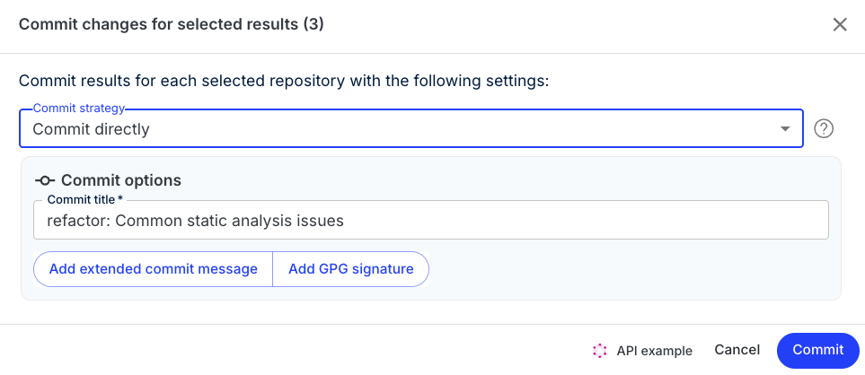

# Quick Start: Running your first recipe

To help orient you to Moderne, let's walk through how to run a [recipe ](https://docs.openrewrite.org/v1beta/recipes)on some open source projects that we have imported into Moderne.

In this guide, we will:

* [ ] ****[**Login with GitHub**](running-your-first-recipe.md#step-2-sign-in-with-github)****
* [ ] ****[**Find a recipe to run**](running-your-first-recipe.md#step-4-selecting-a-recipe)****
* [ ] ****[**Filter the recipe to only run on specific repositories**](running-your-first-recipe.md#step-5-selecting-repositories)****
* [ ] ****[**Run a recipe**](running-your-first-recipe.md#step-6-running-a-recipe)****
* [ ] ****[**Examine the results**](running-your-first-recipe.md#step-7-viewing-results)****
* [ ] ****[**Commit the changes**](running-your-first-recipe.md#step-8-creating-a-branch-and-pull-request)****

## Step 1: Go to [public.moderne.io](https://public.moderne.io/) and _login_

## Step 2: Sign in with GitHub

The first time you sign in to Moderne through GitHub, you will be presented with an authorization prompt for a few permissions to help enhance your experience.


For a better understanding of the permissions requested, please see [GitHub Permissions](../references/github-permissions.md#oauth-permission).


<figure><figcaption>
GitHub permission request
</figcaption></figure>

## Step 3: Navigate to the recipe catalog

After you've logged in and granted the appropriate permissions, you'll arrive at the [Moderne home page](https://public.moderne.io/). To explore the catalog of recipes, click on `Catalog` on the left side of the screen:

<figure><figcaption>
Moderne home page
</figcaption></figure>

This will take you to a page that lists all of the recipe categories:

<figure><figcaption>
Moderne recipe catalog
</figcaption></figure>

## Step 4: Select a recipe

Let's find a good recipe to start from to help illustrate how to search across multiple repositories.

1. From the [Catalog ](https://public.moderne.io/catalog)page, click on [Java ](https://public.moderne.io/catalog/org.openrewrite.java)from the list of categories.
2. Select the [Cleanup ](https://public.moderne.io/catalog/org.openrewrite.java.cleanup)sub-category.
3. Click on the [Common static analysis issues](https://public.moderne.io/catalog/org.openrewrite.java.cleanup) recipe.

## Step 5: Select specific repositories

By default, all of the repositories are selected. Let's change that so we only run our recipe on the OpenRewrite repositories. &#x20;

1. Click on the _Select Repositories_ button.
2. Click on the `<<` arrows at the bottom to clear the selected repositories. 
3. Press the _Add Filter_ button.
4. Enter _openrewrite_ in the text box.                                          
5. Press the `>>` arrows at the top to select all of the OpenRewrite repositories.
6. You should now see all of the OpenRewrite repositories listed under _Selected repositories.___
7. Click anywhere outside of the filter box to confirm your selection.

## Step 6: Run the recipe

Click _Dry Run_ to start the recipe. You might be asked for additional GitHub permissions after you click this button.

On the results page, you will see a summary of your recipe criteria and an indication of progress.

Each result shows the number of files searched and how many changes were detected.

To see the proposed changes, click on either the  button under `Actions` or the name of the repository (e.g. _openrewrite/rewrite_).

## Step 7: View the results

The resulting diff allows you to preview the changes from the recipe before you decide what you want to do.

If you're unsure why something changed, you can click on the three dots (`...`) at the top right of any file and select `Why did this change?`

For instance, in the above example, `= false` was removed due to the [Explicit initialization rule](https://public.moderne.io/recipes/org.openrewrite.java.cleanup.ExplicitInitialization).&#x20;

## Step 8: Commit your changes

Once you've confirmed you want to make the changes, the next course of action is to commit everything.&#x20;

In the results view, select the repositories you want to commit and then click _Commit Selected_.

This will open a prompt that allows you to select different actions such as committing directly, opening a pull request, etc.

&#x20;

From this prompt, you can customize either the _Branch Name_ or the _Commit Message_ to match the contributing guidelines of a particular repository.


You will need to have [specific permissions](https://docs.moderne.io/references/github-permissions) depending on the commit strategy you decide to go with.


## Step 9: 🎉 Profit
