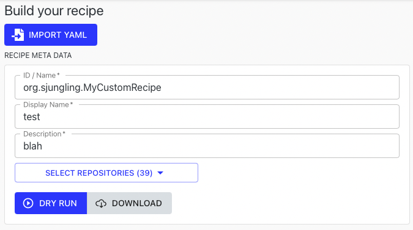

# Creating your own recipes with Builder

Moderne provides the ability to create custom recipes from our existing recipe catalog through _Recipe_ _Builder._

The Recipe Builder allows you to:

1. Import declarative recipes authored in YAML.
2. Export declarative recipes as YAML and include them in your project.
3. Remix existing recipes and configurations to meet your goals.

Let's build a custom recipe!

## Step 1: Import an example recipe

Let's start with a simple recipe to import.


```text
type: specs.openrewrite.org/v1beta/recipe
name: org.your_user_name.MyCustomRecipe
displayName: My custom recipe
description: Find instances of List.
recipeList:
  - org.openrewrite.java.search.FindTypes:
      fullyQualifiedTypeName: java.util.List
      checkAssignability: true
```


1. Click _Import YAML_ to open form
2. Paste in the contents of the recipe above.

   

3. Click _import_

   

4. Observe the _Recipe List_ now contains our `FindTypes` recipe and configuration

## Step 2: Change options

Once we have imported a recipe from YAML, we can make further modifications before running the recipe.

1. Click the _Settings_ button \(Gear\) next to `Find Types` to open the recipe editor.
2. Change `java.util.List` to `java.util.Set`
3. Click _Update_
4. Observe in the _Recipe Preview_ on the right side that the recipe configuration updated.

## Step 3: Confirm repository selection

In the _Recipe Meta Data_ form you can select which repositories to run the recipe against.

## Step 4: Run Recipe

Click _Dry Run_ to execute your custom recipe.

