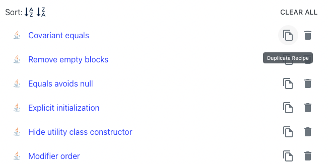

# Creating your own recipes with Builder

Moderne provides the ability to create your own custom recipes from our existing recipe catalog through _Recipe_ _Builder._ The Recipe Builder allows you to:

* Import declarative recipes authored in YAML
* Export declarative recipes as YAML and include them in your project
* Remix existing recipes and configurations to meet your goals

Let's build a custom recipe!

Step 1: Import an example recipe

