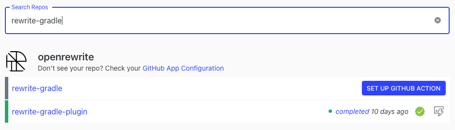

# Importing projects from GitHub

To start performing analysis or code transformations on your projects, Moderne.io integration through our GitHub App and Action. Once connected and configured, your repositories are analyzed through our GitHub Action and imported into Moderne.io.

## Installing the GitHub App

### Step 1: Go to the _My Organizations & Repositories_ page

Click on the _Configure_ link on the left-hand navigation.

### Step 2: Check Moderne.io GitHub App installation status

Click _Add Organization_ to install the GitHub App into one or more of your GitHub organizations and repositories.

### Step 3: Install the Moderne Ingest Action

Select a repository you would like to analyze or transform and click _Set up GitHub Action_.

### Step 4: Create a GitHub Secret using the access token

1. Click _Click to Generate Token_ in the dialog and copy the access token
2. Click on the link in the dialog to go to a repositories' _New Secrets_ form.
3. Enter `MODERNE_API_ACCESS_TOKEN` for the _Secret Name_
4. Paste in the access token from the dialog into the _Value_ field
5. Click _Add Secret_
6. Return to the dialog on Moderne.io and click _Continue_

### Step 5: Install the Moderne Ingest GitHub Action

Click \_Add `moderne-ingest.yml` button. This action automatically creates a new GitHub Action workflow in the repository. After `moderne-ingest.yml` is installed in the repository, the Ingest process analyzes your code and imports it into Moderne.io.

## Adding GitHub Action

