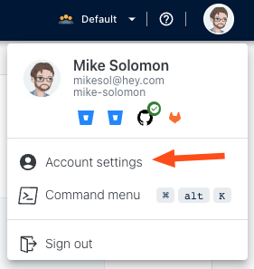

# Token management

You can create Personal Access Tokens (PATs) for interacting with the GraphQL API.

## Viewing your access tokens

### Step 1: Go to the account menu

In the top right-hand corner of the app, click on your profile avatar and select _Account Settings_

### Step 2: View the list of any existing tokens

You From [https://public.moderne.io/settings/access-token](https://public.moderne.io/settings/access-token)

## Creating an access token

### Step 1: Go to the _Access Token_ tab from the _Account Settings_ page

### Step 2: Name your token


Use the name of the token to distinguish it from other tokens.


### Step 3: Click _Generate_

### Step 4: Copy your token to your clipboard

## Revoking an access token

From the _Access Token_ page, click _Delete_ next to the token you wish to revoke.

## Limitations

* Personal access tokens do not retain roles that are granted to your user account. Actions that require roles (deploying recipes and uploading ASTs) will fail as forbidden if attempted with an access token.
