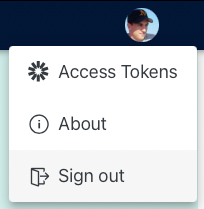
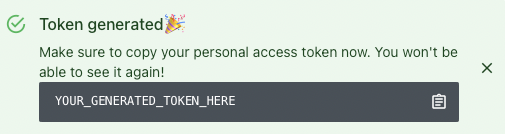

# Token Management

Moderne.io offers the ability to Personal Access Tokens \(PATs\) that can be used to directly interface with the Moderne.io GraphQL API.

## Viewing your access tokens

### Step 1: Go to the account menu

In the top right-hand corner of the app, click on your profile avatar and select _Access Tokens_

### Step 2: View list of any existing tokens

You From [https://app.moderne.io/settings/tokens](https://app.moderne.io/settings/tokens) 

## Creating an access token

## Deleting an access token

