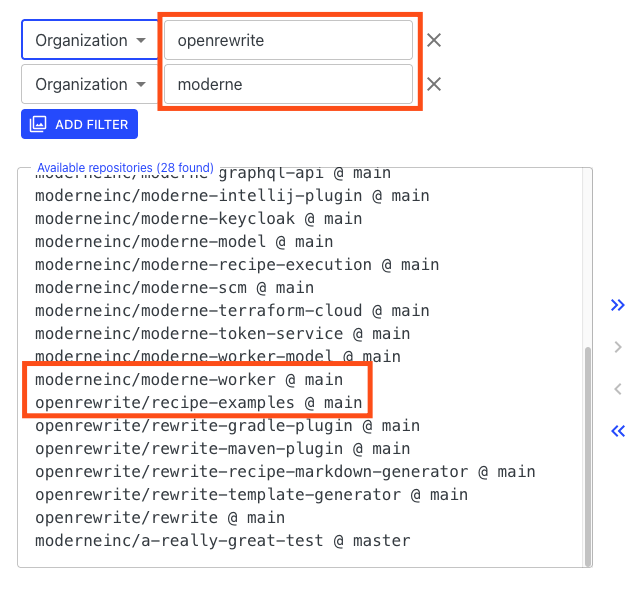
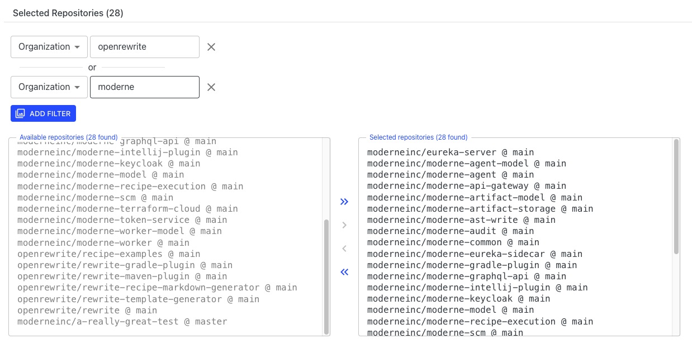

# Managing repository groups

When running recipes in Moderne, it's a good idea to filter them to run on a select group of repositories you care about so that you get relevant results more quickly. In filtering these recipes, many people have found that they wanted to create multiple groups of repositories that they can easily switch between. Both of these issues can be solved by using repository groups.

To help you get started with repository groups, in this guide you will learn:

* [How to create a repository group](managing-repository-groups.md#how-to-create-a-repository-group)
* [How to modify or delete an existing repository group](managing-repository-groups.md#how-to-modify-or-delete-existing-repository-groups)
* [How to Export repository groups JSON](managing-repository-groups.md#how-to-export-repository-groups-json)

## How to create a repository group

1.  In the top right corner of the Moderne home page, you will see some text to the left of your avatar that says `Default`:

    
2.  If you click on that, the repository group menu will appear:

    
3.  Press `Create a repository group`. You will be taken to the repository group creation page:

    
4. At the top, you should enter a descriptive name for the group. This will be the identifier you'll see when you go to select which group you want to run a recipe on.
5.  Once you've entered a name, it's time to select the repositories you want to be included in this group. You can filter which repositories to add to your group by pressing the `Add Filter` button.

    * Please note that you can add more than one filter. If you do, the filters are additive — meaning that if you select both `openrewrite` and `moderne`, you will get all repositories that belong to either one of those organizations:

    
6.  When you've finished adding filters, press the `>>` arrows in the middle of the screen to confirm your selection:

    
7.  Next, click on the `Save` button in the bottom right to create the group. You will be redirected to a page that displays all of your repository groups:

    
8.  Now, when you go to run any recipe, you can click on the group name in the top right corner of the screen to select which repository group you want to run the recipe on:

    

## How to modify or delete existing repository groups

1.  From any page, click on the text to the left of your avatar:

    
2.  This will make the repository group menu appear:

    
3.  Click on `Manage Repository Groups`. You will be redirected to the repository group page:

    
4. To modify a repository group, press the wrench icon under actions.
5. To remove a repository group, press the trash can icon under actions.

## How to export repository groups JSON

1.  From any page, click on the text to the left of your avatar:\
    \

    <figure><figcaption></figcaption></figure>

2. This will make the repository group menu appear:

<figure><figcaption></figcaption></figure>

3\. Click on `Manage Repository Groups`. You will be redirected to the repository group page:\

<figure><figcaption></figcaption></figure>

4\. You can then export them individually or you can export all of the repository groups defined.&#x20;

* To export an individual group, click the triple dots on the group you wish to export and then click on `Export repository group` from the menu. A `.json` file will be downloaded containing this single group.
* To export all of the repository groups, click the `Export ALL` link. A `.json` file of all your groups will be downloaded.

<figure><figcaption></figcaption></figure>

## Additional information

Repository groups are saved locally in your browser. This means that no one else in your organization or team will be able to see the groups you've created. Likewise, if you switch to a different computer or browser, your groups will not exist there.
