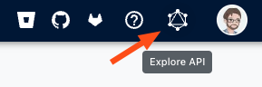
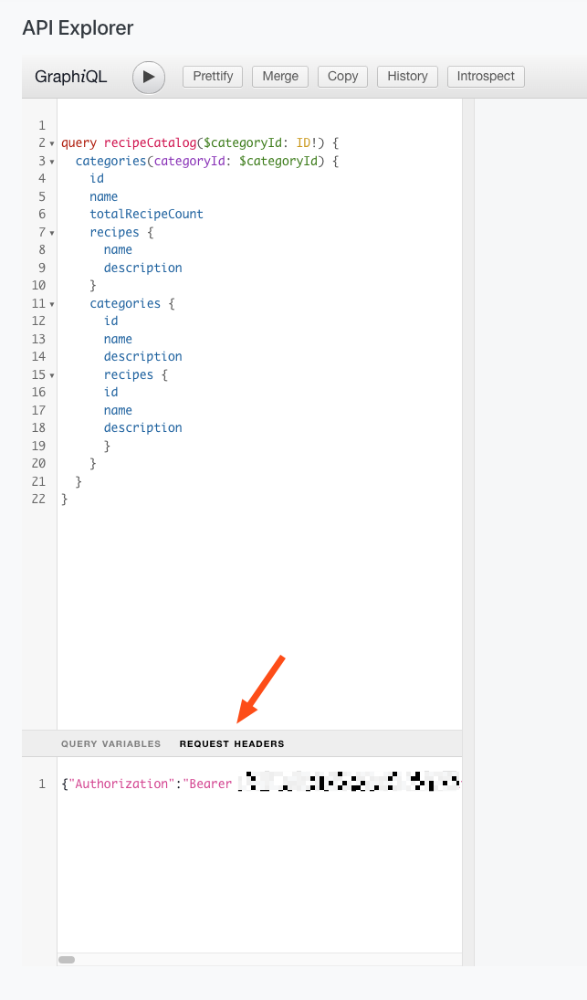

# Moderne Tokens

There are three types of tokens used throughout the Moderne platform: 

1. [A JSON Web Token (JWT) that is created when a user logs in to Moderne](#login-token)
2. [A personal access token used for programmatically accessing the Moderne GraphQL API](#personal-access-tokens)
3. [An OAuth token used for interacting with Source Code Management systems (SCMs)](#source-code-management-scm-oauth-token)

In this doc, you can find detailed information about each of these.

## Login Token

When a user logs in to the Moderne platform, a JWT is created for them by Keycloak. This token is then used by the UI to authenticate against various Moderne APIs for things like displaying recipe categories. 


This token _is not_ used for accessing or viewing source code. That is done via the [SCM Token](#source-code-manager-scm-token)


Users can find this token by clicking on the GraphQL icon in the top right corner of the Moderne platform once they are logged in:

From there, at the bottom of the GraphQL Explorer, there is a `request headers` tag that includes this token:

This token can be used to make general GraphQL API calls. Please note, though, that it is preferable to create a [Personal Access Token](#personal-access-tokens) (PATs) for interacting with the APIs as PATs do not expire.

### Permissions

This token is used in combination with an Identity Provider (IDP) to determine access for users. The IDP configuration maps specific users to specific permissions in Moderne (such as an admin role). 

What this means is that the JWT itself _does not_ have a concept of a "role". Rather, a user must be configured as an admin in the IDP in order for them to have admin permissions in Moderne (which grants access to things like agent configurations, repositories, and audit logs). Likewise, if a user has their admin permissions revoked in the IDP, the token can not be used for admin related functionality in Moderne.

### Expiration

Login tokens expire after one hour.

## Personal Access Tokens

Personal access tokens are used to make queries against the [Moderne GraphQL API](https://api.public.moderne.io/). 

### Permissions

These tokens **do not** have a role associated with them. That means that users can't do things like view agent configurations, delete repositories, or view the audit logs. These tokens are, effectively, the same thing as a [login token](#login-token) for users who are not admins.

### Expiration

Personal access tokens do not expire. If you want to revoke them, please follow [these instructions](/references/create-api-access-tokens.md#how-to-revoke-an-access-token).

### Further reading

## Source Code Management (SCM) OAuth Token

In order for users to see or interact with source code, an SCM token needs to be created. These tokens are created when a user clicks on one of the SCM logos in the top right corner of the screen OR when an action is performed that requires this token such as viewing a diff or committing code.

These SCM OAuth tokens are stored in association with a user, so if a user logs out and logs back in, that token remains until it expires. 

If an SCM token is currently valid, a user can use their [PAT](#personal-access-tokens) or [JWT](#login-token) to interact with the SCM.

### Permissions

SCM tokens will have different permissions depending on the source code manager used and what the user has allowed or not. 

### Expiration

SCM tokens expire after 8 hours. 