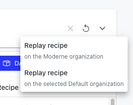

# Platform changelog

UI v10.132.1 (2024/07/25)

* Bug fixes and other improvements.

### UI v10.132.0 (2024/07/25)

In this release we have made various improvements to the new builder to increase clarity and productivity.

* Since adding controls such as **add**, **edit**, **delete** to the tree view ([v10.124.0](https://docs.moderne.io/releases/changelog#ui-v10.124.0-2024-06-20)) we found some users enjoy primarily using the tree view to compose recipes so we want to allow users to move this view to the main content window.  There is now a new layout swap icon to swap the 3D topology view and the tree view:

<figure><figcaption></figcaption></figure>

* We received feedback that the options were hard to discover.  We have begun to address this by making the options panel auto open when the selected recipe has options and also auto expand to fit more options before having to scroll.  Note the options have moved to the lower right now:\
  .png>)
* We found that some users were not aware of the recipe menu and the options available there so we have made the button more visible by adding a label:\
  

### UI v10.131.0 (2024/07/22)

* improve builder tree font on large displays

### UI v10.130.0 (2024/07/18)

*   In the builder there is now a new menu item **Edit as YAML**\
    This will open a text editor with the current recipe's yaml to edit:\


    <figure><figcaption></figcaption></figure>
* In the builder you can now edit nest recipe details

### UI v10.129.0 (2024/07/16)

* Bug fixes and other improvements.

### UI v10.128.4 (2024/07/11)

* Bug fixes and other improvements.

### UI v10.128.3 (2024/07/10)

* Bug fixes and other improvements
  * In combination with other backend changes we now expose more data tables when running composite recipes. Find more information on the latest visualization package [here](https://github.com/moderneinc/moderne-visualizations-misc/blob/main/CHANGELOG.md).

### UI v10.128.2 (2024/07/09)

* Bug fixes and other improvements.

### UI v10.128.1 (2024/07/07)

* Bug fixes and other improvements.

### UI v10.128.0 (2024/07/03)

* use animated icon for loading-like statuses

### UI v10.127.0 (2024/06/28)

* Builder improvements:
  * add expand/collapse all buttons:\
    .png>)

### UI v10.126.1 (2024/06/28)

* Bug fixes and other improvements.

### UI v10.126.0 (2024/06/27)

* Builder improvements:
  * To improve nested precondition clarity we have changed the color of the expanded dashed line when expanding a precondition:\
    .png>)

UI v10.125.2 (2024/06/26)

* Bug fixes and other improvements.

### UI v10.125.1 (2024/06/26)

* Bug fixes and other improvements.

### UI v10.125.0 (2024/06/26)

* In order to demonstrate how complete an impact analysis or set of changes is, we have added results for all repositories to the recipe run results, this now includes repositories for which we have no LST ingested into the platform.

<figure><figcaption><p>Recipe result with No LST ingested</p></figcaption></figure>

### UI v10.124.1 (2024/06/23)

* Bug fixes and other improvements.

### UI v10.124.0 (2024/06/20)

*   We have added dynamic controls to tree items in the tree view of the new builder. These controls will appear when interacting with the tree items:\\

    <figure><figcaption></figcaption></figure>

### UI v10.123.0 (2024/06/17)

* add empty state message to builder open dialog

### UI v10.122.0 (2024/06/13)

* Bug fixes and other improvements.

### UI v10.121.2 (2024/06/12)

* Bug fixes and other improvements.

### UI v10.121.0 (2024/06/11)

* In the new builder we have improved the default recipe ID only in private customer tenants. The new default ID will be based off the user's email. Example:
  * `jsmith@superco.com` -> `com.superco.jsmith.Untitled`
  * `j.smith@superco.ai` -> `ai.superco.j_smith.Untitled`
*   The new builder now supports adding preconditions to any recipe node.\
    \
    Preconditions are recipes that run before the current list of recipes. When a recipe is used as a precondition, any file that it would make a change to is considered to meet the precondition. When more than one recipe is used as a precondition, all of them must make a change to the file for it to be considered to meet the precondition.

    Only when all preconditions are met will the recipes in the recipe list be run.

    \
    _For more information, please see our_ [_preconditions documentation_](https://docs.moderne.io/user-documentation/how-to-guides/preconditions)_._\
    \
    Preconditions can be added via a new button:\
    .png>)\
    or when adding a recipe by toggling this check box:\
    .png>)\
    \
    Preconditions show up as a different color node in the 3D scene and highlighted in the tree view:\\

    <figure><figcaption></figcaption></figure>

### UI v10.120.0 (2024/06/04)

* include bearer token with share curl from graphiql editor

### UI v10.119.0 (2024/06/03)

*   When selecting subtrees in the new builder other nodes are now deemphasized to improve visual clarity of the selection:

    <figure><figcaption></figcaption></figure>

### UI v10.118.0 (2024/05/31)

* add more visual improvements to builder
* add support for quick filter + column filter on organizations repositories grid

### UI v10.117.0 (2024/05/30)

* Grids will now show more context regarding pagination:\
  
* In the new builder the tree view has been improved visually to increase clarity and now has a new auto scroll mechanic which should be more consistent than the previous:\
  .png>)
* In the new builder the scene control buttons have been redesigned and relocated to the lower left of the scene:\
   (1) (1) (1) (1).png>)

UI v10.116.0 (2024/05/23)

* Bug fixes and other improvements.

### UI v10.115.0 (2024/05/21)

* update various menu styles

### UI v10.114.0 (2024/05/18)

We have added a new move to fit camera control to the new builder. This will automatically move the camera location and angle to fit the whole custom recipe into the scene.\


### UI v10.113.0 (2024/05/17)

The new recipe builder now has a new greeting card when no custom recipe is loaded. We hope this will better help newer users start on their recipe authorship journey.\
.png>)

### UI v10.112.1 (2024/05/16)

* Bug fixes and other improvements.

### UI v10.112.0 (2024/05/15)

The new recipe builder now auto saves progress and there is a new indicator to signal when the current work is being saved to your local IndexedDB.

<figure><figcaption></figcaption></figure>

### UI v10.111.1 (2024/05/15)

* Bug fixes and other improvements.

### UI v10.111.0 (2024/05/14)

#### Building recipes in Builder V2

The beta of the new builder has added controls to allow for the construction of recipes. You can now use the new builder to explore and customize the full depth of composed recipes.

<figure><figcaption></figcaption></figure>

Adding marketplace recipes all happens now within the new Builder experience. This prevents users from having to excessively navigate when composing a custom recipe. Additionally, the new Builder supports importing recipe(s) from Yaml, running custom recipes, and exporting a custom recipe to the necessary Yaml docs. Lastly, you can now save multiple custom recipes.

### UI v10.110.0 (2024/05/09)

* Bug fixes and other improvements.

### UI v10.109.0 (2024/05/08)

* Bug fixes and other improvements.

### UI v10.108.0 (2024/05/07)

* Bug fixes and other improvements.

### UI v10.107.0 (2024/05/03)

* Bug fixes and other improvements.

### UI v10.106.0 (2024/05/02)

* add create and retrieve organizations examples
* allow creating user repositories from the repositories page
* Draft not supported in Bitbucket Cloud helper text

### UI v10.105.0 (2024/04/30)

* Update text for upgrades and migrations

### UI v10.104.0 (2024/04/24)

* add QUEUED\_RATE\_LIMITED commit status

### UI v10.103.0 (2024/04/23)

* Bug fixes and other improvements.

### UI v10.102.0 (2024/04/20)

* Bug fixes and other improvements.

### UI v10.101.0 (2024/04/18)

* Bug fixes and other improvements.

### UI v10.100.0 (2024/04/16)

* Bug fixes and other improvements.

### UI v10.99.0 (2024/04/12)

* admin users view

### UI v10.98.0 (2024/04/11)

* add Share curl button to graphql explorer to copy graphql request as curl
* add csharp logo support

### UI v10.97.0 (2024/04/08)

* Bug fixes and other improvements.

### UI v10.96.0 (2024/04/04)

* Bug fixes and other improvements.

### UI v10.95.0 (2024/03/29)

* Bug fixes and other improvements.

### UI v10.94.0 (2024/03/29)

* Bug fixes and other improvements.

### UI v10.93.0 (2024/03/29)

* Bug fixes and other improvements.

### UI v10.92.0 (2024/03/28)

* organizations tile with refresh organizations button

### UI v10.91.0 (2024/03/26)

* Bug fixes and other improvements.

### UI v10.90.0 (2024/03/22)

* Bug fixes and other improvements.

### UI v10.89.0 (2024/03/21)

* Bug fixes and other improvements.

### UI v10.88.0 (2024/03/20)

* Bug fixes and other improvements.

### UI v10.87.0 (2024/03/20)

* add more logo support

### UI v10.86.1 (2024/03/18)

* Bug fixes and other improvements.

### UI v10.86.0 (2024/03/15)

* Bug fixes and other improvements.

### UI v10.85.0 (2024/03/15)

* add API example to search page

### UI v10.84.1 (2024/03/14)

* Bug fixes and other improvements.

### UI v10.84.0 (2024/03/12)

* Bug fixes and other improvements.

### UI v10.83.2 (2024/03/12)

* Bug fixes and other improvements.

### UI v10.83.1 (2024/03/12)

* Bug fixes and other improvements.

### UI v10.83.0 (2024/03/12)

* Bug fixes and other improvements.

### UI v10.82.0 (2024/03/11)

* reporting issue to moderne is now an email template

### UI v10.81.0 (2024/03/08)

* Bug fixes and other improvements.

### UI v10.80.0 (2024/03/06)

* Bug fixes and other improvements.

### UI v10.79.0 (2024/03/06)

* display last updated timestamp on upgrade and migration cards
* incorporate organization ids into dev center URL path

### UI v10.78.1 (2024/03/06)

* Bug fixes and other improvements.

### UI v10.78.0 (2024/03/05)

* add api example with options for individual visualizations

### UI v10.77.1 (2024/03/04)

* Bug fixes and other improvements.

### UI v10.77.0 (2024/03/01)

* add ability to download datatables as JSON

### UI v10.76.0 (2024/03/01)

* Bug fixes and other improvements.

### UI v10.75.0 (2024/02/28)

* Bug fixes and other improvements.

### UI v10.74.0 (2024/02/27)

* Bug fixes and other improvements.

### UI v10.73.0 (2024/02/26)

* Bug fixes and other improvements.

### UI v10.72.0 (2024/02/26)

* Bug fixes and other improvements.

### UI v10.71.0 (2024/02/26)

* Bug fixes and other improvements.

### UI v10.70.0 (2024/02/24)

* visualization width now adjusts when window is resized.

### UI v10.69.0 (2024/02/24)

* Bug fixes and other improvements.

### UI v10.68.1 (2024/02/23)

* Bug fixes and other improvements.

### UI v10.68.0 (2024/02/22)

* Bug fixes and other improvements.

### UI v10.67.0 (2024/02/22)

* add more logo support
* add text editor form input

### UI v10.66.0 (2024/02/20)

* add storybook category
* add support for picnic and refaster

### UI v10.65.1 (2024/02/17)

* Bug fixes and other improvements.

### UI v10.65.0 (2024/02/16)

* Bug fixes and other improvements.

### UI v10.64.0 (2024/02/16)

* add jest logo
* add ng and lodash logos

### UI v10.63.0 (2024/02/15)

* Bug fixes and other improvements.

### UI v10.62.0 (2024/02/14)

* add more js catorgy logos

### UI v10.61.0 (2024/02/14)

* add more logo support

### UI v10.60.1 (2024/02/13)

* Bug fixes and other improvements.

### UI v10.60.0 (2024/02/09)

* add user filter for recipe runs

### UI v10.59.0 (2024/02/09)

* Bug fixes and other improvements.

### UI v10.58.0 (2024/02/08)

* Bug fixes and other improvements.

### UI v10.57.0 (2024/02/07)

* add common filters

### UI v10.56.0 (2024/02/06)

* add download dismiss x
* support date range filter

### UI v10.55.0 (2024/02/05)

* add infinite scrolling to audit logs

### UI v10.54.0 (2024/02/04)

* Bug fixes and other improvements.

### UI v10.53.0 (2024/02/02)

* Bug fixes and other improvements.

### UI v10.52.1 (2024/02/02)

* Bug fixes and other improvements.

### UI v10.52.0 (2024/02/01)

* add date range filter

### Organizations GraphQL changes (2024/02/01)

A new query `allOrganizations` has been added to the organizations service schema to allow our customers to define parent organizations that do not contain repositories.\
This new schema and implementation **will need to be added** to your organizations service to enable this sort of hierarchy. You can find the latest schema implementation [here](https://github.com/moderneinc/moderne-organizations).\
\
Example hierarchy from our public tenant.

<figure><figcaption><p>Note that <code>Open Source,</code> <code>Netflix + Spring + Apache</code> and <code>Netflix + Spring</code> organizations are parent organizations that are defined without repositories.</p></figcaption></figure>

### UI v10.51.0 (2024/01/31)

* preserve column size, order, and visibility to URL `state` hash on change

### UI v10.50.0 (2024/01/30)

* add copy mod cli command
* add `notContains` operator to Audit Log event columns

### UI v10.49.0 (2024/01/27)

* recipe source and lst source information on agents feat/org dash mock 2

### UI v10.48.0 (2024/01/26)

* make infinite scroll

### UI v10.47.0 (2024/01/26)

* Bug fixes and other improvements.

### UI v10.46.0 (2024/01/25)

* Bug fixes and other improvements.

### UI v10.45.0 (2024/01/24)

* Bug fixes and other improvements.

### UI v10.44.1 (2024/01/23)

* Bug fixes and other improvements.

### UI v10.44.0 (2024/01/22)

* Bug fixes and other improvements.

### UI v10.43.2 (2024/01/22)

* Bug fixes and other improvements.

### UI v10.43.1 (2024/01/19)

* Bug fixes and other improvements.

### UI v10.43.0 (2024/01/19)

* Bug fixes and other improvements.

### UI v10.42.0 (2024/01/18)

* Bug fixes and other improvements.

### UI v10.41.1 (2024/01/16)

* Bug fixes and other improvements.

### UI v10.41.0 (2024/01/15)

* Bug fixes and other improvements.

### UI v10.40.0 (2024/01/12)

* Bug fixes and other improvements.

### UI v10.39.0 (2024/01/10)

* add index url column to deploy table
* add system theme aware login

### UI v10.38.0 (2024/01/09)

* Bug fixes and other improvements.

### UI v10.37.0 (2024/01/08)

We have made changes to how recently viewed activity is discovered. Previously we had 3 different pages for view previous recipes runs, commit jobs, and visualization runs:

<figure><figcaption><p>Previous recent pages</p></figcaption></figure>

Each of these pages would show only the individual user's activity.\
\
We are now providing a comprehensive view of these activities in one single Activity page:

<figure><figcaption><p>The new activity view shows activity across an organization</p></figcaption></figure>

\
Here you can see **the most recent activities performed on the selected Organization**. This view will improve how users and teams collaborate. For more information see our [activity view docs](https://docs.moderne.io/user-documentation/getting-started/activity-view).

### UI v10.36.0 (2024/01/06)

* allow downloads to continue while navigating around the app.

### UI v10.35.2 (2024/01/05)

* Bug fixes and other improvements.

### UI v10.35.1 (2024/01/04)

* Bug fixes and other improvements.

### UI v10.35.0 (2024/01/03)

* Bug fixes and other improvements.

### UI v10.34.1 (2024/01/02)

* Bug fixes and other improvements.

### UI v10.34.0 (2023/12/29)

* Bug fixes and other improvements.

### UI v10.33.0 (2023/12/29)

* expose git provenance and operating system information on repository details

### UI v10.32.1 (2023/12/28)

* Bug fixes and other improvements.

### UI v10.32.0 (2023/12/27)

* add search tips for ai search when enabled.
* add reload current recipes with latest version to examples. Show caret with API examples

### UI v10.31.0 (2023/12/22)

* remove need for keycloak logout screen

### UI v10.30.0 (2023/12/20)

We updated the login screen to improve visibility:

Previous:

<div data-full-width="true">


</div>

New:\\

<figure><figcaption></figcaption></figure>

### UI v10.29.0 (2023/12/18)

* Bug fixes and other improvements.

### UI v10.28.1 (2023/12/15)

* Bug fixes and other improvements.

### UI v10.28.0 (2023/12/15)

* Add tile to agents page for PyPi configuration
* add loading indication when paginating audit logs.

### UI v10.27.0 (2023/12/14)

* user organizations

### UI v10.26.0 (2023/12/14)

* enable AI assisted search by default
* add mergeability column to the commit job table

### UI v10.25.0 (2023/12/13)

* Bug fixes and other improvements.

### UI v10.24.2 (2023/12/12)

* Bug fixes and other improvements.

### UI v10.24.1 (2023/12/09)

* Bug fixes and other improvements.

### UI v10.24.0 (2023/12/08)

#### Recipe builder layout changes

On the heels of adding support for preconditions, it was time to give the _Recipe Builder_ a little update to the layout.

<figure><figcaption><p>Recipes and Preconditions are now displayed in a grid to optimize content display on screen.</p></figcaption></figure>

<figure><figcaption><p>Editing your custom recipe metadata has been moved into a dialog to prioritize the recipes and YAML.</p></figcaption></figure>

<figure><figcaption><p>Updating recipe options are now accessible through expanding the row details panel.</p></figcaption></figure>

### UI v10.23.0 (2023/12/08)

* Bug fixes and other improvements.

### UI v10.22.1 (2023/12/06)

* Bug fixes and other improvements.

### UI v10.22.0 (2023/12/06)

#### Recipe preconditions

Through the _Recipe Builder_ customers can now define _precondition_ recipes that will run ahead of the recipe lists. The recipe list will only be run on repositories that included results from the _precondition._

<figure><figcaption><p>To add a precondition recipe to your custom recipe, you can use the <em>Add as precondition</em></p></figcaption></figure>

Once a precondition has been added, it will appear as a new tab on the _Recipe Builder_ page

<figure><figcaption></figcaption></figure>

* add icon support for processing status

### UI v10.21.1 (2023/12/04)

* Bug fixes and other improvements.

### UI v10.21.0 (2023/12/02)

* preserve the recipe options used when navigating back

### UI v10.20.0 (2023/12/01)

* Bug fixes and other improvements.

### UI v10.19.0 (2023/11/30)

* add visualization id for easy reference
* add tooltip to queue position column cells to help understand the workers' queues

### UI v10.18.0 (2023/11/30)

We have added category logo support for the new LaunchDarkly recipes ( `rewrite-launchdarkly`)

<figure><figcaption></figcaption></figure>

### UI v10.17.0 (2023/11/28)

We added a hint to the search results popover with the intention of increasing users awareness of the ability to quickly navigate to recipes (up/down then enter) or to the full page search results (enter) with keyboard navigation alone.\\

<figure><figcaption></figcaption></figure>

### UI v10.16.4 (2023/11/23)

* Bug fixes and other improvements.

### UI v10.16.3 (2023/11/22)

* Bug fixes and other improvements.

### UI v10.16.2 (2023/11/21)

* Bug fixes and other improvements.

### UI v10.16.1 (2023/11/21)

* Bug fixes and other improvements.

### UI v10.16.0 (2023/11/21)

* Bug fixes and other improvements.

### UI v10.15.2 (2023/11/20)

* Bug fixes and other improvements.

### UI v10.15.1 (2023/11/20)

* Bug fixes and other improvements.

### UI v10.15.0 (2023/11/20)

* add opt-in for AI search

### UI v10.14.0 (2023/11/18)

* add for new line support

### UI v10.13.1 (2023/11/18)

* Bug fixes and other improvements.

### UI v10.13.0 (2023/11/17)

* use datatable name for download file

### UI v10.12.0 (2023/11/16)

#### Recipe details fall clean-up

We have improved the organization and layout of recipe details to make better use of space and prioritize the presentation of running recipes.

<figure><figcaption></figcaption></figure>

* Bug fixes and other improvements.

### UI v10.11.0 (2023/11/16)

* visualization marketplace

### UI v10.10.0 (2023/11/15)

* add percentage of completion to actively running recipes

### UI v10.9.2 (2023/11/15)

* Bug fixes and other improvements.

### UI v10.9.1 (2023/11/13)

* Bug fixes and other improvements.

### UI v10.9.0 (2023/11/10)

* use radio control for organization selection

### UI v10.8.0 (2023/11/10)

* link to recipe from recipe run results summary
* async repo details

### UI v10.0.0 (2023/11/02)

<figure><figcaption><p>so fresh and so clean</p></figcaption></figure>

**We have a new look!**

We started to encounter pain points with our previous design:

* Navigation was split across the top bar and side bar
* Long organization / repository group titles could be truncated

Unified Sidebar Navigation: All navigation elements are now consolidated into a single, intuitive side bar, simplifying the user experience and reducing the cognitive load.

Elimination of Top Bar: Removing the top navigation bar frees up valuable screen real estate, allowing for more content to be displayed and making it easier for users to focus on their work.

### UI v9.177.0 (2023/10/30)

* determine ability to deploy artifacts based on new ACL

### UI v9.176.1 (2023/10/24)

* Bug fixes and other improvements.

### UI v9.176.0 (2023/10/24)

feat/add-yielded-state

### UI v9.175.0 (2023/10/20)

* add support for showing skipped connectivity

### UI v9.174.0 (2023/10/19)

**New left navigation icons**

We have plans to overhaul the iconography to create better visual consistency and clarity.

This journey begins this version with a rework of the left navigation icons:\
 (1) (1) (2) (1).png>)

### UI v9.173.0 (2023/10/17)

* Bug fixes and other improvements.

### UI v9.172.0 (2023/10/12)

* Bug fixes and other improvements.

### UI v9.171.2 (2023/10/12)

* Bug fixes and other improvements.

### UI v9.171.1 (2023/10/11)

* Bug fixes and other improvements.

### Agent v0.150.0 (2023/10/11)

*   Tool connectivity validation on startup. Now when Agent starts it tests the connectivity of each tool configured (maven, artifactory, SCM provider). If connectivity fails for any configured tool, the Agent will fail to start and the logs will display which configuration failed to connect. \\

    ```log
    ***************************
    APPLICATION FAILED TO START
    ***************************

    Description:

    Binding to target org.springframework.boot.context.properties.bind.BindException: Failed to bind properties under 'moderne.agent' to io.moderne.agent.config.AgentConfiguration failed:

        Property: moderne.agent.bitbucket[0]
        Value: "BitbucketConfiguration(url=https://bitbucket.test/stash, alternateUrls=[ssh://bitbucket.moderne.nin:7999], ssh=null, skipSsl=false, valid=false)", 
        Reason: Connection verification errored with connection timed out: bitbucket.test/143.244.220.150:443; 
        nested exception is io.netty.channel.ConnectTimeoutException: connection timed out: bitbucket.test/143.244.220.150:443
            Verify configuration url and credentials.
    ```

### UI v9.171.0 (2023/10/10)

* show connection status of each tool in agents view

### UI v9.170.3 (2023/10/07)

* Bug fixes and other improvements.

### UI v9.170.2 (2023/10/07)

* Bug fixes and other improvements.

### UI v9.170.1 (2023/10/06)

* Bug fixes and other improvements.

### UI v9.170.0 (2023/10/05)

* add `organizationId` to commit job tables

### UI v9.169.0 (2023/10/04)

* add homebrew installation option for mod-cli

### UI v9.168.0 (2023/10/04)

* change marketplace banner

#### Optimizing recipe results and commit jobs

To improve the number of recipe results and commit jobs that can be viewed on the screen at a glance, we've re-organized the display of summary information about recipe runs and commit jobs into their own tab.

<figure><figcaption></figcaption></figure>

<figure><figcaption></figcaption></figure>

<figure><figcaption><p>New <em>Summary</em> tab on Commit job details page</p></figcaption></figure>

<figure><figcaption><p>Commit job <em>Summary</em> tab example</p></figcaption></figure>

### UI v9.167.1 (2023/10/03)

* Bug fixes and other improvements.

### UI v9.167.0 (2023/10/02)

* add mass close pull requests

### UI v9.166.0 (2023/09/27)

* download patch with patch download task.

### UI v9.165.2 (2023/09/26)

* Bug fixes and other improvements.

### UI v9.165.1 (2023/09/26)

* Bug fixes and other improvements.

### UI v9.165.0 (2023/09/26)

* Bug fixes and other improvements.

### UI v9.164.0 (2023/09/26)

* Bug fixes and other improvements.

### UI v9.163.1 (2023/09/26)

* Bug fixes and other improvements.

### UI v9.163.0 (2023/09/26)

* download cli from staging
* add recipe hover card to recent runs grid

### UI v9.162.0 (2023/09/23)

* Bug fixes and other improvements.

### UI v9.159.0 (2023/09/15)

* Bug fixes and other improvements.

### UI v9.158.3 (2023/09/14)

* Bug fixes and other improvements.

### UI v9.158.2 (2023/09/14)

* Bug fixes and other improvements.

### UI v9.158.1 (2023/09/14)

* Bug fixes and other improvements.

### UI v9.158.0 (2023/09/13)

* add tree data grid visualiztion support feat/merge commit
* add categories api example

### UI v9.157.0 (2023/09/12)

* add more notifications

### UI v9.156.0 (2023/09/11)

* add approve to the row-level actions on commit jobs
* add download notifications
* pull request status on commit jobs
* add notifications for artifact deploys

### UI v9.155.0 (2023/09/07)

* toggling datetime elements now changes default user setting

### UI v9.154.0 (2023/09/06)

* add recipe run priority to recent recipe run grid
* approve pull requests

### UI v9.153.0 (2023/09/02)

* Bug fixes and other improvements.

### UI v9.152.1 (2023/09/01)

* Bug fixes and other improvements.

### UI v9.152.0 (2023/08/31)

* replay visualizations with predefined prior options
* add date selector support for recipe input options

### UI v9.151.2 (2023/08/29)

* Bug fixes and other improvements.

### UI v9.151.1 (2023/08/29)

* Bug fixes and other improvements.

### UI v9.151.0 (2023/08/28)

* increase diff page size to `20` and selectively render large diffs
* include api url in graph sharing

### UI v9.150.0 (2023/08/25)

* Bug fixes and other improvements.

### UI v9.149.0 (2023/08/24)

* Bug fixes and other improvements.

### UI v9.148.0 (2023/08/24)

* add auto merge strategy option for github & gitlab
* add Share query option for graphql operations

### UI v9.147.0 (2023/08/23)

#### Tabs, tabs, tabs, tabs, yeah!

We've done a little tidying up on the recipe run result page. _**Visualizations**_ and _**Data tables**_ can now be accessed from the tabs at the top of the page. You'll find these tabs are also accessible from the respective pages for _Visualizations_ and _Data tables._

<figure><figcaption></figcaption></figure>

#### Add dropdown options to share button

 (1) (1) (1) (1) (1) (2).png>)

When sharing a recipe from the recipes details, you can now select whether or not to include your current organizations.

### UI v9.146.0 (2023/08/22)

* add sharing option to visualizations that produce data tables

#### Organization ID to the recent runs table

Now you can see which Organization a visualization was run on from the _Recent visualizations_ table.

 (1) (2).png>)

### UI v9.145.0 (2023/08/22)

* show options used

### UI v9.144.0 (2023/08/18)

#### View the CLI version.

Now you can see the latest version number of the CLI before downloading.

<div align="left" data-full-width="false">

<figure><figcaption></figcaption></figure>

</div>

#### Organization and group selector improvements

 (1) (1) (1) (1).png>)

* Highlighted search terms
* More flexible width and word wrapping when organization names are long.

### UI v9.143.0 (2023/08/16)

#### Dynamic forms for recipe options

We now support dynamic form fields for `List` or `string[]` options. Recipes that take a list of strings now have a new editor interface to improve the usability.

<figure><figcaption></figcaption></figure>

### UI v9.142.0 (2023/08/15)

* Bug fixes and other improvements.

### UI v9.141.0 (2023/08/15)

* Bug fixes and other improvements.

### UI v9.140.0 (2023/08/15)

* support visualization parameters

### UI v9.139.1 (2023/08/15)

* Bug fixes and other improvements.

### UI v9.139.0 (2023/08/11)

Pan/zoom controls and download options are now available for Visualizations.

*  (1) (1) (1) (1).png>)

### UI v9.138.0 (2023/08/10)

* add pagination support to visualization run repositories
* tooltip on results toolbar and disable commit option on Find only results.

### UI v9.137.0 (2023/08/08)

* recent visualizations

### UI v9.136.1 (2023/08/08)

* Bug fixes and other improvements.

### UI v9.136.0 (2023/08/08)

* Bug fixes and other improvements.

### UI v9.135.0 (2023/08/04)

* Bug fixes and other improvements.

### UI v9.134.0 (2023/08/04)

* add back to top action

### UI v9.133.2 (2023/08/04)

* Bug fixes and other improvements.

### UI v9.133.1 (2023/08/04)

* Bug fixes and other improvements.

### UI v9.133.0 (2023/08/04)

* Bug fixes and other improvements.

### UI v9.132.0 (2023/08/03)

* add recent visualization screen

### UI v9.131.0 (2023/08/02)

* indicate when data is missing on visualization

### UI v9.130.2 (2023/08/02)

* Bug fixes and other improvements.

### UI v9.130.1 (2023/08/02)

* Bug fixes and other improvements.

### UI v9.130.0 (2023/08/02)

* Bug fixes and other improvements.

### UI v9.129.0 (2023/08/01)

* cancel visualization run

### UI v9.128.0 (2023/08/01)

* data grid for visualization repositories.

### UI v9.127.0 (2023/07/31)

* Bug fixes and other improvements.

### UI v9.126.0 (2023/07/29)

* Bug fixes and other improvements.

### UI v9.125.0 (2023/07/28)

* add recipe run link in footer.
* recipe run visualization
* add available visualization for recipe runs
* operationalize visualizations

### UI v9.124.1 (2023/07/27)

* Bug fixes and other improvements.

### UI v9.124.0 (2023/07/27)

* add share option to rerun recipe items
* add support for multiple select recipe options
* add export paginated data grid

### UI v9.123.0 (2023/07/26)

* Bug fixes and other improvements.

### UI v9.122.0 (2023/07/26)

* add loading indicator for yaml from run id

### UI v9.121.0 (2023/07/24)

* Bug fixes and other improvements.

### UI v9.120.0 (2023/07/18)

* sort recipe results by worker

### UI v9.119.1 (2023/07/14)

* Bug fixes and other improvements.

### UI v9.119.0 (2023/07/14)

* Bug fixes and other improvements.

### UI v9.118.1 (2023/07/14)

* Bug fixes and other improvements.

### UI v9.118.0 (2023/07/12)

* Bug fixes and other improvements.

### UI v9.117.0 (2023/07/10)

* Bug fixes and other improvements.

### UI v9.116.0 (2023/07/07)

* add welcome banner to marketplace

### UI v9.115.0 (2023/07/07)

* remove home page and strengths tab

### UI v9.114.3 (2023/07/06)

* Bug fixes and other improvements.

### UI v9.114.2 (2023/07/05)

* Bug fixes and other improvements.

### UI v9.114.1 (2023/07/04)

* Bug fixes and other improvements.

### UI v9.114.0 (2023/07/04)

* Bug fixes and other improvements.

### UI v9.113.0 (2023/07/03)

* Bug fixes and other improvements.

### UI v9.112.1 (2023/07/01)

* add dependency resolution time and worker name to recipe run summary

### UI v9.112.0 (2023/06/29)

* Bug fixes and other improvements.

### UI v9.111.1 (2023/06/29)

* Bug fixes and other improvements.

### UI v9.111.0 (2023/06/28)

* Bug fixes and other improvements.

### UI v9.110.0 (2023/06/28)

* Bug fixes and other improvements.

### UI v9.109.0 (2023/06/27)

* Bug fixes and other improvements.

### UI v9.108.0 (2023/06/22)

* Bug fixes and other improvements.

### UI v9.107.1 (2023/06/21)

* Bug fixes and other improvements.

### UI v9.107.0 (2023/06/20)

* Bug fixes and other improvements.

### UI v9.106.5 (2023/06/20)

* Bug fixes and other improvements.

### UI v9.106.4 (2023/06/19)

* Bug fixes and other improvements.

### UI v9.106.3 (2023/06/19)

* Bug fixes and other improvements.

### UI v9.106.2 (2023/06/19)

* Bug fixes and other improvements.

### UI v9.106.1 (2023/06/19)

* Bug fixes and other improvements.

### UI v9.106.0 (2023/06/18)

* Bug fixes and other improvements.

### UI v9.105.2 (2023/06/17)

* Bug fixes and other improvements.

### UI v9.105.1 (2023/06/17)

* Bug fixes and other improvements.

### UI v9.105.0 (2023/06/16)

* Bug fixes and other improvements.

### UI v9.104.1 (2023/06/15)

* Bug fixes and other improvements.

### UI v9.104.0 (2023/06/15)

* Bug fixes and other improvements.

### UI v9.103.0 (2023/06/12)

* render skeleton when loading more results.
* set sort model with default sorting so it is clear what sorting is being applied by default.

### UI v9.102.1 (2023/06/09)

* Bug fixes and other improvements.

### UI v9.102.0 (2023/06/07)

* add bitbucket cloud authentication option for `public.*`

### UI v9.101.0 (2023/06/06)

* leverage notebook description provided by service

### UI v9.100.0 (2023/06/05)

* add javascript logo

### UI v9.99.1 (2023/06/02)

* Bug fixes and other improvements.

### UI v9.99.0 (2023/06/01)

* Bug fixes and other improvements.

### UI v9.98.0 (2023/05/30)

* add support for multiple auth providers through keycloak on multitenant

### UI v9.97.1 (2023/05/26)

* Bug fixes and other improvements.

### UI v9.97.0 (2023/05/25)

* prompt for confirmation when canceling recipe runs

### UI v9.96.2 (2023/05/25)

* Bug fixes and other improvements.

### UI v9.96.1 (2023/05/23)

* Bug fixes and other improvements.

### UI v9.96.0 (2023/05/19)

* add in support for downloading data-tables from visualizations where available

### UI v9.95.0 (2023/05/17)

* Bug fixes and other improvements.

### UI v9.94.0 (2023/05/16)

* Bug fixes and other improvements.

### UI v9.93.0 (2023/05/16)

* Bug fixes and other improvements.

### UI v9.92.2 (2023/05/11)

* Bug fixes and other improvements.

### UI v9.92.1 (2023/05/10)

* Bug fixes and other improvements.

### UI v9.92.0 (2023/05/10)

* Bug fixes and other improvements.

### UI v9.91.0 (2023/05/08)

* add jupyter output cell renderer

### UI v9.90.0 (2023/05/05)

* add support for `startAuth=true` QSP to initiate flow

### UI v9.89.2 (2023/05/03)

* Bug fixes and other improvements.

### UI v9.89.1 (2023/05/02)

* Bug fixes and other improvements.

### UI v9.89.0 (2023/05/01)

* Changes to how _Repository Groups_ are stored in your browser to resolve an issue where having multiple tabs open at the same time was causing newly created _Repository Groups_ to vanish as a result of a mismatch in state that was not synced between tabs.

### UI v9.88.2 (2023/05/01)

* Bug fixes and other improvements.

### UI v9.88.1 (2023/04/30)

* Bug fixes and other improvements.

### UI v9.88.0 (2023/04/28)

* Bug fixes and other improvements.

### UI v9.87.1 (2023/04/28)

* Bug fixes and other improvements.

### UI v9.87.0 (2023/04/26)

* Bug fixes and other improvements.

### UI v9.86.1 (2023/04/26)

* Bug fixes and other improvements.

### UI v9.86.0 (2023/04/25)

* Bug fixes and other improvements.

### UI v9.85.0 (2023/04/24)

* add progress bar to commit job summary

### UI v9.84.0 (2023/04/21)

#### Date time format preference added

In Account menu > Accessibility there is now an option for Date time format that will allow you to choose between `Relative time`, `Local time`, and `UTC time`.

<figure><figcaption></figcaption></figure>

Date time stamps can also be changed by simply clicking on them to cycle through the formats:

<figure><figcaption></figcaption></figure>

#### Replay YAML recipes

Custom yaml recipe runs can now be replayed. Now hitting replay on a custom recipe run summary will link to a new `/recipes/builder/[runId]` page. This page is similar to the `/recipes/builder` page however it will reflect the yaml recipe that was run making it possible to replay custom yaml recipe runs. This will also not disrupt your personal custom recipe.\\

<figure><figcaption></figcaption></figure>

#### Admin agent version notice

Admin users will now see a notice that can be dismissed whenever there is a new agent version available:\\

<figure><figcaption></figcaption></figure>

#### Additional changes

* add link to replay recipe to commit message and PR body
* display finished time for recipe runs and run history
* add import repository group support
* add axonframework logo
* add python logo
* adds api recipe run examples to yaml recipe builder
* various visual improvements

### UI v9.83.0 (2023/04/19)

#### Replaying recipes with organizations

If a recipe was run using an _Organization_ instead of a _Repository group_, you can now quickly click to replay the recipe using either the _Organization_ that was originally used or your currently selected _Organization / Repository group._



These items will take you back to the recipe details page where you can copy the URL and share.

#### Filtering audit logs

Audit logs can now be filtered across multiple columns and/or values.

<figure><figcaption></figcaption></figure>

* Add confirmation before creating a new recipe builder
* Add support for quarantining and un-quarantining multiple repositories at a time

### UI v9.82.0 (2023/04/17)

We've completed a change to move over queries for _Organizations_ and _Repositories_ to use a new paginated query to improve the performance of filtering and selecting repositories. As apart of this change we've changed how _Repository groups_ are managed. Previously we had a transfer list that customers could use to handle selection. With this recent version, we've moved to a filterable data grid of repositories.

<figure><figcaption></figcaption></figure>

### UI v9.81.1 (2023/04/14)

* Bug fixes and other improvements.

### UI v9.81.0 (2023/04/14)

* Bug fixes and other improvements.

### UI v9.80.3 (2023/04/12)

* Bug fixes and other improvements.

### UI v9.80.2 (2023/04/10)

* Bug fixes and other improvements.

### UI v9.80.1 (2023/04/01)

* Bug fixes and other improvements.

### UI v9.80.0 (2023/03/31)

* add API examples for generating and downloading admin reports

### UI v9.79.0 (2023/03/31)

* add support for downloading `.tar.gz` and `.zip` version of the cli

### UI v9.78.1 (2023/03/28)

* Fix issue where associated Agents were not showing on the Artifactory integration details table in the administrative _Agents_ screen.

### UI v9.78.0 (2023/03/28)

* add copy resulting lines to hunks
* Resolved bug that was setting all recipe runs from the UI to _Low_ priority. Recipe runs now use _Normal_ priority.

### UI v9.77.0 (2023/03/27)

* add more confirmation dialogues
* add ability to disable keyboard shortcuts

### UI v9.76.1 (2023/03/24)

* Bug fixes and other improvements.

### UI v9.76.0 (2023/03/24)

* add option for running recipes with low priority
* add filter to organzation and repository group selector menu

### UI v9.75.0 (2023/03/24)

* add administrative reports page to download usage reports

### UI v9.74.1 (2023/03/23)

* Bug fixes and other improvements.

### UI v9.74.0 (2023/03/23)

#### Recipe results

The _Data Tables_ button is now ever present on the page along side the familiar _Commit_ option. As a note the button will be disabled until a _Recipe run_ has completed.

<figure><figcaption></figcaption></figure>

_API examples_ button has been pulled up from a collapsable portion of the summary and into a more familiar and consistant place on the page.

<figure><figcaption></figcaption></figure>

The _Replay_ _recipe_ and _Cancel run_ buttons have been consolidated into one location on the screen in part to make room for the _Api example_ button.

<figure><figcaption></figcaption></figure>

#### Repository details

We've cleaned up the _Repository details_ screen to align with page titles on other pages as well as making the _API examples_ consistently located.

<figure><figcaption></figcaption></figure>

_Language composition_ chart now contains more colors to help distinguish various languages.

<figure><figcaption></figcaption></figure>

#### Moderne CLI

Now you can download a Zip archive of Moderne CLI tools.


#### Organizations

Users will not be prompted for confirmation before removing repository.

<figure><figcaption></figcaption></figure>

### UI v9.73.0 (2023/03/20)

* use totalRepositoriesInProgress from graphql

### UI v9.71.0 (2023/03/15)

* We have changed the name "Catalog" to "Marketplace" and given it a new icon. We hope the use of the word "Marketplace" reflects the community aspect of "Recipe" development.\
  .png>)
* Recipes can now have `maintainers` associated with them. This has been added to the graphQL API and the UI will render them in a special contributor's section on the recipe details page if present:\
  \
  

### UI v9.70.0 (2023/03/15)

* We have added operating system detection to custom tailor the user experience. The first place to use this is the CLI download dialogue which now will default the instruction set selected based on your operating system. This should reduce the confusion on what instruction to use.
* Various bug fixes and improvements

### UI v9.69.0 (2023/03/13)

### API Examples

We improved how we surface GraphQL API examples to make it easier to include multiple types of calls on a single page in one location where it's consistent to find

<figure><figcaption></figcaption></figure>

### UI v9.68.0 (2023/03/09)

* Try CLI `curl` example now uses URL from API Gateway
* Various bug fixes

### UI v9.67.0 (2023/03/09)

* Recipe results table now supports sorting by the four different marker count columns: info, debug, warn, and error.
* Recipe artifacts can now only be updated by those with the administrative rights within the UI.
* Various bug fixes.

### UI v9.66.0 (2023/03/08)

Now you can download the Moderne CLI from your SaaS Instance.

#### Recipe builder

We've rearranged a few of the buttons to make some actions clearer to the customer. _New Recipe_ took the place of the _Import YAML_ button, which was moved to the YAML preview. _New Recipe_ will reset the state for the Recipe builder so you can start on your new endevaours.

<figure><figcaption></figcaption></figure>

#### Recipe refresh

Spring is right around the corner and we've been doing a little bit of cleaning to make the recipe page cleaner and more consistent with the rest of the site.

<figure><figcaption></figcaption></figure>

#### Download the Moderne CLI

Go to the _Help_ menu → _Try Moderne CLI_

<figure><figcaption></figcaption></figure>

<figure><figcaption></figcaption></figure>

### UI v9.65.0 (2023/03/03)

In our continual efforts to integrate the new organizations service we have redesigned the top navigation bar. You will now find plenty of space for displaying longer organization and repository group names as well as improvements to all drop downs menus. \\

<figure><figcaption></figcaption></figure>

Notably, source management control connections have been moved into a new profile section in the avatar dropdown. Additionally, the redesigned top navigation bar is more accommodating of smaller device screens.

### UI v9.64.0 (2023/03/02)

Up until now repository groups have been stored in the users' localStorage on their browser. If users had large amounts of groups with large lists of repositories they would approach the limits of their localStorage (typically 5-10 Mb).\
\
We have now switch to using IndexedDB for this purpose which will not run into these same thresholds and provides faster reads and writes for large objects.

### UI v9.63.0 (2023/02/27)

The interactive origin icon now includes links:\\

<figure><figcaption></figcaption></figure>

We added some quality of life changes on various forms to have focus be automatically brought to the first field, for example when adding or editing a repository group.

### UI v9.62.0 (2023/02/24)

Improve support for organizations defined in thee organization service.

### UI v9.61.0 (2023/02/24)

We have added the ability to see repository origin details from the diff page via the interactive origin icon:\


GitHub links on recipe details for OpenRewrite recipes ([v9.35.0](changelog.md#recipe-source-links)) previously linked to a search interface to find the origin on GitHub. These have now been updated with direct links to the source.

### UI v9.60.0 (2023/02/23)

All file downloads have been standardized to use our async download manager for a more consistent experience.\\

### UI v9.59.0 (2023/02/23)

Add more support for organization as we shift focus on the new organization service:

* UI will now use commit options defined by the organization service
* Recipe runs in the UI and GraphQL can now use organization ID

We have also added recipe IDs to the list of recipes in the catalog to save time for those seeking them by preventing the need to drill down into each individual recipe details page.

### UI v9.58.0 (2023/02/16)

Optimize the UI's use of GraphQL queries.

### UI v9.57.0 (2023/02/15)

Added more data table driven Jupyter lite notebooks. Currently supported:

* org.openrewrite.maven.table.DependenciesInUse:
  * dependency-usage-violin.ipynb
  * dependency-usage.ipynb
* org.openrewrite.table.ParseFailures:
  * parse-failures.ipynb
* org.openrewrite.table.RecipeRunStats:
  * recipe-visit-all-performance.ipynb
  * recipe-visitor-performance.ipynb
* org.openrewrite.table.SourcesFileResults:
  * composite-recipe-results.ipynb

### UI v9.56.0 (2023/02/14)

Repository Groups has been refreshed. The global menu will now separate Organizations that are defined by either the Moderne Agent or your implementation of the Moderne Organization service and _Repository groups_ that are locally curated collections of repositories.

<figure><figcaption></figcaption></figure>

We've also added some visual touches to better group icons in the top navigation as well as providing you with a quick visual cue of the current selection.

### UI v9.51.0 (2023/02/01)

A new option has been added to the Pull Request form to allow or disallow the reopening of closed pull requests.

<figure><figcaption></figcaption></figure>

`See how to run against the API` link has been added to the commit form as well. This will show the GraphQL for the action.

<figure><figcaption></figcaption></figure>

### UI v9.46.0 (2023/01/21)

Data tables: Recipes can now emit tabular data according to a schema that they define.

<figure><figcaption></figcaption></figure>

<figure><figcaption></figcaption></figure>

### UI v9.44.0 (2023/01/21)

#### Repository quick view

Hover over the info icon to quickly view more information including the commit that the artifact was generated from and when it was ingested into the platform.

<figure><figcaption></figcaption></figure>

### UI v9.41.0 (2023/01/17)

#### Removal of the default repository group `All`

Moderne SaaS no longer provides a default named repository group called `All` that represents all ingested repositories. Customers can [define their own named repository group](../administrator-documentation/moderne-platform/how-to-guides/agent-configuration/configure-organizations-service.md) through Agent to provide this functionality. See the example below.

```json
{
  "All": {
    "name": "All",
    "repositories": null
  },
  "Default": {
    "name": "Default",
    "repositories": [...]
  }
}
```

### UI v9.39.0 (2023/01/11)

#### Actions moved to left

Actions for grids are now presented on the left-hand side of the table.

<figure><figcaption></figcaption></figure>

### UI v9.37.0 (2023/01/10)

#### Bitbucket Cloud support

Repositories hosted on Bitbucket Cloud are now supported. This [requires additional configuration through your agent](../administrator-documentation/moderne-platform/how-to-guides/agent-configuration/configure-bitbucket-cloud-to-agent.md#prerequisites).

<figure><figcaption></figcaption></figure>

### UI v9.35.0 (2022/12/30)

#### Admin token management

We have added the ability for admins to view and revoke Moderne personal access tokens of any user. There is now a new Access tokens page under the admin navigations:\
\\

#### Improved keyboard shortcuts

While addressing some keyboard shortcuts that were reported to conflict with certain browsers we overhauled the keyboard shortcuts to primarily use single key commands and added more. These commands will not fire if the focus of the browser is in a text input or any control like field. Additionally, we have provided a new short cut cheat sheet that is activated with `shift`+`?`


#### Recipe source links

We want to improve users and recipe authors' experience finding source code for a particular recipe. We have added on the recipe details pages a link on OpenRewrite recipes that will use a specialized GitHub search query to find the source. We have plans to expand this functionality in the future.\\

<figure><figcaption></figcaption></figure>

### UI v9.31.0 (2022/12/16)

#### Support for adding applicability tests to builder recipes

The "Add to builder" button now has an additional drop-down to support adding the current recipe to the builder as an applicability test.

These tests currently come in two variants:

* `singleSource` - The custom recipe will _**only be run on those source files**_ that would have been changed by _**all**_ `singleSource` test recipes.
* `anySource` - The custom recipe will run on _**all**_ _**source files**_ if there would have been a change from all `anySource` tests. Not all `anySource` tests have to change the _**same**_ file; as long as there would be one change from each test then the custom recipe would be run.

<figure><figcaption><p>For more information on applicability test see the <a href="https://docs.openrewrite.org/authoring-recipes/recipe-conventions-and-best-practices#use-applicability-tests">OpenRewrite documentation</a>.</p></figcaption></figure>

### UI v9.29.0 (2022/12/14)

#### Show error when recipe no longer exists

<figure><figcaption></figcaption></figure>

### UI v9.28.0 (2022/12/10)

#### Origin and base branch added to commit results table

<figure><figcaption></figcaption></figure>

### UI v9.26.0 (2022/12/09)

#### Patch and commit are now disabled if there are no results to commit

<figure><figcaption></figcaption></figure>

### UI v9.25.0 (2022/12/08)

#### Add error details to errors in diffs

An Error card shows the code where the error was discovered, the error message, and now a new section called details that will show any extra details like stack traces. Additionally, the copy button in the upper right of the card now copies all sections as a string of Markdown to your copy buffer.

<figure><figcaption></figcaption></figure>

### UI v9.24.0 (2022/12/02)

#### Create a new repository group from existing

<figure><figcaption></figcaption></figure>

#### Add see how to run GraphQL to more locations

This has been added to the following pages:

* recent commits
* commit jobs
* organizations
* workers
* quarantine

<figure><figcaption></figcaption></figure>

### UI v9.23.0 (2022/11/30)

#### Ignore whitespace changes

You can now hide whitespace changes from diffs via the _Settings_ menu

<figure><figcaption></figcaption></figure>

### UI v9.21.0 (2022/11/18)

#### Viewing result diffs

Now it's even easier to filter down the result set to only those diffs that include errors from the result diff menu bar.

<figure><figcaption></figcaption></figure>

### UI v9.15.0 (2022/11/03)

#### Status page

We have added a status page \`/status\` that displays a general summary of the site's health.

<figure><figcaption></figcaption></figure>

#### Enhanced marker info

Recipe run results summary view now has the option to view the number of markers returned for each repository.

<figure><figcaption></figcaption></figure>

This can also be viewed in the extended summary.

<figure><figcaption></figcaption></figure>

### UI v9.14.0 (2022/11/02)

#### Named repository groups

Previously repository selection was performed at recipe run time. Now users will create named repository groups that will drive what repositories recipes are run against and what repositories are shown on the Organizations page. The group in use will be visible in the header. Groups can also be created from the repositories of a recipe run. There is also a `All` group by default that is all the repositories of the tenant. The named groups are initially stored in the browser's local storage.

**Running a recipe**


**Repository group menu**

<figure><figcaption></figcaption></figure>

From this menu, users can change their selection, create a new grouping, or navigate to the management page for all their groups.

**Repository group creation**

<figure><figcaption></figcaption></figure>

**Organization view filtered**

<figure><figcaption></figcaption></figure>

As shown above, only repositories defined in the user's repository group are displayed.

**Recipe run group creation**


New groups can be created from the selected rows of a recipe run.

### UI v9.11.0 (2022/10/24)

#### Only show error hunks

In addition to using Moderne for running recipes, it is also common to use the built-in debugging tools for recipe development.

<figure><figcaption></figcaption></figure>

Previously, the `Only show errors` a toggle would limit diffs to only those containing errors. For large files with multiple hunks of changes, this behavior still required recipe authors to manually search for the errors that surfaced.\
\
We have changed this behavior so that `Only show errors` will now cause only the hunks with errors to render.

### UI v9.8.0

#### Commit job status

Previously the _Recent Commit Job_ page only reported the overall status of job completion. We now surface the number of successful, failed, or jobs with no changes.

<figure><figcaption></figcaption></figure>

### UI v9.7.0

#### More markers!

We have increased the types of markers we annotate and surface in the diff view of the UI. Previously the new markers will now render as squiggly lines with an icon. If there are additional details, it will allow you to click in to see those details:\
ou may have noticed search markers displaying like this:\\

<figure><figcaption></figcaption></figure>

<figure><figcaption></figcaption></figure>

In addition to search markers, we will render info/debug, warnings, and errors in a similar way:


.png>)


### UI v9.5.0

#### Improved recipe deployment

Deploying recipe artifacts now has an improved asynchronous experience. We've added the recipe artifact state and last deployment time to increase the visibility around the freshness of a recipe artifact.Notable changes to the Moderne Platform

<figure><figcaption><p>View recipe artifact state and last deployment time.</p></figcaption></figure>

### UI v9.4.0

#### Moderne update notice

<figure><figcaption><p>If there is a Moderne update in the middle of your browser session, you should now see a prompt to refresh your page to ensure you have the latest version available.</p></figcaption></figure>
