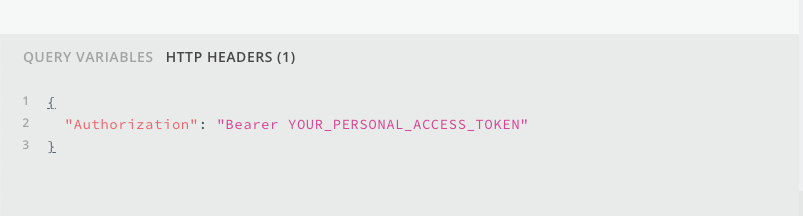

# Accessing the Moderne API

Moderne.io offers a GraphQL API at [https://api.public.moderne.io](https://api.public.moderne.io/) for customers to interact with through the usage of a personal access token.

Note: Personal access tokens do not retain roles that are granted to your user account. Actions that require roles (deploying recipes and uploading LSTs) will fail as forbidden if attempted with an access token.


If you want to write and test GraphQL queries, you can click on the GraphQL icon in the top middle of the UI or you go directly to [https://public.moderne.io/graphql](https://public.moderne.io/graphql).



## Prerequisites

* Create a [Moderne Personal Access Token](../references/create-api-access-tokens.md)

## Go to the Moderne API

* [https://api.public.moderne.io](https://api.public.moderne.io)

## Configure your access token

In the `HTTP Headers` pane of GraphQL Playground, enter your token for the `Authorization` header.

## (Optional) View the documentation

After you have configured your personal access token, you can click the _Docs_ tab on the right-hand side of the screen to explore the various Queries and Mutations offered by the API.

## 🚀 Start querying!
