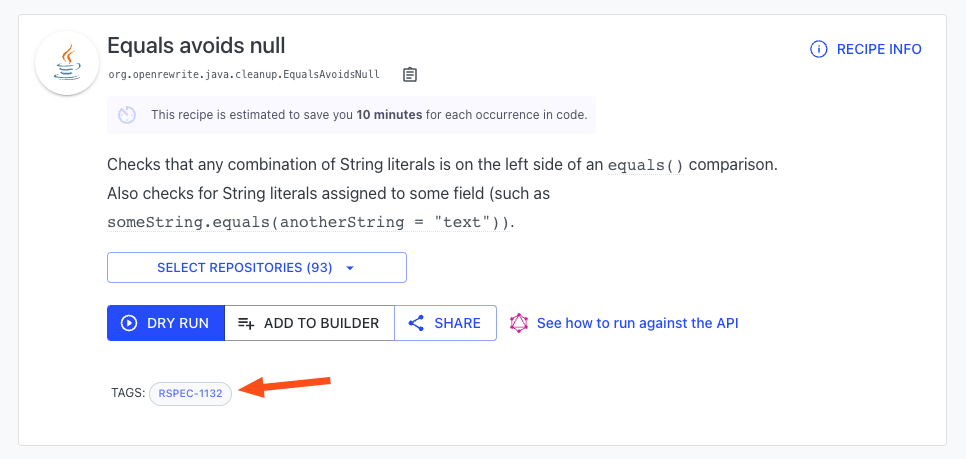

# Achieve and Maintain High Code Quality

Every programming language has a vast number of conventions and rules that make up "ideal" code. While some of these conventions are stylistic, others can help prevent significant bugs like Null Pointer Exceptions. Unfortunately, even for the most experienced developers, it's extremely difficult to keep track of all of these and to follow them diligently in code. 

Over the years, a variety of static analysis tools have been created to try and help, but these tools do not actually *fix* your code. Rather, they rely on developers to manually change every line that it warns about. If a new convention is standardized, this can easily result in thousands of lines that need to be changed across a vast number of repositories. 

Fortunately, this is another area where Moderne shines. Thanks to a [comprehensive Abstract Syntax Tree](/concepts/abstract-syntax-trees.md), Moderne can improve your code by doing things like resolving common static analysis issues or changing it to utilize best practices. Furthermore, for each change made, you can learn _why_ it was changed so that you and your team can write better code in the future.

To help you get a better understanding of how Moderne can help improve your code quality, this guide will:
* Walk you through running a recipe that fixes common static analysis issues
* Show you how to learn what is wrong with the code 

## Fixing Common Static Analysis Issues

Moderne's [Common static analysis recipe](https://public.moderne.io/recipes/org.openrewrite.java.cleanup.CommonStaticAnalysis) looks for and fixes over 50 different types of issues in your code, all of which you can easily enable or disable to meet your needs.

To get to this recipe:
* From the home page, click on `Catalog` in the top left corner. This will take you to the recipe catalog.
* From there, click on `Java` and then `Cleanup`.
* At the top you should see a recipe called `Common static analysis issues`. If you click on it, it will expand slightly. Click on `More details` to be taken to [this](https://public.moderne.io/recipes/org.openrewrite.java.cleanup.CommonStaticAnalysis) page:

    

### Running the recipe

The bottom half of the page lists all of the recipes that will be run as part of this analysis. You can click on the checkbox next to any of them to enable or disable that particular recipe from being run. For most of them, there is also a tag like `RSPEC-1234` which links out to a Jira issue that goes into much more detail about the rule being implemented. For instance, clicking on `RSPEC-2057` next to `Add serialVersionUID to a Serializable class when missing` will take you [here](https://sonarsource.atlassian.net/browse/RSPEC-2057).

When you're ready to run the recipe, select the repositories you wish to run on and then press `Dry Run`. You will then be redirected to a page that looks like this:

You can click on any of the repositories to look at the suggested changes and learn more about why the code is being changed. Some of these changes are rather complex, such as changing anonymous inner classes that contain only one method into lambdas: 

### Learning what's wrong with the code

If you want to learn more about _why_ the code is changing, you can press the three dots (`...`) in the top right-hand corner of any file and select `Why did this change?`:

This will display a list of all of the recipes that affected the selected file along with a sentence or two describing the rule in more detail:

If that explanation isn't enough, you can click on any of them to be taken directly to the recipe page. On most recipes, there are tags that link out to more comprehensive explanations about the rule. For instance, the `Equals avoids null` recipe links out to [RSPEC-1132](https://sonarsource.atlassian.net/browse/RSPEC-1132):

