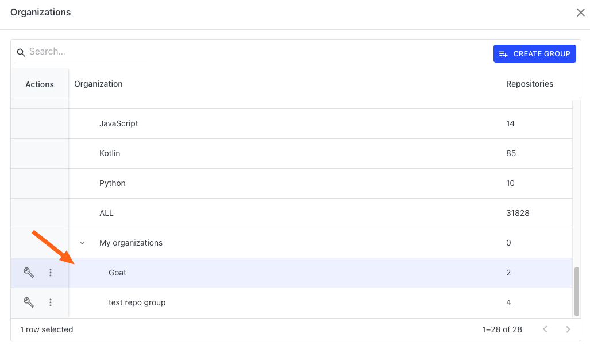

# Managing repository groups

When running recipes in Moderne, it's a good idea to filter them to run on a select group of repositories you care about so that you get relevant results more quickly. In filtering these recipes, many people have found that they wanted to create multiple groups of repositories that they can easily switch between. Both of these issues can be solved by using repository groups.

To help you get started with repository groups, in this guide you will learn:

* [How to create a repository group](managing-repository-groups.md#how-to-create-a-repository-group)
* [How to modify or delete an existing repository group](managing-repository-groups.md#how-to-modify-or-delete-existing-repository-groups)
* [How to Export repository groups JSON](managing-repository-groups.md#how-to-export-repository-groups-json)

## How to create a repository group

1. In the top left corner of the Moderne home page, you will see a box under the search box that says `Default`:

<figure><figcaption></figcaption></figure>

2. If you click on that, the organization and repository group menu will appear:

<figure><figcaption></figcaption></figure>

3. Press the `Create Group` button in the top right corner. You will be taken to the repository group creation page:

4. At the top, you should enter a descriptive name for the group. This will be the identifier you'll see when you go to select which group you want to run a recipe on.
5. Once you've entered a name for the group, it's time to select the repositories you want to be included in this group. You can use the search box to look for repositories that contain your search term anywhere in their origin, organization, name or branch.
6. When you've finished searching for the repositories you want in the group, you can select all of the repositories to add by clicking on the checkbox at the top or you can select individual repositories by clicking on the checkbox next to each repository.
7. Once you've selected all the repositories you want to be in the group, click on the `Save` button in the bottom right to create the group. You will be redirected back to the Organizations page. At the bottom of that page, you will find your repository groups:&#x20;

<figure><figcaption></figcaption></figure>

8. Now, when you go to run any recipe, you can navigate to the Organizations page and click on the group name to select which repository group you want to run the recipe on. Once selected, you should see the name of the group appear in the box back on the home page:

<figure><figcaption></figcaption></figure>

## How to modify or delete existing repository groups

1. From any page, click on the organization box under the search box:

<figure><figcaption></figcaption></figure>

2. This will take you to the list of organizations or repository groups to select:

<figure><figcaption></figcaption></figure>

3. To modify a repository group, scroll to the bottom of that page and click on the wrench icon next to the repository group you want to modify. You will be redirected to a page that allows you to select repositories:

<figure><figcaption></figcaption></figure>

4. To remove a repository group, scroll to the bottom of the page and click on the `...` icon. Then select `Delete repository group` and it will be removed.

## How to export repository groups JSON

Follow the same instructions as above, but instead of selecting "delete", select "export".

## Additional information

Repository groups are saved locally in your browser. This means that no one else in your organization or team will be able to see the groups you've created. Likewise, if you switch to a different computer or browser, your groups will not exist there.
