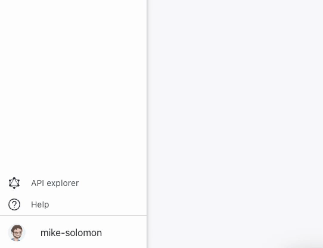

# Moderne platform search tips

In order to get the most out of the Moderne platform, it's a good idea to understand how you can effectively search for recipes.

Let's walk through some tips and tricks you might not be aware of when searching for recipes in Moderne.

## AI search

Traditionally, recipe searches in Moderne required exact word matches. For example, searching for `Common static analysis issues` required `common` or `static`. If you tried entering, `common stat`, you wouldn't get any results. This could be especially problematic if you didn't already know the exact name of the recipe or you wanted to discover new ones.

To help improve the user experience of finding and discovering recipes, Moderne **now offers AI search capabilities**.

### How to use AI search effectively

To get the most value out of AI search, you'll want to approach searching for recipes differently than you normally would. Instead of trying to enter an exact recipe name (which you can still do), you might consider:

* **Asking questions** such as, "How can I make my code more secure?"
* **Entering keywords** such as, "JUnit" or "Jakarta".
* **Expressing something you want to do** such as, "I want to upgrade Spring".
* **Entering tags for the recipe to search for** such as, `tags:"RSPEC-2204"` to find all recipes with the `RSPEC-2204` tag. Please note that the other fields mentioned in the [non-ai search tip](moderne-platform-search.md#non-ai-search-tips) will not work with AI enabled.

### How to enable or disable AI search

To toggle AI search, log in to Moderne, click your profile in the bottom-left, and click on the AI-assisted search button in the modal that appears:

## Non-AI search tips

When AI search is disabled, you can search for specific fields such as:

* `id` - the recipe id&#x20;
  * Example: `id:"org.openrewrite.staticanalysis.CommonStaticAnalysis"` (Requires quotes)
* `shortName` - the last part of the id&#x20;
  * Example: `shortName:"CommonStaticAnalysis"` (Requires quotes)
* `description` - the recipe description&#x20;
  * Example: `description:Resolve common static analysis issues discovered through 3rd party tools.` (Requires no quotes)
* `category` - the category in the recipe marketplace&#x20;
  * Example:  `category:Static analysis and remediation` (Requires no quotes)

Please note that in all of these cases you **cannot** have a space between the `:` and the start of the string you're looking for.
