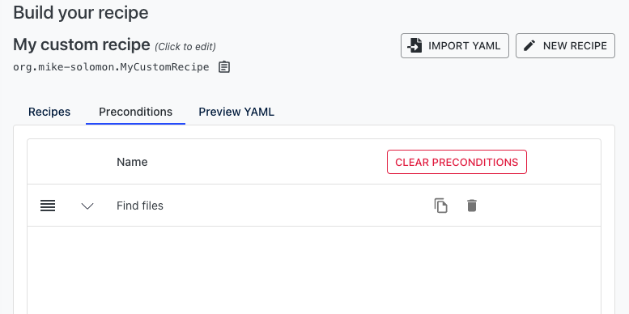
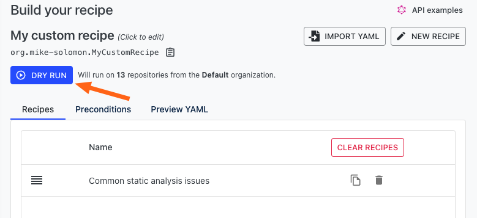

# How to use preconditions

When running recipes, there may come a time when you want to restrict which files the recipe runs against. For example, if your company has a large mono-repo, and you only work on part of it, you may want to run a recipe on _just_ that part. Similarly, if you are working on a security or best practice update, you may want to focus only on product code and not on tests.

This is what preconditions were designed for. They are a way of restricting where a recipe is run.

In this guide, we'll walk through how preconditions work and how you can use them in the Moderne platform.

## How preconditions work

Preconditions, at their core, are just recipes that run before the current list of recipes you're wanting to run. When a recipe is used as a precondition, any file that it would make a change to is considered to meet the precondition. When more than one recipe is used as a precondition, all of them must make a change to the file for it to be considered to meet the precondition.

Only when all preconditions are met will the recipes in the recipe list be run.


Changes made by preconditions are not included in the final result of the recipe. Changes made by preconditions are used only to determine if the recipe should be run.


### Example

To help clarify this, let's consider the case where you want to run a recipe against non-test files in a specific module in a mono-repo.

To meet this need, you would want two precondition recipes: [find files by source path](https://app.moderne.io/recipes/org.openrewrite.FindSourceFiles) and [find files that are likely not tests](https://app.moderne.io/recipes/org.openrewrite.java.search.IsLikelyNotTest).

The first precondition recipe could be provided with a path such as `mono-repo/your-team`. When that precondition recipe is run, it would step through every file in the mono-repo and "mark" every file that exists in the directory you specified. Then, the second precondition recipe would run and it, too, would step through every file and "mark" those that are likely not tests.

With the preconditions being done, the core recipe you're wanting to run will then step through the files and only make changes to the ones that were marked by _both_ of the preconditions. Please note that these marks _do not_ appear in the final results.

## How to use preconditions in the Moderne platform

From the [recipe marketplace](https://app.moderne.io/marketplace), find the recipe you'd like to use as a precondition. Once you've found it, click on the triangle drop-down next to the text `Add to builder` and select `Add as precondition`.

You will then be redirected to the [recipe builder page](https://app.moderne.io/recipes/builder).

If you want to add more preconditions, you can follow the same steps as above. After doing so, you'll want to select the recipe(s) you want to run (which will only update the files that have met the preconditions).

To do so, find the recipe you want to run and press `Add to builder`:

You'll then be redirected to the same [recipe builder page](https://app.moderne.io/recipes/builder). You can add more recipes to be run if you'd like. You can also update or remove the recipes and preconditions from this page.

When you're ready to run the recipe with the specified preconditions, press the `Dry run` button at the top of the page:

You've now successfully created and run a recipe with preconditions!&#x20;
