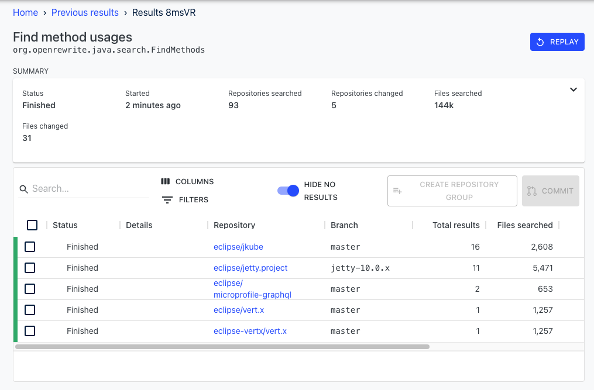
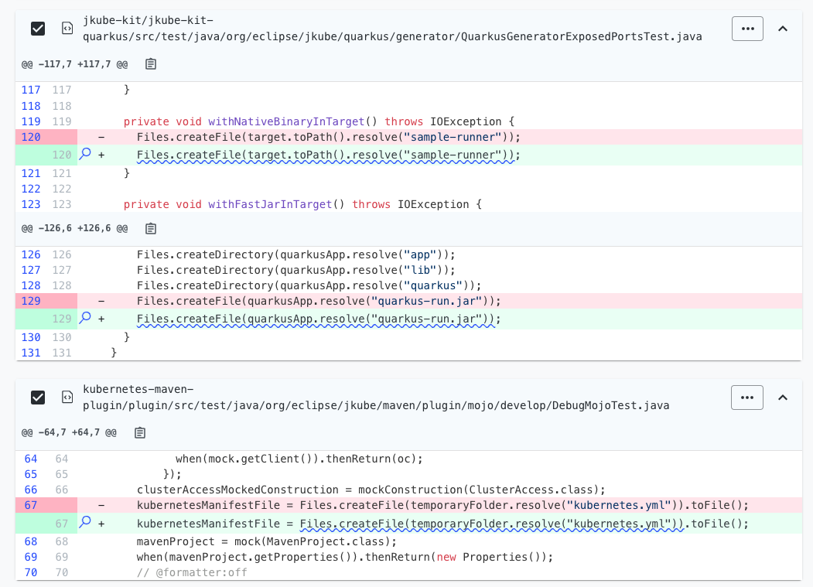
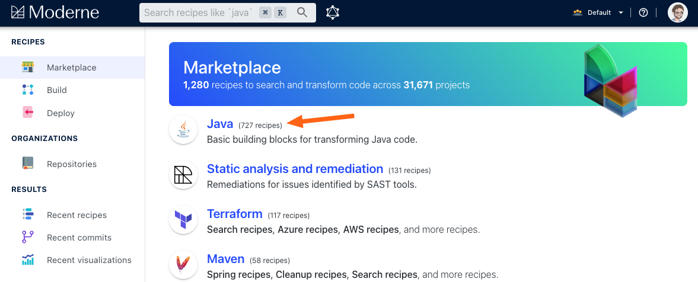
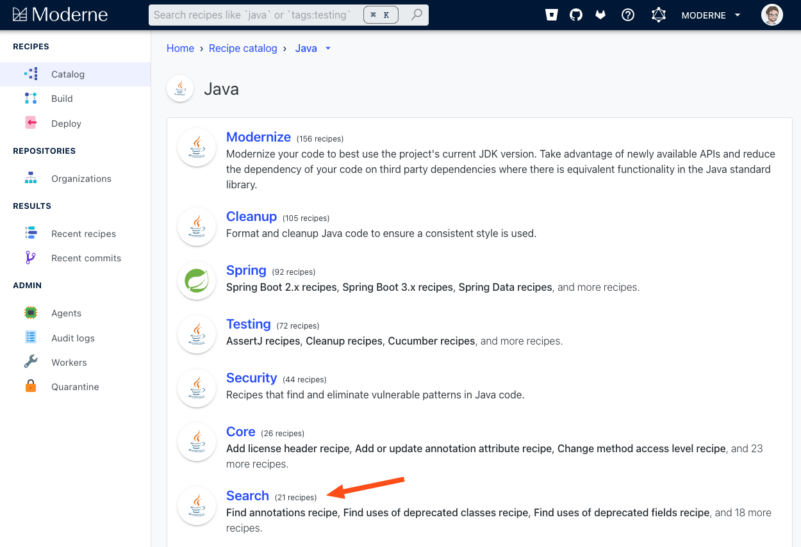

# Introduction to Type-Aware Code Search

Imagine you're an author of a Java library. You've defined an [abstract base class](https://docs.oracle.com/javase/tutorial/java/IandI/abstract.html) and you want to figure out if people are using a specific method defined in that class. It wouldn't be _too_ difficult to search in the repository where the class was defined, but what if there are hundreds or thousands of repositories that are potentially using it or some subclass of it? Searching for the method name might return thousands of irrelevant matches. A human would certainly struggle to do this search within a reasonable amount of time.

Fortunately, Moderne offers a robust solution to this problem: type-aware search recipes. Using these recipes you can quickly and correctly find things like classes, methods, or fields — even if they are named or imported in different ways. 

To help you get accustomed to Moderne's search capabilities, in this guide, we will:
* [Walk through an example of using a search recipe](#using-a-search-recipe)
* [Teach you how to find type-aware search recipes](#finding-type-aware-search-recipes)

## Using a search recipe

As an example, let's say that you are wanting to find all of the places where your team is using the `createTempFile` method from `java.io.File`. If you searched for `createTempFile` in GitHub, you might end up with a ton of irrelevant results as this is a fairly common method name. To find results that match the method name _and_ are from the correct library please follow these steps:

* From the [Java Search](https://public.moderne.io/catalog/org.openrewrite.java.search) page, scroll down and click on `Find method usages`. You will see this: 

    

* (Optionally) Filter down to a specific group of repositories:
  * Click on `Select Repositories`.
  * Press `Add Filter`. 
  * Select what you want to filter on such as `Organization`.
  * Type the text you want to search for such as `openrewrite`. You should see the repositories filter down as desired.
  * Press the `>>` button to select all of the filtered repositories. 
  * Click out of the modal to confirm your choices.

* Enter the fully qualified class name of `java.io.File` in the receiver type field.
* Enter the method name of `createTempFile` in the method name field.
* Enter `..` in the argument type field to denote that we want to search for any amount of arguments.
* Select `none` for the flow.
* Your window should look like: 

    

* Press `Dry Run` to begin the search. You will be redirected to a page that looks like:

    

* If you click on one of the repository names such as `openrewrite/recipe-examples`, you'll be taken into the code for that repository. Lines that match the search will be underlined and marked with a magnifying glass icon. These lines match the type that was specified in the search. This means that if any other `createTempFile` method was invoked, you wouldn't see those results here. Instead, you will see:

    

From there, you can make intelligent decisions about the code. For instance, maybe you'll see that there aren't too many instances of this and conclude that you can safely replace it with a new `createFile` method. Or maybe you just wanted to learn how other people use it to safely use it in your new class. Regardless of what you end up doing, you can be confident that you correctly and quickly found all of the places that use this method. 

## Finding type-aware search recipes

To discover all of the type-aware search recipes, please follow these steps:

* From the [Moderne Catalog](https://public.moderne.io/catalog), click on a category that relates to your needs such as `Java`:

    

* Click on `Search`:

    

* You will then arrive on a page that includes recipes for all of the different ways you can search for code:

    

* Click on whichever one you are interested in exploring. 
