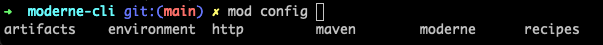

# Getting started with the Moderne CLI

The Moderne CLI is a command line tool that compliments the Moderne Platform and Moderne DX, enabling you to build [Lossless Semantic Tree](https://docs.moderne.io/concepts/lossless-semantic-trees) (LST) artifacts across many repositories and run recipes against all of them from your local machine. It also provides substantial benefits for creating and testing your own recipes.

To ensure you can use the Moderne CLI successfully, in this guide, we will walk you through everything you need to get started – from installation, to configuration, to examples demonstrating how to use it.

## Assumptions

* You can access [app.moderne.io](https://app.moderne.io/marketplace) or a private Moderne tenant
* You are familiar with running terminal commands

## Installation and configuration

_If you are in an air-gapped environment, please follow the_ [_instructions for installing and configuring the CLI in an air-gapped environment_](../how-to-guides/air-gapped-cli-install.md) _instead._

### Step 1: Download the CLI

1. Go to the [Moderne Platform](https://app.moderne.io/) (or your private tenant) and sign in.
2. Click on `Help` in the bottom left-hand corner and select the version of the CLI you want to download (Stable or Staging).
3. Either press the download button for your appropriate OS, or select the installation method in the provided table. We recommend using HomeBrew or Chocolatey if you have access to either.


4. If you chose to install the CLI without a package manager, you'll need to save it somewhere that your terminal can access. This could involve updating your `PATH` to point to a specific location – or this could involve putting it in a directory that's already on your `PATH` (such as a `/user/bin` directory).
   * Remember to refresh any open terminals if you modify the `PATH`.

If everything was configured correctly, you should be able to type `mod` into your terminal and see a list of commands:

<details>

<summary>mod command results</summary>

```bash
➜ mod

Moderne CLI 3.24.1

Usage:

mod [-h] [--version] [COMMAND]

Description:

Automated code remediation.

Options:

  -h, --help      Display this help message.
      --version   Display version info.
Commands:

  afterburner          (INCUBATING) Indexes built LSTs to accelerate recipe
                         execution.
  audit                (INCUBATING) Perform an audit of recent activity.
  build                Generates LST artifacts for one or more repositories.
  clean                Clean build and run artifacts produced by the CLI.
  config               Global configuration options that are required by some
                         CLI commands.
  devcenter            DevCenter operations.
  exec                 Execute an arbitrary shell command recursively on
                         selected repository roots.
  git                  Multi-repository git operations.
  log                  Manages a log aggregate.
  list                 Lists the repositories that can be built and published.
  monitor              (INCUBATING) Launches an HTTP server used to monitor the
                         CLI.
  publish              Publishes the LST artifacts for one or more projects.
  run                  Runs an OpenRewrite recipe locally on pre-built LSTS.
  run-history          Get information about the most recent recipe runs. This
                         will be transitioning to mod audit runs list
                         eventually. A deprecation notice will be added here
                         when we suggest adopting the alternative.
  study                Produces studies from OpenRewrite recipe data tables
                         locally.
  generate-completion  Generate bash/zsh completion script for mod.

MOD SUCCEEDED in (0.01s)
```

</details>

### Step 2: (Optional) Set up auto-completion in your terminal (Unix terminals only)

The Moderne CLI offers a command which generates a completion script that can be used to set up auto-completion in your terminal. After initializing this script, you can type `mod config` and press tab and then your terminal will offer suggestions for the sub-commands or parameters:



To configure this for the terminal you're using please enter the following command in your terminal:

```shell
source <(mod generate-completion)
```

Or, if you want to configure auto-completion so that it works for _every_ terminal instance you make, please update your `~/.zshrc` or `~/.bashrc` file and add this command to the bottom of it:

```shell
# The next line enables shell command completion for mod
source <(mod generate-completion)
```

### Step 3: Connect the CLI to Moderne

Connecting the CLI to Moderne is necessary to:

* Quickly sync the recipe catalog from Moderne to your local machine
* Download pre-built LSTs from Moderne so you can quickly run recipes locally
* Receive organizational information, so you can clone/build/run groups of repositories more easily

To set up this connection, you'll first need to create an access token for the CLI to use. Follow the below instructions to obtain a token and provide it to the CLI:

1. Navigate to [https://app.moderne.io/settings/access-token](https://app.moderne.io/settings/access-token)
   * If you're in a private tenant, replace `app.moderne.io` with your tenant URL
2. Enter a human-readable name for the token (e.g., cli-token)
3. Press `Generate`
4. Copy the `install on your workstation` command and paste it into your command line. This command should look something like:

```bash
mod config moderne edit https://app.moderne.io --token mat-YOUR_TOKEN_HERE
```

5. If everything worked, you should see a `MOD SUCCEEDED` message


### Step 4: Install recipes

With the Moderne connection established, you can download recipes to your local machine by running the following command:

```shell
mod config recipes moderne sync
```

This will grab _all_ of the recipes from the tenant you specified in `mod config` – so please expect this command to take a few minutes to download the recipes. 

## Using the CLI

With installation and configuration done, you're now ready to use the CLI. Let's walk through some things you might do with it. We recommend you follow along on your own machine to get a feel for how to use the CLI.

### Run recipes against many repositories at once

In this example, we will use the Moderne CLI to run the `DependencyVulnerabilityCheck` recipe against a group of open-source repositories.

1. From your terminal, create a directory to work in and `cd` into it:

```bash
mkdir -p $HOME/workshop
cd $HOME/workshop
```

2. For this exercise, we've prepared a list of open-source repositories for you to use. These repositories have been added to the Moderne Platform and put inside the `Default` organization. Clone these repositories by running the following command from inside your `workshop` directory.

<pre class="language-bash"><code class="lang-bash"><strong>mod git clone moderne . "Default"
</strong></code></pre>

<details>

<summary>You should see output similar to the following.</summary>

```bash
Moderne CLI 3.24.1

> Cloning organization from Moderne

Moderne has 14 repositories in Default
Listed all 14 repositories (0.27s)

> Cloning repositories

Clone output will be written to /Users/mikesol/workshop/./clone.log

> apache/maven-doxia@master
    + Cloned
> aws/amazon-documentdb-jdbc-driver@develop
    + Cloned
> awslabs/aws-saas-boost@main
    + Cloned
> finos/messageml-utils@main
    + Cloned
> finos/spring-bot@spring-bot-master
    + Cloned
> finos/symphony-bdk-java@main
    + Cloned
> finos/symphony-wdk@master
    + Cloned
> Netflix/ndbench@master
    + Cloned
> Netflix/photon@master
    + Cloned
> Netflix/ribbon@master
    + Cloned
> openrewrite/rewrite-recipe-bom@main
    + Cloned
> openrewrite/rewrite-sql@main
    + Cloned
> spring-projects/spring-data-commons@main
    + Cloned
> spring-projects/spring-petclinic@main
    + Cloned

Cloned 14 repositories. Synchronized DevCenter configuration. (42s)

MOD SUCCEEDED in (43s)
```

</details>

3. Confirm that your repositories were cloned correctly by running the following command:

```bash
ls  .  # For Mac/Unix users
dir .  # For Windows users
```

<details>

<summary>You should see output similar to the following.</summary>

```bash
Netflix         apache          aws             awslabs         clone.log       finos           openrewrite     spring-projects
```

</details>

4. Now that you have the repositories on your local machine, you'll need to build the [Lossless Semantic Trees](https://docs.moderne.io/concepts/lossless-semantic-trees) (LSTs) for them so that you can run recipes against them. Fortunately, since most of these repositories have their LSTs published to the Moderne Platform, the build operation will download the LSTs without you having to build them locally. This will save you a ton of time!


By default, the CLI is able to build LSTs for well-formed projects (i.e. projects that build well with a plain `mvn verify` or `gradle build`). At times, however, you may encounter a project that fails to build. This could be because of a hidden dependency on certain tooling, like NPM, or because specific dependencies or repositories are not available without additional configuration.

Through [mod config build](../cli-reference.md#mod-config-build) and other configuration options, you're typically able to get these LSTs built and ingested fairly quickly. For the purposes of this tutorial, however, let's ignore any projects that don't build and focus on running recipes against the ones that do.


```bash
mod build . --download-only
```

<details>

<summary>You should see output similar to the following.</summary>

```bash
Moderne CLI 3.24.1

> Selecting repositories

> apache/maven-doxia@master
> aws/amazon-documentdb-jdbc-driver@develop
> awslabs/aws-saas-boost@main
> finos/messageml-utils@main
> finos/spring-bot@spring-bot-master
> finos/symphony-bdk-java@main
> finos/symphony-wdk@master
> Netflix/ndbench@master
> Netflix/photon@master
> Netflix/ribbon@master
> openrewrite/rewrite-recipe-bom@main
> openrewrite/rewrite-sql@main
> spring-projects/spring-data-commons@main
> spring-projects/spring-petclinic@main
Selected 14 repositories (1s)

> Building LST(s)

> apache/maven-doxia@master
    Build output will be written to /Users/mikesol/workshop/apache/maven-doxia/.moderne/build/20240904083148-s7SDp/build.log
    > Download from Moderne
    + Downloaded LST /Users/mikesol/workshop/apache/maven-doxia/.moderne/build/20240904083148-s7SDp/maven-doxia-20240904124207407-ast.jar
    + Reported build metrics to Moderne
    + Cleaned 0 older builds.
> aws/amazon-documentdb-jdbc-driver@develop
    Build output will be written to /Users/mikesol/workshop/aws/amazon-documentdb-jdbc-driver/.moderne/build/20240904083148-s7SDp/build.log
    > Download from Moderne
    !  Failed to download the LST from Moderne. Proceeding to build the LST locally
    ! Skipping build because --download-only was specified
    + Reported build metrics to Moderne
    + Cleaned 0 older builds.
> awslabs/aws-saas-boost@main
    Build output will be written to /Users/mikesol/workshop/awslabs/aws-saas-boost/.moderne/build/20240904083148-s7SDp/build.log
    > Download from Moderne
    + Downloaded LST /Users/mikesol/workshop/awslabs/aws-saas-boost/.moderne/build/20240904083148-s7SDp/aws-saas-boost-20240904124344180-ast.jar
    + Reported build metrics to Moderne
    + Cleaned 0 older builds.
> finos/messageml-utils@main
    Build output will be written to /Users/mikesol/workshop/finos/messageml-utils/.moderne/build/20240904083148-s7SDp/build.log
    > Download from Moderne
    + Downloaded LST /Users/mikesol/workshop/finos/messageml-utils/.moderne/build/20240904083148-s7SDp/messageml-utils-20240904124418454-ast.jar
    + Reported build metrics to Moderne
    + Cleaned 0 older builds.
> finos/spring-bot@spring-bot-master
    Build output will be written to /Users/mikesol/workshop/finos/spring-bot/.moderne/build/20240904083148-s7SDp/build.log
    > Download from Moderne
    + Downloaded LST /Users/mikesol/workshop/finos/spring-bot/.moderne/build/20240904083148-s7SDp/spring-bot-20240904124515391-ast.jar
    + Reported build metrics to Moderne
    + Cleaned 0 older builds.
> finos/symphony-bdk-java@main
    Build output will be written to /Users/mikesol/workshop/finos/symphony-bdk-java/.moderne/build/20240904083148-s7SDp/build.log
    > Download from Moderne
    + Downloaded LST /Users/mikesol/workshop/finos/symphony-bdk-java/.moderne/build/20240904083148-s7SDp/symphony-bdk-java-20240904125118774-ast.jar
    + Reported build metrics to Moderne
    + Cleaned 0 older builds.
> finos/symphony-wdk@master
    Build output will be written to /Users/mikesol/workshop/finos/symphony-wdk/.moderne/build/20240904083148-s7SDp/build.log
    > Download from Moderne
    + Downloaded LST /Users/mikesol/workshop/finos/symphony-wdk/.moderne/build/20240904083148-s7SDp/symphony-wdk-20240904125339731-ast.jar
    + Reported build metrics to Moderne
    + Cleaned 0 older builds.
> Netflix/ndbench@master
    Build output will be written to /Users/mikesol/workshop/Netflix/ndbench/.moderne/build/20240904083148-s7SDp/build.log
    > Download from Moderne
    !  Failed to download the LST from Moderne. Proceeding to build the LST locally
    ! Skipping build because --download-only was specified
    + Reported build metrics to Moderne
    + Cleaned 0 older builds.
> Netflix/photon@master
    Build output will be written to /Users/mikesol/workshop/Netflix/photon/.moderne/build/20240904083148-s7SDp/build.log
    > Download from Moderne
    + Downloaded LST /Users/mikesol/workshop/Netflix/photon/.moderne/build/20240904083148-s7SDp/photon-20240904134649877-ast.jar
    + Reported build metrics to Moderne
    + Cleaned 0 older builds.
> Netflix/ribbon@master
    Build output will be written to /Users/mikesol/workshop/Netflix/ribbon/.moderne/build/20240904083148-s7SDp/build.log
    > Download from Moderne
    + Downloaded LST /Users/mikesol/workshop/Netflix/ribbon/.moderne/build/20240904083148-s7SDp/ribbon-20240904134938748-ast.jar
    + Reported build metrics to Moderne
    + Cleaned 0 older builds.
> openrewrite/rewrite-recipe-bom@main
    Build output will be written to /Users/mikesol/workshop/openrewrite/rewrite-recipe-bom/.moderne/build/20240904083148-s7SDp/build.log
    > Download from Moderne
    + Downloaded LST /Users/mikesol/workshop/openrewrite/rewrite-recipe-bom/.moderne/build/20240904083148-s7SDp/rewrite-recipe-bom-20240904140002559-ast.jar
    + Reported build metrics to Moderne
    + Cleaned 0 older builds.
> openrewrite/rewrite-sql@main
    Build output will be written to /Users/mikesol/workshop/openrewrite/rewrite-sql/.moderne/build/20240904083148-s7SDp/build.log
    > Download from Moderne
    + Downloaded LST /Users/mikesol/workshop/openrewrite/rewrite-sql/.moderne/build/20240904083148-s7SDp/rewrite-sql-20240904140118570-ast.jar
    + Reported build metrics to Moderne
    + Cleaned 0 older builds.
> spring-projects/spring-data-commons@main
    Build output will be written to /Users/mikesol/workshop/spring-projects/spring-data-commons/.moderne/build/20240904083148-s7SDp/build.log
    > Download from Moderne
    !  Failed to download the LST from Moderne. Proceeding to build the LST locally
    ! Skipping build because --download-only was specified
    + Reported build metrics to Moderne
    + Cleaned 0 older builds.
> spring-projects/spring-petclinic@main
    Build output will be written to /Users/mikesol/workshop/spring-projects/spring-petclinic/.moderne/build/20240904083148-s7SDp/build.log
    > Download from Moderne
    + Downloaded LST /Users/mikesol/workshop/spring-projects/spring-petclinic/.moderne/build/20240904083148-s7SDp/spring-petclinic-20240904141033601-ast.jar
    + Reported build metrics to Moderne
    + Cleaned 0 older builds.

Built LSTs for 0 repositories, downloaded 11 LSTs (11s)

19m 57s saved by using previously built LSTs

* What to do next
    > Run mod run . --recipe=<RecipeName>
    > Run mod devcenter run .
    > Run mod log builds add . logs.zip --last-build to aggregate build logs

MOD SUCCEEDED in (12s)
```

</details>

5. With the LSTs downloaded to your machine, you can now run recipes against them. Let's run the `DependencyVulnerabilityCheck` recipe to find and fix vulnerable dependencies. Unlike many other tools, this recipe can find and fix dependencies that are _many_ levels deep. For instance, if you depend on a library which depends on a library which depends on a library which contains a vulnerable dependency, this recipe can find that and offer suggestions on how to fix it.

```bash
mod run . --recipe DependencyVulnerabilityCheck

# Select the recipe that matches org.openrewrite.java.dependencies.DependencyVulnerabilityCheck
```

<details>

<summary>You should see output similar to the following.</summary>

```bash
Moderne CLI 3.24.1

> Selecting repositories

> apache/maven-doxia@master
> aws/amazon-documentdb-jdbc-driver@develop
> awslabs/aws-saas-boost@main
> finos/messageml-utils@main
> finos/spring-bot@spring-bot-master
> finos/symphony-bdk-java@main
> finos/symphony-wdk@master
> Netflix/ndbench@master
> Netflix/photon@master
> Netflix/ribbon@master
> openrewrite/rewrite-recipe-bom@main
> openrewrite/rewrite-sql@main
> spring-projects/spring-data-commons@main
> spring-projects/spring-petclinic@main
Selected 14 repositories (0.33s)

[1] Find and fix vulnerable Nuget dependencies (org.openrewrite.csharp.dependencies.DependencyVulnerabilityCheck)
[2] Find and fix vulnerable dependencies (org.openrewrite.java.dependencies.DependencyVulnerabilityCheck)
[3] Find and fix vulnerable npm dependencies (org.openrewrite.nodejs.DependencyVulnerabilityCheck)
Select a recipe [1-3]: 2

> Running recipe org.openrewrite.java.dependencies.DependencyVulnerabilityCheck

> apache/maven-doxia@master
    No changes
> aws/amazon-documentdb-jdbc-driver@develop
    ! Skipping recipe run because no LST was found
> awslabs/aws-saas-boost@main
    + Fix results at /Users/mikesol/workshop/awslabs/aws-saas-boost/.moderne/run/20240904083238-wRnHo/fix.patch
> finos/messageml-utils@main
    No changes
> finos/spring-bot@spring-bot-master
    No changes
> finos/symphony-bdk-java@main
    No changes
> finos/symphony-wdk@master
    No changes
> Netflix/ndbench@master
    ! Skipping recipe run because no LST was found
> Netflix/photon@master
    No changes
> Netflix/ribbon@master
    + Fix results at /Users/mikesol/workshop/Netflix/ribbon/.moderne/run/20240904083238-wRnHo/fix.patch
> openrewrite/rewrite-recipe-bom@main
    No changes
> openrewrite/rewrite-sql@main
    No changes
> spring-projects/spring-data-commons@main
    ! Skipping recipe run because no LST was found
> spring-projects/spring-petclinic@main
    No changes

Found change results on 2 repositories; data tables available for 11 repositories; skipped 3 repositories with no LST (1m 19s)

19m 57s saved by using previously built LSTs

* What to do next
    > ! Update out of date LSTs with mod build .
    > Click on one of the patch links above to view the changes on a particular repository
    > Run mod study . --last-recipe-run --data-table <DATA-TABLE> to examine the following data tables produced by this recipe:
          org.openrewrite.java.dependencies.table.VulnerabilityReport
          org.openrewrite.table.RecipeRunStats
          org.openrewrite.table.SourcesFileResults
    > Run npm install -g diff2html-cli to produce patch files on subsequent runs that are easier to view
    > Run mod git checkout . -b hotfix --last-recipe-run to prepare a hotfix branch for applying the changes
    > Run mod git apply . --last-recipe-run to apply the changes
    > Run mod git apply . --recipe-run 20240904083238-wRnHo to apply the changes
    > Run mod log runs add . logs.zip --last-run to aggregate run logs

MOD SUCCEEDED in (2m 1s)
```

</details>

6. To learn more about what changed, you can command/ctrl click on the `fix.patch` files generated in the above command. If you open one of these patch files up, you'll see that various dependencies in `pom.xml` or `build.gradle` files have been updated. While these updates to the dependencies are useful, they are only a minor part of what this recipe does. In the next section we'll take a look at the real power of this recipe – the data table that is produced.

### Study the results of a recipe

If you've been following along, you'll know that we just ran the `DependencyVulnerabilityCheck` recipe. Let's take another look at the `What to do next` section produced at the end of the recipe run:

```bash
* What to do next
    > ! Update out of date LSTs with mod build .
    > Click on one of the patch links above to view the changes on a particular repository
    > Run mod study . --last-recipe-run --data-table <DATA-TABLE> to examine the following data tables produced by this recipe:
          org.openrewrite.java.dependencies.table.VulnerabilityReport
          org.openrewrite.table.RecipeRunStats
          org.openrewrite.table.SourcesFileResults
    > Run npm install -g diff2html-cli to produce patch files on subsequent runs that are easier to view
    > Run mod git checkout . -b hotfix --last-recipe-run to prepare a hotfix branch for applying the changes
    > Run mod git apply . --last-recipe-run to apply the changes
    > Run mod git apply . --recipe-run 20240904083238-wRnHo to apply the changes
    > Run mod log runs add . logs.zip --last-run to aggregate run logs
```

You may notice that one of the suggestions on what to do next is the `mod study` command. This command allows you to examine the [data tables](../../moderne-platform/getting-started/data-tables.md) produced by the recipe run. Data tables are columnar data in a schema defined by the recipe.

In the above example, you'll see there are three data tables produced by this recipe:

```bash
org.openrewrite.table.RecipeRunStats
org.openrewrite.java.dependencies.table.VulnerabilityReport
org.openrewrite.table.SourcesFileResults
```

The `VulnerabilityReport` contains detailed information about the vulnerabilities that exist in the repositories. For instance, it will tell you what CVE a particular repository is affected by, what the current version is, what the minimum fixed version is, a clear summary of what is wrong, and how many levels deep the dependency is.

Let's generate this data table by running the following command:


```bash
mod study . --last-recipe-run --data-table VulnerabilityReport
```


<details>

<summary>You should see output similar to the following.</summary>

```bash
Moderne CLI 3.24.1

Found recipe run 20240904083238-wRnHo

> Selecting repositories

> apache/maven-doxia@master
> aws/amazon-documentdb-jdbc-driver@develop
> awslabs/aws-saas-boost@main
> finos/messageml-utils@main
> finos/spring-bot@spring-bot-master
> finos/symphony-bdk-java@main
> finos/symphony-wdk@master
> Netflix/ndbench@master
> Netflix/photon@master
> Netflix/ribbon@master
> openrewrite/rewrite-recipe-bom@main
> openrewrite/rewrite-sql@main
> spring-projects/spring-data-commons@main
> spring-projects/spring-petclinic@main
Selected 14 repositories (0.16s)

> Building a combined data table from results on every repository

> apache/maven-doxia@master
    + Did not produce any rows for this data table
> aws/amazon-documentdb-jdbc-driver@develop
    ! No matching recipe run was found in this repository, skipping
> awslabs/aws-saas-boost@main
    + Added 57 rows
> finos/messageml-utils@main
    + Did not produce any rows for this data table
> finos/spring-bot@spring-bot-master
    + Added 60 rows
> finos/symphony-bdk-java@main
    + Added 139 rows
> finos/symphony-wdk@master
    + Added 15 rows
> Netflix/ndbench@master
    ! No matching recipe run was found in this repository, skipping
> Netflix/photon@master
    + Added 5 rows
> Netflix/ribbon@master
    + Added 687 rows
> openrewrite/rewrite-recipe-bom@main
    + Did not produce any rows for this data table
> openrewrite/rewrite-sql@main
    + Did not produce any rows for this data table
> spring-projects/spring-data-commons@main
    ! No matching recipe run was found in this repository, skipping
> spring-projects/spring-petclinic@main
    + Added 8 rows

Studied 14 repositories (13s)

* What to do next
    > Open /Users/mikesol/workshop/VulnerabilityReport.xlsx

MOD SUCCEEDED in (13s)
```

</details>


We used the short name for the data table (`VulnerabilityReport`) rather than the fully-qualified name. As long as the short name is distinct, you can do this to save some typing.


Open up the Excel file that is produced. You will see that the recipe found almost 1,000 vulnerabilities. You can sort them by severity to see what the most important ones to start with are – or you could find the ones that can be fixed with a version update only to quickly address some of the problems. Having a table like this can help you and your organization track and prioritize security issues.

### Adjust the format of data tables

Maybe you don't really want an Excel spreadsheet as the output, though. Fortunately, the Moderne CLI lets you customize what you get out of data tables with templates. Let's run a new recipe to demonstrate this. Let's run a recipe to find all locations where the `java.util.List add(..)` method is used (For more information on how to select a particular method, check out our [method patterns documentation](https://docs.openrewrite.org/reference/method-patterns)).

```bash
mod run . --recipe FindMethods -PmethodPattern="java.util.List add(..)"

# Select the following recipe: 
#   * Find method usages (org.openrewrite.java.search.FindMethods)
```

Once that's done running, we _could_ run a similar study command as before to get an Excel file that contains detailed information about all of the places this specific method was found. Let's say, however, that you don't care about all of the columns and that you'd like a markdown file to be produced instead of an Excel spreadsheet.

We can filter the data table to only a couple columns we are interested in and then use a GoTemplate to produce a markdown file containing code samples for all of the matching methods we found:


````bash
mod study . --last-recipe-run --data-table MethodCalls --json sourceFile,method --template '{{"# Search results\n\n"}}{{range .}}{{"* "}}{{.sourceFile}}{{"\n```\n"}}{{.method}}{{"\n```\n"}}{{end}}' > methods.md
````


As you can see, the output is extremely flexible to meet whatever needs you have.

### Commit changes and/or create PRs

So far, everything we've done has remained local to your machine. In a real-world situation, though, you'd definitely want to commit the results, test the changes, and open a PR in each repository. Let's walk through how to do this.

To begin, make sure you're still in the `$HOME/workshop` directory with the `Default` organization cloned. Then, run the following recipe to resolve common static analysis issues in all of the repositories:

```bash
mod run . --recipe CommonStaticAnalysis
```

<details>

<summary>You should see output similar to the following.</summary>

```bash
Moderne CLI 3.24.1

> Selecting repositories

> apache/maven-doxia@master
> aws/amazon-documentdb-jdbc-driver@develop
> awslabs/aws-saas-boost@main
> finos/messageml-utils@main
> finos/spring-bot@spring-bot-master
> finos/symphony-bdk-java@main
> finos/symphony-wdk@master
> Netflix/ndbench@master
> Netflix/photon@master
> Netflix/ribbon@master
> openrewrite/rewrite-recipe-bom@main
> openrewrite/rewrite-sql@main
> spring-projects/spring-data-commons@main
> spring-projects/spring-petclinic@main
Selected 14 repositories (0.32s)

> Running recipe org.openrewrite.staticanalysis.CommonStaticAnalysis

> apache/maven-doxia@master
    + Fix results at /Users/mikesol/workshop/apache/maven-doxia/.moderne/run/20240904084031-xdbaB/fix.patch
> aws/amazon-documentdb-jdbc-driver@develop
    ! Skipping recipe run because no LST was found
> awslabs/aws-saas-boost@main
    + Fix results at /Users/mikesol/workshop/awslabs/aws-saas-boost/.moderne/run/20240904084031-xdbaB/fix.patch
> finos/messageml-utils@main
    + Fix results at /Users/mikesol/workshop/finos/messageml-utils/.moderne/run/20240904084031-xdbaB/fix.patch
> finos/spring-bot@spring-bot-master
    + Fix results at /Users/mikesol/workshop/finos/spring-bot/.moderne/run/20240904084031-xdbaB/fix.patch
> finos/symphony-bdk-java@main
    + Fix results at /Users/mikesol/workshop/finos/symphony-bdk-java/.moderne/run/20240904084031-xdbaB/fix.patch
> finos/symphony-wdk@master
    + Fix results at /Users/mikesol/workshop/finos/symphony-wdk/.moderne/run/20240904084031-xdbaB/fix.patch
> Netflix/ndbench@master
    ! Skipping recipe run because no LST was found
> Netflix/photon@master
    + Fix results at /Users/mikesol/workshop/Netflix/photon/.moderne/run/20240904084031-xdbaB/fix.patch
> Netflix/ribbon@master
    + Fix results at /Users/mikesol/workshop/Netflix/ribbon/.moderne/run/20240904084031-xdbaB/fix.patch
> openrewrite/rewrite-recipe-bom@main
    No changes
> openrewrite/rewrite-sql@main
    No changes
> spring-projects/spring-data-commons@main
    ! Skipping recipe run because no LST was found
> spring-projects/spring-petclinic@main
    + Fix results at /Users/mikesol/workshop/spring-projects/spring-petclinic/.moderne/run/20240904084031-xdbaB/fix.patch

Found change results on 9 repositories; data tables available for 11 repositories; skipped 3 repositories with no LST (1m 37s)

19m 57s saved by using previously built LSTs

* What to do next
    > ! Update out of date LSTs with mod build .
    > Click on one of the patch links above to view the changes on a particular repository
    > Run mod study . --last-recipe-run --data-table <DATA-TABLE> to examine the following data tables produced by this recipe:
          org.openrewrite.table.RecipeRunStats
          org.openrewrite.table.SourcesFileResults
    > Run npm install -g diff2html-cli to produce patch files on subsequent runs that are easier to view
    > Run mod git checkout . -b hotfix --last-recipe-run to prepare a hotfix branch for applying the changes
    > Run mod git apply . --last-recipe-run to apply the changes
    > Run mod git apply . --recipe-run 20240904084031-xdbaB to apply the changes
    > Run mod log runs add . logs.zip --last-run to aggregate run logs

MOD SUCCEEDED in (1m 37s)
```

</details>

Right now, if you `cd` to any of the repositories in the `workshop` directory, you won't see any of these changes. While you _could_ apply these changes to the branches you have checked out, it's generally preferable to make changes inside of a branch and then submit a PR for said branch.

To begin, let's create a branch in each repository that has changes by running the following command:

```bash
mod git checkout . -b workshop-changes --last-recipe-run
```

<details>

<summary>You should see output similar to the following.</summary>

```bash
Moderne CLI 3.24.1

Found recipe run 20240904084031-xdbaB

> Selecting repositories

> apache/maven-doxia@master
> aws/amazon-documentdb-jdbc-driver@develop
> awslabs/aws-saas-boost@main
> finos/messageml-utils@main
> finos/spring-bot@spring-bot-master
> finos/symphony-bdk-java@main
> finos/symphony-wdk@master
> Netflix/ndbench@master
> Netflix/photon@master
> Netflix/ribbon@master
> openrewrite/rewrite-recipe-bom@main
> openrewrite/rewrite-sql@main
> spring-projects/spring-data-commons@main
> spring-projects/spring-petclinic@main
Selected 14 repositories (0.16s)

> Checkout

> apache/maven-doxia@master
    Switched to branch workshop-changes
> aws/amazon-documentdb-jdbc-driver@develop
    No results to commit
> awslabs/aws-saas-boost@main
    Switched to branch workshop-changes
> finos/messageml-utils@main
    Switched to branch workshop-changes
> finos/spring-bot@spring-bot-master
    Switched to branch workshop-changes
> finos/symphony-bdk-java@main
    Switched to branch workshop-changes
> finos/symphony-wdk@master
    Switched to branch workshop-changes
> Netflix/ndbench@master
    No results to commit
> Netflix/photon@master
    Switched to branch workshop-changes
> Netflix/ribbon@master
    Switched to branch workshop-changes
> openrewrite/rewrite-recipe-bom@main
    No results to commit
> openrewrite/rewrite-sql@main
    No results to commit
> spring-projects/spring-data-commons@main
    No results to commit
> spring-projects/spring-petclinic@main
    Switched to branch workshop-changes
Done (0.54s)

* What to do next
    > Commit your changes using mod git commit . -m "commit message" --last-recipe-run.

MOD SUCCEEDED in (1s)
```

</details>

Next, let's apply the changes from the recipe to these branches:

```bash
mod git apply . --last-recipe-run
```

If you `cd` into the project directories and run `git status`, you will see that you have a bunch of uncommitted and unstaged changes. Normally this would be where you would run tests and confirm that everything still works. For the purposes of the workshop, though, let's just pretend everything worked perfectly and move to the next step of staging the files and committing the changes.

To add the files to the list that should be committed, run the following command:

```bash
mod git add . --last-recipe-run
```

Then, to commit these changes, run the following command:

```bash
mod git commit . -m "Test common static analysis changes" --last-recipe-run
```


Right now, GPG signing is not supported by the `mod git commit` command. If you use GPG signing, you'll either need to disable that temporarily or manually commit the changes in each repository without using the CLI.


Normally, the next step you would do would be to push the commit to a branch and open a PR for it. However, as we don't own these repositories and as we don't want to clutter them, **please refrain from running the following commands against the repositories above**.

There are a variety of ways to create PRs based on your goals. We'll provide a few of the most common examples below.

You could push commits to the repositories via:

```bash
mod git push . --last-recipe-run
```

Or you could create a PR directly with the GitHub command line:

```bash
mod exec . --last-recipe-run -- gh pr create --title "refactor: Apply AssertJ best practices"
```

[Or you could create PRs while filtering to only certain repositories, branches, origins, recipe runs, etc.](../cli-reference.md#mod-git-push):

```bash
mod git push . --recipe-run <id> --repository-branch main
```

## Additional information

If you want to learn more about the Moderne CLI, we'd encourage you to check out the follow docs:

* [Learn more about how to configure the CLI to meet your needs](../how-to-guides/layer-config-cli.md)
* [Learn more about how JDK selection works and how you might configure other locations for JDKs](../how-to-guides/jdk-selection-and-config.md)
* [Learn how to use the Moderne IntelliJ plugin in combination with the CLI to test recipes](../../moderne-ide-integration/how-to-guides/moderne-plugin-install.md)

Or watch the following videos:







## Differences between the Moderne CLI and the OpenRewrite build plugins

The OpenRewrite build plugins are designed to run a _single recipe_ on a _single repository_ at a time. When you run a recipe using these plugins, a new LST is produced regardless of whether or not the code for that repository has changed. This LST is temporarily stored in memory and used by the recipe before being discarded at the end of the recipe run. For large projects, this can be problematic as the entire LST _must_ fit in memory for the recipe to work.

In contrast, the Moderne CLI is designed for scale. You can run recipes against multiple repositories at once and the LST does not need to fit into memory. This is because the Moderne CLI uses proprietary code to build the LST up in parts and then serializes/writes it to the disk (as part of the `mod build` command). Likewise, the `mod run` command will read this LST from the disk in pieces as it runs recipes rather than building the LST every time.

When running the Moderne CLI commands for the first time, you might notice that running a single recipe on a single repository is slower than the OpenRewrite build plugins. This is due to the fact that the OpenRewrite build plugins do not serialize the LST and write it to disk.

However, if you wanted to run more recipes against the same LST, you would see that the Moderne CLI drastically increases in speed compared to the OpenRewrite build plugins as the Moderne CLI can read the pre-built LST and execute recipes against it rather than having to build it again each time. Furthermore, if you wanted to, you could use the Moderne CLI to run a recipe against many repositories at once – which the OpenRewrite build plugins can't do.
