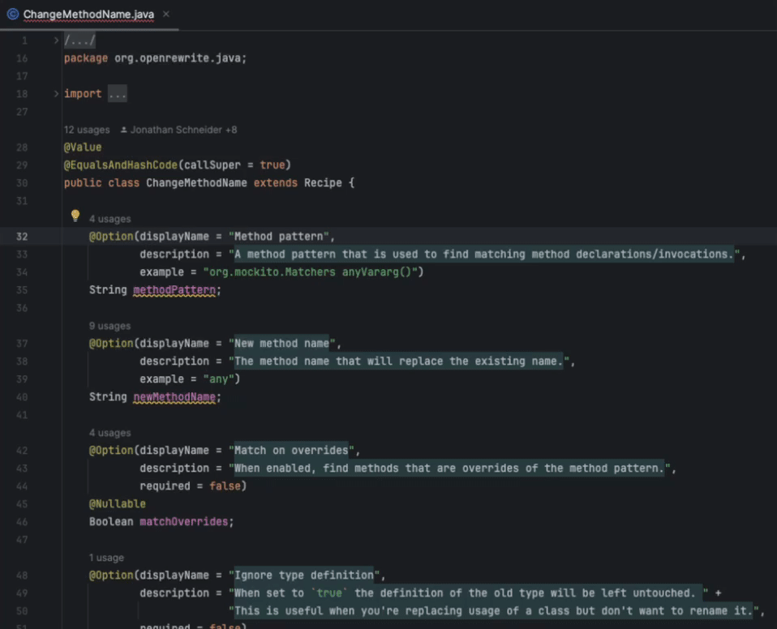

# Moderne IntelliJ plugin

Moderne offers an IntelliJ plugin that improves the recipe development experience by connecting to the [Moderne CLI](../getting-started/cli-intro.md). With it, you can select an "active recipe" in IntelliJ and the Moderne CLI will automatically pick that up so that you can run recipes using the `--active-recipe` option rather than having to know the exact paths and names for every recipe you want to test.

Let's walk through how to install and use this plugin.

## Installation

You can install the Moderne IntelliJ plugin by:

* Going to [https://plugins.jetbrains.com/plugin/17565-moderne](https://plugins.jetbrains.com/plugin/17565-moderne) and pressing Get/Install in the top-right corner OR
* Navigating to `Settings` → `Plugins` inside of IntelliJ and searching for `Moderne`&#x20;

## How to use

Once the plugin has been installed, please open the code for any recipe in IntelliJ. From there, right-click on the class name. You should see an option to set the active recipe:

<figure><figcaption></figcaption></figure>

Behind the scenes, when you click on `Set Active Recipe`, an active recipe file will be created at: `~/.moderne/cli/active.recipe`.&#x20;

With that file created, you can use the `--active-recipe` flag in the Moderne CLI. For instance, to run the active recipe in the current directory, you would run: `mod run . --active-recipe`.&#x20;

## How to attach a debugger to a CLI recipe run

1. Set the recipe you want to debug as the active recipe in your IDE ([see above](#how-to-use))
2. Set one or more breakpoints in your IDE
3. Open up the Moderne CLI and run `mod build <path/to/project>` to build or download the LST for the project you want to test on
4. Once the LST has been obtained, run the command: `mod run <path/to/project> --jvm-debug --active-recipe`. The CLI will then wait for a debugger to be attached to run the recipe.
    * Note: Depending on the recipe you may need to provide additional parameters in the run command such as `--recipe-option methodPattern="java.util.Collections emptyList()"`.
5. Open up your IDE and create a new debug run configuration. You can do this by clicking on the vertical triple dots in the top right corner, selecting `Edit...`, and then adding a new `Remote JVM Debug`: 

    
    
    

6. Once you've created the debugger, launch it by clicking on the bug icon in the top right corner of your screen:

    

7. Your recipe should then begin to run in your terminal – pausing at the breakpoints to allow you to debug. Victory!