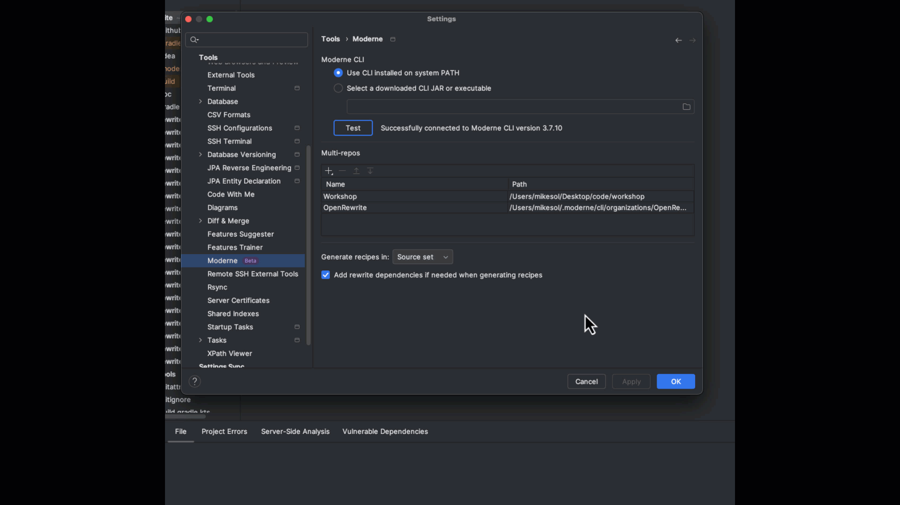

# How to install and configure the Moderne plugin

Moderne offers an IntelliJ IDEA plugin that can not only help you create and debug recipes, but can also assist with your general development experience by allowing you to easily search for code across all of your repositories at once. In this short guide, we'll show you how to install and configure the Moderne plugin.



## Installation

Install the Moderne IntelliJ plugin by either:

* Going to [https://plugins.jetbrains.com/plugin/17565-moderne](https://plugins.jetbrains.com/plugin/17565-moderne) and downloading the plugin OR
* Navigating to `Settings` → `Plugins` inside of IntelliJ, searching for `Moderne`, and installing it

## Prerequisites

Before you can use the Moderne IDE plugin, you'll need to:

* [Download and install the Moderne CLI](../../moderne-cli/getting-started/cli-intro.md)
* [Ensure the CLI is configured with a Moderne license](../../moderne-cli/getting-started/moderne-cli-license.md)


Moderne is offering a free time-bound CLI license available until the end of July 2024. To get this free license, [please fill out our signup form](https://share.hsforms.com/1cfEbSpZNT8enCckPXmdlmwblnxg).


## Configuring the Moderne plugin

With the Moderne CLI configured and the plugin downloaded and installed, you're ready to begin configuring it.

The first thing you'll need to do is tell the Moderne plugin where the CLI is located. To do this, go to `Settings` --> `Tools` --> `Moderne`.

If the CLI is installed on the system PATH (e.g., with Homebrew or Chocalatey), you'll want to select the top radio button, and the plugin should automatically find the CLI. If you have downloaded the CLI via Maven Central or an internal artifact repository as a JAR, you'll want to pick the second radio button and specify the path where it has been downloaded on disk:

The next thing you'll want to configure is the list of [multi-repos](moderne-plugin-install.md#multi-repos) that you want to interact with. In the multi-repos section, you have two options to pick from:

1. You can point the plugin to a local folder that contains a set of repositories that you've already performed a [mod build](../../moderne-cli/cli-reference.md) on.
2. You can select a Moderne Organization from the Moderne DX or SaaS instance that the CLI has been configured with.

Once you've added the multi-repos you'd like the plugin to have access to, press `Apply`.


When you apply these settings, any Moderne Organization that you have selected will be cloned using [--metadata-only](../../moderne-cli/cli-reference.md#mod-git-clone-csv). Its LSTs will also be downloaded from your artifact repository. This process resembles dependency resolution of binary dependencies.


After configuring the plugin, you will see the repositories belonging to the multi-repo(s) that you configured listed in the Moderne tool window (on the right side of the IDE). Click the refresh  button if necessary. Repositories displayed with a blue icon have LSTs successfully built or downloaded on disk. Repositories with a gray icon do not.

<figure><figcaption>
The 47 repositories of the OpenRewrite organization, listed in the Moderne tool window.
</figcaption></figure>

### Multi-repos

"Multi-repo" refers to a named set of repositories that you want to operate on as a unit for either code search or transformation. The set of repositories in a multi-repo need only share a common ancestor root directory somewhere on disk. Common examples of what multi-repos represent are:

* The set of repositories that your team is responsible for.
* A set of repositories that uses a core platform library or component that you are developing whose developers belong to product teams other than your own.
* A set of repositories all using a certain technology (e.g., all Gradle projects or all Cassandra projects) that you would like to study together, though the responsibility for this set of repositories is spread across several or many distinct product teams.

[Moderne Organizations](../../../administrator-documentation/moderne-platform/how-to-guides/organizations-service.md) are directly configurable as a multi-repo. In some cases, though, individual engineers may assemble their own multi-repos based on what they have on their local machines.

## Next steps

* [Use the Moderne plugin to quickly search across all of your repositories](./code-search.md)
* [Use the Moderne plugin to easily create search recipes of your own](creating-recipes.md)
* [Use the Moderne plugin to debug recipes](debugging-recipes.md)
