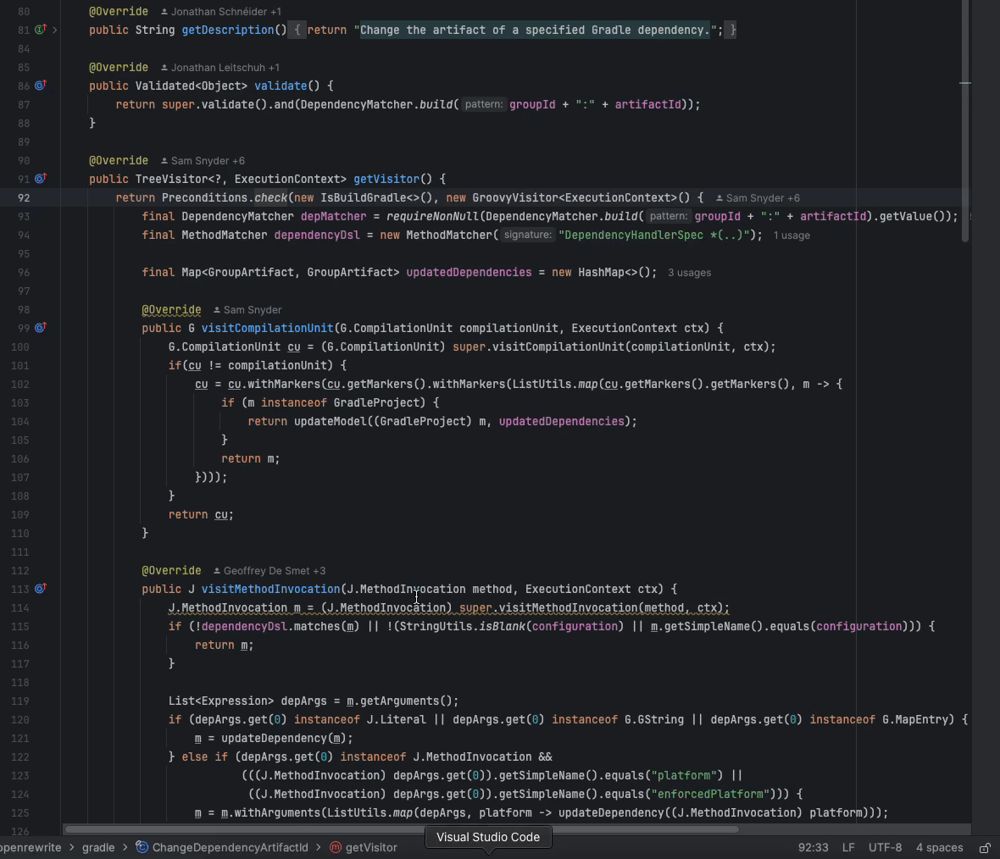
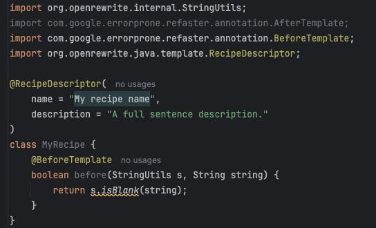
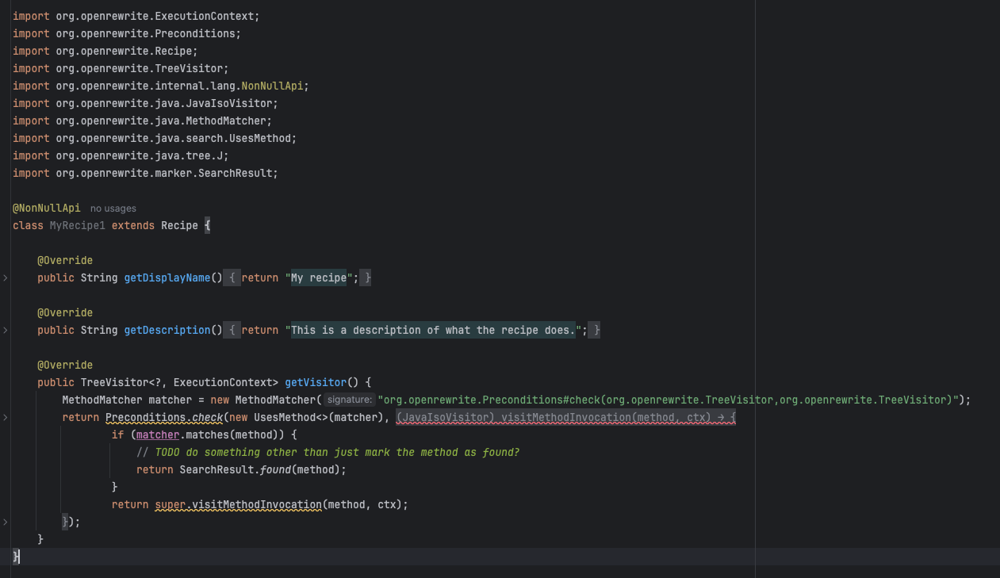

# Creating recipes with the Moderne plugin for JetBrains IDEs

When planning large-scale code changes, it's a good idea to begin by creating a recipe that identifies all of the potential edit sites. Doing so gives you a full impact analysis of what you're about to do, before you actually do it. Taking the time to find all of these locations is especially important because real-world code is complex and nuanced. Without a proper accounting of this nuance, writing a _transformation_ recipe will not be as accurate as you'd wish.

The Moderne plugin helps simplify this process by providing you with an easy way to create a search recipe for any piece of your code.

In this short guide, we'll walk through everything you need to know to get started with recipe creation using the Moderne plugin.

## Ways to create recipes

To begin, find some API that you're interested in searching for. Then right-click on one of its usages and either:

* Click on `Find Usages on All Repos` and then click on `Create Recipe` (selecting the [type of recipe that you want to create](creating-recipes.md#types-of-recipes-you-can-create)) OR

<figure><figcaption>
Find Usages example
</figcaption></figure>

* Click on `Refactor`, select `Create OpenRewrite Recipe...`, and then click on `Create Recipe` (selecting the [type of recipe you want to create](creating-recipes.md#types-of-recipes-you-can-create)). Please note that IntelliJ IDEA offers a keyboard shortcut for the `Create OpenRewrite Recipe...` menu (it defaults to alt + command + 9 on a Mac).

## Types of recipes you can create

The Moderne plugin allows you to create two types of recipes: [Refaster recipes](https://docs.openrewrite.org/authoring-recipes/refaster-recipes) and [Imperative visitor-based recipes](https://docs.openrewrite.org/authoring-recipes/types-of-recipes#imperative-recipes).

Refaster recipes are better if you're doing a straightforward replacement (such as converting `StringUtils.equals(..)` to `Objects.equals(..)`). For everything else, you should create an Imperative recipe.

For more information on recipe development, check out the [OpenRewrite authoring recipes docs](https://docs.openrewrite.org/authoring-recipes).
