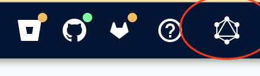

# Getting started with the Moderne plugin for JetBrains IDEs

The Moderne plugin for JetBrains IDEs is available on the [JetBrains marketplace](https://plugins.jetbrains.com/plugin/17565-moderne?noRedirect=true). The plugin interacts with Moderne CLI to enable multi-repository code search and transformation on a set of repositories that engineers configure in their IDE.

## Multi-repos

"Multi-repo" refers to a named set of repositories that you want to operate on as a unit for either code search or transformation. The set of repositories in a multi-repo need only share a common ancestor root directory somewhere on disk. Common examples of what multi-repos represent are:

* The set of repositories that your team is responsible for.
* A set of repositories that uses a core platform library or component that you are developing whose developers belong to product teams other than your own.
* A set of repositories all using a certain technology (e.g., all Gradle projects or all Cassandra projects) that you would like to study together, though the responsibility for this set of repositories is spread across several or many distinct product teams.

As we will see in the installation section below, Moderne [Organizations](../../../administrator-documentation/moderne-platform/how-to-guides/organizations-service.md) are directly configurable as a multi-repo, but individual engineers may assemble multi-repos that may or may not correspond directly to an organization.&#x20;

## Installation

To configure the plugin for use, connect it to an existing licensed Moderne CLI installation and select one or more multi-repository sets that serve as your working set.


Moderne is offering a free time-bound CLI license available until the end of July 2024. To get this free license, [please fill out our signup form](https://share.hsforms.com/1cfEbSpZNT8enCckPXmdlmwblnxg).


### Configuring the CLI

Prior to configuring the IDE plugin, you should [install](../../moderne-cli/getting-started/cli-intro.md) the Moderne CLI and configure its [license key](../../moderne-cli/getting-started/moderne-cli-license.md). If the CLI is installed on the system PATH (e.g., with Homebrew or Chocalatey), you'll want to select the top radio button, and the plugin should automatically find the CLI. If you have downloaded the CLI via Maven Central or an internal artifact repository as a JAR,  you'll need to pick the second radio button and specify the path where it has been downloaded on disk.

<figure><figcaption>
Selecting a path on disk where the Moderrne CLI resides as a JAR.
</figcaption></figure>

In the Multi-repos section, add either some local folder that you have already cloned a set of repositories and performed a [mod build](../../moderne-cli/cli-reference.md) on, or select a Moderne Organization from the Moderne DX or SaaS instance that the CLI has been configured to.

<figure><figcaption>
The set of organizations fetched from Moderne SaaS (in this case <a href="https://app.moderne.io">https://app.moderne.io</a>).
</figcaption></figure>


When you apply these settings, any Moderne Organization that you have selected will be cloned using `--metadata-only` and its LSTs downloaded from your artifact repository. This process resembles dependency resolution of binary dependencies.


After configuring the plugin, you will see the repositories belonging to the multi-repo(s) that you configured listed in the Moderne tool window. Click the refresh  button if necessary. Repositories displayed with a blue icon have LSTs successfully built or downloaded on disk. Repositories with a gray icon do not.

<figure><figcaption>
The 47 repositories of the OpenRewrite organization, listed in the Moderne tool window.
</figcaption></figure>
