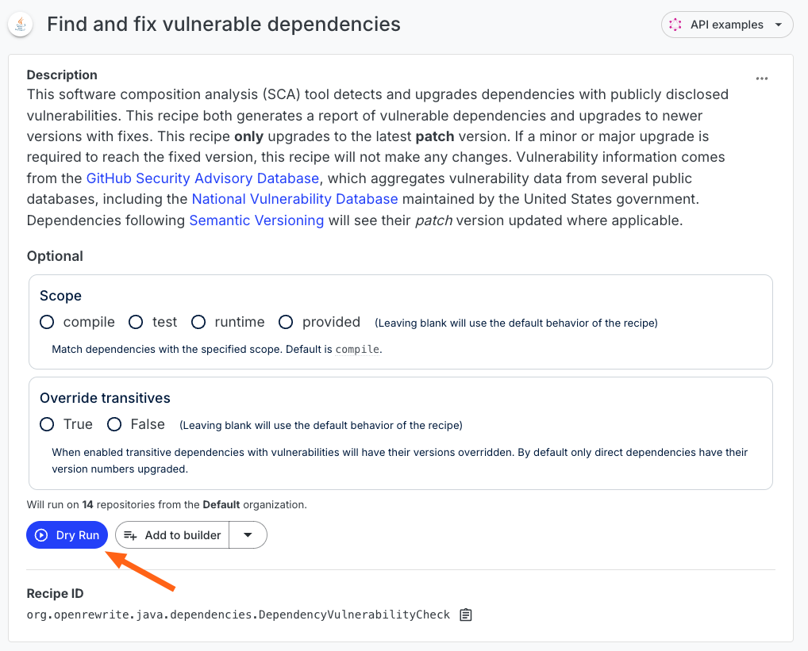

# Getting started with data tables

Traditionally, recipes either tried to fix an issue by updating the code directly or they helped you find pieces of code based on a query. However, what if you wanted to extract some specific attributes or inferences from the code? For example, what if you wanted to know details about the vulnerabilities that exist in a group of repositories or what if you wanted to know how well your recipe was performing?

This is where data tables come in. In addition to modifying the code directly, recipes can generate tabular data that people can use for analysis purposes. Taking the security vulnerability scenario as an example, a recipe could fix certain vulnerabilities _and_ produce a table containing vital information about repositories that still have vulnerabilities. This information could include a summary of the CVE, the severity of the issue, and whether or not a version update could address the vulnerability.

To help give you a better idea of how data tables work in Moderne, this guide will:

* [Explain the different types of data tables](data-tables.md#types-of-data-tables)
* [Walk you through running a recipe that produces a data table](data-tables.md#data-table-example)
* [Help you decide whether or not you should add a data table to your recipe](data-tables.md#when-you-should-create-data-tables)


See how to produce and view data tables


## Types of data tables

There are three types of data tables in Moderne:

1. A recipe performance table that provides insights into the recipe's execution
2. A source file table that offers information about the changed files (if any were)
3. Recipe-specific tables where the rows/columns are defined by the recipe

Every recipe you run will have a recipe performance table and, if changes were made, a source file table. However, both of those tables are typically used for testing and analyzing recipes. If you aren't developing recipes, you can safely ignore those.

The third type of data table, the recipe-specific one, is the one you'll get the most use out of as it will contain data that matches the goals of the recipe. Please note, though, that most recipes do not have a recipe-specific table.

## Data table example

Let's take a look at a recipe that attempts to fix security vulnerabilities and then produces a data table with detailed information about the repositories and their vulnerabilities.

To get started, run the [check for dependency vulnerabilities](https://app.moderne.io/recipes/org.openrewrite.java.dependencies.DependencyVulnerabilityCheck?) recipe:

From the recipe page, specify a `Scope` of `compile` and then press the `Dry Run` button:

You will then be taken to the recipe results page:

If the recipe can fix a security vulnerability, it will do so. You can view the diffs and commit the results as you would in any other recipe. In most situations, however, this recipe will identify that there is a security vulnerability rather than fix it. If there are security vulnerabilities identified, the recipe will produce a detailed data table.

To see the data table, wait until the recipe has finished running and then click on the `Data Tables` tab:

You should now be on a page that lists all of the data tables available for this recipe:

As the `recipe performance` and `source files that had results` tables are primarily for the people who wrote the recipe, let's ignore them and focus on the `vulnerability report` data table instead (feel free to download them and look at them, though). The `vulnerability report` table was specifically coded into the `check for dependency vulnerabilities` recipe and it will have data relevant to our needs.

To view it, click the download button next to the vulnerability report and save it to your computer. Then, open the spreadsheet in the editor of your choice (Excel, Google Sheets, Numbers, etc).

You should see that the data table contains critical information about the vulnerabilities found in the repository. Your team can then use this information to prioritize which security issues should be addressed first:

## When you should create data tables

If you're a recipe developer, you may be wondering when you should create a data table vs. create a search recipe. We suggest following this advice:

* If you want to see the exact code matching some criteria, a search result is generally preferable
* If you want to extract some attribute or inference from the code rather than the code itself, a data table is generally preferable
