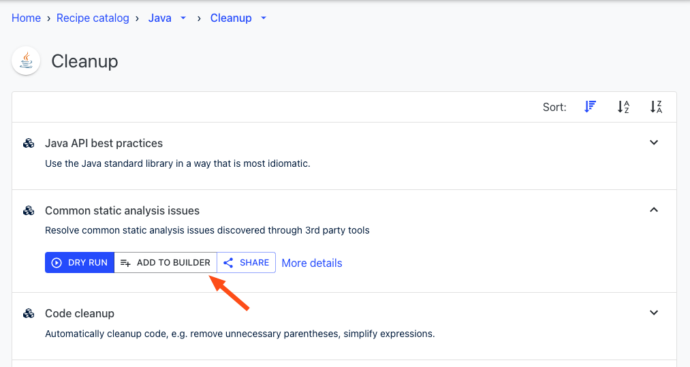
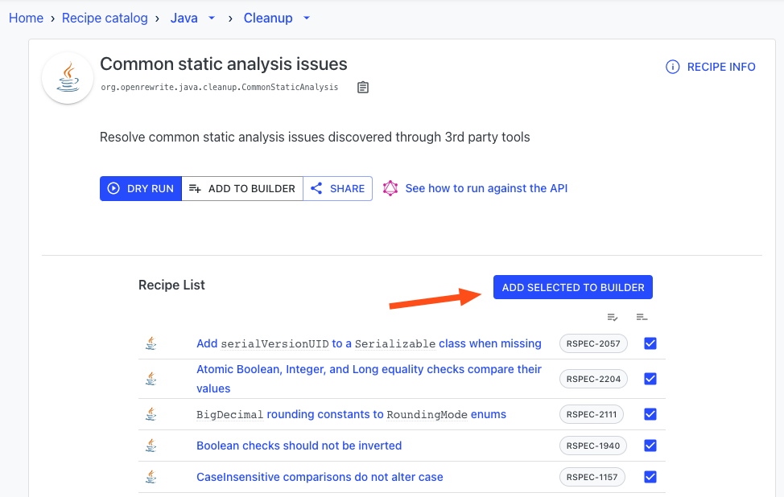
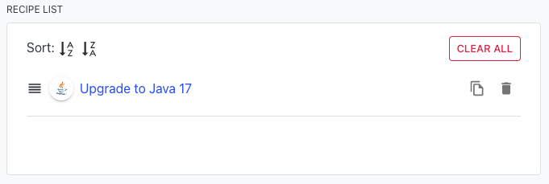
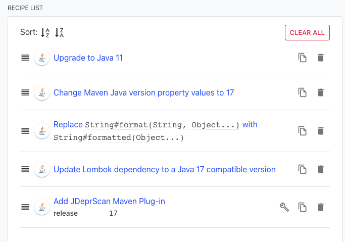
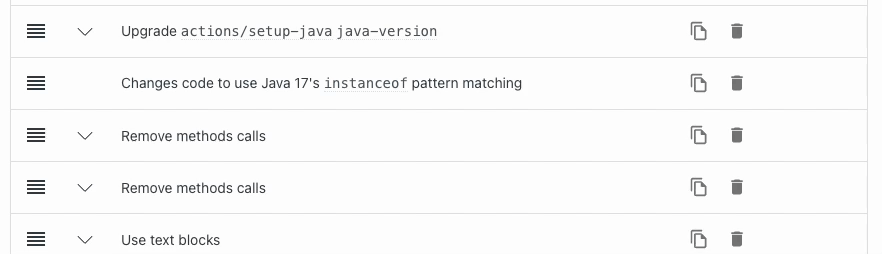
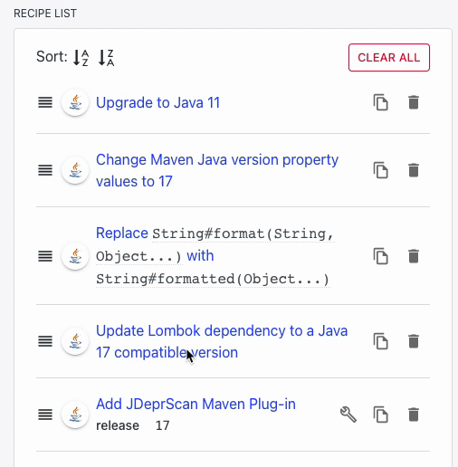
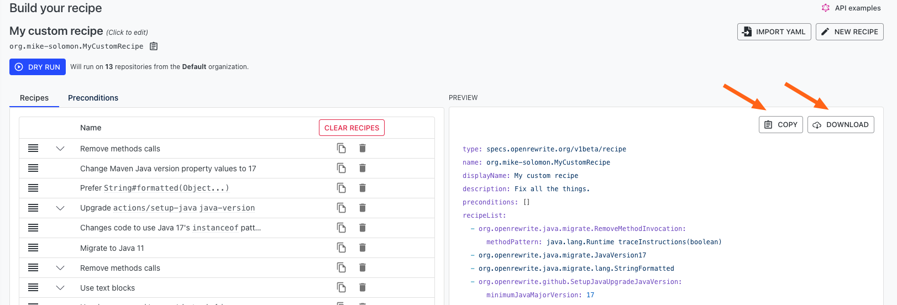
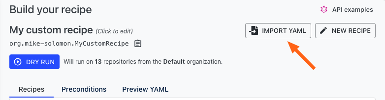
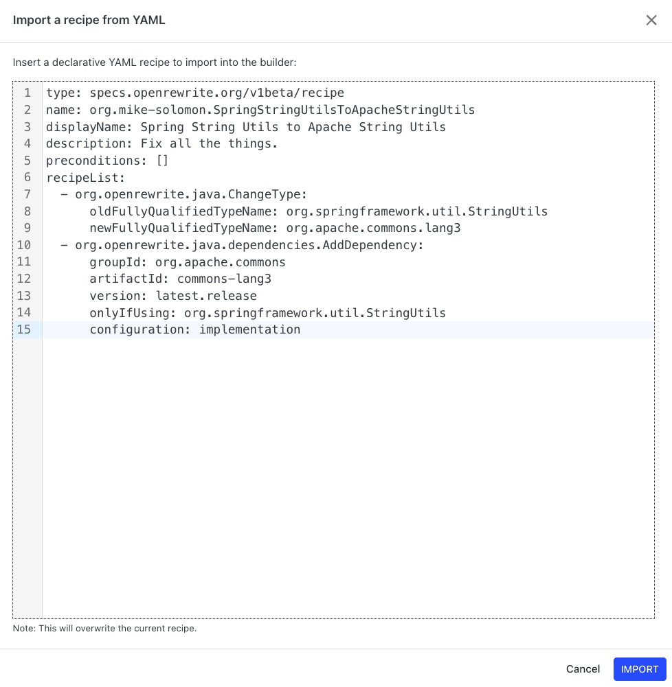
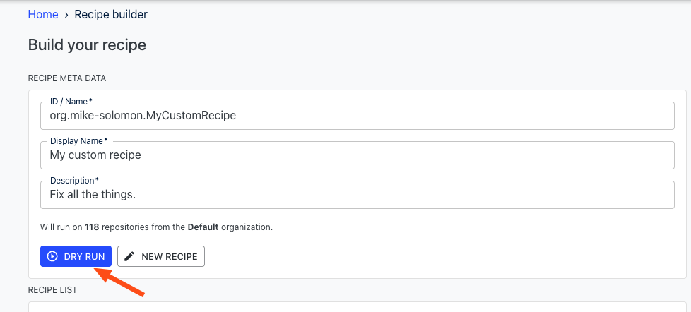

# (Legacy) Create custom recipes with the old recipe builder

Have you found a recipe in Moderne where you only want to run certain parts of it? Or have you found a few recipes that you want to combine into one larger recipe? Or maybe you want to run a bunch of recipes in a specific order?

All of these problems can be solved by utilizing the Recipe Builder, which provides a way for you to create custom recipes from our existing recipe catalog.

To help you get acquainted with the Recipe Builder, in this guide, you will learn:

* [How to create a custom recipe](recipe-builder.md#how-to-create-a-custom-recipe)
* [How to save and share custom recipes](recipe-builder.md#how-to-save-and-share-custom-recipes)
* [How to import and run custom recipes](recipe-builder.md#how-to-import-and-run-custom-recipes)



## How to create a custom recipe

To create a custom recipe you will need to:

1. [Find the recipes you want to utilize in your custom recipe](/user-documentation/moderne-platform/how-to-guides/moderne-platform-search.md)
2. [Add the recipes to the builder](recipe-builder.md#adding-recipes-to-the-builder)
3. [Order the recipes to match your needs](recipe-builder.md#ordering-the-recipes)

### Adding recipes to the builder

There are two possible ways of adding a recipe to the builder:

1.  By pressing the `Add to Builder` button in the recipe catalog or in the recipe itself:

    

2.  By pressing the `Add Selected to Builder` button that's available on all composite recipes (recipes that have multiple recipes that run as part of them):

    

If you press the `Add to Builder` button, the default version of the recipe and all sub-recipes (if they exist) will be added to the Recipe Builder as one high-level entry. You won't be able to individually configure or see the sub-recipes:

If you want more configurability for composite recipes, such as the ability to change option values, re-order, or remove the sub-recipes, you'll need to press the `Add Selected to Builder` button. This will add an entry for each of the sub-recipes themselves rather than the high-level recipe:

If any of these recipes have options that you can configure, an upside down chevron will appear on the left side. You can click on it to expand the list of options for said recipe:

### Ordering the recipes

Recipes added to the recipe list are run in the order they're listed. This means that if you had a recipe that changed the name of a package from `foo` to `bar` and another recipe, listed after the first one, that changed `bar` to `baz`, you would end up with both `foo` and `bar` changing to `baz`.

You can re-order the recipes in the recipe list by dragging them up and down:

## How to save and share custom recipes

Once you've defined and configured all of the recipes you want as part of your custom recipe, you can copy the YAML by pressing the `Copy` button or you can download it by pressing the `Download` button:

This will create and download a YAML file that contains all of the information needed to re-create this recipe. You can either use that file to [re-create this recipe](recipe-builder.md#how-to-import-and-run-custom-recipes) when needed or you can send that file to anyone and they'll be able to [import it](recipe-builder.md#how-to-import-and-run-custom-recipes) and run the recipe themselves.

## How to import and run custom recipes

If you or someone on your team has previously created a recipe via the Recipe Builder, you can import it by following these instructions:

* Navigate to the [Recipe Builder page](https://app.moderne.io/recipes/builder).
*   Press the `Import YAML` button in the top right corner:

    

*   A modal will appear that you can paste a declarative YAML recipe into:

    

* When you're done entering the YAML, press the `Import` button in the bottom right corner of the modal. If the YAML is properly formatted, you'll see your recipe populated into the recipe builder with everything set up exactly as specified.

*   You can then run the recipe as normal by pressing `Dry Run`:

    
