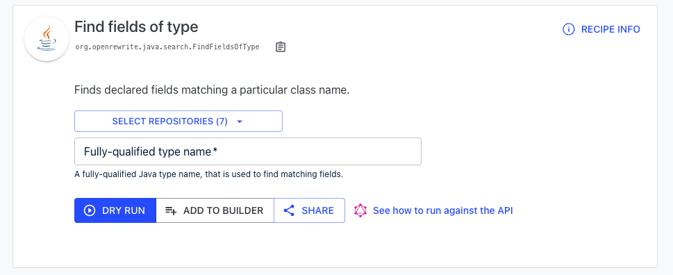
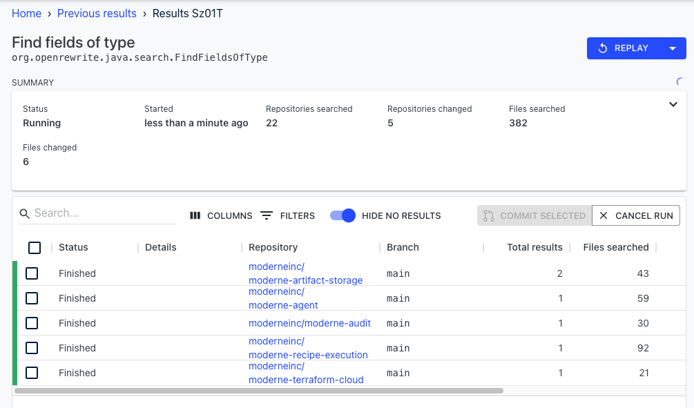
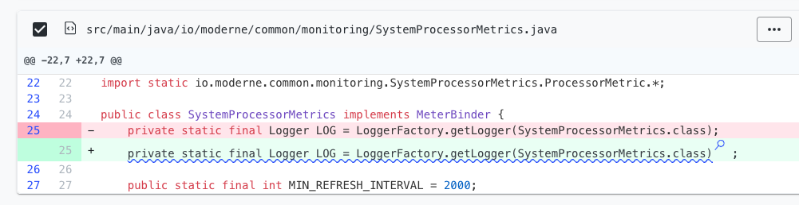

# Starting to Use Moderne Search

When working in a single repository, it's not _too_ difficult to perform standard searches such as looking for a particular `Type`, seeing how a method is used, or finding deprecated classes. But what if there are hundreds or thousands of repositories that share code? This search becomes exponentially more difficult. A simple IDE search or relying on experience with the code is no longer applicable.

Fortunately, Moderne offers a robust solution to this problem: search recipes. Using these recipes you can quickly and easily find out all of the above things and more.

To help you get accustomed to Moderne's search capabilities, in this guide, we will:
* [Teach you how to find search-related recipes](#finding-search-related-recipes)
* [Walk through an example of using a search recipe](#using-a-search-recipe)

## Finding search-related recipes

* From the [Moderne Catalog](https://public.moderne.io/catalog), click on a category that relates to your needs such as `Java`:

    

* Click on `Search`:

    

* You will then arrive on a page that includes recipes for all of the different ways you can search for code:

    

* Click on any of them to get started.

## Using a search recipe

Imagine that you're going about your day when suddenly you get pinged about a zero-day security vulnerability. Everyone is frantically trying to figure out what services are affected and what needs to be changed. You could have developers across many teams start searching through their services manually to see if the service uses the `Type` that is vulnerable — but that's incredibly inefficient and error-prone. 

A much safer and more efficient way would be to search through all of your company's repositories to see where it's being used. Let's walk through using the [Find Types Recipe](https://public.moderne.io/recipes/org.openrewrite.java.search.FindFieldsOfType) to do just that: 

* From the [Java Search](https://public.moderne.io/catalog/org.openrewrite.java.search) page, scroll down and click on `Find fields of type`. You should see something that looks like: 

    

* (Optionally) If you wish to filter the search to a specific group of repositories:
  * Click on `Select Repositories`.
  * Press `Add Filter`. 
  * Select what you want to filter on (Organization, Name, or Branch).
  * Type the text you want to search for and you should see the repositories filter down as desired.
  * Press the `>>` button to select all of the filtered repositories. 
  * Click out of the modal to confirm your choices.

* Enter a type such as `org.apache.logging.log4j`.

* Press `Dry Run` to begin the search. You should now be redirected to a page that shows the results. If there are results, it should look similar to this:

    

* If you click on one of the repository names you'll be taken into the code for that repository. Lines that contain the selected type will be underlined and marked with a magnifying glass icon. This should look like: 

    

You can then use this information to quickly make informed decisions about the security vulnerability. There may even be a [Recipe](https://public.moderne.io/recipes/org.openrewrite.java.logging.slf4j.Log4jToSlf4j) that exists to fix all of your code for you.